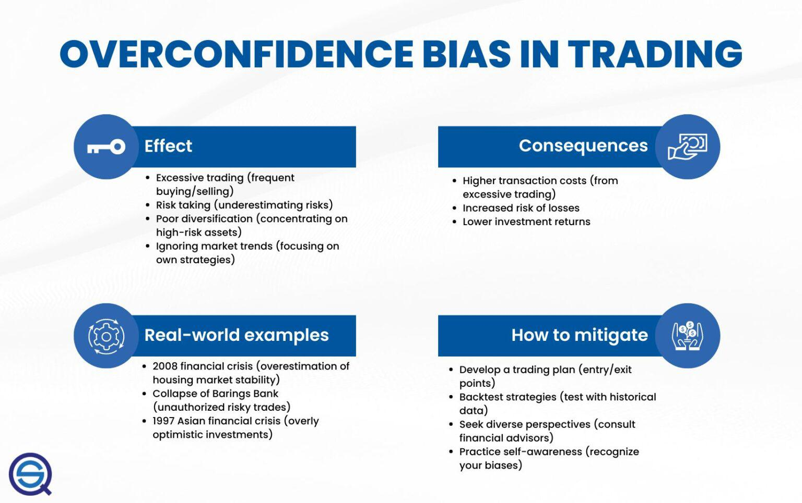

## Table of Contents

## What is overconfidence bias?

Overconfidence bias is when people think they know more or are better at something than they really are. It's like when you believe you can do a hard puzzle quickly, but then it takes much longer than you thought. This happens a lot because people often feel too sure about their skills, knowledge, or how well they can predict things.

This bias can cause problems. For example, if a driver thinks they are a better driver than they are, they might drive too fast and cause an accident. In money matters, someone might invest in a risky stock thinking they know it will do well, but then lose money. It's important to be aware of overconfidence bias so we can make better choices and not take too many risks.

## How does overconfidence bias affect decision-making in general?

Overconfidence bias makes people think they are smarter or better at things than they really are. This can mess up decision-making because people might not check their facts or ask for help when they should. They might choose to do something risky because they believe they can handle it, even when it's not a good idea. For example, someone might decide to start a business without doing enough research, thinking they know everything they need to succeed.

This bias can also make people ignore advice from others or not consider other points of view. When people are overconfident, they might not see the risks or problems that could come up. This can lead to bad choices, like investing all their money in one thing because they think they can predict how it will go. Being aware of overconfidence can help people make better decisions by taking the time to think things through and listen to others.

## What are some common examples of overconfidence bias in everyday life?

Overconfidence bias often shows up when people drive. They might think they are better drivers than most people and drive too fast or take risks they shouldn't. This can lead to accidents because they believe they can handle the road better than they actually can. It's like when someone speeds on a busy highway, thinking they won't get into a crash, but then they do because they were too confident in their driving skills.

Another common example is in school or work. Students might think they know all the material for a test and not study enough. They feel so sure about what they know that they don't check their notes or ask for help. Then, when they get the test back, they see they didn't do as well as they thought they would. At work, someone might take on a big project thinking they can finish it quickly, but then they struggle because they didn't plan properly or ask for help.

In personal finance, overconfidence can lead people to make risky investments. They might think they can predict the stock market and put all their money into one stock, believing it will go up. But the stock market is hard to predict, and they can lose a lot of money if the stock goes down. This happens because they were too sure about their ability to pick winning stocks without enough research or advice.

## How does overconfidence bias specifically impact investment decisions?

Overconfidence bias can really mess up investment decisions. People might think they know more about the stock market than they really do. They feel so sure about their choices that they might put all their money into one stock, believing it will go up. But the stock market is tricky and hard to predict. If that stock goes down, they could lose a lot of money because they were too confident in their ability to pick winners without doing enough research or getting advice.

This bias can also make people trade too much. They think they can time the market perfectly and buy and sell stocks at just the right times. But all this trading can lead to big losses because no one can really predict the market that well. Overconfidence can make people ignore the risks and not spread their money out in different investments, which is safer. Being aware of this bias can help people make smarter investment choices by taking the time to do research and maybe even talk to a financial advisor.

## What are the psychological roots of overconfidence bias?

Overconfidence bias comes from how our brains work. One big reason is that we like to feel good about ourselves. So, we often think we're better at things than we really are because it makes us feel smart and capable. This is called the better-than-average effect. We compare ourselves to others and think we're doing better than most people, even when we're not. This can make us feel more confident than we should be, leading to overconfidence.

Another reason for overconfidence is something called the illusion of control. We think we can control things more than we actually can. For example, we might believe we can predict the stock market or control how a project at work will go. But a lot of things are out of our control, and thinking we can manage them all can lead to overconfidence. Our brains also tend to remember our successes more than our failures, which makes us feel even more confident. This selective memory can make us think we're better at things than we really are, causing overconfidence bias.

## Can overconfidence bias lead to better investment returns under certain conditions?

Sometimes, overconfidence bias can actually help with investment returns, but only if certain things are true. If someone is really good at picking stocks and knows a lot about the market, their overconfidence might make them act quickly and take advantage of good opportunities. They might feel so sure about a stock that they buy it right away, and if they're right, they can make more money than someone who is more careful and takes longer to decide.

But, this is risky and doesn't happen often. Most of the time, overconfidence leads to bad choices because people think they know more than they do. They might not do enough research or spread their money out in different investments, which is safer. So, while overconfidence can sometimes lead to better returns if everything goes perfectly, it usually causes more problems and losses than gains.

## What are the typical signs that an investor might be suffering from overconfidence bias?

One big sign that an investor might be suffering from overconfidence bias is if they trade a lot. They think they can predict the stock market perfectly and buy and sell stocks all the time, believing they'll make a lot of money. But all this trading can lead to big losses because no one can really predict the market that well. Another sign is if they put all their money into one stock or investment. They feel so sure about it that they don't spread their money out, which is safer. This can lead to big losses if that one investment doesn't do well.

Another sign is if they don't do enough research before making investment decisions. They might think they know everything they need to know already, so they don't take the time to check facts or get advice from others. This can lead to bad choices because they're not considering all the risks. Also, if they ignore advice from financial experts or friends, that's a sign of overconfidence. They believe they know better than everyone else, even when they might not. Being aware of these signs can help investors make better choices and avoid the problems that come with overconfidence.

## How can investors measure the impact of overconfidence bias on their investment returns?

Investors can measure the impact of overconfidence bias on their investment returns by looking at how often they trade and how well those trades do. If they trade a lot and their returns are not as good as they expected, it might be because they were too confident in their ability to predict the market. They can compare their returns to a simple index fund, like the S&P 500. If their returns are lower than the index fund, it could be a sign that overconfidence is hurting their investments.

Another way to measure the impact is by looking at how diversified their portfolio is. If an investor has put all their money into one or two stocks because they thought they knew exactly how those stocks would do, and then they lost money, that's a clear sign of overconfidence. They can track their returns over time and see if they would have done better by spreading their money out more. By keeping track of these things, investors can see if overconfidence is making them lose money and make better choices in the future.

## What strategies can investors use to mitigate the effects of overconfidence bias?

One good way for investors to fight overconfidence bias is to do a lot of research before they make any investment choices. They should not just trust their gut feelings but look at all the facts and numbers. It's also smart to talk to financial advisors or other people who know about investing. Listening to what others think can help investors see things they might have missed because they were too confident. Another helpful strategy is to keep a record of all their investment decisions and how they turned out. By looking back at this record, investors can see if they are making too many risky choices because of overconfidence and learn from their mistakes.

Another strategy is to make sure their money is spread out in different investments. This is called diversification. If an investor puts all their money into one stock because they think they know it will do well, they are being overconfident. By having a mix of stocks, bonds, and other investments, they can lower the risk of losing a lot of money if one investment does badly. It's also important for investors to set clear goals and rules for themselves before they start investing. If they stick to these rules, it can stop them from making quick, overconfident decisions that could lead to losses.

## Are there any tools or technologies available that can help investors manage overconfidence bias?

Yes, there are tools and technologies that can help investors manage overconfidence bias. One useful tool is investment tracking software. This kind of software helps investors keep a record of all their trades and see how well they are doing over time. By looking at this data, investors can see if they are making too many risky choices because of overconfidence. The software can also show them how their returns compare to the market, which can help them realize if they need to be more careful.

Another helpful technology is robo-advisors. These are computer programs that give investment advice and manage portfolios for people. Robo-advisors use algorithms to make sure an investor's money is spread out in different investments, which helps reduce the risk of overconfidence. They also stop investors from making quick, emotional decisions by sticking to a set plan. Using these tools can help investors make smarter choices and avoid the problems that come with being too confident.

## How does overconfidence bias interact with other cognitive biases in the context of investing?

Overconfidence bias often works together with other cognitive biases to make investing harder. One common bias it interacts with is confirmation bias. This is when people look for information that supports what they already believe and ignore information that doesn't. When an investor is overconfident, they might only look at data that makes them feel good about their choices and ignore warnings or risks. This can lead to bad decisions because they're not seeing the whole picture. For example, if an investor is sure a certain stock will go up, they might only read news that says it will and ignore reports that say it might go down.

Another bias that can team up with overconfidence is the availability heuristic. This is when people make decisions based on the information that's easiest to remember or find. Overconfident investors might think they know all they need to know because they remember a few successful investments they made. But they might forget or not consider the times they lost money. This can make them take bigger risks than they should. By understanding how overconfidence works with these other biases, investors can be more careful and make better choices.

## What does recent research say about the long-term effects of overconfidence bias on investment portfolios?

Recent research shows that overconfidence bias can hurt investment portfolios over the long term. When investors are too sure about their skills, they might trade too much and take big risks. This often leads to lower returns because they are not as good at picking stocks as they think. Studies have found that overconfident investors tend to have portfolios that do worse than the market average. They might feel good about their choices at first, but over many years, their overconfidence can lead to big losses.

On the other hand, some research suggests that a little bit of overconfidence can sometimes help. If an investor is really good at picking stocks and knows a lot about the market, their confidence might help them act quickly and take advantage of good opportunities. But this is rare and risky. Most of the time, overconfidence leads to bad choices because investors think they know more than they do. They might not spread their money out enough or do enough research, which can hurt their portfolio in the long run.

## What are some strategies for managing overconfidence bias?

Managing overconfidence bias is crucial for investors seeking to enhance their decision-making processes and optimize investment returns. Overconfidence can lead investors to overestimate their knowledge and underplay risks, resulting in suboptimal investment choices. Here are some effective strategies to recognize and manage this cognitive bias.

### Recognition and Management Strategies

1. **Education and Self-Awareness**:
   Education plays a pivotal role in mitigating cognitive biases, including overconfidence. By understanding the basic principles of behavioral finance, investors can identify the signs of overconfidence in their decision-making. Self-awareness can be nurtured through mindfulness practices, which encourage investors to reflect on past investment decisions and outcomes. By acknowledging their limitations and learning from their mistakes, investors can cultivate a more realistic view of their capabilities.

2. **Technology and Software**:
   Advancements in technology offer powerful tools to manage overconfidence bias. Investment software and platforms that incorporate behavioral analytics can help investors by providing data-driven insights and highlighting potential biases in decision-making. Machine learning algorithms can analyze past investment behaviors, identify patterns of overconfidence, and provide corrective feedback. Additionally, automated alert mechanisms can inform investors when their actions deviate from their strategic investment plans, prompting them to reassess their decisions.

3. **Diversified Investment Strategies**:
   Diversification is a fundamental principle in mitigating risks associated with overconfidence. By spreading investments across various asset classes and geographical regions, investors can reduce the impact of incorrect predictions or unexpected market movements. Diversification minimizes the reliance on a singular outcome, decreasing the potential adverse effects of overconfident decision-making. The concept adheres to the risk management formula where total investment risk is reduced as the variance of the portfolio is minimized:
$$
   \sigma^2_p = \sum_{i=1}^n w_i^2 \sigma^2_i + \sum_{i=1}^{n-1} \sum_{j=i+1}^n 2w_iw_j \sigma_{ij}

$$

   where $\sigma^2_p$ is the portfolio variance, $w_i$ and $w_j$ are the weights of the investments, and $\sigma_{ij}$ is the covariance between investment returns.

4. **Maintaining a Rational and Balanced Approach**:
   Maintaining a disciplined and balanced approach to investing is a key strategy in managing overconfidence. This involves setting clear investment objectives, adhering to predetermined risk tolerance levels, and regularly reviewing portfolio performance against benchmarks. Emotional regulation techniques like meditation and cognitive-behavioral strategies can also aid investors in maintaining objectivity. Peer reviews and consulting with financial advisors can provide additional perspectives, discouraging impulsive decisions rooted in overconfidence.

By implementing these strategies, investors can better recognize and counteract overconfidence bias, leading to more informed and balanced investment decisions. This proactive approach can justify more consistent outcomes and potentially enhance overall investment performance.

## References & Further Reading

[1]: Barber, B. M., & Odean, T. (2000). ["Trading is Hazardous to Your Wealth: The Common Stock Investment Performance of Individual Investors."](https://faculty.haas.berkeley.edu/odean/Papers%20current%20versions/Individual_Investor_Performance_Final.pdf) The Journal of Finance, 55(2), 773-806.

[2]: Thaler, R. H. (1993). ["Advances in Behavioral Finance"](https://psycnet.apa.org/record/1993-98595-000). Princeton University Press.

[3]: Kahneman, D. (2011). ["Thinking, Fast and Slow"](https://link.springer.com/article/10.1007/s00362-013-0533-y). Farrar, Straus and Giroux.

[4]: Montier, J. (2007). ["Behavioural Investing: A Practitioner's Guide to Applying Behavioural Finance"](https://onlinelibrary.wiley.com/doi/book/10.1002/9781118673430). Wiley.

[5]: De Bondt, W. F. M., & Thaler, R. (1985). ["Does the Stock Market Overreact?"](https://onlinelibrary.wiley.com/doi/full/10.1111/j.1540-6261.1985.tb05004.x) The Journal of Finance, 40(3), 793-805.

[6]: Chan, E., (2009). ["Quantitative Trading: How to Build Your Own Algorithmic Trading Business"](https://github.com/ftvision/quant_trading_echan_book). Wiley.