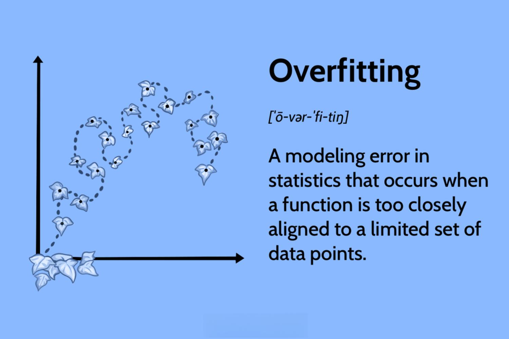

## Table of Contents

## What is overfitting in machine learning?

Overfitting in machine learning happens when a model learns too much from the training data, including the noise and random fluctuations. This means the model becomes really good at predicting the training data but performs poorly on new, unseen data. Imagine you're trying to learn a new game by memorizing every single move from past games instead of understanding the general rules. When you play a new game, your memorized moves won't help because the new game will be different.

To avoid overfitting, it's important to find a balance where the model learns the general patterns without getting too caught up in the specifics of the training data. Techniques like using more data, simplifying the model, or applying regularization can help. Think of it like learning to cook: if you only follow one recipe perfectly, you might struggle with a slightly different recipe. But if you understand the basics of cooking, you can adapt to new recipes more easily.

## Why does overfitting occur in machine learning models?

Overfitting happens when a machine learning model pays too much attention to the training data. It tries to remember every little detail, even the random bits that don't really matter. Imagine you're learning to play a sport by watching videos. If you try to copy every single move exactly, including the mistakes, you might not play well in a real game. The model becomes too focused on the training data and loses the ability to make good guesses on new data.

This problem often comes up when the model is too complex for the amount of data it's learning from. If you have a simple puzzle but use a very complicated tool to solve it, you might end up making the puzzle harder than it needs to be. To avoid overfitting, you need to find the right balance. Using more data, keeping the model simpler, or using special techniques like regularization can help the model learn the important patterns without getting distracted by the unimportant details.

## What are the signs that a model is overfitting?

One sign that a model is overfitting is when it does really well on the training data but not so well on new data. Imagine you're learning to draw by copying a picture perfectly, but when you try to draw something new, it looks bad. The model is too good at the training data and can't handle new stuff.

Another sign is if the model's performance keeps getting better on the training data but starts to get worse on a separate set of data called the validation set. It's like practicing a dance routine over and over until you can do it perfectly, but when you perform it with different music, you mess up. The model is memorizing the training data instead of learning the general patterns.

## How does the bias-variance tradeoff relate to overfitting?

The bias-variance tradeoff is like a balancing act in machine learning. Bias is when a model makes too many assumptions and misses important patterns in the data. It's like using a simple rule to solve a complex problem, which can lead to errors because the rule is too basic. On the other hand, variance is when a model pays too much attention to the training data, including the random noise. This is similar to overfitting, where the model learns the training data too well but fails to perform on new data.

Overfitting is closely related to high variance. When a model has high variance, it's too flexible and tries to fit every little detail of the training data. This makes the model perform well on the training data but poorly on new data because it's not capturing the general patterns. To manage the bias-variance tradeoff and prevent overfitting, you need to find the right balance. This might mean using a simpler model to reduce variance, or gathering more data to help the model learn the true patterns without getting distracted by noise.

## What is the impact of overfitting on model performance?

Overfitting can hurt how well a model works. When a model overfits, it gets really good at the training data but bad at new data. Imagine you're trying to learn a new game by memorizing every move from past games. You might do great in those games, but when you play a new game, your memorized moves won't help because the new game is different. So, the model can't make good guesses on new data because it's too focused on the old data.

This problem can make the model less useful in real life. If a model can't handle new situations well, it's not very reliable. For example, if you train a model to recognize pictures of cats but it only works on the exact pictures it was trained on, it won't be good at recognizing new pictures of cats. To avoid this, you need to find a balance where the model learns the important patterns without getting too caught up in the details of the training data.

## What are some common techniques to prevent overfitting?

One way to stop overfitting is by using more data. When you give the model more examples to learn from, it's less likely to focus too much on the small details of the training data. It's like learning a new sport: the more games you play, the better you understand the general rules instead of just memorizing specific moves. Another technique is to keep the model simple. A simpler model is less likely to overfit because it can't learn the tiny details as well. It's like using a basic tool to solve a puzzle instead of a complicated one that might make things harder.

Regularization is another way to prevent overfitting. It adds a penalty to the model for being too complex, encouraging it to focus on the important patterns instead of the noise. Imagine you're writing a story and you're told to keep it short; you'll focus on the main points instead of adding unnecessary details. Cross-validation is also helpful. It involves splitting the data into different parts and testing the model on each part to see how well it performs on new data. It's like practicing a dance routine with different music to make sure you can adapt to new situations.

## How does increasing the amount of training data help prevent overfitting?

When you increase the amount of training data, it's like giving the model more examples to learn from. This helps the model understand the general patterns better instead of focusing too much on the small details of the original data. Imagine you're learning to cook a new dish. If you only try it once, you might memorize that one recipe perfectly, but you won't know how to adapt if you're missing an ingredient. But if you cook it many times with different ingredients, you'll learn the basic steps and can handle changes better.

By having more data, the model is less likely to get distracted by random noise or mistakes in the training data. It's like learning a new sport by watching lots of different games instead of just one. If you only watch one game, you might copy some mistakes or unusual plays and think they're important. But if you watch many games, you'll see the common strategies and ignore the one-time mistakes. This way, the model can make better guesses on new data because it has a broader understanding of what's important.

## What role does cross-validation play in detecting and preventing overfitting?

Cross-validation helps detect and prevent overfitting by splitting the data into different parts and testing the model on each part. Imagine you're learning to play a new game. If you practice with the same set of moves over and over, you might get really good at those moves but struggle with new ones. Cross-validation is like practicing with different sets of moves to make sure you can handle new situations. By testing the model on different parts of the data, you can see if it's doing well on new data or if it's just memorizing the training data.

Using cross-validation, you can see if the model's performance is consistent across different parts of the data. If the model does well on the training data but poorly on the validation data, it's a sign of overfitting. It's like if you can only play well with one set of moves but not with others. By spotting this, you can adjust the model to make it simpler or use other techniques to prevent overfitting. This way, cross-validation helps make sure the model is learning the right things and can work well on new data.

## How can regularization techniques like L1 and L2 help in reducing overfitting?

Regularization techniques like L1 and L2 help reduce overfitting by adding a penalty to the model for being too complex. Imagine you're writing a story and you're told to keep it short. You'll focus on the main points instead of adding unnecessary details. L1 and L2 regularization do something similar by making the model simpler. L1 regularization, also known as Lasso, can even make some of the model's features zero, which is like removing unnecessary words from your story. This helps the model focus on the most important patterns in the data instead of getting distracted by the noise.

L2 regularization, also called Ridge, works by making the model's features smaller overall. It's like telling a painter to use less paint for their picture. By doing this, the model becomes less sensitive to small changes in the training data. This means the model won't try to fit every little detail and will instead learn the general trends. Both L1 and L2 regularization help the model perform better on new data by preventing it from overfitting to the training data. It's like learning to play a sport by understanding the rules instead of just copying specific moves.

## What are the differences between early stopping and pruning in the context of preventing overfitting?

Early stopping and pruning are two ways to stop a model from overfitting, but they work a bit differently. Early stopping is like hitting the pause button on a model's training. Imagine you're practicing a dance routine. If you keep practicing the same moves over and over, you might start to do them perfectly but lose the ability to adapt to new music. Early stopping means you stop practicing when you see that your performance on new music isn't getting better anymore. In machine learning, this means you stop training the model when its performance on a separate set of data, called the validation set, starts to get worse, even if it's still getting better on the training data.

Pruning, on the other hand, is like trimming a tree to make it grow better. Imagine you're building a decision tree model, which is like a flowchart that helps make decisions. If the tree gets too big and complicated, it might start to fit the training data too well, including the random noise. Pruning means cutting off some of the branches to make the tree simpler. This helps the model focus on the important patterns instead of getting distracted by the small details. Both early stopping and pruning help make the model simpler and better at handling new data, but they do it in different ways: early stopping by stopping training early, and pruning by making the model's structure simpler.

## How can ensemble methods such as bagging and boosting mitigate overfitting?

Ensemble methods like bagging and boosting help reduce overfitting by combining multiple models to make better predictions. Bagging, which stands for bootstrap aggregating, works by creating many versions of the training data through random sampling with replacement. Each version is used to train a different model, and then the predictions from all these models are combined, usually by taking an average. This process helps because the different models will overfit to different parts of the data, and when you combine them, the overfitting effects cancel out, leading to a more stable and accurate overall prediction.

Boosting, on the other hand, builds models one after the other, where each new model focuses on the mistakes made by the previous ones. Imagine you're learning to play a game and you keep making the same mistake. Boosting is like getting tips on how to fix that mistake and then practicing again. By doing this, the model slowly gets better at handling the data it was struggling with. This method also helps reduce overfitting because it pays attention to the general patterns in the data rather than the noise, making the final combined model more accurate on new data.

## What advanced methods can be used to address overfitting in deep learning models?

In deep learning, one way to tackle overfitting is by using dropout. Imagine you're learning to play a team sport, but during practice, some players randomly sit out. This forces you to adapt and learn to play well with different team members. Dropout works similarly by randomly turning off some of the neurons in the neural network during training. This makes the network less likely to rely too much on any single neuron or path, helping it learn more general patterns instead of memorizing the training data.

Another advanced method is data augmentation. Think of it like learning to recognize different types of fruit. If you only see apples in perfect lighting, you might struggle to recognize them in different conditions. Data augmentation helps by creating new training examples from the existing data, like flipping images, zooming in, or adding noise. This way, the model sees a wider variety of data and learns to handle new situations better, reducing the chance of overfitting. 

Lastly, using transfer learning can also help. Imagine you've learned to play one sport really well and now you're trying to learn a similar one. You can use what you already know to get a head start. In deep learning, transfer learning means using a model that was trained on a large dataset and fine-tuning it for your specific task. Since the model has already learned general features from the large dataset, it's less likely to overfit to the smaller, specific dataset you're working with.

## References & Further Reading

[1]: Bergstra, J., Bardenet, R., Bengio, Y., & Kégl, B. (2011). ["Algorithms for Hyper-Parameter Optimization."](https://dl.acm.org/doi/10.5555/2986459.2986743) Advances in Neural Information Processing Systems 24.

[2]: ["Advances in Financial Machine Learning"](https://www.amazon.com/Advances-Financial-Machine-Learning-Marcos/dp/1119482089) by Marcos Lopez de Prado

[3]: ["Evidence-Based Technical Analysis: Applying the Scientific Method and Statistical Inference to Trading Signals"](https://www.amazon.com/Evidence-Based-Technical-Analysis-Scientific-Statistical/dp/0470008741) by David Aronson

[4]: ["Machine Learning for Algorithmic Trading"](https://github.com/stefan-jansen/machine-learning-for-trading) by Stefan Jansen

[5]: ["Quantitative Trading: How to Build Your Own Algorithmic Trading Business"](https://www.amazon.com/Quantitative-Trading-Build-Algorithmic-Business/dp/1119800064) by Ernest P. Chan