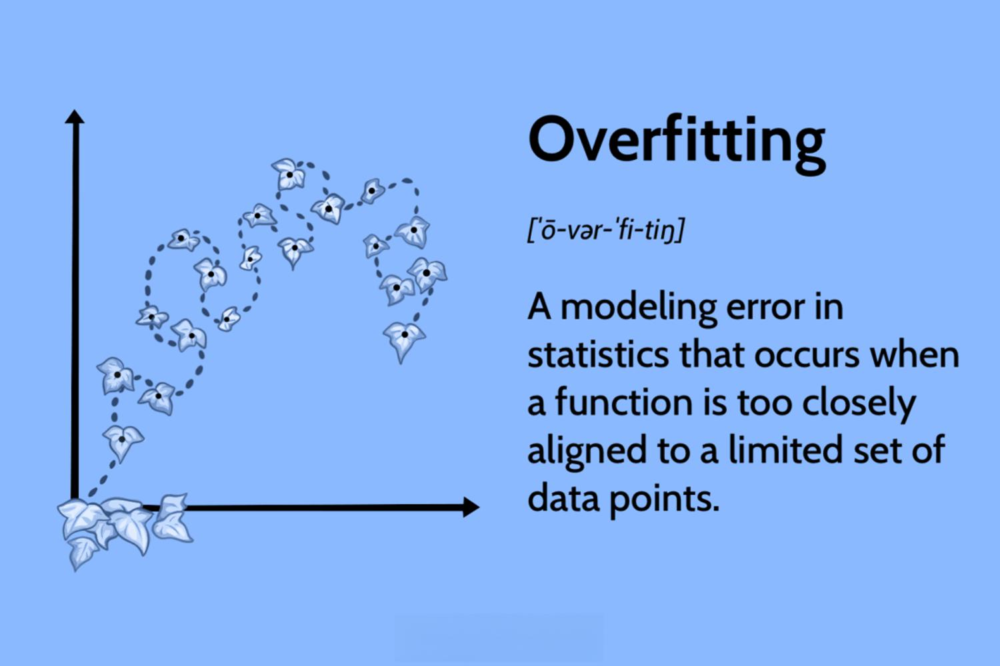

## Table of Contents

## What is overfitting in machine learning?

Overfitting in machine learning happens when a model learns too much from the training data, including the small mistakes and random noise. This makes the model very good at predicting the training data, but not so good at predicting new, unseen data. Imagine you're studying for a test by memorizing every single detail of your notes. You might do well on questions that are exactly like your notes, but you'll struggle with any new questions that are slightly different.

To avoid overfitting, it's important to find a balance. The model should learn the general patterns from the training data, but not the specific details that don't apply to new data. Techniques like using more data, simplifying the model, or using methods like cross-validation can help prevent overfitting. Think of it like learning the main ideas from your notes instead of memorizing every word. This way, you'll be better prepared for any type of question on the test.

## How can you identify overfitting in a model?

You can tell if a model is overfitting by looking at how well it performs on two different sets of data: the training data and the test data. The training data is what the model learned from, and the test data is new data the model hasn't seen before. If the model does really well on the training data but not so well on the test data, it's probably overfitting. It means the model learned the training data too perfectly, including all the little mistakes and random stuff, and can't handle new data well.

Another way to spot overfitting is by using a method called cross-validation. This involves splitting your data into several parts and then using different parts to train and test the model multiple times. If you see that the model's performance on the training parts is always much better than on the testing parts, it's a sign of overfitting. It's like checking if the model can do well on different "tests" or if it's just good at one specific "test" it's been trained on.

## What are the common causes of overfitting?

Overfitting often happens when a model is too complex for the amount of data it's learning from. Imagine you have a simple puzzle, but you're using a really complicated tool to solve it. The tool might work perfectly on that one puzzle, but it won't be good for other puzzles. In the same way, a model with too many details or too many layers can learn the training data too well, including all the little mistakes and random things that aren't important. This makes the model great at predicting the training data but bad at predicting new data.

Another common cause of overfitting is not having enough data. If you're trying to learn a big lesson but you only have a tiny book to learn from, you might end up memorizing the book instead of understanding the lesson. Similarly, if a model doesn't have enough examples to learn from, it might start to treat the random noise in the data as important patterns. This leads to overfitting because the model is trying to fit the data too closely, including all the unimportant details. To avoid this, you need more data or a simpler model that can learn the general patterns without getting caught up in the noise.

## What is the difference between overfitting and underfitting?

Overfitting happens when a model learns too much from the training data, including all the small mistakes and random noise. Imagine you're trying to learn how to ride a bike by practicing on one specific hill. You might get really good at riding that hill, but if you go to a different hill, you might struggle because you learned too much about the first hill and not enough about biking in general. A model that's overfitting will do really well on the training data but not so well on new data it hasn't seen before.

Underfitting is the opposite problem. It happens when a model is too simple and can't learn enough from the training data. It's like trying to learn how to ride a bike but only practicing on a flat road. You might learn the basics, but you won't be prepared for hills or rough terrain. A model that's underfitting won't do well on the training data, and it will also struggle with new data because it hasn't learned enough about the patterns in the data. The key is to find a balance so the model learns just the right amount – not too much and not too little.

## How does the size of the training dataset affect overfitting?

The size of the training dataset is really important when it comes to overfitting. If you have a small dataset, the model might learn too much from it, including all the little mistakes and random stuff. It's like trying to learn a big lesson from just a tiny book. You might end up memorizing the book instead of understanding the lesson. When a model has too little data to learn from, it can start to treat the random noise as important patterns, which leads to overfitting. The model fits the training data too closely, including all the unimportant details, and then it can't predict new data well.

On the other hand, a larger dataset can help prevent overfitting. With more data, the model has more examples to learn from, so it can better understand the general patterns instead of just memorizing the specific details of a small dataset. It's like having a big library of [books](/wiki/algo-trading-books) to learn from instead of just one small book. The model can see more examples of the important patterns and ignore the random noise, which helps it perform better on new data it hasn't seen before. So, using a bigger dataset can make the model more balanced and less likely to overfit.

## What are some techniques to prevent overfitting?

One way to prevent overfitting is by using more data. When a model has more examples to learn from, it can better understand the general patterns and ignore the random noise. It's like having a big library of books to learn from instead of just one small book. With more data, the model won't just memorize the specific details of a small dataset but will learn the important patterns that apply to new data too.

Another technique is to simplify the model. If a model is too complex, it might learn too much from the training data, including all the little mistakes and random stuff. By making the model simpler, like reducing the number of layers or features, it can focus on the big picture instead of the tiny details. It's like using a simpler tool to solve a puzzle; it might not be perfect for one specific puzzle, but it will work better for different puzzles.

You can also use a method called regularization. This adds a penalty to the model for being too complex, which helps it stay focused on the important patterns. It's like having a rule that says you can't use too many complicated words when explaining something. This keeps the explanation simple and easy to understand, just like how regularization keeps the model from overfitting.

## Can you explain the concept of regularization and its role in preventing overfitting?

Regularization is a way to help a model learn the right amount – not too much and not too little. Imagine you're trying to explain something to a friend. If you use too many complicated words and details, your friend might get confused. Regularization is like having a rule that says you can't use too many complicated words. It adds a little penalty to the model for being too complex, which encourages it to focus on the important patterns instead of the tiny details. This helps the model avoid overfitting, which happens when it learns too much from the training data, including all the little mistakes and random stuff.

By using regularization, the model can stay simpler and more balanced. It's like using a simpler tool to solve a puzzle; it might not be perfect for one specific puzzle, but it will work better for different puzzles. Regularization helps the model perform better on new data it hasn't seen before because it learns the general patterns instead of memorizing the specific details of the training data. This way, the model can make better predictions and avoid the problem of overfitting.

## How does cross-validation help in detecting and preventing overfitting?

Cross-validation helps in detecting overfitting by splitting the data into several parts and using different parts to train and test the model multiple times. Imagine you're studying for a test and you have different sets of practice questions. If you do really well on the set you used to study but not so well on the other sets, it means you might have just memorized the study set instead of learning the material. In the same way, if the model performs much better on the training parts than on the testing parts, it's a sign that the model is overfitting. It learned the training data too well, including all the little mistakes and random stuff, and can't handle new data well.

To prevent overfitting, cross-validation helps by showing how the model performs on different parts of the data. This way, you can see if the model is learning the right things or if it's just memorizing the training data. If the model is overfitting, you can try to fix it by using more data, simplifying the model, or using regularization. Cross-validation gives you a better idea of how the model will do on new data, which helps you make it more balanced and less likely to overfit. It's like using different practice tests to make sure you're ready for the real test, not just good at one specific set of questions.

## What role do model complexity and capacity play in overfitting?

Model complexity and capacity are really important when it comes to overfitting. Think of model complexity like how fancy or complicated the model is. If a model is too complex, it might learn too much from the training data, including all the little mistakes and random stuff. It's like trying to solve a simple puzzle with a really complicated tool. The tool might work perfectly on that one puzzle, but it won't be good for other puzzles. In the same way, a model with too many details or too many layers can learn the training data too well, which leads to overfitting. The model does great on the training data but not so well on new data it hasn't seen before.

Model capacity is about how much the model can learn. If a model has too much capacity, it can fit the training data too closely, including all the unimportant details. It's like having a huge memory and trying to remember every single detail of a tiny book. You might end up memorizing the book instead of understanding the big lesson. When a model has too much capacity, it can start to treat the random noise in the data as important patterns, which leads to overfitting. To avoid this, you need to find the right balance so the model learns just the right amount – not too much and not too little.

## How can feature selection help in reducing overfitting?

Feature selection helps reduce overfitting by choosing only the most important pieces of information for the model to learn from. Imagine you're trying to learn how to cook a new dish, but you have a huge cookbook with thousands of recipes. If you try to learn from all of them, you might get confused and overwhelmed. By [picking](/wiki/asset-class-picking) just the recipes that are relevant to the dish you want to cook, you can focus on what's important and ignore the rest. In the same way, feature selection helps the model focus on the important patterns in the data and ignore the random noise, which makes it less likely to overfit.

When a model has too many features, it can start to learn the small mistakes and random stuff in the training data, which leads to overfitting. By selecting the right features, you can make the model simpler and more balanced. It's like using a smaller, more focused cookbook instead of a huge one. This helps the model learn the general patterns that apply to new data, not just the specific details of the training data. So, feature selection can make the model better at predicting new data and less likely to overfit.

## What are the implications of overfitting in real-world applications?

Overfitting can cause big problems in real-world applications. Imagine you have a model that's supposed to help doctors predict if someone is sick. If the model is overfitting, it might be really good at predicting sickness for the people it was trained on, but not so good for new patients. This means the model could give wrong predictions, which could lead to people not getting the right treatment. It's like having a test that's only good for one specific group of people and not everyone else.

In another example, think about a model used for recommending products on a website. If the model is overfitting, it might suggest things that worked well for a small group of people but not for everyone else. This could make the recommendations less helpful and might even make people stop using the website. Overfitting can make models less reliable and useful, so it's important to find ways to prevent it and make sure the models work well for everyone, not just a small group.

## How do advanced techniques like ensemble methods and dropout address overfitting?

Ensemble methods help prevent overfitting by using several models together instead of just one. Imagine you're trying to guess the answer to a question, and you ask a group of friends for their guesses. If you take the most common guess from all your friends, you're more likely to get the right answer than if you just listened to one friend. In the same way, ensemble methods like random forests or boosting combine the predictions of many different models. This helps smooth out the mistakes that any single model might make, including the ones caused by overfitting. By using many models together, ensemble methods can make better predictions on new data and reduce the risk of overfitting.

Dropout is another technique that helps prevent overfitting, especially in neural networks. Think of it like studying for a test with a group of friends, but each time you study, some friends are missing. You have to keep learning and adapting to who's there. Dropout works by randomly turning off some of the connections in the neural network during training. This means the network can't rely too much on any single connection or path, which helps it learn more general patterns instead of memorizing the training data. By making the network more flexible and less dependent on specific details, dropout can help it perform better on new data and avoid overfitting.

## What are techniques to prevent overfitting?

To effectively prevent overfitting in [algorithmic trading](/wiki/algorithmic-trading), several techniques are prevalent and essential. Cross-validation is a fundamental method; it involves dividing the dataset into multiple subsets and training the model on various combinations while validating on the others. This approach ensures that the model's performance is consistent across different data segments, preventing it from memorizing the noise in a single training set. For instance, k-fold cross-validation, a popular variant, splits the dataset into k equally sized folds, training the model k times and each time using a different fold as the validation set.

Regularization methods are also crucial for overfitting prevention. Regularization adds a penalty to the loss function to discourage overly complex models that fit the training data too closely. Common regularization techniques include L1 regularization (Lasso), which encourages sparsity in model features, and L2 regularization (Ridge), which discourages large coefficients in the model. The regularization term is typically incorporated into the cost function as:

$$
\text{Cost Function} = \text{Loss} + \lambda \cdot \text{Regularization Term}
$$

where $\lambda$ is a hyperparameter that controls the strength of the penalty.

Simplifying models plays a vital role in reducing the risk of overfitting. By limiting the number of parameters or selecting only the most impactful features, models become more generalizable. This simplification process can involve using fewer layers or nodes in [neural network](/wiki/neural-network)s, selecting simpler algorithms such as linear regressions over more complex ones, or implementing robust feature selection techniques. Feature selection can be executed through algorithms that evaluate the importance of each feature, like Recursive Feature Elimination (RFE) or using feature importances from tree-based models.

A diverse dataset is another crucial [factor](/wiki/factor-investing) in crafting models that generalize well. Data diversity ensures that the model encounters a wide range of scenarios and features during training, improving its capability to handle unseen data. Including varied market conditions, periods of different [volatility](/wiki/volatility-trading-strategies) levels, or distinct economic cycles can significantly enhance the robustness of the model. It mitigates the risk of a model that performs well only in specific conditions it was trained on, thereby supporting a balanced and comprehensive learning experience.

In summary, combining these techniques can significantly mitigate the risk of overfitting in algorithmic trading models. Adopting practices like cross-validation and regularization, alongside model simplification and ensuring dataset diversity, fosters the development of robust trading strategies with better predictive performance on unseen data.

## References & Further Reading

[1]: Bergstra, J., Bardenet, R., Bengio, Y., & Kégl, B. (2011). ["Algorithms for Hyper-Parameter Optimization."](https://papers.nips.cc/paper_files/paper/2011/hash/86e8f7ab32cfd12577bc2619bc635690-Abstract.html) Advances in Neural Information Processing Systems 24.

[2]: ["Advances in Financial Machine Learning"](https://www.amazon.com/Advances-Financial-Machine-Learning-Marcos/dp/1119482089) by Marcos Lopez de Prado

[3]: ["Evidence-Based Technical Analysis: Applying the Scientific Method and Statistical Inference to Trading Signals"](https://www.wiley.com/en-gb/Evidence+Based+Technical+Analysis:+Applying+the+Scientific+Method+and+Statistical+Inference+to+Trading+Signals-p-9780470008744) by David Aronson

[4]: ["Machine Learning for Algorithmic Trading"](https://www.amazon.com/Machine-Learning-Algorithmic-Trading-intelligence/dp/9918608013) by Stefan Jansen

[5]: ["Quantitative Trading: How to Build Your Own Algorithmic Trading Business"](https://www.amazon.com/Quantitative-Trading-Build-Algorithmic-Business/dp/0470284889) by Ernest P. Chan