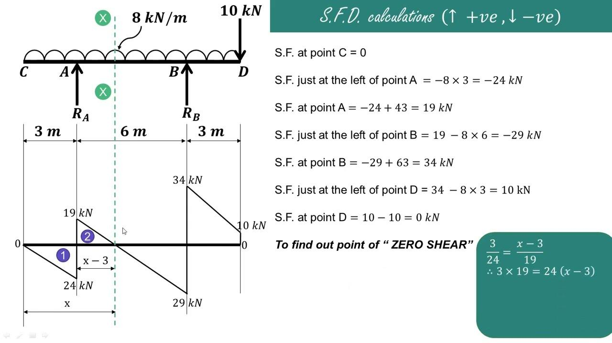

Algorithmic trading has become a pivotal component of modern financial markets, chiefly due to its ability to execute trades with remarkable speed and precision. This type of trading relies on complex algorithms to make decisions based on market data, enabling traders to capitalize on minute price movements within fractions of a second. However, a key aspect of understanding and optimizing algorithmic trading lies in comprehending the various calculation mechanisms that form its foundation. Notably, the concept of "overhang" plays a significant role in these mechanisms.

Overhang refers to the potential dilution of stock shares stemming from stock-based compensation, which can significantly influence trading dynamics and risk levels. Managing overhang effectively is essential to maintaining stability in stock prices and earnings per share, as high overhang levels can lead to increased volatility and pose risks to shareholders. This consideration is particularly vital when constructing algorithmic trading strategies, as it may impact the predictions and decisions made by algorithms.



The mathematics of trading is integral to the development of these algorithms. Descriptive statistics, probability theory, and other mathematical concepts underpin the strategies used to analyze historical data and forecast future market behavior. For instance, moving averages and statistical indicators like the Moving Average Convergence Divergence (MACD) are frequently utilized to identify trading signals. These mathematical tools help clarify trends, allowing algorithms to make more informed decisions by identifying patterns and potential opportunities within the market.

In addition to analyzing historical data, robust algorithms must include mechanisms for managing risk and optimizing performance. This involves employing advanced calculations, such as linear regression and calculus, to predict market trends and create models that are responsive to real-time data. By understanding these mathematical foundations, traders can translate market theories into practical algorithms that enhance trading efficacy.

Practical applications of algorithmic calculations extend beyond mere market analysis. Implementing a solid understanding of overhang and associated risks enables traders to mitigate potential adverse impacts and improve overall strategy performance. The integration of statistical and mathematical principles into algorithmic trading processes also empowers traders to adapt their strategies in response to evolving market conditions.

In conclusion, understanding the calculation mechanisms underpinning algorithmic trading is crucial to formulating effective strategies. With a comprehensive grasp of mathematical concepts and a keen awareness of potential risks such as overhang, traders can significantly enhance their algorithmic trading performance. As financial markets continue to evolve, continuous learning and adaptation remain essential for maintaining a competitive edge in this rapidly advancing field.

## Table of Contents

## Understanding Overhang in Trading

Overhang is a critical concept affecting the dynamics of trading and risk management within financial markets. It refers to the potential dilution of stock shares resulting from stock-based compensation, such as stock options and convertible securities. This dilution can significantly influence trading dynamics by affecting stock prices, investor perceptions, and risk levels.

The calculation of overhang is straightforward. It is determined by the formula: 

$$
\text{Overhang} = \frac{\text{Stock Options Granted} + \text{Options Remaining to be Granted}}{\text{Total Shares Outstanding}}
$$

This formula quantifies the potential increase in the number of shares that could enter the market, potentially affecting shareholder value. A high overhang percentage indicates a substantial amount of future stock issuance, which can dilute the value of existing shares. This possible dilution can lead to increased [volatility](/wiki/volatility-trading-strategies) as market participants anticipate the effects of increased share supply on market prices.

Overhang impacts not only volatility but also earnings per share (EPS) calculations. Since EPS is computed by dividing net earnings by the total number of outstanding shares, any increase in the share base (actual or anticipated) can reduce EPS, which may negatively influence stock valuations. Consequently, shareholders face risks related to diminished share value and returns.

For traders and investors, understanding overhang is essential for developing strategies to counter these potential impacts. For instance, high overhang levels might prompt a reevaluation of investment positions or encourage hedging strategies to manage associated risks. By factoring overhang into their analysis, traders can better align their strategies with market realities, potentially mitigating the adverse effects of stock dilution.

## Calculations in Algorithmic Trading

Algorithmic trading relies on sophisticated calculations that draw upon various mathematical and statistical disciplines, with the core goal of harnessing computational power to develop trading signals, manage risk, and optimize strategies. At its foundation, [algorithmic trading](/wiki/algorithmic-trading) incorporates descriptive [statistics](/wiki/bayesian-statistics), probability theory, linear algebra, and calculus to process and analyze financial market data.

Descriptive statistics provide a foundational layer in algorithmic trading by summarizing essential data attributes. Metrics such as mean, median, variance, and standard deviation help traders understand data distribution, identify anomalies, and assess volatility. For example, calculating the average price of a stock over a specified period offers crucial insights into its typical market behavior, while the standard deviation highlights the extent of price variation and potential market risk.

Probability theory extends this analysis by evaluating the likelihood of various outcomes, thus facilitating risk management and decision-making under uncertainty. Algorithms often incorporate statistical models that estimate the probability of certain price movements or patterns occurring, enabling traders to gauge and hedge potential risks.

Linear algebra plays a pivotal role, particularly in dealing with large datasets and performing matrix operations crucial for certain algorithmic models. For instance, portfolio optimization techniques, such as the Modern Portfolio Theory, leverage covariance matrices to minimize risk while maximizing returns. Linear algebraic approaches also underpin [factor](/wiki/factor-investing) models and principal component analysis, which help in identifying underlying trends and correlations in market data.

Calculus, particularly differential and integral calculus, assists in modeling and predicting dynamic market trends. Techniques from calculus are utilized to determine rates of change for price movements by calculating derivatives, which can indicate market [momentum](/wiki/momentum) or reversals.

In practical scenarios, these mathematical principles manifest through the development of indicators like moving averages and crossovers. Moving averages, such as Simple Moving Average (SMA) and Exponential Moving Average (EMA), smooth out price data to detect market trends. For example, the SMA is calculated as:

$$
\text{SMA}_{n} = \frac{P_1 + P_2 + \ldots + P_n}{n}
$$

where $P_i$ are the closing prices over $n$ days.

Crossovers, including the Moving Average Convergence Divergence (MACD), identify trading signals by comparing short-term and long-term moving averages. In Python, computation of a simple moving average might look as follows:

```python
import numpy as np

def simple_moving_average(prices, window):
    return np.convolve(prices, np.ones(window), 'valid') / window
```

The effective use of these calculations in algorithmic trading empowers traders to capitalize on market opportunities by providing a data-driven framework for systematic trade decisions.

## Mathematical Concepts for Algorithmic Trading

Mathematical concepts are key components in the development and execution of algorithmic trading strategies. Foundational statistical measures like mean, median, and mode are crucial for analyzing trading data, as they provide insights into the central tendency and distribution of asset prices or volumes. The mean (average) gives a general idea of the trading price over a specific period, while the median offers a more robust measure by resisting the influence of outliers. Mode, though less commonly used, can identify the most frequent trading value and indicate strong support or resistance levels.

Calculus is indispensable for modeling and predicting market trends. It aids in understanding the rate of change and motion, which are critical in identifying momentum in price movements. Derivatives—both first and second—help traders assess acceleration and deceleration in price, enabling more informed entries and exits. For example, the first derivative of a stock's price function can indicate the velocity of price change, while the second derivative can show the acceleration or deceleration of that change.

Linear algebra techniques are employed to manage and optimize portfolios, especially when large datasets are involved. Matrix operations can simplify complex calculations required in constructing and rebalancing portfolios. Factor models, such as the Capital Asset Pricing Model (CAPM), utilize linear algebra to explain and predict the relationship between expected return and risk in a portfolio.

Probability theory plays a significant role in risk management and decision making. By estimating the likelihood of various price movements, traders can determine the expected returns and potential risks associated with different trading strategies. Concepts like the probability distribution function (PDF) and cumulative distribution function (CDF) are used to model the distribution of asset returns, helping traders devise strategies that mitigate risks.

Linear regression is a powerful tool for identifying and analyzing trends in financial data. By applying linear regression analysis, traders can establish the relationship between dependent and independent variables, such as stock price and market index. This method provides a way to forecast future price movements based on established relationships, enhancing the predictive power of trading strategies.

Python, widely used for algorithmic trading, facilitates the implementation of these mathematical concepts. For instance, using libraries like NumPy and pandas, traders can efficiently compute central tendencies, linear regressions, and matrix operations. Here's a simple Python example to calculate the moving average, which is often used in trading strategies:

```python
import pandas as pd

# Sample data for stock prices
data = {'Price': [150, 152, 149, 153, 155, 157, 159]}
prices = pd.DataFrame(data)

# Calculate the moving average
window_size = 3
prices['Moving_Average'] = prices['Price'].rolling(window=window_size).mean()

print(prices)
```

In this example, the moving average is computed over a specified window of past prices, which smooths out short-term fluctuations and helps in understanding the market trend. By incorporating such mathematical concepts into algorithmic trading, traders can create more informed and refined strategies.

## Practical Applications and Strategies

Traders utilize calculation mechanisms such as overhang assessment and the Moving Average Convergence Divergence (MACD) indicator to develop viable algorithmic trading strategies. The MACD, a momentum indicator, helps traders identify potential buy and sell signals by analyzing the relationship between two moving averages of a security's price. The principle behind MACD is relatively straightforward: it computes the difference between a short-term exponential moving average (EMA) and a long-term EMA. Typically, the 12-day EMA and the 26-day EMA are employed, and the result is plotted as the MACD line. Additionally, a 9-day EMA of the MACD line, known as the signal line, is plotted as well. The basic strategies involving MACD include the MACD crossover and the zero line cross.

### MACD Crossover

The MACD crossover strategy becomes actionable when the MACD line crosses above or below the signal line. A bullish crossover occurs when the MACD line crosses above the signal line, indicating a potential buying opportunity. Conversely, a bearish crossover transpires when the MACD line crosses below the signal line, suggesting a potential selling opportunity.

**Python Code Example:**

```python
import pandas as pd
import numpy as np

def calculate_macd(prices, short_window=12, long_window=26, signal_window=9):
    short_ema = prices.ewm(span=short_window, adjust=False).mean()
    long_ema = prices.ewm(span=long_window, adjust=False).mean()
    macd = short_ema - long_ema
    signal = macd.ewm(span=signal_window, adjust=False).mean()
    return macd, signal

# Assuming `data` is a pandas DataFrame with historical price data
prices = data['Close']
macd, signal = calculate_macd(prices)
crossover_buy = (macd > signal) & (macd.shift(1) <= signal.shift(1))
crossover_sell = (macd < signal) & (macd.shift(1) >= signal.shift(1))
```

### Zero Line Cross

The zero line cross of the MACD occurs when the MACD line crosses above or below the zero line. A move above the zero line suggests an upward trend, while a descent below it indicates a downward trend. This approach aids traders in confirming the strength of an existing trend or anticipating a potential trend reversal.

**Mathematical Representation:**

Let $\text{MACD} = \text{EMA}_{\text{short}} - \text{EMA}_{\text{long}}$.

- When $\text{MACD} > 0$, the short-term average is above the long-term average, indicating upward momentum.
- When $\text{MACD} < 0$, the short-term average is below the long-term average, reflecting downward momentum.

Effective use of these strategies necessitates a well-founded understanding of the associated mathematical and statistical principles. Evaluations of stock overhang can also play a role in risk assessment and decision-making, especially in scenarios where companies have significant stock-based compensation that could dilute share value. Integrating these analytical tools allows traders to tailor their algorithms to capitalize on price movements, optimize entry and [exit](/wiki/exit-strategy) points, and achieve a strategic edge in fast-moving markets.

## Conclusion

Calculation mechanisms and understanding overhang are integral to formulating effective algorithmic trading strategies. The ability to execute trades with precision and speed hinges on a robust understanding of various calculation methodologies that are rooted in mathematical and statistical principles. For instance, overhang, a key concept indicating potential dilution, plays a critical role in assessing a company's stock performance and its potential impact on trading dynamics.

By leveraging mathematical concepts such as descriptive statistics, probability theory, and calculus, traders can better understand market behaviors and enhance their algorithmic trading performance. Calculations derived from these principles, such as mean, variance, and regression analysis, support the creation of predictive models and inform the development of efficient trading algorithms. 

Python, with its rich ecosystem of libraries like NumPy, pandas, and scikit-learn, proves particularly useful in implementing these calculations. For example, a simple code snippet to calculate the moving average, a common technical indicator, could be implemented as follows:

```python
import pandas as pd

def calculate_moving_average(prices, window_size):
    return prices.rolling(window=window_size).mean()

# Example usage
data = {'Price': [120, 125, 130, 128, 135, 140, 145]}
prices = pd.Series(data['Price'])
moving_average = calculate_moving_average(prices, window_size=3)
print(moving_average)
```

As the financial markets evolve, traders and investors must continue to update and refine their strategies to adapt to new challenges and opportunities. This iterative learning process ensures that they maintain a competitive edge in algorithmic trading. Embracing a mindset of continuous improvement and education is crucial for success in this dynamic field, where technological advancements and market trends constantly reshape the landscape.

## References & Further Reading

[1]: Bergstra, J., Bardenet, R., Bengio, Y., & Kégl, B. (2011). ["Algorithms for Hyper-Parameter Optimization."](https://dl.acm.org/doi/10.5555/2986459.2986743) Advances in Neural Information Processing Systems 24.

[2]: ["Advances in Financial Machine Learning"](https://www.amazon.com/Advances-Financial-Machine-Learning-Marcos/dp/1119482089) by Marcos Lopez de Prado

[3]: ["Evidence-Based Technical Analysis: Applying the Scientific Method and Statistical Inference to Trading Signals"](https://www.amazon.com/Evidence-Based-Technical-Analysis-Scientific-Statistical/dp/0470008741) by David Aronson

[4]: ["Machine Learning for Algorithmic Trading"](https://github.com/stefan-jansen/machine-learning-for-trading) by Stefan Jansen

[5]: ["Quantitative Trading: How to Build Your Own Algorithmic Trading Business"](https://www.amazon.com/Quantitative-Trading-Build-Algorithmic-Business/dp/1119800064) by Ernest P. Chan