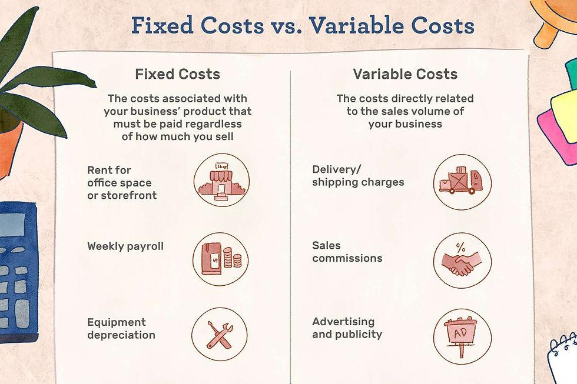

## Table of Contents

## What are overhead expenses?

Overhead expenses are the costs a business has to pay that are not directly tied to making a specific product or service. These are the ongoing expenses needed to keep the business running smoothly. Examples include rent for the office space, utilities like electricity and water, and salaries for employees who do not work directly on the product, like managers or administrative staff.

These expenses are important because they help keep the business operational, but they can also be tricky to manage. If overhead costs get too high, they can eat into the profits of the business. That's why business owners need to keep a close eye on these costs and try to keep them under control. By doing so, they can make sure that the business remains profitable and sustainable over time.

## What are operating expenses?

Operating expenses are the costs a business has to pay to keep running day to day. These are different from the costs of making a product or buying things to sell. Operating expenses include things like rent for the office, salaries for workers who aren't making the product, and bills for electricity and water. These costs are important because they help keep the business going, but they need to be watched carefully.

If operating expenses get too high, they can make it hard for the business to make money. Business owners need to keep these costs in check to stay profitable. For example, they might try to find cheaper office space or look for ways to use less electricity. By managing operating expenses well, a business can keep running smoothly and make more money in the long run.

## How do overhead and operating expenses differ?

Overhead expenses and operating expenses are similar because they both include costs needed to keep a business running. Overhead expenses are the costs that aren't directly linked to making a product or service. For example, rent for the office space, utilities like electricity and water, and salaries for employees who don't work directly on the product, like managers or administrative staff, are all overhead expenses.

Operating expenses, on the other hand, are the costs a business has to pay every day to keep going. These include things like rent, salaries for employees who aren't making the product, and utility bills. Operating expenses are a bit broader because they include all the costs needed to run the business day to day, not just the indirect costs like overhead.

The main difference between the two is that overhead expenses are a subset of operating expenses. Overhead expenses focus on the indirect costs that support the business's operations, while operating expenses cover all the costs of running the business, including both direct and indirect costs. Keeping both types of expenses in check is important for a business to stay profitable and sustainable.

## Can you provide examples of common overhead expenses?

Overhead expenses are costs that businesses have to pay even if they're not making anything. Some common overhead expenses are rent for the office or store. This is money the business has to pay every month to keep a place to work. Another example is utilities, like electricity and water. These bills come every month and need to be paid to keep the lights on and the water running.

Another big overhead expense is salaries for employees who don't make the products. This includes people like managers, accountants, and administrative staff. Their salaries are important because they help keep the business running smoothly, but they're not directly tied to making things. Other examples of overhead expenses are office supplies, like paper and pens, and insurance to protect the business from risks.

Keeping these overhead expenses under control is important for businesses. If they get too high, it can be hard for the business to make money. That's why business owners need to watch these costs closely and find ways to keep them low, like using less electricity or finding cheaper office space.

## What are typical operating expenses for a business?

Operating expenses are the costs a business has to pay every day to keep running. These include rent for the office or store, which is the money the business pays every month to have a place to work. Another big part of operating expenses is salaries for employees. This includes everyone who works at the business, not just the people who make the products. There are also utility bills, like electricity and water, that the business has to pay to keep the lights on and the water running. These bills come every month and need to be paid no matter what.

Other operating expenses include things like office supplies, which are things like paper and pens that the business needs to keep going. There are also costs for insurance, which helps protect the business from risks. Marketing and advertising costs are another part of operating expenses. These are the costs of telling people about the business and its products. Keeping all these operating expenses under control is important for a business. If they get too high, it can be hard for the business to make money. That's why business owners need to watch these costs closely and find ways to keep them low, like using less electricity or finding cheaper office space.

## How do businesses categorize overhead and operating expenses in their financial statements?

Businesses categorize overhead and operating expenses in their financial statements to show how much it costs to run the business every day. Overhead expenses are the costs that aren't directly tied to making a product or service. These include things like rent for the office, utilities like electricity and water, and salaries for employees who don't work directly on the product, like managers or administrative staff. These costs are listed under a section called "overhead" or "indirect costs" in the financial statements.

Operating expenses, on the other hand, include all the costs needed to keep the business running day to day. This category is broader and includes both overhead expenses and other costs like salaries for all employees, not just the ones who don't make the product. It also includes costs for things like office supplies, insurance, and marketing. In financial statements, these are usually listed under a section called "operating expenses" or "SG&A" (Selling, General, and Administrative expenses). By separating these expenses, businesses can see how much they're spending on different parts of their operations and make better decisions about where to cut costs or invest more money.

## What strategies can businesses use to manage and reduce overhead costs?

Businesses can manage and reduce overhead costs by looking at their biggest expenses, like rent and utilities, and finding ways to spend less on them. For example, they might move to a cheaper office space or try to use less electricity by turning off lights and computers when they're not needed. Another way to save money is by negotiating better deals with suppliers for things like office supplies or insurance. By talking to suppliers and asking for discounts, businesses can lower their costs without losing quality.

Another strategy is to use technology to make things more efficient. For example, businesses can use software to automate tasks that used to be done by people, like payroll or accounting. This can save money on salaries and make the business run more smoothly. It's also important to keep an eye on how much employees are working and make sure they're not wasting time. By setting clear goals and keeping track of progress, businesses can make sure everyone is working as efficiently as possible, which helps to keep overhead costs down.

## How do operating expenses impact a company's profitability?

Operating expenses have a big impact on a company's profitability. These are the costs a company has to pay every day to keep running, like rent, salaries, and utility bills. If these expenses get too high, they can eat into the company's profits. For example, if a company spends too much on rent, it might not have enough money left over to make a profit, even if it's selling a lot of products. That's why it's important for business owners to keep a close eye on these costs and try to keep them as low as possible.

One way to manage operating expenses is by finding cheaper ways to do things. For example, a company might move to a less expensive office or find ways to use less electricity. Another way is to use technology to make things more efficient, like using software to handle tasks that used to be done by people. By keeping operating expenses under control, a company can make more money and stay profitable. This helps the business grow and stay strong over time.

## What role do overhead and operating expenses play in budgeting and financial planning?

Overhead and operating expenses are really important when businesses make their budgets and plan their finances. These costs are what the business has to pay to keep running every day. Overhead expenses are the costs that aren't directly tied to making a product or service, like rent for the office and salaries for managers. Operating expenses are a bit broader and include all the costs needed to run the business, like rent, salaries for all employees, and utility bills. By knowing how much these expenses will be, businesses can figure out how much money they need to make to cover them and still make a profit.

When businesses make their budgets, they need to guess how much they'll spend on overhead and operating expenses. They use these guesses to plan how much money they need to bring in from selling their products or services. If they guess too low, they might not have enough money to cover their costs, and if they guess too high, they might not spend their money wisely. By keeping a close eye on these expenses and making smart choices about where to spend money, businesses can make sure they stay profitable and can grow over time.

## How can advanced analytics be used to optimize overhead and operating expenses?

Advanced analytics can help businesses understand their overhead and operating expenses better. By using data and special tools, businesses can see where they're spending the most money and find ways to spend less. For example, they might use analytics to look at their electricity bills and find out when they're using the most power. Then, they can make changes, like turning off lights and computers when they're not needed, to save money. Analytics can also help businesses see if they're paying too much for things like office supplies or insurance. By looking at the data, they can negotiate better deals with suppliers and lower their costs.

Another way advanced analytics can help is by making the business run more smoothly. Businesses can use special software to handle tasks that used to be done by people, like payroll or accounting. This can save money on salaries and make the business more efficient. Analytics can also help businesses keep track of how much their employees are working and make sure they're not wasting time. By setting clear goals and keeping an eye on progress, businesses can make sure everyone is working as efficiently as possible. This helps to keep overhead and operating expenses down and makes the business more profitable.

## What are the tax implications of overhead and operating expenses for different business structures?

Overhead and operating expenses can affect how much tax a business has to pay, and this can be different for different types of business structures. For sole proprietors and partnerships, these expenses can be deducted from their business income to reduce the amount of tax they owe. This means they can subtract the cost of things like rent, utilities, and salaries from their earnings before calculating their tax. This can make a big difference in how much tax they have to pay at the end of the year.

For corporations, the tax implications are a bit different. Corporations can also deduct overhead and operating expenses from their income, but they have to follow stricter rules about what they can deduct. They might have to keep more detailed records and follow certain accounting rules. Also, corporations are taxed on their profits at the corporate level, and then shareholders might have to pay taxes again on any dividends they receive. This is called double taxation, and it can make the tax situation more complicated for corporations compared to sole proprietors or partnerships.

## How do industry-specific factors influence the management of overhead and operating expenses?

Different industries have different needs and costs, which can change how businesses manage their overhead and operating expenses. For example, a restaurant might have high overhead costs because it needs a big space to cook and serve food, and it has to pay for things like ingredients and kitchen equipment. On the other hand, a software company might have lower overhead costs because it can work from a smaller office and doesn't need as much physical stuff. The type of industry a business is in can also affect how it tries to save money. A manufacturing company might focus on making its production process more efficient to cut down on operating expenses, while a retail store might try to save money by negotiating better deals with suppliers.

Another way industry-specific factors can influence expense management is through the need for specialized equipment or staff. For instance, a healthcare business might have high operating expenses because it needs to pay for expensive medical equipment and highly trained staff. These costs are necessary to provide good care, but they can make it harder for the business to make a profit. On the other hand, a consulting firm might have lower operating expenses because it mainly needs computers and skilled employees, which can be less costly. By understanding the unique needs and costs of their industry, businesses can make better decisions about where to spend money and how to keep their expenses under control.

## What is the impact of operating and overhead expenses on profitability?

Operating and overhead expenses play a crucial role in determining the profitability metrics of any business, including [algorithmic trading](/wiki/algorithmic-trading) firms. Effective management of these costs can dramatically influence a firm's bottom line, while unchecked expenses, particularly overheads, can significantly erode profits.

At the core of profitability is the simple formula:

$$
\text{Profit} = \text{Revenue} - (\text{Operating Expenses} + \text{Overhead Expenses})
$$

The equation highlights that, for a given level of revenue, any reduction in operating or overhead expenses directly translates to increased profit. In algorithmic trading, where margins can be tight and competition fierce, achieving high efficiency in managing these costs is vital.

### Systematic Review and Potential Efficiencies

Algorithmic trading firms can benefit considerably from a systematic review of their cost structures. This involves:

1. **Data Analysis**: Utilizing advanced data analytics tools to scrutinize every element of expenses. By doing so, firms can gain insights into where funds are being allocated and identify areas of excess or redundancy.

2. **Technology Utilization**: Leveraging technologies such as machine learning to forecast trading outcomes more accurately, allowing the firm to optimize resource allocation and minimize operating expenses related to trading strategies.

3. **Cost-Benefit Analysis**: A detailed cost-benefit analysis helps in assessing the value derived from each overhead expense. For instance, investments in high-speed internet or premium data feeds should be evaluated for their direct impact on trading performance and decision-making speed.

### Implementing Cost-Saving Measures

Implementing effective cost-saving measures requires a strategic and informed approach, which includes:

- **Automation**: Many trading operations can be automated, reducing manual intervention costs and increasing efficiency. Automation not only cuts down labor costs but also minimizes the risk of human error.

- **Strategic Sourcing**: Firms should consider strategic sourcing for their data subscriptions and software needs, possibly negotiating better terms with suppliers or opting for cloud-based solutions which often offer cost savings over traditional infrastructure.

- **Regular Audits**: Conducting regular audits ensures that all expenses are routinely evaluated. This helps in identifying obsolete or unnecessary expenditures that can be eliminated to preserve capital.

Managing both operating and overhead expenses diligently enhances a firm's financial health, allowing it to maintain competitive positions within markets. For algorithmic trading firms, which operate in a high-stakes environment, achieving optimal expense management is fundamental to sustaining profitability and growth. This approach not only reduces risk but also frees up resources that can be redirected towards innovation and strategic investment, creating a robust operational model that supports continuous advancement.

## References & Further Reading

[1]: Bergstra, J., Bardenet, R., Bengio, Y., & Kégl, B. (2011). ["Algorithms for Hyper-Parameter Optimization."](https://dl.acm.org/doi/10.5555/2986459.2986743) Advances in Neural Information Processing Systems 24.

[2]: ["Advances in Financial Machine Learning"](https://www.amazon.com/Advances-Financial-Machine-Learning-Marcos/dp/1119482089) by Marcos Lopez de Prado

[3]: ["Evidence-Based Technical Analysis: Applying the Scientific Method and Statistical Inference to Trading Signals"](https://www.amazon.com/Evidence-Based-Technical-Analysis-Scientific-Statistical/dp/0470008741) by David Aronson

[4]: ["Machine Learning for Algorithmic Trading"](https://github.com/stefan-jansen/machine-learning-for-trading) by Stefan Jansen

[5]: ["Quantitative Trading: How to Build Your Own Algorithmic Trading Business"](https://www.amazon.com/Quantitative-Trading-Build-Algorithmic-Business/dp/1119800064) by Ernest P. Chan