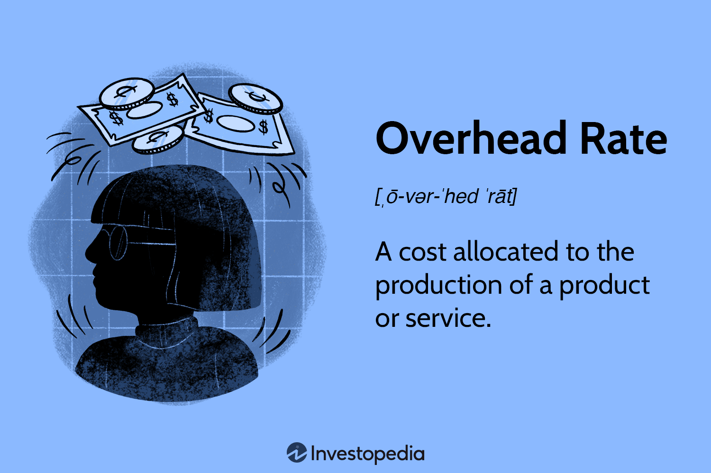

## Table of Contents

## What is the overhead rate?

The overhead rate is a way to figure out how much it costs to run a business, aside from the direct costs of making a product or providing a service. It includes things like rent, utilities, and salaries for people who don't directly work on the product. Businesses use the overhead rate to understand how much extra cost they have to cover to keep operating.

To calculate the overhead rate, you take the total overhead costs and divide them by a base, like the total number of labor hours or the total cost of goods sold. For example, if your overhead costs are $50,000 and you have 10,000 labor hours in a year, your overhead rate would be $5 per labor hour. This helps businesses set prices that cover all their costs and make a profit.

## Why is the overhead rate important for businesses?

The overhead rate is important for businesses because it helps them understand all the extra costs they have to pay, like rent, utilities, and salaries for staff who don't make the product. Knowing these costs helps a business figure out how much they need to charge for their products or services to make sure they cover everything and still make a profit. If a business doesn't know its overhead rate, it might set prices too low and lose money.

Also, the overhead rate helps businesses make smart decisions about where to spend their money. If the overhead rate is too high, a business might look for ways to cut costs, like moving to a cheaper office or finding ways to use less electricity. By keeping an eye on the overhead rate, a business can stay healthy and keep running smoothly.

## How do you calculate the overhead rate?

To calculate the overhead rate, you need to know your total overhead costs and a base to divide them by. Overhead costs are things like rent, utilities, and salaries for staff who don't make the product. The base can be something like the total number of labor hours worked in a year or the total cost of goods sold. You take the total overhead costs and divide them by the base to get the overhead rate.

For example, if your overhead costs are $50,000 and you have 10,000 labor hours in a year, you would divide $50,000 by 10,000 to get an overhead rate of $5 per labor hour. This means that for every hour of labor, you have to add $5 to cover the overhead costs. Knowing this rate helps you set prices for your products or services that cover all your costs and make a profit.

## What are the different types of overhead costs?

Overhead costs are the extra expenses a business has to pay, aside from the costs of making their product or service. These costs can be broken down into three main types: fixed, variable, and semi-variable. Fixed overhead costs stay the same no matter how much the business produces. Examples include rent for the office or factory, insurance, and salaries for employees who don't work directly on the product, like managers or administrative staff.

Variable overhead costs change depending on how much the business produces. These costs go up when production goes up and go down when production goes down. Examples include utilities like electricity and water, which might increase if more machines are running, and supplies like office paper or cleaning materials. Semi-variable overhead costs have both a fixed and a variable part. For example, a phone bill might have a fixed monthly charge plus extra charges based on how many calls are made.

Understanding these different types of overhead costs helps businesses plan better and make sure they set their prices right to cover all their expenses. By keeping track of fixed, variable, and semi-variable costs, a business can figure out where they might be able to save money or where they need to spend more to keep things running smoothly.

## Can you provide an example of overhead rate calculation?

Let's say a small bakery has total overhead costs of $30,000 for a year. These costs include rent for the bakery, utilities like electricity and water, and the salary for the manager who doesn't bake the bread. The bakery wants to know its overhead rate so it can set the right prices for its bread. They decide to use the total number of labor hours as the base for calculating the overhead rate. In a year, the bakery's bakers work a total of 6,000 hours.

To calculate the overhead rate, the bakery divides its total overhead costs by the total number of labor hours. So, they take $30,000 and divide it by 6,000 hours. This gives them an overhead rate of $5 per labor hour. This means that for every hour a baker works, the bakery needs to add $5 to the cost of the bread to cover the overhead costs. Knowing this helps the bakery set prices that will cover all their costs and make a profit.

## How does the overhead rate affect pricing strategies?

The overhead rate is really important when a business is figuring out how to set its prices. It tells the business how much extra cost they have for things like rent, utilities, and staff salaries that aren't directly making the product. If a business knows its overhead rate, they can add that cost to the price of their product. For example, if it costs $2 to make a cake and the overhead rate adds another $3 per hour of baking, the business needs to make sure the price of the cake covers both the direct cost and the overhead.

Knowing the overhead rate helps a business make smart choices about pricing. If the overhead rate is high, the business might need to charge more for their products to make sure they're not losing money. On the other hand, if the overhead rate is low, they might be able to charge less and still make a good profit. By understanding the overhead rate, a business can set prices that keep them profitable and competitive in the market.

## What are common mistakes in calculating the overhead rate?

One common mistake in calculating the overhead rate is not including all the overhead costs. Sometimes, businesses forget to add in things like insurance, office supplies, or the salaries of staff who don't make the product. If these costs are left out, the overhead rate will be too low, and the business might set prices that don't cover all their expenses. It's important to make a list of all the overhead costs and double-check it to make sure nothing is missed.

Another mistake is choosing the wrong base to divide the overhead costs by. The base could be the total number of labor hours, the total cost of goods sold, or something else. If the base is too small, the overhead rate will be too high, and if it's too big, the rate will be too low. For example, if a business uses the total number of labor hours but forgets to include the hours worked by part-time staff, the overhead rate will be too high. It's important to pick a base that makes sense for the business and includes everything it should.

A third mistake is not updating the overhead rate regularly. Overhead costs can change over time, like when rent goes up or when a business hires more staff. If the overhead rate isn't updated to reflect these changes, the business might end up with prices that are too high or too low. It's a good idea to check and update the overhead rate at least once a year, or whenever there are big changes in the business.

## How can a business reduce its overhead rate?

A business can reduce its overhead rate by finding ways to cut down on costs that aren't directly related to making its products or services. One way to do this is by looking at fixed costs like rent. If the rent is too high, the business could move to a cheaper location or try to negotiate a lower rent with the landlord. Another way is to save on utilities, like electricity and water, by using energy-efficient equipment or turning off lights and machines when they're not needed. The business could also look at salaries for staff who don't make the product and see if there are ways to save money, like hiring part-time workers instead of full-time or using technology to do some of the work.

Another way to lower the overhead rate is by keeping an eye on variable costs, which change based on how much the business produces. If the business can find cheaper suppliers for things like office supplies or cleaning materials, it can save money. They might also find ways to use less of these supplies, like printing less or using reusable items. By keeping track of these costs and finding ways to make them smaller, the business can bring down its overhead rate. This means they can charge less for their products or services and still make a good profit, or they can keep their prices the same and make more money.

## How does the overhead rate vary across different industries?

The overhead rate can be very different depending on the industry a business is in. Some industries, like manufacturing, have high overhead costs because they need big factories, lots of machines, and many workers who don't make the product directly. These businesses might have to spend a lot on rent, utilities, and salaries for managers and maintenance staff. On the other hand, a service industry like a consulting firm might have lower overhead costs. They might not need a big office space, and their main costs could be salaries for the consultants and some office supplies. So, the overhead rate for a manufacturing business could be much higher than for a consulting firm.

Even within the same industry, the overhead rate can vary a lot from one business to another. For example, in the restaurant industry, a fancy restaurant in a big city might have high overhead costs because of the expensive rent and the need for a big staff. But a small food truck might have much lower overhead costs because it doesn't need a big space and can run with just a few people. So, the overhead rate for the fancy restaurant would be higher than for the food truck, even though they're both in the restaurant industry. Understanding these differences helps businesses set the right prices and make smart decisions about where to spend their money.

## What is the relationship between overhead rate and profitability?

The overhead rate is really important for a business's profitability. It tells the business how much extra cost they have to cover things like rent, utilities, and staff salaries that aren't directly making the product. If the overhead rate is too high, it can eat into the business's profits. This means the business has to charge more for their products or services to make sure they're covering all their costs. If they can't charge enough to cover the high overhead, they might end up losing money.

On the other hand, if a business can keep its overhead rate low, it can be more profitable. With a lower overhead rate, the business doesn't need to charge as much to cover all its costs, so they can either keep their prices the same and make more profit or lower their prices and sell more. By keeping an eye on the overhead rate and finding ways to reduce it, a business can make sure they're making enough money to stay healthy and grow.

## How should overhead rates be monitored and adjusted over time?

Overhead rates should be monitored regularly to make sure a business stays profitable. This means keeping track of all the costs that aren't directly related to making the product, like rent, utilities, and staff salaries. Businesses can do this by looking at their financial reports every month or every quarter. If they see that these costs are going up, they need to think about how to bring them down. This could mean moving to a cheaper office, using less electricity, or finding cheaper suppliers for things like office supplies.

Adjusting the overhead rate over time is also important. If a business finds that its overhead costs have changed a lot, like if rent goes up or they hire more staff, they need to update their overhead rate. This can be done by dividing the new total overhead costs by the same base they used before, like the total number of labor hours or the cost of goods sold. By doing this, the business can make sure their prices still cover all their costs and they can keep making a profit. It's a good idea to check and adjust the overhead rate at least once a year, or whenever there are big changes in the business.

## What advanced methods exist for allocating overhead costs more accurately?

One advanced method for allocating overhead costs more accurately is called activity-based costing (ABC). This method looks at all the different activities a business does, like ordering materials, setting up machines, or handling customer orders. It figures out how much each activity costs and then assigns those costs to the products or services that use those activities. This way, a business can see exactly how much each product or service is really costing them, including all the overhead. This helps them set prices that are fair and make sure they're not losing money on anything.

Another method is using cost drivers to allocate overhead costs. Cost drivers are things that cause overhead costs to go up or down, like the number of machine hours used or the number of orders processed. By figuring out which cost drivers are most important for their business, a company can allocate overhead costs based on how much each product or service uses those drivers. This makes the overhead rate more accurate because it's based on what's really happening in the business. Both of these methods help businesses understand their costs better and make smarter decisions about pricing and where to spend their money.

## What is the Formula and Calculation of Overhead Rate?

The overhead rate is an essential financial metric, calculated to allocate indirect costs to trading activities accurately. The formula for calculating the overhead rate is:

$$
\text{Overhead Rate} = \frac{\text{Indirect Costs}}{\text{Allocation Measure}}
$$

Indirect costs refer to expenses that are not directly associated with the core trading activities but are necessary for the operation of the trading firm. These may include data feed costs, IT infrastructure, regulatory compliance, and administrative salaries. 

The allocation measure serves as the basis for distributing these indirect costs across different trading activities. In the context of [algorithmic trading](/wiki/algorithmic-trading), this can vary significantly and is often selected based on the trading environment and the firm's specific needs. Common allocation measures include:

- **Trading Volume**: This involves dividing the total indirect costs by the number of trades executed over a given period. It is useful for firms that want to understand the cost impact relative to market activity.

- **Hours of Operation**: This metric allocates costs based on the number of hours trading systems are operational. It is particularly useful for quantifying costs for firms that maintain extensive trading hours, regardless of trading volume.

- **Computational Usage**: With the increasing reliance on high-frequency trading algorithms and complex computational models, firms may choose to allocate indirect costs based on computational usage. This involves assessing the expenses associated with server maintenance, data processing, and hardware or software utilization.

By applying this method, trading firms can determine the overhead cost incurred per unit of trading activity. This insight is crucial for effective cost management, pricing strategies, and profitability analysis. Here's a simple example in Python that calculates the overhead rate using trading [volume](/wiki/volume-trading-strategy) as the allocation measure:

```python
def calculate_overhead_rate(indirect_costs, trading_volume):
    if trading_volume == 0:
        return "Allocation measure (trading volume) cannot be zero."
    return indirect_costs / trading_volume

# Example usage:
indirect_costs = 100000  # Example indirect costs in currency
trading_volume = 5000    # Number of trades
overhead_rate = calculate_overhead_rate(indirect_costs, trading_volume)
print("Overhead Rate per Trade:", overhead_rate)
```

This script calculates the overhead rate per trade by dividing the total indirect costs by the trading volume. Adjusting the allocation measure and indirect costs as necessary allows firms to tailor this approach to align with their operational structures and strategic goals.

## What are some examples of overhead calculations in trading?

Example 1: Consider a trading firm that determines overhead costs by analyzing the number of executed trades. The firm identifies electricity for server use and data costs as significant indirect expenses. For instance, if the firm's servers are operational 24/7 to execute trades, the electricity costs are substantial. Additionally, maintaining continuous data feeds incurs consistent indirect expenses. The overhead can be calculated using the formula:

$$
\text{Overhead Rate} = \frac{\text{Electricity Cost} + \text{Data Costs}}{\text{Total Number of Executed Trades}}
$$

This calculation gives a per-trade overhead cost, allowing the firm to assess profitability per trade more accurately and adjust their pricing strategies as necessary.

Example 2: In high-frequency trading ([HFT](/wiki/high-frequency-trading-strategies)), overhead might be measured in terms of computing hours. This is crucial since HFT strategies rely heavily on executing a large number of transactions in milliseconds, requiring intensive computational resources. Key indirect expenses for HFT firms include server maintenance and cooling costs. The overhead per computing hour can be computed as follows:

$$
\text{Overhead Rate} = \frac{\text{Server Maintenance Cost} + \text{Cooling Cost}}{\text{Total Computing Hours}}
$$

By understanding overhead on a per-hour basis, HFT firms can identify periods of inefficiency or excessive costs and optimize server usage to minimize overhead expenditure.

Both examples illustrate how accurately calculating overhead costs based on different measures—such as trades executed or computing hours—can provide insights into operational efficiencies and inform strategic decision-making in algorithmic trading environments.

## References & Further Reading

[1]: Bergstra, J., Bardenet, R., Bengio, Y., & Kégl, B. (2011). ["Algorithms for Hyper-Parameter Optimization."](https://dl.acm.org/doi/10.5555/2986459.2986743) Advances in Neural Information Processing Systems 24.

[2]: ["Advances in Financial Machine Learning"](https://www.amazon.com/Advances-Financial-Machine-Learning-Marcos/dp/1119482089) by Marcos Lopez de Prado

[3]: ["Evidence-Based Technical Analysis: Applying the Scientific Method and Statistical Inference to Trading Signals"](https://www.amazon.com/Evidence-Based-Technical-Analysis-Scientific-Statistical/dp/0470008741) by David Aronson

[4]: ["Machine Learning for Algorithmic Trading"](https://github.com/stefan-jansen/machine-learning-for-trading) by Stefan Jansen

[5]: ["Quantitative Trading: How to Build Your Own Algorithmic Trading Business"](https://www.amazon.com/Quantitative-Trading-Build-Algorithmic-Business/dp/1119800064) by Ernest P. Chan