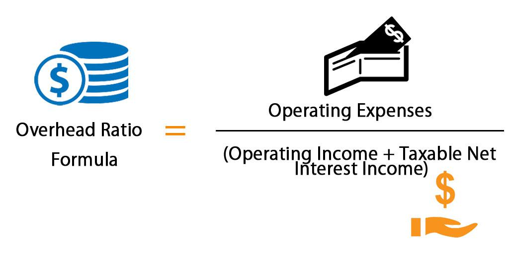

In the fast-paced world of algorithmic trading, understanding cost structures is vital for accurate decision-making. One of these critical cost elements is the overhead rate, a financial metric that helps allocate indirect costs to products and services. Naming conventions in algorithmic trading might be deceptively simple, but grasping such metrics is complex because it requires balancing technological investment, human expertise, and market demand.

This article will explore the formula for calculating overhead rates, showing how indirect costs such as data feeds, IT infrastructure, and regulatory compliance can be systematically allocated across trading activities. This structured approach is crucial for precise costs assessments, which leads to more informed pricing strategies and improved profitability analysis within algorithmic trading.



We'll examine examples and methodologies used in the industry, as well as technological innovations such as artificial intelligence (AI) and machine learning that streamline overhead management. These advancements help trading firms efficiently manage resources and make sound financial decisions. Moreover, practical application across diverse trading environments underscores the importance of tailored strategies to enhance cost efficiency.

By the end of this article, readers will understand how accurately managing overhead rates not only impacts profitability but also enables strategic decision-making, ultimately enhancing the performance of trading operations. We will also introduce practical guidelines on applying these concepts in various trading settings, ensuring that trading firms are well-equipped to optimize their overhead allocations and improve operational outcomes.

## Table of Contents

## Understanding Overhead Rate

The overhead rate is a crucial financial metric used to allocate costs associated with producing a product or service that are not directly linked to production activities. These indirect costs typically include expenditures such as rent, utilities, administrative salaries, and other expenses that support the overall functioning of an organization but do not directly contribute to the creation of a specific product or service.

In the context of algorithmic trading, understanding and managing overhead costs become essential for optimizing trading strategies and ensuring accurate pricing of services. Common types of overhead costs within this domain include data feed costs, IT infrastructure expenses, and regulatory compliance fees. Data feed costs are incurred from accessing real-time market data that algorithmic trading systems rely on for making informed trading decisions. IT infrastructure expenses cover the maintenance and operation of the technological framework required for running complex trading algorithms, including servers, storage solutions, and network resources. Regulatory compliance costs pertain to the expenditures associated with adhering to financial regulations and ensuring that trading practices remain within the legal framework.

By accurately identifying and allocating overhead costs, [algorithmic trading](/wiki/algorithmic-trading) firms can better assess the true profitability of their trading strategies. This involves recognizing how these costs impact the overall financial landscape of trading activities and subsequently making informed decisions that enhance pricing strategies and cost management.

A clear understanding of overhead costs also facilitates strategic improvements. Firms may identify areas where they can reduce unnecessary expenditures—such as optimizing data processing methods or leveraging more efficient computational resources—leading to improved operational efficiency and profitability. Proactively managing these indirect costs allows trading firms to maintain a competitive edge while maximizing returns on their trading activities.

## Formula and Calculation of Overhead Rate

The overhead rate is an essential financial metric, calculated to allocate indirect costs to trading activities accurately. The formula for calculating the overhead rate is:

$$
\text{Overhead Rate} = \frac{\text{Indirect Costs}}{\text{Allocation Measure}}
$$

Indirect costs refer to expenses that are not directly associated with the core trading activities but are necessary for the operation of the trading firm. These may include data feed costs, IT infrastructure, regulatory compliance, and administrative salaries. 

The allocation measure serves as the basis for distributing these indirect costs across different trading activities. In the context of algorithmic trading, this can vary significantly and is often selected based on the trading environment and the firm's specific needs. Common allocation measures include:

- **Trading Volume**: This involves dividing the total indirect costs by the number of trades executed over a given period. It is useful for firms that want to understand the cost impact relative to market activity.

- **Hours of Operation**: This metric allocates costs based on the number of hours trading systems are operational. It is particularly useful for quantifying costs for firms that maintain extensive trading hours, regardless of trading volume.

- **Computational Usage**: With the increasing reliance on high-frequency trading algorithms and complex computational models, firms may choose to allocate indirect costs based on computational usage. This involves assessing the expenses associated with server maintenance, data processing, and hardware or software utilization.

By applying this method, trading firms can determine the overhead cost incurred per unit of trading activity. This insight is crucial for effective cost management, pricing strategies, and profitability analysis. Here's a simple example in Python that calculates the overhead rate using trading [volume](/wiki/volume-trading-strategy) as the allocation measure:

```python
def calculate_overhead_rate(indirect_costs, trading_volume):
    if trading_volume == 0:
        return "Allocation measure (trading volume) cannot be zero."
    return indirect_costs / trading_volume

# Example usage:
indirect_costs = 100000  # Example indirect costs in currency
trading_volume = 5000    # Number of trades
overhead_rate = calculate_overhead_rate(indirect_costs, trading_volume)
print("Overhead Rate per Trade:", overhead_rate)
```

This script calculates the overhead rate per trade by dividing the total indirect costs by the trading volume. Adjusting the allocation measure and indirect costs as necessary allows firms to tailor this approach to align with their operational structures and strategic goals.

## Application in Algorithmic Trading

Accurate overhead allocation in algorithmic trading plays a crucial role in ensuring that pricing strategies are reflective of all incurred costs, leading to better profitability analysis. This precision in cost measurement allows trading firms to set more competitive and sustainable pricing for their trading services. In the context of algorithmic trading, overhead costs might include data feed expenses, server usage, regulatory compliance, and IT infrastructure maintenance. Thus, a comprehensive understanding and application of overhead rates can significantly impact the financial health and strategic decisions of a trading firm.

Trading firms employ various allocation measures to calculate overhead rates accurately. Some of the most prevalent include trade volume and algorithm runtime. Trade volume as an allocation measure assesses overhead based on the number of trades executed within a given period. This method allows firms to determine the cost incurred per trade, thereby refining trade pricing strategies. Moreover, this volume-based approach can identify high-cost periods, guiding strategic reductions in trading activities during those times.

On the other hand, algorithm runtime focuses on the duration of computational resources utilized by trading algorithms. High-frequency trading firms, for instance, often rely on this measure due to the intense computational demands of executing numerous trades per second. By calculating overhead based on algorithm runtime, firms can gauge the efficiency of their algorithms in terms of resource usage. This assessment highlights opportunities to refine algorithms, potentially reducing computation time and, consequently, associated overhead costs.

Tracking overhead rates over time provides insights into operational efficiency, pinpointing areas where improvements can lead to cost savings. For example, firms might recognize that certain algorithms consistently incur high data processing costs. By optimizing these algorithms, either through code enhancements or employing more efficient hardware, firms can reduce indirect expenses. Additionally, firms can leverage these insights to balance workloads across available resources, preventing bottlenecks and ensuring optimal server performance.

In summary, precise overhead allocation in algorithmic trading strengthens the link between incurred costs and pricing strategies, supporting enhanced profitability analysis. By harnessing allocation measures such as trade volume and algorithm runtime, firms can achieve a clearer understanding of their financial obligations and identify areas for efficiency improvements, ultimately improving their competitive edge in the trading industry.

## Technological Innovations for Overhead Management

Technological advancements have significantly transformed overhead management in algorithmic trading, offering tools to optimize cost structures and enhance strategic decision-making. Key innovations such as [artificial intelligence](/wiki/ai-artificial-intelligence) (AI), [machine learning](/wiki/machine-learning), and cloud-based solutions have enabled real-time cost tracking and forecasting, essential for maintaining competitive advantage in the fast-paced trading environment.

AI and machine learning are instrumental in predicting future overhead expenses by analyzing historical data trends. These technologies use complex algorithms to process vast datasets, automate cost analysis, and provide insights into cost drivers, enabling firms to anticipate changes and make informed adjustments to their trading strategies. For instance, machine learning models can predict data feed expenses based on trading volume patterns, allowing firms to optimize resource allocation and cost management.

Cloud-based solutions offer scalability and flexibility, vital for managing overhead in a dynamic trading landscape. They facilitate the seamless integration of disparate data sources, providing a unified platform for monitoring and analyzing overhead costs. Cloud infrastructure supports cost-efficient storage and processing power, enabling firms to handle large-scale data analytics without the need for significant upfront investment in IT infrastructure.

Enterprise Resource Planning (ERP) systems enhance overhead management by consolidating various business processes into a single framework. These systems provide comprehensive insights into cost allocation across multiple trading strategies, facilitating the identification of inefficiencies and the optimization of resource allocation. An ERP system can aggregate data from trading activities, regulatory compliance, and IT operations, offering a holistic view of indirect costs and their impact on profitability.

Moreover, advancements in big data analytics empower trading firms to derive actionable insights from massive datasets. By leveraging data analytics tools, firms can conduct granular analyses of cost components, uncovering opportunities for reducing overhead and improving operational efficiency. For example, data analysis can identify patterns in server usage that suggest potential cost savings through strategic scheduling or optimization of algorithmic runtime.

These technological innovations represent a paradigm shift in overhead management, providing algorithmic trading firms with the capability to enhance cost accuracy, improve profitability analysis, and refine strategic decisions. As these technologies continue to evolve, their integration into overhead management processes promises further opportunities for efficiency gains and strategic advantage in the competitive trading landscape.

## Examples of Overhead Calculations in Trading

Example 1: Consider a trading firm that determines overhead costs by analyzing the number of executed trades. The firm identifies electricity for server use and data costs as significant indirect expenses. For instance, if the firm's servers are operational 24/7 to execute trades, the electricity costs are substantial. Additionally, maintaining continuous data feeds incurs consistent indirect expenses. The overhead can be calculated using the formula:

$$
\text{Overhead Rate} = \frac{\text{Electricity Cost} + \text{Data Costs}}{\text{Total Number of Executed Trades}}
$$

This calculation gives a per-trade overhead cost, allowing the firm to assess profitability per trade more accurately and adjust their pricing strategies as necessary.

Example 2: In high-frequency trading ([HFT](/wiki/high-frequency-trading-strategies)), overhead might be measured in terms of computing hours. This is crucial since HFT strategies rely heavily on executing a large number of transactions in milliseconds, requiring intensive computational resources. Key indirect expenses for HFT firms include server maintenance and cooling costs. The overhead per computing hour can be computed as follows:

$$
\text{Overhead Rate} = \frac{\text{Server Maintenance Cost} + \text{Cooling Cost}}{\text{Total Computing Hours}}
$$

By understanding overhead on a per-hour basis, HFT firms can identify periods of inefficiency or excessive costs and optimize server usage to minimize overhead expenditure.

Both examples illustrate how accurately calculating overhead costs based on different measures—such as trades executed or computing hours—can provide insights into operational efficiencies and inform strategic decision-making in algorithmic trading environments.

## Limitations of Overhead Rate Calculations

While overhead rate calculations are a cornerstone in determining the allocation of indirect costs, they come with several limitations that trading firms must recognize. First, firms with minimal indirect costs might find the traditional overhead rate formula less relevant. In such cases, the calculated overhead might be disproportionately small compared to direct costs, diminishing its usefulness for comprehensive cost analysis.

Moreover, overhead rate calculations can become challenging when applied across diverse trading environments. Varying trading strategies and operations can lead to significant differences in how costs are incurred and distributed. For instance, a firm utilizing high-frequency trading might prioritize computational and data feed costs, whereas another focusing on long-term investments may see these as less significant. This disparity can render a one-size-fits-all approach to overhead rates ineffective.

Therefore, it is crucial for trading firms to tailor overhead calculations to fit their specific operational needs and industry standards. Customization can involve adjusting the allocation measures or weights given to different indirect costs, ensuring that calculations provide meaningful insights. For example, a trading firm can customize their overhead allocation by implementing a dynamic weighting system on its computational costs, adapting to changes in trading volume or strategy shifts.

An example of customizing the calculation could involve using Python to adjust weights based on real-time trading data:

```python
def calculate_custom_overhead_rate(indirect_costs, allocation_measure, weights):
    total_weight = sum(weights.values())
    adjusted_costs = {key: (value * weights[key] / total_weight) for key, value in indirect_costs.items()}
    overhead_rate = sum(adjusted_costs.values()) / allocation_measure
    return overhead_rate

# Example usage
indirect_costs = {'data_feeds': 3000, 'server_maintenance': 2000}
allocation_measure = 5000
weights = {'data_feeds': 1.5, 'server_maintenance': 1}
overhead_rate = calculate_custom_overhead_rate(indirect_costs, allocation_measure, weights)
print(f"Customized Overhead Rate: {overhead_rate}")
```

In this script, the `calculate_custom_overhead_rate` function allows firms to distribute indirect costs dynamically, reflecting their strategic priorities. This flexibility supports more accurate and context-sensitive cost management decisions. Ultimately, effective customization of overhead calculations helps firms align closer with operational realities, leading to better-informed financial strategies.

## Conclusion

Understanding and accurately calculating overhead rates is crucial for any trading firm aiming for optimal performance and profitability. By effectively managing these rates, firms can gain a more precise comprehension of the cost structures that underpin their trading operations. This precision allows for more informed decision-making regarding pricing strategies and resource allocation, which in turn can enhance profitability.

Methodically applying overhead rates helps firms manage costs more efficiently. By incorporating overhead calculations into the cost management process, trading firms can identify areas where resources are being underutilized or overextended. This insight allows firms to adjust operations and strategies accordingly, ensuring that every aspect of their trading activities is aligned with the goal of optimal financial performance.

As technology progresses, firms are equipped with advanced tools that simplify and improve the handling of overhead costs. Modern technologies such as artificial intelligence and machine learning, along with cloud-based solutions, enable real-time data analysis and forecasting of future costs. These innovations facilitate more accurate overhead rate allocation and provide greater visibility into cost drivers. For instance, AI algorithms can predict trends in overhead expenses based on historical data, allowing firms to preemptively address potential cost increases.

Moreover, integrated software tools, such as enterprise resource planning (ERP) systems, offer a comprehensive view of a firm’s cost structure. These systems automate data collection and analysis, allowing trading firms to allocate overhead with greater precision across various strategies and operations. This integration ensures that overhead management is not just a backend function but an integral part of the firm’s strategic planning.

In conclusion, the ability to manage overhead rates effectively empowers trading firms to maintain competitive pricing and enhance profitability. As the landscape of trading becomes increasingly competitive and technologically advanced, the firms that succeed will be those that leverage tools and methodologies to streamline overhead management, making it a cornerstone of their operational strategy.

## References & Further Reading

[1]: Bergstra, J., Bardenet, R., Bengio, Y., & Kégl, B. (2011). ["Algorithms for Hyper-Parameter Optimization."](https://dl.acm.org/doi/10.5555/2986459.2986743) Advances in Neural Information Processing Systems 24.

[2]: ["Advances in Financial Machine Learning"](https://www.amazon.com/Advances-Financial-Machine-Learning-Marcos/dp/1119482089) by Marcos Lopez de Prado

[3]: ["Evidence-Based Technical Analysis: Applying the Scientific Method and Statistical Inference to Trading Signals"](https://www.amazon.com/Evidence-Based-Technical-Analysis-Scientific-Statistical/dp/0470008741) by David Aronson

[4]: ["Machine Learning for Algorithmic Trading"](https://github.com/stefan-jansen/machine-learning-for-trading) by Stefan Jansen

[5]: ["Quantitative Trading: How to Build Your Own Algorithmic Trading Business"](https://www.amazon.com/Quantitative-Trading-Build-Algorithmic-Business/dp/1119800064) by Ernest P. Chan