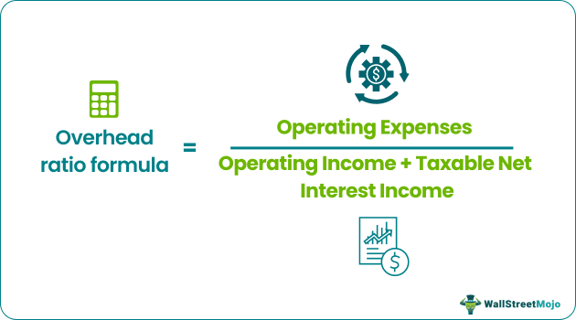

## Table of Contents

## What is an overhead ratio?

An overhead ratio is a way to measure how much of an organization's money goes towards running the business, rather than the main activities it does. For example, in a charity, the overhead ratio shows how much of the donations are used for things like office rent, staff salaries, and other costs that aren't directly helping the people the charity aims to help.

This ratio is important because it helps people see how efficiently an organization is using its money. A lower overhead ratio means more money is going towards the main goals of the organization, which is usually seen as a good thing. However, it's also important to remember that some overhead costs are necessary for the organization to work well, so a very low overhead ratio isn't always the best.

## Why is the overhead ratio important for businesses?

The overhead ratio is important for businesses because it shows how much money they spend on things that aren't directly making their product or service. This includes things like rent, utilities, and salaries for people who don't make the product. By knowing this ratio, a business can see if it's spending too much on these costs and not enough on the things that make money.

Understanding the overhead ratio helps businesses make better decisions. If the ratio is too high, it might mean the business needs to find ways to cut costs or make more money. This can help the business stay healthy and grow. It's like checking the health of the business to make sure it's using its money wisely.

## How do you calculate the overhead ratio?

To calculate the overhead ratio, you need to know two things: the total overhead costs and the total revenue or sales of the business. Overhead costs are all the expenses that aren't directly tied to making the product or service, like rent, utilities, and office supplies. Revenue is the total money the business makes from selling its products or services. Once you have these numbers, you divide the total overhead costs by the total revenue. The result is the overhead ratio, which you can then turn into a percentage by multiplying by 100.

For example, if a business has overhead costs of $50,000 and total revenue of $200,000, you would calculate the overhead ratio like this: $50,000 divided by $200,000 equals 0.25. When you multiply 0.25 by 100, you get an overhead ratio of 25%. This means that 25% of the business's revenue goes towards overhead costs. A lower percentage usually means the business is more efficient, but it's important to compare this number with other businesses in the same industry to see if it's a good or bad ratio.

## What are the components of overhead costs?

Overhead costs are all the expenses a business has that aren't directly related to making its product or service. This includes things like rent for the office or factory, utilities like electricity and water, and office supplies like paper and pens. It also covers the salaries of people who don't make the product, like managers, accountants, and receptionists.

Another part of overhead costs is insurance, which businesses need to protect themselves from risks. There are also costs for things like advertising and marketing, which help the business get more customers. Sometimes, overhead costs can include expenses for repairs and maintenance of the building and equipment that the business uses every day.

## Can you provide an example of calculating the overhead ratio for a small business?

Let's say you run a small bakery. Your total overhead costs for the year are $30,000. This includes rent for your bakery, utilities, and the salary for your manager who helps you run the business but doesn't bake the goods. Your total revenue for the year, which is the money you make from selling your baked goods, is $120,000.

To calculate the overhead ratio, you divide your overhead costs by your total revenue. So, you take $30,000 and divide it by $120,000, which equals 0.25. When you turn this into a percentage by multiplying by 100, you get an overhead ratio of 25%. This means that 25% of your bakery's revenue goes towards overhead costs. A lower percentage is usually better, but you might want to compare your bakery's overhead ratio with other bakeries to see if it's a good number.

## How does the overhead ratio differ across industries?

The overhead ratio can be very different from one industry to another because each type of business has its own unique costs and ways of making money. For example, a tech company might have high overhead costs because they need to pay a lot for things like software development and customer support, even though they don't need a big office space. On the other hand, a restaurant might have lower overhead costs because most of their money goes directly into buying food and paying the cooks, but they still need to pay for rent and utilities.

It's important to compare a business's overhead ratio with other businesses in the same industry to see if it's doing well. For instance, a manufacturing company might have a higher overhead ratio than a retail store because they need to spend more on machines and factory space. But if their overhead ratio is much higher than other manufacturing companies, it might mean they're spending too much on things that don't help them make more products.

## What is considered a good overhead ratio?

A good overhead ratio depends a lot on the type of business. For example, a manufacturing company might have a higher overhead ratio than a retail store because they need to spend more on machines and factory space. But if their overhead ratio is much higher than other manufacturing companies, it might mean they're spending too much on things that don't help them make more products. So, a good overhead ratio is one that is similar to or lower than what other businesses in the same industry have.

In general, a lower overhead ratio is usually better because it means the business is spending less money on things like rent, utilities, and office supplies, and more money on making its product or service. But it's important to remember that some overhead costs are necessary for the business to run well. A very low overhead ratio might mean the business isn't spending enough on important things like good management or marketing, which can hurt the business in the long run. So, the best overhead ratio is one that balances efficiency with the needs of the business.

## How can a business reduce its overhead ratio?

A business can reduce its overhead ratio by finding ways to spend less money on things that aren't directly related to making its product or service. For example, it might move to a smaller office to pay less rent, or switch to cheaper utility providers to save on electricity and water bills. Another way is to use technology to do things more efficiently, like using software to handle bookkeeping instead of hiring more accountants. By cutting these costs, the business can lower its overhead ratio and have more money to spend on making its product or service.

Another approach is to increase revenue while keeping overhead costs the same. This can be done by finding new customers or selling more to existing ones. For example, a bakery could start offering delivery services or sell baked goods at local events to bring in more money. If the bakery's revenue goes up but its overhead costs stay the same, the overhead ratio will go down. It's all about finding the right balance between spending less on overhead and making more money from sales.

## What are the limitations of using the overhead ratio as a performance metric?

Using the overhead ratio as a performance metric has some limitations. One big problem is that it can make businesses focus too much on cutting costs instead of growing. If a business tries to lower its overhead ratio too much, it might stop spending money on important things like good managers, marketing, or new technology. These things can help the business grow and make more money in the long run, even if they increase the overhead ratio a bit.

Another issue is that the overhead ratio doesn't tell the whole story about how well a business is doing. It only looks at how much money is spent on things like rent and office supplies, but it doesn't say anything about how happy the customers are, how good the products are, or how well the business is doing compared to others in the same industry. So, while the overhead ratio can be a useful tool, it's important to use it along with other ways of measuring performance to get a full picture of how the business is doing.

## How does the overhead ratio impact pricing strategies?

The overhead ratio can affect how a business sets its prices. If a business has a high overhead ratio, it means a big part of its money goes to things like rent and salaries for people who don't make the product. To cover these costs, the business might need to set higher prices for its products or services. This can make it harder to compete with other businesses that have lower overhead costs and can offer lower prices.

On the other hand, a business with a low overhead ratio might be able to set lower prices because it doesn't need to spend as much money on overhead costs. This can help the business attract more customers and sell more products. But, the business still needs to make sure its prices are high enough to cover all its costs and make a profit. So, understanding the overhead ratio helps a business find the right price that keeps it healthy and competitive.

## What advanced methods can be used to analyze overhead ratios more deeply?

To analyze overhead ratios more deeply, businesses can use a method called activity-based costing (ABC). This method looks at all the different activities a business does and figures out how much each activity costs. By doing this, a business can see which activities are using up a lot of overhead costs and find ways to make them cheaper. For example, if a business finds out that a lot of its overhead costs come from managing inventory, it might look for ways to do this more efficiently, like using a better computer system to keep track of stock.

Another advanced method is benchmarking, which means comparing your business's overhead ratio with other businesses in the same industry. This can help a business see if its overhead costs are too high or too low compared to others. If a business's overhead ratio is much higher than its competitors, it might need to find ways to cut costs. On the other hand, if it's much lower, the business might be able to spend a bit more on things like marketing or new technology to help it grow. By using these advanced methods, a business can get a better understanding of its overhead costs and make smarter decisions.

## How do international accounting standards affect the calculation of overhead ratios?

International accounting standards can change how businesses calculate their overhead ratios. These standards are rules that businesses in different countries have to follow when they report their money. For example, some standards might say that certain costs, like the cost of borrowing money, should be counted as overhead costs. Other standards might say these costs should be counted differently. So, businesses that follow different standards might end up with different overhead ratios, even if they are doing the same thing.

Because of these differences, it can be hard to compare the overhead ratios of businesses in different countries. If one business follows a standard that counts more costs as overhead, its overhead ratio might look higher than a business that follows a different standard. This is why it's important for businesses to know which standards they are following and to explain these standards when they share their overhead ratios with others. This way, people can understand why the ratios might be different and make fairer comparisons.

## What are the key aspects of understanding business efficiency metrics?

Business efficiency metrics are crucial tools that provide insights into a company's operational health and financial stability. These metrics enable businesses to evaluate how effectively they utilize their resources and manage their costs relative to their income. Among these metrics, the overhead ratio is particularly significant.

The overhead ratio measures the relationship between a company's operating expenses and its income. It is typically calculated as:

$$
\text{Overhead Ratio} = \frac{\text{Operating Expenses}}{\text{Taxable Net Interest Income} + \text{Operating Income}}
$$

This ratio excludes direct production costs, focusing instead on the broader operational expenses. It serves as an indicator of how efficiently a company manages its indirect costs, which can include administrative expenses, utilities, and rent.

A low overhead ratio is desirable as it reflects cost-effective operations, suggesting that a business is proficient in controlling its expenses relative to its income. This leads to higher profit margins, indicating robust financial health and operational efficiency. In contrast, a high overhead ratio may suggest inefficiencies and potentially erode profitability if not addressed.

Apart from the overhead ratio, a variety of key financial ratios provide comprehensive insights into a company's performance and financial health. These include:

1. **Profit Margin Ratios**: These measure the degree of profitability relative to revenue. Commonly used ratios include the gross profit margin, operating profit margin, and net profit margin.

2. **Liquidity Ratios**: Such as the current ratio and quick ratio, that assess a company's ability to meet its short-term obligations.

3. **Leverage Ratios**: Including the debt-to-equity ratio, which evaluate the extent to which a company utilizes debt to finance its operations.

4. **Efficiency Ratios**: Such as the asset turnover ratio, which indicate how effectively a company uses its assets to generate sales.

By consistently monitoring these metrics, businesses can gain valuable insights into their operational effectiveness, allowing them to make informed decisions aimed at enhancing efficiency and financial performance. Understanding these metrics is fundamental for managers and stakeholders eager to optimize business operations and ensure long-term sustainability.

## What is the Overhead Ratio: Its Formula and Importance?

The overhead ratio is a critical financial metric used to evaluate a company's operational efficiency by assessing the proportion of operating expenses relative to its income. It is calculated using the formula:

$$
\text{Overhead Ratio} = \frac{\text{Operating Expenses}}{\text{Taxable Net Interest Income} + \text{Operating Income}}
$$

Operating expenses typically include costs related to administrative and general operations, excluding direct production costs. In contrast, taxable net interest income and operating income constitute the primary revenue streams before expenses are deducted.

Maintaining a low overhead ratio is significant for business efficiency as it indicates a company's ability to control and optimize its operational expenditures in relation to its income. A lower ratio can suggest that a company is managing its costs effectively and maximizing its profitability. Conversely, a high overhead ratio could signal inefficiencies or excessive spending within the organization, potentially impacting profitability and competitiveness.

Comparative analysis with industry benchmarks is essential for interpreting the overhead ratio, as benchmarks provide context to evaluate whether a company is performing within acceptable industry standards. For instance, a company with an overhead ratio lower than the industry average might be considered more efficient and better positioned in terms of cost management and profitability. However, it is important to consider the specific industry context, as acceptable overhead ratios can vary significantly between sectors, such as retail, manufacturing, or financial services.

In summary, the overhead ratio serves as a valuable tool for assessing a company's operational efficiency. By managing this ratio effectively and understanding its implications, businesses can enhance their financial health and strengthen their competitive position in the market.

## What are the Financial Metrics used in Algorithmic Trading?

Algorithmic trading, often referred to as algo trading, involves the use of computer programs to automate trading strategies. These programs are designed to execute trades at speeds and frequencies that would be impossible for a human trader. The primary goal of [algorithmic trading](/wiki/algorithmic-trading) is to maximize trading efficiency while minimizing risk by leveraging financial metrics.

One of the cornerstone metrics in algo trading is the Sharpe Ratio. This ratio measures the risk-adjusted return of an investment. It is calculated by subtracting the risk-free rate (such as the return on government bonds) from the portfolio return and dividing this result by the standard deviation of the portfolio's excess return. A high Sharpe Ratio indicates more efficient risk management and better performance relative to risk.

$$
\text{Sharpe Ratio} = \frac{R_p - R_f}{\sigma_p}
$$

Where:
- $R_p$ is the return of the portfolio,
- $R_f$ is the risk-free rate,
- $\sigma_p$ is the standard deviation of the portfolio's excess return.

Another critical metric is the maximum drawdown, which represents the largest drop from a peak to a trough in the value of a portfolio before a new peak is reached. This metric is valuable in assessing the risk of a trading strategy, as it provides insight into how a portfolio might perform under adverse conditions. A smaller maximum drawdown suggests a more robust and resilient strategy.

The win rate, also known as the success rate, measures the proportion of profitable trades to total trades made. While a high win rate is desirable, it must be considered alongside other metrics like the average profit per trade and risk-reward ratios to ensure that trading strategies are truly effective.

KPIs such as the Sharpe Ratio, maximum drawdown, and win rate are vital in evaluating and refining trading strategies. These metrics influence trading efficiency by highlighting areas where strategies might be optimized for better performance. For instance, a trading strategy with a low Sharpe Ratio might be re-evaluated for excessive risk-taking. Similarly, strategies with high maximum drawdowns can be modified for improved risk management.

Risk management is integral to the success of algorithmic trading. Effective use of financial performance metrics enables traders to maintain a balance between risk and reward, enhancing trading efficiency and fostering sustainable profitability. It allows for systematic adjustments to strategies based on performance evaluations, thereby ensuring that the trading system remains robust across varying market conditions.

## References & Further Reading

[1]: Bergstra, J., Bardenet, R., Bengio, Y., & Kégl, B. (2011). ["Algorithms for Hyper-Parameter Optimization."](https://dl.acm.org/doi/10.5555/2986459.2986743) Advances in Neural Information Processing Systems 24.

[2]: ["Advances in Financial Machine Learning"](https://www.amazon.com/Advances-Financial-Machine-Learning-Marcos/dp/1119482089) by Marcos Lopez de Prado

[3]: ["Evidence-Based Technical Analysis: Applying the Scientific Method and Statistical Inference to Trading Signals"](https://www.amazon.com/Evidence-Based-Technical-Analysis-Scientific-Statistical/dp/0470008741) by David Aronson

[4]: ["Machine Learning for Algorithmic Trading"](https://github.com/stefan-jansen/machine-learning-for-trading) by Stefan Jansen

[5]: ["Quantitative Trading: How to Build Your Own Algorithmic Trading Business"](https://www.amazon.com/Quantitative-Trading-Build-Algorithmic-Business/dp/1119800064) by Ernest P. Chan