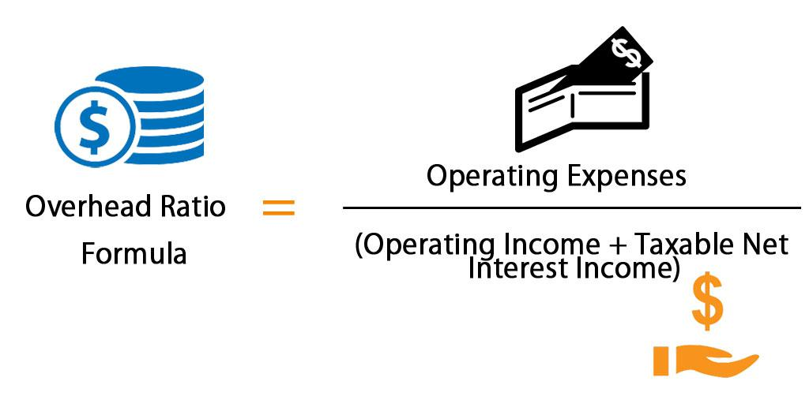

In today's competitive business environment, maximizing efficiency is crucial for financial success. As businesses strive to enhance their operational efficiency, understanding and leveraging key financial metrics is more important than ever. Among these metrics, the overhead ratio plays a pivotal role, providing insights into how effectively a company manages its operating expenses relative to its income. A lower overhead ratio generally indicates a more efficient operational structure, as it suggests the company is minimizing unnecessary expenditure while maximizing value generation.

Moreover, financial metrics are equally important in algorithmic trading, a domain where trading decisions are driven by automated systems. In this context, metrics such as the Sharpe ratio, maximum drawdown, and win rate are used to inform and refine trading strategies, balancing efficiency with risk management. By understanding these metrics, traders can optimize performance, enhance decision-making processes, and align trading strategies with business objectives.



This article will explore how these financial metrics define business efficiency and their implications for algorithmic trading. We aim to connect business efficiency metrics with practical applications in algorithmic trading environments, emphasizing the role of data-driven insights in achieving financial success. By doing so, we hope to provide readers with a comprehensive understanding of how to use financial metrics for more informed decision-making, potentially leading to more efficient and successful business and trading strategies.

## Table of Contents

## Understanding Business Efficiency Metrics

Business efficiency metrics are crucial tools that provide insights into a company's operational health and financial stability. These metrics enable businesses to evaluate how effectively they utilize their resources and manage their costs relative to their income. Among these metrics, the overhead ratio is particularly significant.

The overhead ratio measures the relationship between a company's operating expenses and its income. It is typically calculated as:

$$
\text{Overhead Ratio} = \frac{\text{Operating Expenses}}{\text{Taxable Net Interest Income} + \text{Operating Income}}
$$

This ratio excludes direct production costs, focusing instead on the broader operational expenses. It serves as an indicator of how efficiently a company manages its indirect costs, which can include administrative expenses, utilities, and rent.

A low overhead ratio is desirable as it reflects cost-effective operations, suggesting that a business is proficient in controlling its expenses relative to its income. This leads to higher profit margins, indicating robust financial health and operational efficiency. In contrast, a high overhead ratio may suggest inefficiencies and potentially erode profitability if not addressed.

Apart from the overhead ratio, a variety of key financial ratios provide comprehensive insights into a company's performance and financial health. These include:

1. **Profit Margin Ratios**: These measure the degree of profitability relative to revenue. Commonly used ratios include the gross profit margin, operating profit margin, and net profit margin.

2. **Liquidity Ratios**: Such as the current ratio and quick ratio, that assess a company's ability to meet its short-term obligations.

3. **Leverage Ratios**: Including the debt-to-equity ratio, which evaluate the extent to which a company utilizes debt to finance its operations.

4. **Efficiency Ratios**: Such as the asset turnover ratio, which indicate how effectively a company uses its assets to generate sales.

By consistently monitoring these metrics, businesses can gain valuable insights into their operational effectiveness, allowing them to make informed decisions aimed at enhancing efficiency and financial performance. Understanding these metrics is fundamental for managers and stakeholders eager to optimize business operations and ensure long-term sustainability.

## The Overhead Ratio: Formula and Importance

The overhead ratio is a critical financial metric used to evaluate a company's operational efficiency by assessing the proportion of operating expenses relative to its income. It is calculated using the formula:

$$
\text{Overhead Ratio} = \frac{\text{Operating Expenses}}{\text{Taxable Net Interest Income} + \text{Operating Income}}
$$

Operating expenses typically include costs related to administrative and general operations, excluding direct production costs. In contrast, taxable net interest income and operating income constitute the primary revenue streams before expenses are deducted.

Maintaining a low overhead ratio is significant for business efficiency as it indicates a company's ability to control and optimize its operational expenditures in relation to its income. A lower ratio can suggest that a company is managing its costs effectively and maximizing its profitability. Conversely, a high overhead ratio could signal inefficiencies or excessive spending within the organization, potentially impacting profitability and competitiveness.

Comparative analysis with industry benchmarks is essential for interpreting the overhead ratio, as benchmarks provide context to evaluate whether a company is performing within acceptable industry standards. For instance, a company with an overhead ratio lower than the industry average might be considered more efficient and better positioned in terms of cost management and profitability. However, it is important to consider the specific industry context, as acceptable overhead ratios can vary significantly between sectors, such as retail, manufacturing, or financial services.

In summary, the overhead ratio serves as a valuable tool for assessing a company's operational efficiency. By managing this ratio effectively and understanding its implications, businesses can enhance their financial health and strengthen their competitive position in the market.

## Financial Metrics in Algorithmic Trading

Algorithmic trading, often referred to as algo trading, involves the use of computer programs to automate trading strategies. These programs are designed to execute trades at speeds and frequencies that would be impossible for a human trader. The primary goal of [algorithmic trading](/wiki/algorithmic-trading) is to maximize trading efficiency while minimizing risk by leveraging financial metrics.

One of the cornerstone metrics in algo trading is the Sharpe Ratio. This ratio measures the risk-adjusted return of an investment. It is calculated by subtracting the risk-free rate (such as the return on government bonds) from the portfolio return and dividing this result by the standard deviation of the portfolio's excess return. A high Sharpe Ratio indicates more efficient risk management and better performance relative to risk.

$$
\text{Sharpe Ratio} = \frac{R_p - R_f}{\sigma_p}
$$

Where:
- $R_p$ is the return of the portfolio,
- $R_f$ is the risk-free rate,
- $\sigma_p$ is the standard deviation of the portfolio's excess return.

Another critical metric is the maximum drawdown, which represents the largest drop from a peak to a trough in the value of a portfolio before a new peak is reached. This metric is valuable in assessing the risk of a trading strategy, as it provides insight into how a portfolio might perform under adverse conditions. A smaller maximum drawdown suggests a more robust and resilient strategy.

The win rate, also known as the success rate, measures the proportion of profitable trades to total trades made. While a high win rate is desirable, it must be considered alongside other metrics like the average profit per trade and risk-reward ratios to ensure that trading strategies are truly effective.

KPIs such as the Sharpe Ratio, maximum drawdown, and win rate are vital in evaluating and refining trading strategies. These metrics influence trading efficiency by highlighting areas where strategies might be optimized for better performance. For instance, a trading strategy with a low Sharpe Ratio might be re-evaluated for excessive risk-taking. Similarly, strategies with high maximum drawdowns can be modified for improved risk management.

Risk management is integral to the success of algorithmic trading. Effective use of financial performance metrics enables traders to maintain a balance between risk and reward, enhancing trading efficiency and fostering sustainable profitability. It allows for systematic adjustments to strategies based on performance evaluations, thereby ensuring that the trading system remains robust across varying market conditions.

## Integrating Financial Metrics for Business and Trading Success

In the modern financial landscape, the integration of business efficiency metrics with algorithmic trading strategies unlocks new potentials for optimizing both financial operations and trading performance. The overhead ratio, a key metric in evaluating operational cost efficiency, plays a significant role in algorithmic trading, where streamlined expenses can enhance overall profitability. By minimizing overhead, firms can allocate more resources toward refining trading algorithms and embracing advanced technologies, creating a more agile trading environment.

Algorithmic trading relies heavily on precise calculations and the ability to adapt swiftly to market fluctuations. Essential performance indicators such as the Sharpe ratio, which measures risk-adjusted return, maximum drawdown, indicating the potential risk of an investment, and win rate, the ratio of profitable trades, are critically influenced by the underlying financial health signified by business efficiency metrics. Maintaining a low overhead ratio can directly contribute to improving these trading KPIs by ensuring that resources are directed toward enhancing algorithm efficiency rather than administrative overheads.

A practical application of integrating these metrics is in refining the decision-making process for algo trading strategies. For example, a Python implementation could utilize the overhead ratio to adjust the risk parameters dynamically in an algorithmic trading strategy, enhancing robustness against market [volatility](/wiki/volatility-trading-strategies). Here is a simplified illustration of how this might be implemented:

```python
def adjust_risk_parameter(overhead_ratio, base_risk=0.1):
    if overhead_ratio < 0.20:
        adjusted_risk = base_risk * 0.9  # Reduce risk for companies with lower overhead
    else:
        adjusted_risk = base_risk * 1.1  # Increase risk for higher overhead
    return adjusted_risk

# Example usage
current_overhead_ratio = 0.18  # This would be dynamically calculated
risk_parameter = adjust_risk_parameter(current_overhead_ratio)
print("Adjusted Risk Parameter:", risk_parameter)
```

In terms of business operations, leveraging financial efficiency metrics allows firms to strategically manage their growth and investment in technology necessary for executing high-frequency trades. Businesses that utilize these metrics effectively are more adept at identifying opportunities for improvement and channels for strategic investment, ensuring that their trading operations are not only efficient but also scalable.

To achieve optimal success in both business operations and trading execution, firms must blend traditional financial metrics like the overhead ratio with innovative trading techniques. This integration fosters a balanced approach, poised to thrive amid the complexities and rapid pace of modern financial markets. Understanding these synergies is crucial for cultivating a competitive edge and sustaining long-term profitability.

## Challenges and Considerations

Addressing the challenges of measuring and maintaining low overhead ratios involves understanding both internal operational efficiencies and external market conditions. A low overhead ratio indicates that a business is managing its non-production costs effectively relative to its income. However, achieving and preserving such efficiency requires strategic oversight and constant adjustment.

One key challenge is accurately tracking and allocating indirect costs. Misallocations can lead to skewed overhead ratios, masking inefficiencies. Companies must implement precise accounting systems and regularly audit their financial data to ensure accuracy. Additionally, businesses need to balance cost-cutting with maintaining quality and employee morale. Excessive reductions in overhead, such as cuts in essential staff or underinvestment in technology, can harm long-term operational capability.

In algorithmic trading, complexity and risk are inherent. Algorithmic trading strategies rely heavily on robust financial models and dynamic data inputs. Such strategies can be sensitive to market volatility, leading to significant financial risks if not managed properly. Algorithms must be rigorously tested under various market conditions to validate their effectiveness and resilience.

Performance evaluation of algorithmic trading also presents challenges. Key performance indicators, such as Sharpe ratio, maximum drawdown, and win rate, need careful calculation and interpretation. These metrics must account for transaction costs, slippage, and other market factors that can influence results. Python, with its comprehensive libraries, can be extremely useful in performing these evaluations:

```python
import numpy as np

# Example: Calculating Sharpe Ratio
def sharpe_ratio(returns, risk_free_rate=0.0):
    return_difference = np.mean(returns) - risk_free_rate
    volatility = np.std(returns)
    return return_difference / volatility

# Simulated daily returns
daily_returns = np.random.normal(0.001, 0.02, 252) # Example data
sr = sharpe_ratio(daily_returns)
print(f"Sharpe Ratio: {sr:.2f}")
```

To overcome pitfalls in performance evaluation, traders should employ robust [backtesting](/wiki/backtesting) frameworks and stress testing under hypothetical adverse market conditions. Regular review and update of algorithms are critical to account for evolving market dynamics. It's also vital to integrate human oversight in algorithmic decisions to mitigate unforeseen errors or anomalies.

In conclusion, both business and trading fields face distinct yet overlapping challenges in maintaining efficiency and evaluating performance. A strategic, well-rounded approach that combines accurate financial tracking, advanced technological implementation, and constant strategic revisions can help overcome these challenges effectively.

## Conclusion

A comprehensive understanding of financial metrics is fundamental for any business aiming for operational excellence and market competitiveness. These metrics offer insights into various aspects of a company's financial health and efficiency, serving as a guide for informed decision-making. The overhead ratio, in particular, is a key indicator of cost management efficacy, revealing how effectively a company converts income into profit while minimizing operating expenses.

Businesses and traders alike are encouraged to continually evaluate and refine their strategies, ensuring that financial performance remains aligned with market conditions and corporate goals. This ongoing assessment allows for the identification of potential deficiencies and the implementation of corrective measures to maintain a competitive edge.

In diverse financial landscapes, achieving a balanced approach to efficiency and success is critical. Whether managing a company's operational costs or optimizing algorithmic trading strategies, the integration of robust financial metrics provides a roadmap for sustainable growth and profitability. By embracing these metrics as part of core strategic frameworks, organizations can enhance both business operations and trading performance, paving the way for long-term success in an ever-evolving financial ecosystem.

## References & Further Reading

[1]: Bergstra, J., Bardenet, R., Bengio, Y., & Kégl, B. (2011). ["Algorithms for Hyper-Parameter Optimization."](https://dl.acm.org/doi/10.5555/2986459.2986743) Advances in Neural Information Processing Systems 24.

[2]: ["Advances in Financial Machine Learning"](https://www.amazon.com/Advances-Financial-Machine-Learning-Marcos/dp/1119482089) by Marcos Lopez de Prado

[3]: ["Evidence-Based Technical Analysis: Applying the Scientific Method and Statistical Inference to Trading Signals"](https://www.amazon.com/Evidence-Based-Technical-Analysis-Scientific-Statistical/dp/0470008741) by David Aronson

[4]: ["Machine Learning for Algorithmic Trading"](https://github.com/stefan-jansen/machine-learning-for-trading) by Stefan Jansen

[5]: ["Quantitative Trading: How to Build Your Own Algorithmic Trading Business"](https://www.amazon.com/Quantitative-Trading-Build-Algorithmic-Business/dp/1119800064) by Ernest P. Chan