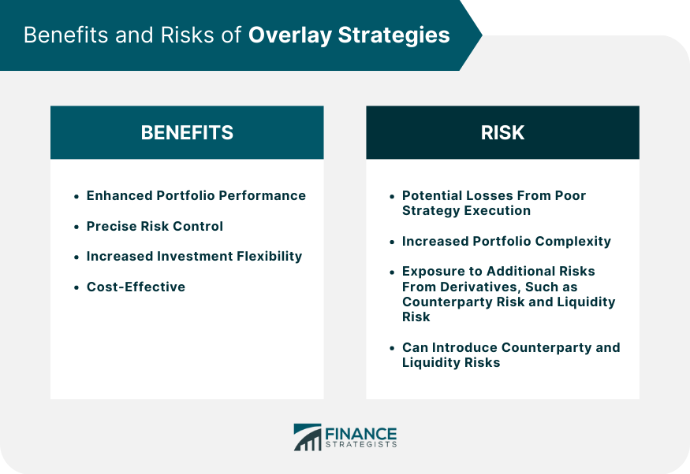

Overlay strategies in portfolio management refer to techniques that are layered on top of existing investment strategies to achieve specific financial objectives such as risk mitigation, performance enhancement, or cost reduction. These strategies do not involve directly altering the underlying investments but rather add an additional layer of management. For instance, currency overlay strategies might manage foreign exchange risk within a globally diversified portfolio without affecting the core asset allocation.

Algorithmic trading, often abbreviated as algo trading, is a method of executing orders using automated and pre-programmed trading instructions accounting for variables such as time, price, and volume. Its relevance in modern financial markets has grown due to its ability to efficiently handle complex strategies and execute trades faster and with increased accuracy compared to human traders.

The purpose of this article is to explore how overlay strategies can be augmented through the application of algorithmic trading. This intersection is becoming increasingly important in contemporary investment management. By integrating overlay strategies with algo trading, investors and portfolio managers can achieve more precise control over their investment processes, enhance decision-making capabilities, and potentially improve risk-adjusted returns.

Combining these approaches leverages the advantages of both strategies. Overlay strategies provide a framework for managing specific investment goals, while algorithmic trading offers the technology to implement these strategies efficiently and effectively. This synergy is crucial in the fast-paced and data-driven world of modern finance, where the ability to quickly adapt to market changes and new information can provide a significant competitive advantage. These combined methodologies highlight a transformational shift in investment management processes, catering to a future where technology plays a pivotal role in strategic financial planning.

## Table of Contents

## Understanding Overlay Strategies

Overlay strategies in portfolio management are sophisticated techniques that enable fund managers to manage and optimize a portfolio beyond its traditional asset allocation. These strategies function as an additional layer, or 'overlay,' on top of the existing portfolio, allowing for enhanced management of certain risks and opportunities without altering the underlying asset mix. This can involve a range of activities, from hedging currency risk to adjusting for interest rate exposures or even incorporating [ESG](/wiki/esg-investing) (Environmental, Social, and Governance) factors.

A primary function of overlay strategies is risk management. By employing derivatives such as options, futures, and swaps, fund managers can mitigate specific risks associated with foreign exchange rates, interest rates, or commodity prices, thus protecting the portfolio from undesirable market movements. For instance, currency overlay strategies can help manage the foreign exchange risk in an international investment portfolio by using currency forwards or options to hedge against currency fluctuations. This ensures that investment returns are not adversely impacted by changes in currency exchange rates.

Performance enhancement represents another key aspect of overlay strategies. Fund managers might utilize tactical asset allocation overlays to capitalize on short-term market opportunities. This involves making tactical adjustments to a portfolio's asset allocation based on short-term forecasts of market conditions while keeping the long-term strategic asset allocation intact. Such strategies enable the portfolio to achieve excess returns relative to a benchmark index.

Common examples of overlay strategies include currency overlays, which aim to manage currency exposure; duration overlays, for adjusting sensitivity to [interest rate](/wiki/interest-rate-trading-strategies) changes; and rebalancing overlays, designed to ensure a portfolio maintains its desired risk profile and asset allocation. Another example is [volatility](/wiki/volatility-trading-strategies) overlay strategies, which can be employed to either reduce risk or take advantage of predicted volatility movements in the market. 

The strategic value of overlays lies in their ability to provide focused, dynamic adjustments to a portfolio without the need to alter its foundational components. This added flexibility can lead to improved risk-adjusted performance by allowing portfolios to better align with investment objectives and market conditions. Moreover, overlays can help in the systematic implementation of investment policies, maintaining the portfolio's adherence to its strategic objectives while systematically adapting to market dynamics.

By incorporating overlay strategies into traditional investments, portfolio managers can effectively enhance returns, control risks, and maintain alignment with strategic investment objectives. This ability to react swiftly to market conditions, manage specific risks, and potentially capitalize on market opportunities often makes overlay strategies a valuable component of comprehensive portfolio management.

## The Role of Algorithmic Trading in Investments

Algorithmic trading, often known as algo trading, refers to the use of computer algorithms to automate trading decisions and execute orders in financial markets. This approach leverages mathematical models and complex formulas to determine timing, pricing, and quantity of orders, thereby eliminating the need for manual intervention by traders. Algo trading has gained significant presence due to its ability to process vast amounts of market data in real-time and execute trades with high precision and speed.

The benefits of [algorithmic trading](/wiki/algorithmic-trading) are numerous. One of the primary advantages is speed. Algorithms can execute trades within milliseconds, capitalizing on even the slightest market movements before human traders can react. This speed not only enhances the potential for profit but also diminishes the likelihood of significant price changes between the decision-making and trade execution stages.

Accuracy is another benefit, as algorithms minimize human error. Trading decisions based on quantitative rules ensure consistency and reduce emotional influence, which is often a source of errors in manual trading. Furthermore, the efficiency in executing large volumes of trades without affecting market prices significantly is an inherent advantage of algo trading, allowing for cost reduction in terms of both time and financial resources.

Integration of algorithmic trading with portfolio management strategies can enhance overall portfolio performance. Algorithms can be tailored to execute strategies that align with specific investment objectives, such as managing risk or optimizing returns. For instance, portfolio rebalancing, a critical task in maintaining desired asset allocations, can be automated to ensure that portfolios remain aligned with investment strategies without conscious, manual intervention.

Recent advancements in algorithmic trading technology have further strengthened its capabilities. Machine learning and [artificial intelligence](/wiki/ai-artificial-intelligence) are increasingly being incorporated to improve pattern recognition and forecast accuracy. Innovations such as high-frequency trading ([HFT](/wiki/high-frequency-trading-strategies)) continue to push the boundaries of speed and capacity in execution, while advances in data analytics enable more sophisticated analysis of market trends and investor behaviors.

In conclusion, algorithmic trading plays a pivotal role in modern investment strategies, offering speed, accuracy, and efficiency. Its integration with portfolio management opens new avenues for optimizing returns and managing risks, supplemented by ongoing technological innovations that promise to refine and enhance its impact on financial markets.

## Pros of Combining Overlay Strategies with Algorithmic Trading

Combining overlay strategies with algorithmic trading enhances decision-making capabilities in portfolio management by leveraging the strengths of both approaches. Overlay strategies provide a framework for adjusting and optimizing a portfolio's risk and performance characteristics, while algorithmic trading introduces precision, speed, and efficiency to the execution process. This synergy allows investors to respond more effectively to market conditions and manage investments with greater sophistication.

One of the primary benefits of this combination is the potential for improved risk-adjusted returns. By integrating algorithmic processes, overlay strategies can be executed swiftly and precisely, enabling timely adjustments to market dynamics. This can be especially beneficial for managing risk through more effective hedging and dynamic rebalancing techniques. For example, algorithms can calculate key metrics such as the Sharpe Ratio—a measure of risk-adjusted performance—rapidly and adjust positions to maintain an optimal risk-return profile.

The flexibility and adaptability offered by algorithmic trading-driven overlays allow investors to tailor their strategies to specific investment goals and market conditions. Algorithms can be designed to implement a variety of strategies, from simple moving average crossovers to complex statistical [arbitrage](/wiki/arbitrage) models. This versatility enables portfolio managers to not only implement traditional overlay strategies more efficiently but also to adapt them as necessary based on real-time data and predictive analytics.

Successful implementations of these strategies in practice demonstrate the value added to investment processes. Large institutional investors, such as pension funds and hedge funds, have increasingly adopted algorithmic-driven overlay strategies to refine their investment approaches. For instance, BlackRock, one of the world's largest asset managers, utilizes algorithms for portfolio overlays to enhance asset allocation decisions and manage risk more effectively.

Moreover, the adaptability of algorithmic overlays means that new data sources and analytics can be incorporated easily, enabling continuous improvement in strategy performance. This includes the use of [machine learning](/wiki/machine-learning) models that can adapt to changing market conditions, optimizing the overlay strategies' parameters based on historical and real-time data to further enhance investment outcomes.

In summary, the integration of overlay strategies with algorithmic trading empowers investors with enhanced decision-making capabilities, improved risk-adjusted returns, and exceptional flexibility and adaptability in managing portfolios. These advantages make this combination an attractive approach for modern investment management, enabling investors to better navigate complex financial markets and achieve their investment objectives.

## Cons and Challenges of Overlay Strategies in Algo Trading

Overlay strategies combined with algorithmic trading offer significant benefits. However, there are inherent challenges and potential drawbacks that must be understood and addressed for successful implementation. 

One major concern is over-reliance on technology and data. While algorithmic trading provides enhanced accuracy and speed, it also depends heavily on the quality and availability of data. Poor data quality or interruptions in access can lead to flawed trading decisions. Algorithms trained on historical data may fail to adapt to unforeseen market events, potentially resulting in significant financial losses.

The integration of overlay strategies with algorithmic trading systems poses substantial complexity. These strategies require the harmonization of diverse software platforms, databases, and communication protocols. Ensuring seamless operation between these components demands significant investment in technology infrastructure and specialized personnel. Effective integration also relies on advanced analytics and machine learning systems, which may present additional technical challenges.

Market [liquidity](/wiki/liquidity-risk-premium) and execution risks represent another crucial concern. The rapid execution capability of algorithms may inadvertently impact market prices and liquidity, particularly in thinly traded assets. This could lead to slippage—when the actual price of a trade differs from the expected price—thus affecting portfolio performance adversely. High-frequency trading strategies, which often accompany algorithmic trading, can exaggerate these challenges, especially during periods of market stress.

Regulatory and compliance challenges are also pertinent. Financial markets are subject to stringent regulations aimed at ensuring fair trading practices and protecting investors. The use of algorithms introduces unique issues such as algorithmic fairness, market manipulation risks, and transparency. Regulatory bodies may require detailed disclosures about algorithmic strategies and periodic compliance audits, complicating the operational landscape for firms employing these strategies.

Successfully navigating these cons and challenges requires continuous monitoring, risk management frameworks, and adherence to regulatory standards. Moreover, the dynamic nature of financial markets necessitates ongoing strategy refinement and adaptation to stay ahead in this competitive arena.

## Practical Considerations and Best Practices

Implementing overlay strategies with algorithmic trading requires a strategic approach that encompasses various technical and organizational aspects. The combination of these two methodologies can significantly enhance portfolio management, but maximizing their potential hinges on several key practices.

### Effective Implementation Tips

The integration of overlay strategies with algorithmic trading can result in improved decision-making and risk management. Here are some critical considerations for effective implementation:

1. **Continuous Monitoring and Performance Assessment:**
   Continuous oversight is vital to ensure that overlay strategies and algorithmic trading systems function optimally. Regular performance reviews help identify inefficiencies and potential improvements. Advanced analytics and real-time data monitoring tools are invaluable in this process, enabling the detection of anomalies and immediate adjustments.

   Performance assessment should not only focus on returns but also consider risk metrics such as Value at Risk (VaR) and tracking error. For instance, using the Sharpe ratio can help evaluate the risk-adjusted performance of the overlay strategy implemented with algorithmic trading:
$$
   \text{Sharpe Ratio} = \frac{R_p - R_f}{\sigma_p}

$$

   Where $R_p$ is the portfolio return, $R_f$ is the risk-free rate, and $\sigma_p$ is the standard deviation of the portfolio's excess return.

2. **Role of Technology and Skilled Personnel:**
   Cutting-edge technology underpins successful integration. This includes sophisticated trading platforms, extensive data feeds, and advanced computational capabilities. Automation and machine learning can be leveraged for pattern recognition and predictive analytics, enhancing algorithmic precision.

   Human expertise remains crucial; skilled personnel are required to design, implement, and oversee these complex systems. Analysts and quants with expertise in both finance and computer science are best positioned to bridge the technical and strategic aspects of overlay strategies and algorithmic trading.

3. **Avoiding Common Pitfalls and Maximizing Potential:**
   To circumvent the typical pitfalls associated with overlay strategies and algorithmic trading, consider the following:

   - **Robust Testing and Validation:** Prior to deployment, comprehensive backtesting and stress testing are essential. These procedures should examine the system's robustness across various market conditions, ensuring resilience and reliability.

   - **Data Quality Management:** The accuracy and relevance of data inputs are paramount. Ensuring high-quality, clean data is foundational to the success of algorithmic systems.

   - **Dynamic Adaptation:** Financial markets are inherently dynamic, and strategies must be adaptable. Regular updates and recalibration of algorithms may be necessary to keep pace with market evolution and regulatory changes.

   - **Compliance and Risk Management:** Adherence to regulatory standards is critical. Effective risk management protocols must be in place to mitigate exposure, including automated stop-loss measures and compliance checks integrated into the trading system.

In conclusion, implementing overlay strategies with algorithmic trading demands a structured approach that combines continuous monitoring, cutting-edge technology, skilled personnel, and diligent risk management. By adhering to these best practices, portfolio managers can unlock the full potential of these innovative investment strategies.

## Conclusion

Overlay strategies and algorithmic trading represent a pivotal fusion in the domain of portfolio management, offering significant potential when judiciously implemented. Throughout the article, we have explored how overlay strategies provide key functions such as risk management and performance enhancement, while algorithmic trading offers benefits in speed, accuracy, and execution efficiency. When these approaches are combined, they can significantly enhance decision-making capabilities, potentially yielding better risk-adjusted returns and greater flexibility.

However, this investment approach is not without its challenges. The complexities involved in integrating technology, potential over-reliance on data, and challenges related to market liquidity and regulatory compliance warrant careful consideration. Despite these hurdles, the strategic benefits—when effectively managed—underscore the importance of this combination in modern investment management.

Investors and portfolio managers are encouraged to consider these strategies for their potential to transform traditional investment paradigms. By leveraging advanced technologies and skilled personnel, continuous monitoring and performance assessment can help navigate the common pitfalls and maximize the strategy's potential.

Looking forward, the integration of overlay strategies with algorithmic trading is poised to play an increasingly crucial role in investment management. As technology continues to advance and data analytics grow more sophisticated, the strategic implementation of these tools promises to offer new avenues for optimized investment outcomes, shaping the future of dynamic and adaptive portfolio management.

## References & Further Reading

[1]: Bergstra, J., Bardenet, R., Bengio, Y., & Kégl, B. (2011). ["Algorithms for Hyper-Parameter Optimization."](https://papers.nips.cc/paper/4443-algorithms-for-hyper-parameter-optimization) Advances in Neural Information Processing Systems 24.

[2]: ["Advances in Financial Machine Learning"](https://www.amazon.com/Advances-Financial-Machine-Learning-Marcos/dp/1119482089) by Marcos Lopez de Prado

[3]: ["Evidence-Based Technical Analysis: Applying the Scientific Method and Statistical Inference to Trading Signals"](https://www.amazon.com/Evidence-Based-Technical-Analysis-Scientific-Statistical/dp/0470008741) by David Aronson

[4]: ["Machine Learning for Algorithmic Trading"](https://github.com/stefan-jansen/machine-learning-for-trading) by Stefan Jansen

[5]: ["Quantitative Trading: How to Build Your Own Algorithmic Trading Business"](https://www.amazon.com/Quantitative-Trading-Build-Algorithmic-Business/dp/1119800064) by Ernest P. Chan