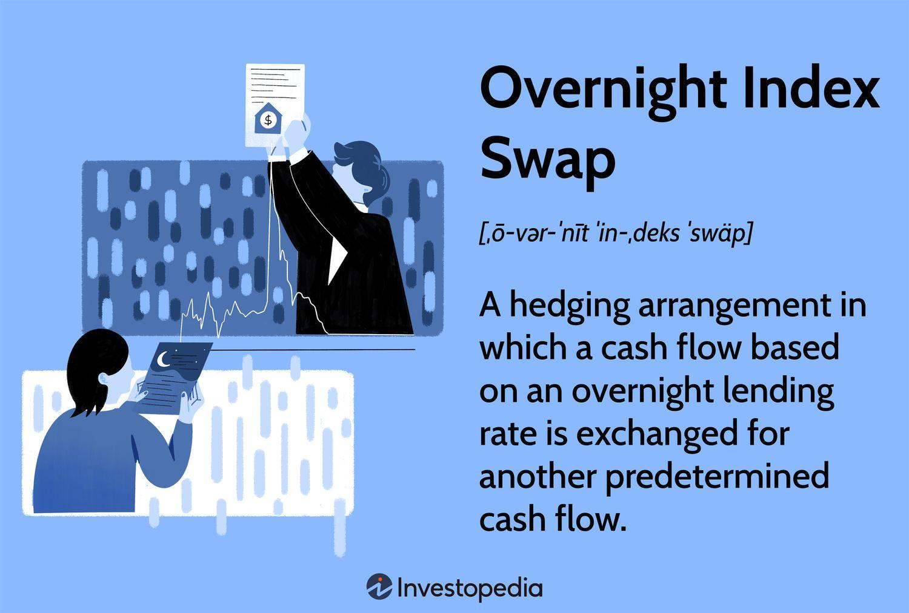

## Table of Contents

## What is an Overnight Index Swap (OIS)?

An Overnight Index Swap (OIS) is a type of financial agreement where two parties exchange cash flows based on different interest rates. One party pays a fixed interest rate, while the other pays a floating interest rate that is based on an overnight index, like the Federal Funds Rate in the U.S. This swap helps manage interest rate risk and is often used by banks and financial institutions.

OIS is important because it reflects the market's view on future interest rates. It's used as a benchmark for other financial products and helps in setting the price for loans and derivatives. By using an OIS, banks can better predict their costs and manage their exposure to changes in interest rates over time.

## How does an Overnight Index Swap work?

An Overnight Index Swap (OIS) is like a bet between two people about what interest rates will do in the future. One person agrees to pay a fixed interest rate, say 2%, every year for a set period, like five years. The other person agrees to pay an interest rate that changes every day, based on what's called an overnight rate. This overnight rate is the interest banks charge each other for very short loans, like the Federal Funds Rate in the U.S.

At the end of each year, they figure out how much each person owes. The person paying the fixed rate just pays the same amount every year, like 2% of the total amount they agreed on. The other person adds up all the daily overnight rates for the year and pays that total. If the overnight rates added up to more than 2%, the second person pays the difference to the first person. If it's less, then the first person pays the difference to the second person. This way, they can manage the risk of interest rates going up or down.

## What are the key components of an OIS?

An Overnight Index Swap (OIS) has a few main parts that make it work. First, there's the fixed rate, which is like a steady number that one person agrees to pay every year. It's like setting a bet on what the [interest rate](/wiki/interest-rate-trading-strategies) will be in the future. Then, there's the floating rate, which changes every day based on the overnight rate, like the Federal Funds Rate. This is the part that moves around and makes the swap interesting because it depends on what's happening in the market every day.

The second key part is the notional amount, which is just a big number that the swap is based on. It's like saying, "Let's pretend we're borrowing this much money," but you don't actually borrow it. You just use it to figure out how much money changes hands at the end of the swap. Lastly, the duration of the swap is important. This is how long the swap lasts, like one year, five years, or even longer. All these parts together help people manage the risk of interest rates going up or down.

## Who are the typical participants in OIS markets?

The main people who use Overnight Index Swaps (OIS) are big banks and financial institutions. They use OIS to manage the risk of interest rates changing. Imagine a bank that needs to predict how much it will cost to borrow money in the future. By using an OIS, the bank can lock in a fixed interest rate and protect itself from sudden changes in the overnight rates.

Other participants include hedge funds and other big investors. They might use OIS to make bets on where they think interest rates are going. If they think rates will go up, they might pay the floating rate, hoping to make money if they're right. Central banks also sometimes use OIS to help control the money supply and influence interest rates in the economy.

## What is the difference between an OIS and other types of interest rate swaps?

An Overnight Index Swap (OIS) is different from other interest rate swaps mainly because of what it uses as the floating rate. In an OIS, the floating rate is based on an overnight rate, like the Federal Funds Rate. This means it changes every day and reflects very short-term borrowing costs. Other types of interest rate swaps, like a LIBOR swap, use a different floating rate, like the London Interbank Offered Rate (LIBOR), which is usually set for longer periods, like three months or a year. So, OIS is more about managing daily interest rate changes, while other swaps might focus on longer-term rates.

Another big difference is how OIS is used. Because OIS uses overnight rates, it's often seen as a better way to measure what the market thinks about future interest rates. It's like a very accurate thermometer for the economy's health. Banks and financial institutions use OIS a lot to manage their daily cash flows and predict costs. Other swaps, like those based on LIBOR, are used more for longer-term planning and might be used by a wider range of people, including companies that need to plan for big loans over several years.

## How is the floating rate determined in an OIS?

In an Overnight Index Swap (OIS), the floating rate is figured out using an overnight rate, like the Federal Funds Rate in the U.S. This overnight rate is the interest that banks charge each other for very short loans, usually just for one day. Every day, this rate changes based on what's happening in the market. At the end of the swap period, like a year, all these daily rates are added up to find the total floating rate for that period.

This way of calculating the floating rate makes OIS different from other swaps. For example, a LIBOR swap uses a rate that's set for longer periods, like three months or a year. But with OIS, because it uses the overnight rate, it's more about what's happening day by day. This makes OIS a good tool for banks and financial institutions to manage their daily cash flows and predict costs based on very short-term changes in the market.

## What are the common benchmarks used in OIS?

In an Overnight Index Swap (OIS), the floating rate is based on what's called an overnight rate. In the U.S., the most common benchmark for this is the Federal Funds Rate. This rate is what banks charge each other for very short loans, usually just for one night. It changes every day, so it gives a good picture of what's happening in the market right now.

In other countries, different benchmarks are used. For example, in the Eurozone, the Euro Overnight Index Average (EONIA) was used, but it has been replaced by the Euro Short-Term Rate (€STR). In the UK, the Sterling Overnight Index Average (SONIA) is the benchmark. These rates work the same way as the Federal Funds Rate, changing every day to reflect the cost of overnight borrowing in their respective markets. By using these benchmarks, OIS helps banks and financial institutions manage their daily cash flows and predict costs based on short-term market changes.

## How do you calculate the payment in an OIS?

Calculating the payment in an Overnight Index Swap (OIS) involves figuring out the difference between the fixed rate and the floating rate over the swap's duration. Let's say you have a one-year OIS with a notional amount of $1 million. One person agrees to pay a fixed rate of 2% per year, while the other pays a floating rate based on the daily overnight rate, like the Federal Funds Rate. At the end of the year, you add up all the daily overnight rates to get the total floating rate for the year.

Once you have the total floating rate, you compare it to the fixed rate. If the total floating rate for the year comes out to be 1.5%, the person paying the fixed rate (2%) would owe the difference to the other person. In this case, that's 0.5% of the notional amount, or $5,000 (0.005 * $1,000,000). If the total floating rate was higher than the fixed rate, say 2.5%, then the person paying the floating rate would owe the difference, which would be $5,000 as well (0.005 * $1,000,000). This way, the swap helps manage the risk of interest rates changing over time.

## What are the risks associated with Overnight Index Swaps?

One big risk with Overnight Index Swaps (OIS) is interest rate risk. This means that if the overnight rates, like the Federal Funds Rate, go up or down a lot, it can change how much money you have to pay or get at the end of the swap. If you're the one paying the fixed rate and the overnight rates go up, you might end up paying more than you expected. On the other hand, if you're paying the floating rate and the overnight rates go down, you could lose money because you'll have to pay the difference to the other person.

Another risk is counterparty risk. This is the chance that the other person in the swap might not be able to pay what they owe. If a bank or financial institution gets into trouble and can't pay, you could be left holding the bag. To manage this risk, people often use something called a credit support annex, which is like a safety net that makes sure both sides can pay up if things go wrong.

## How do regulatory changes impact OIS?

Regulatory changes can have a big impact on Overnight Index Swaps (OIS). When rules change, it can affect how banks and financial institutions use OIS to manage their money. For example, after the 2008 financial crisis, new rules were made to make the financial system safer. These rules made banks hold more money as a cushion, which changed how they used OIS. Banks might use OIS less if they have to keep more money on hand, because they need to be careful with their cash.

Also, rules can change what benchmarks are used in OIS. In the past, many swaps used LIBOR, but because of problems with LIBOR, regulators pushed for new benchmarks like the Federal Funds Rate or SOFR (Secured Overnight Financing Rate). This shift means that OIS based on these new rates might become more common. When benchmarks change, it can make old OIS less useful and force everyone to switch to new ones, which can be a big adjustment for banks and other users.

## What advanced strategies can be employed using OIS?

One advanced strategy using Overnight Index Swaps (OIS) is called basis trading. In basis trading, someone might use OIS to bet on the difference between the overnight rate, like the Federal Funds Rate, and another interest rate, like SOFR. If they think the difference between these two rates will change, they can use OIS to make money from that change. This can be tricky because it involves guessing how two different rates will move compared to each other, but it can be a good way to make money if you're right.

Another strategy is using OIS for hedging. Big banks and financial institutions often have a lot of money moving around every day, and they need to predict their costs. By using OIS, they can lock in a fixed interest rate and protect themselves from sudden changes in the overnight rates. This helps them plan better and avoid big surprises in their cash flows. It's like buying insurance against interest rate changes, making sure they know exactly what their costs will be over time.

## How can OIS be used to gauge market expectations of monetary policy?

Overnight Index Swaps (OIS) can tell us a lot about what people think will happen with interest rates in the future. When banks and financial institutions use OIS, they're betting on where they think the overnight rates, like the Federal Funds Rate, will go. If a lot of people start paying the fixed rate in OIS, it might mean they think the overnight rates will go up. On the other hand, if more people are paying the floating rate, it could mean they expect rates to stay low or even go down. By looking at these swaps, we can get a good idea of what the market expects from the central bank's monetary policy.

For example, if the Federal Reserve is thinking about raising interest rates, people might start using OIS to protect themselves from higher costs. This would show up in the OIS market as more people paying the fixed rate. By watching these trends, economists and investors can guess what the central bank might do next. It's like taking the temperature of the market's expectations, helping everyone prepare for what might happen with interest rates and the economy.

## How are OIS Rates Calculated?

Overnight Index Swaps (OIS) are critical in determining overnight interest rates and serve as instruments in managing interest rate risk. Calculation of OIS rates involves multiple components, which provide insights into the cost of borrowing overnight without the counterparty risk typically present in unsecured lending.

### Overview of Components Involved in Computing OIS Rates

To compute OIS rates, it is essential to consider the Overnight Index, typically a risk-free rate like the Secured Overnight Financing Rate (SOFR) in the United States, alongside the fixed rate agreed upon in the swap contract. The OIS rate reflects the fixed rate agreed upon by the parties to exchange the difference between the fixed rate and the floating overnight rate over a specified term.

### Step-by-Step Process of Calculating an OIS

1. **Identify the Floating Rate**: Determine the overnight rate that will be used, such as SOFR. Data on these rates are often sourced from central banks or financial market aggregators.

2. **Determine the Fixed Rate**: This is the agreed-upon rate in the swap contract.

3. **Calculate the Notional Principal**: Establish the notional amount on which the interest will be calculated. This amount is typically not exchanged but is a basis for calculating cash flows.

4. **Compute Cash Flows**: For each day in the life of the OIS, calculate the interest due for both the fixed and floating legs:

   - **Floating Leg Cash Flow**: $\text{Interest} = \text{Notional Principal} \times \left( \frac{\text{Floating Rate (SOFR)}}{360} \right)$

   - **Fixed Leg Cash Flow**: $\text{Interest} = \text{Notional Principal} \times \left( \frac{\text{Fixed Rate}}{360} \right)$

5. **Net Cash Flow Calculation**: Subtract the sum of floating leg cash flows from fixed leg cash flows to obtain the net cash flow over the period.

6. **Present Value of Cash Flows**: Discount the net cash flows to their present value using an appropriate discount factor. This allows for a time-adjusted perspective of the cash flows' worth.

### Role of Benchmark Rates: SOFR

The Secured Overnight Financing Rate (SOFR) serves as a reliable benchmark due to its basis in actual overnight lending transactions in the market, reducing risks associated with estimation and sentiment-based rate setting. It provides transparency and stability, pivotal to accurately pricing OIS contracts.

### Calculating the Present Value of OIS Cash Flows

The present value (PV) calculation discount method uses:

$$
\text{PV} = \frac{\text{Future Cash Flows}}{(1 + r)^n}
$$

Where $r$ is the relevant discount rate, potentially derived from the current risk-free rate, and $n$ represents the time period till cash flow realization. This formula ensures that the value of cash flows today accurately reflects future payments adjusted for time and risk.

### Tools and Software Used in OIS Rate Calculation

Many financial institutions use sophisticated software tools for calculating OIS rates. These tools range from Excel spreadsheets incorporating advanced VBA scripting to dedicated trading systems with embedded analytics capabilities like Bloomberg Terminal and Reuters Eikon. Moreover, software platforms like MATLAB, Python libraries such as QuantLib, and financial APIs are integral to automating calculations, enhancing precision, and evaluating numerous scenarios swiftly.

In Python, using QuantLib, calculating present value for an OIS might look like this:

```python
import QuantLib as ql

notional = 1000000
fixed_rate = 0.02
floating_rate = 0.018

# Assume payment every year and calculate using QuantLib
schedule = ql.Schedule(
    ql.Date(1, 1, 2023), ql.Date(1, 1, 2024),
    ql.Period(ql.Annual), ql.TargetCalendar(),
    ql.ModifiedFollowing, ql.ModifiedFollowing,
    ql.DateGeneration.Forward, False
)

ois = ql.VanillaSwap(
    ql.VanillaSwap.Payer, 
    notional,
    ql.FixedRateLeg([schedule], [notional], [fixed_rate]),
    floating_rate
)

discount_curve = ql.YieldTermStructureHandle(ql.FlatForward(0, ql.NullCalendar(), ql.QuoteHandle(ql.SimpleQuote(0.01)), ql.Actual360()))
ois.setPricingEngine(ql.DiscountingSwapEngine(discount_curve))

print("PV of OIS: ", ois.NPV())
```

This code snippet demonstrates the conceptual framework for evaluating the present value of cash flows in an OIS, a vital metric underpinning these financial instruments' valuation.

In sum, the calculation of OIS rates integrates several sophisticated elements, from floating rate identification to present value computation, facilitated by benchmark rates like SOFR and advanced computational tools.

## References & Further Reading

[1]: "Interest Rate Swaps and Other Derivatives" by Howard Corb, provides an in-depth understanding of swaps, including Overnight Index Swaps.

[2]: "Options, Futures, and Other Derivatives" by John C. Hull, covers various types of financial derivatives and their applications, including OIS.

[3]: "Algorithmic Trading: Winning Strategies and Their Rationale" by Ernest P. Chan, details the use of algorithmic trading in financial markets.

[4]: ["Secured Overnight Financing Rate (SOFR)"](https://www.newyorkfed.org/markets/reference-rates/sofr) - Federal Reserve Bank of New York, provides information on SOFR, a critical benchmark for OIS.

[5]: Brigo, D., & Mercurio, F. (2006). "Interest Rate Models - Theory and Practice: With Smile, Inflation and Credit" (Springer Finance), offers theoretical insights into interest rate models, including swaps.

[6]: Lopez de Prado, M. (2018). "Advances in Financial Machine Learning", explores the integration of machine learning in finance, including algorithmic trading strategies.

[7]: ["Understanding Derivatives: Markets and Infrastructure"](https://www.chicagofed.org/publications/understanding-derivatives/index) by the Federal Reserve Bank of Chicago, provides a comprehensive overview of derivatives, including interest rate swaps like OIS.