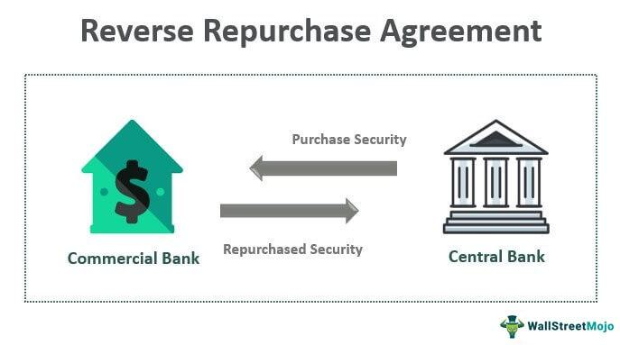

## Table of Contents

## What is an overnight limit?

An overnight limit is a rule set by banks and financial institutions that tells how much money they can keep in other countries overnight. This is important because it helps manage risk. If a bank has too much money in another country, it could be risky if that country's economy has problems.

Banks use overnight limits to make sure they don't have too much money in one place. This helps them stay safe and follow the rules set by financial regulators. By setting these limits, banks can protect themselves and their customers from big financial losses.

## Why is an overnight limit important in financial markets?

An overnight limit is important in financial markets because it helps banks manage their risk. When banks do business in different countries, they need to be careful about how much money they leave there overnight. If they have too much money in one place, it could be risky if something bad happens in that country's economy. By setting an overnight limit, banks can make sure they don't have too much money at risk in any one place.

This limit also helps banks follow the rules set by financial regulators. Regulators want banks to be safe and not take too many risks with their customers' money. By using overnight limits, banks can show that they are being careful and following the rules. This helps keep the financial system stable and protects both the banks and their customers from big financial losses.

## How does an overnight limit affect trading activities?

An overnight limit can affect trading activities by setting a cap on how much money a bank can keep in another country overnight. This means that if a bank reaches its limit, it might have to stop trading or move money around to stay within the rules. Traders need to be aware of these limits because they can change how much they can buy or sell in different markets.

For example, if a bank is close to its overnight limit in a certain country, traders might have to slow down or stop trading there. This can affect the prices and the amount of trading in that market. Banks and traders need to plan their activities carefully to make sure they don't go over the limit and cause problems for themselves or their customers.

## What are the typical settings for an overnight limit?

Overnight limits are usually set by banks and financial regulators. The exact amount can be different for each bank and country. It depends on things like how much risk the bank wants to take, the rules of the country, and how stable the country's economy is. A bank might set a limit of a few million dollars in one country, but a different limit in another country.

These limits are important because they help banks stay safe. If a bank has too much money in one place, it could lose a lot if that country's economy has problems. By setting an overnight limit, banks can make sure they don't have too much money at risk. This helps them follow the rules and protect their customers' money.

## Who sets the overnight limits and how are they determined?

Overnight limits are set by banks and financial regulators. Banks decide how much money they can keep in other countries overnight based on their own risk management rules. They look at how much risk they want to take and the rules of the countries where they do business. Financial regulators also set rules about how much money banks can keep in other countries. These rules are meant to keep the financial system safe and make sure banks don't take too many risks.

The exact amount of the overnight limit can be different for each bank and country. It depends on things like how stable the country's economy is and how much risk the bank is willing to take. For example, a bank might set a limit of a few million dollars in one country, but a different limit in another country. By setting these limits, banks can make sure they don't have too much money at risk in any one place. This helps them follow the rules and protect their customers' money.

## Can overnight limits be adjusted, and if so, by whom?

Overnight limits can be adjusted, and it's usually the banks themselves that make these changes. Banks keep an eye on how much risk they are taking and how the economy is doing in different countries. If things change, like if a country's economy gets better or worse, the bank might decide to change its overnight limit. They want to make sure they are not taking too much risk with their customers' money.

Financial regulators can also ask banks to change their overnight limits. Regulators want to make sure that banks are being safe and following the rules. If they think a bank is taking too much risk, they might tell the bank to lower its overnight limit. This helps keep the whole financial system stable and protects everyone's money.

## What are the risks associated with exceeding an overnight limit?

Exceeding an overnight limit can be risky for banks. If a bank has too much money in another country overnight, it could lose a lot if that country's economy has problems. For example, if the country's currency loses value or if there is a financial crisis, the bank could lose money. This could hurt the bank's customers and make it hard for the bank to do business.

Banks also need to follow the rules set by financial regulators. If a bank goes over its overnight limit, it might get in trouble with the regulators. This could mean fines or other punishments. It's important for banks to stay within their limits to keep their customers' money safe and to follow the rules.

## How do overnight limits differ across various financial institutions?

Overnight limits can be different for each bank because each bank has its own rules about how much risk it wants to take. Some banks might set a higher limit if they feel more comfortable with the risk, while others might set a lower limit to be more careful. The size of the bank and how much money it has can also affect the limit. Big banks might have higher limits because they can handle more risk, but smaller banks might have lower limits to stay safe.

The country where the bank is doing business also matters. Some countries have stronger economies and are seen as less risky, so banks might set higher overnight limits there. Other countries might be more risky, so banks might set lower limits to protect themselves. Financial regulators in each country also have rules that banks need to follow, and these rules can be different from one country to another. So, a bank might have different overnight limits for different countries based on these factors.

## What role do overnight limits play in risk management strategies?

Overnight limits are an important part of how banks manage risk. They help banks decide how much money they can safely keep in another country overnight. This is important because if a bank has too much money in one place, it could lose a lot if that country's economy has problems. By setting an overnight limit, banks can make sure they don't have too much money at risk in any one place. This helps them protect their customers' money and stay safe.

Financial regulators also use overnight limits to make sure banks are being careful. Regulators want banks to follow rules and not take too many risks. If a bank goes over its overnight limit, it might get in trouble with the regulators. This could mean fines or other punishments. So, overnight limits help banks follow the rules and keep the whole financial system stable.

## How do technological systems enforce overnight limits?

Technological systems help banks keep track of their overnight limits by using special software. This software watches how much money the bank has in different countries all the time. If the bank gets close to its limit, the software can send a warning to the bank's traders and managers. This way, they know they need to be careful and maybe move some money around to stay within the limit.

The software also stops the bank from going over the limit. If a trader tries to do a trade that would put the bank over its overnight limit, the system won't let it happen. It's like a safety net that keeps the bank from taking too much risk. By using technology to enforce overnight limits, banks can make sure they are following the rules and keeping their customers' money safe.

## What historical events have influenced changes in overnight limit policies?

Some big events in history have made banks change their overnight limit rules. One big event was the 2008 financial crisis. During this time, many banks lost a lot of money because they had too much money in risky places. After the crisis, banks and regulators decided to be more careful. They made the overnight limits smaller to reduce the risk of losing money if another crisis happened.

Another event that changed overnight limit policies was the Brexit vote in 2016. When the UK decided to leave the European Union, it made the value of the British pound go up and down a lot. Banks that had a lot of money in the UK were worried about losing money because of these changes. So, they started to set lower overnight limits for the UK to be safer. These events show how banks and regulators change their rules to keep money safe when big things happen in the world.

## How do global regulatory frameworks impact the setting of overnight limits?

Global regulatory frameworks play a big role in how banks set their overnight limits. These frameworks are rules made by different countries and international groups to keep the financial system safe. Banks need to follow these rules when they decide how much money they can keep in other countries overnight. For example, the Basel Committee on Banking Supervision gives banks rules about how much risk they can take. These rules help banks set their overnight limits in a way that keeps them safe and follows the law.

Different countries have their own rules too, and these can affect how banks set their overnight limits. For example, a country might have strict rules about how much money banks can keep there overnight. Banks need to follow these rules to avoid getting in trouble with the regulators. This means that a bank might have different overnight limits for different countries, depending on the rules in each place. By following global and local rules, banks can make sure they are managing their risk well and keeping their customers' money safe.

## References & Further Reading

[1]: Adrian, T., & Shin, H. S. (2008). ["Liquidity, Monetary Policy, and Financial Cycles"](https://www.newyorkfed.org/research/current_issues/ci14-1.html). International Journal of Central Banking, 4(1), 59-92.

[2]: Bernanke, B. S., & Blinder, A. S. (1992). ["The Federal Funds Rate and the Channels of Monetary Transmission."](https://www.jstor.org/stable/2117350) American Economic Review, 82(4), 901-921.

[3]: Lopez de Prado, M. (2018). ["Advances in Financial Machine Learning"](https://www.amazon.com/Advances-Financial-Machine-Learning-Marcos/dp/1119482089). Wiley.

[4]: Hull, J. C. (2018). ["Options, Futures, and Other Derivatives"](https://www.semanticscholar.org/paper/Options%2C-Futures%2C-and-Other-Derivatives-Hull/89bdee500c8623864fc9eb7a471546aa713acc44). Pearson.

[5]: Chan, E. P. (2009). ["Quantitative Trading: How to Build Your Own Algorithmic Trading Business"](https://github.com/ftvision/quant_trading_echan_book). Wiley.

[6]: Jorion, P. (2007). ["Value at Risk: The New Benchmark for Managing Financial Risk"](https://link.springer.com/article/10.1007/s11408-007-0057-3). McGraw-Hill.