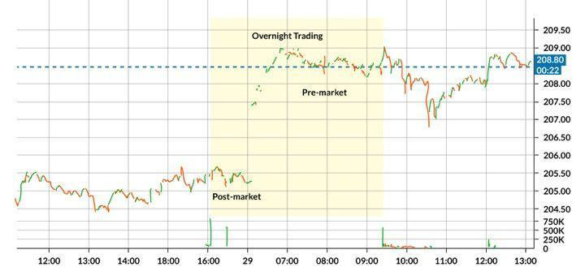

Trading is a multifaceted activity that involves taking various risks and leveraging different strategies to maximize returns. Among the numerous strategies available to traders, two that stand out due to their unique characteristics and implications are overnight position trading and algorithmic trading, commonly referred to as algo trading. Both methods offer distinct advantages that can significantly enhance a trader's ability to capture market opportunities, but they also come with their own set of challenges and risks.

Overnight position trading involves maintaining trading positions beyond the end of a standard trading session. This strategy is particularly prevalent in markets such as foreign exchange and futures, where fluctuations in exchange rates or commodity prices overnight can lead to profitable opportunities. However, holding positions overnight exposes traders to fluctuations caused by after-hours news and global events that might impact market conditions when trading resumes. Understanding the dynamics of overnight market movements is essential for capitalizing on this strategy effectively.



In contrast, algorithmic trading employs sophisticated computer programs to automatically execute trades based on pre-determined criteria. This method is renowned for its speed and accuracy, enabling the execution of high-frequency trading strategies that would be unattainable through manual trading. Additionally, algo trading minimizes the human errors and biases inherent in manual trading but requires a robust understanding of coding, financial markets, and the potential for technical failures.

Both strategies necessitate a solid comprehension of market trends, data analysis, and risk management. Traders employing these techniques must remain vigilant and adaptive, ensuring that they account for potential pitfalls and adjust their approaches as market conditions evolve. By exploring these dimensions, traders can better harness the potential of overnight position and algorithmic trading, aiming to enhance their portfolio performance and achieve their financial goals.

## Table of Contents

## Understanding Overnight Position Trading

An overnight position is a trading position that remains open beyond the end of the trading day. These positions are prevalent in foreign exchange ([FX](/wiki/fx-anomaly)) and futures markets due to the continuous nature of these markets across different time zones. Holding an overnight position allows traders to take advantage of price movements that occur outside regular trading hours, thus offering the potential for increased profits. 

In foreign exchange markets, for example, global events and macroeconomic factors can lead to currency pair fluctuations during the night. These fluctuations can be driven by economic announcements, geopolitical developments, or changes in market sentiment, providing opportunities for significant gains. For instance, if a trader anticipates a positive economic report from a major economy like the United States, they might hold a long position in the USD overnight, hoping to benefit from an appreciation in its value.

Futures markets also present overnight opportunities as they often correlate with commodities, indices, and other financial instruments influenced by global supply and demand factors. Overnight positions in futures contracts allow traders to capitalize on movements in commodities such as oil, metals, and agricultural products, which can be affected by international trade dynamics and weather conditions.

However, the potential for increased profits comes with inherent risks. One significant risk is that of adverse market movements occurring when markets are closed. Such events might be triggered by unexpected news releases or geopolitical tensions, impacting the value of the asset held overnight. Traders can find their positions affected by significant price gaps when the market reopens, leading to potential losses if the movement goes against their position.

To manage these risks, traders must employ effective risk management strategies, such as setting stop-loss orders or using options to hedge their positions. Additionally, maintaining awareness of international news cycles and utilizing advanced trading platforms with access to global market data are crucial in executing overnight position trading successfully.

## Risks Associated with Overnight Positions

Overnight position trading exposes traders to specific risks primarily stemming from market dynamics outside standard trading hours. The baselined [volatility](/wiki/volatility-trading-strategies) during these hours can manifest in significant price swings, primarily due to reduced trading volumes. Lower trading activity often results in a restrained market depth, increasing the likelihood of larger price fluctuations when new information or trades are introduced.

One of the main contributors to this volatility is overnight news events. These events, which include economic reports, geopolitical developments, or unexpected financial disclosures, can lead to substantial market movements. Since markets are closed, traders cannot adjust their positions in real-time. Consequently, when markets reopen, the initial reaction to such news can lead to gap openings — sudden shifts in prices from the previous closing levels, which may result in unexpected gains or losses for those holding positions overnight.

Liquidity risks compound the challenges associated with overnight trading. Liquidity, defined as the ease with which an asset can be bought or sold without affecting its price, tends to fluctuate during non-standard hours. During these times, the pool of buyers and sellers diminishes, making it harder to [exit](/wiki/exit-strategy) trades at desired prices. This scarcity of counterparties can lead to higher bid-ask spreads, forcing traders to settle for less favorable prices or to hold positions longer than intended.

Mathematically, the price change $\Delta P$ of an asset can be expressed in terms of its volatility $\sigma$ and the market impact $I$ as:

$$
\Delta P = \sigma \times \sqrt{T} + I
$$

where $T$ represents the time elapsed since the last market activity. In the context of overnight trading, $T$ can represent the duration from market close to market open, during which period the volatility $\sigma$ is often magnified due to external events, and the impact $I$ grows due to low liquidity.

To navigate these risks, traders can implement various strategies such as hedging overnight positions or using stop-loss orders to mitigate potential adverse impacts. These financial instruments allow traders to limit potential losses while maintaining upside potential, though they too come with associated costs and limitations. Understanding the nuanced interplay between these factors is crucial for traders looking to leverage overnight positions effectively.

## Benefits of Overnight Position Trading

Overnight position trading offers several notable advantages that can significantly enhance a trader’s portfolio performance. One of the primary benefits is the ability to exploit large market movements that take place outside standard trading hours. Financial markets often experience significant events or news that can lead to price fluctuations when markets are closed. These overnight movements can create opportunities for traders to capture potentially substantial gains by maintaining positions beyond the trading day.

Another advantage is the presence of overnight price gaps. A price gap occurs when there is a significant difference between the closing price of a market one day and its opening price the next trading session. Such gaps are often the result of after-hours news or events that affect the perception of an asset’s value. Traders who hold positions overnight can benefit from these gaps as the market adjusts to new information, providing opportunities for profits.

Flexibility is also a crucial benefit offered by overnight position trading. This strategy allows traders to manage their positions outside of traditional trading hours, which can be particularly advantageous for those with demanding schedules or those who participate in multiple international markets across different time zones. This flexibility enables traders to respond to global events in a timely manner, optimizing their strategies without being constrained by the limited hours of regular market operations.

In conclusion, while overnight position trading involves exposure to certain risks, the potential for capturing large market moves, taking advantage of price gaps, and enjoying enhanced trading flexibility makes it an attractive strategy for many traders aiming to improve their overall performance.

 to Algorithmic Trading

Algorithmic trading, often referred to as algo trading, involves the use of computer programs to automate trading activities based on predetermined strategies and criteria. This approach leverages advanced algorithms to analyze vast datasets, execute trades, and optimize trading decisions with minimal human intervention. The central premise of [algorithmic trading](/wiki/algorithmic-trading) is to employ precise mathematical models to react to and capitalize on market opportunities more efficiently than traditional manual trading.

One of the primary advantages of algorithmic trading is its high-speed execution. Given that financial markets operate at an extraordinarily fast pace, the ability to execute trades in milliseconds offers a significant edge. Algorithmic systems are capable of handling large volumes of trades, processing numerous transactions simultaneously without the delays associated with human decision-making. This facilitates increased market [liquidity](/wiki/liquidity-risk-premium) and ensures tighter spreads for market participants.

Furthermore, algorithmic trading can effectively minimize human error and biases, which are often prevalent in manual trading. By relying on objective, data-driven models, algo trading reduces the risk of emotional trading decisions that can lead to substantial financial losses. This objectivity is crucial for implementing complex trading strategies across diverse markets, enabling traders to utilize statistical [arbitrage](/wiki/arbitrage), market-making, and trend-following strategies more systematically.

Algorithmic trading also includes the capacity for continuous monitoring and adjustment of trading strategies based on live market data. This allows for real-time feedback and fine-tuning of trading models, adapting to changing market conditions and ensuring optimal performance. Additionally, algo trading offers scalability, permitting traders to operate seamlessly across multiple markets and asset classes simultaneously.

In summary, the automation and computational power inherent in algorithmic trading provide unique opportunities for traders to maximize efficiency, reduce errors, and execute sophisticated strategies with precision. As technology advances, algorithmic trading continues to play an increasingly vital role in modern financial markets.

## Risks and Challenges of Algo Trading

Algorithmic trading, while offering numerous advantages, is not without its risks and challenges. One of the primary concerns is technical failures and system errors. Algorithms depend heavily on computer systems and networks, which can suffer from downtime or disruptions for various reasons. Such failures can result in missed trades, incorrect execution, or duplication of orders, leading to substantial financial losses. To mitigate this, traders often implement fail-safes, redundant systems, and regular maintenance protocols. However, even with these precautions, the risk cannot be entirely eliminated.

Another significant risk is that market dynamics can change more rapidly than algorithms can accommodate. Trading algorithms are typically based on historical data and predefined criteria. These parameters may not adequately predict or react to sudden shifts in market conditions, such as geopolitical events, economic announcements, or unanticipated market behavior. In fast-paced environments, this lag in response can lead to suboptimal trades or increased exposure to risk. To address this, continuous monitoring and modification of algorithms are essential, along with an agile approach to strategy adjustments.

Additionally, algorithmic trading raises important regulatory concerns. The speed and [volume](/wiki/volume-trading-strategy) at which trades are executed can contribute to market volatility and raise questions about market fairness and transparency. Regulators have expressed concerns about the potential for market manipulation and systemic risks posed by high-frequency trading. As a result, various regulatory bodies around the world have implemented guidelines and requirements to oversee algorithmic trading practices. Traders must navigate these regulations carefully to ensure compliance, which may involve significant overhead and complexity in maintaining trading systems.

Overall, while algorithmic trading provides efficiencies and opportunities for profit, it also necessitates a nuanced understanding of its potential pitfalls. Traders must be vigilant in managing technical, market, and regulatory risks to harness the benefits of algorithmic trading effectively.

## Advantages of Algo Trading

Algorithmic trading, also known as algo trading, offers several advantages that traditional manual trading methods cannot match. The primary benefit is the ability to execute trades with remarkable precision and speed. Algorithms can process complex calculations and decisions within microseconds, far surpassing human capabilities. This rapid execution reduces market impact and slippage, enabling traders to capitalize on fleeting market conditions and price discrepancies.

Algo trading also facilitates diversification by allowing traders to implement multiple strategies across various assets simultaneously. This broad exposure helps in mitigating risks, as the poor performance of one market or strategy can be compensated by gains in another. For instance, a trader can concurrently engage in [trend following](/wiki/trend-following), mean reversion, and arbitrage strategies across equities, [forex](/wiki/forex-system), and commodities, effectively spreading risk and optimizing returns.

Another significant advantage of algo trading is the capability to backtest strategies using historical data. This involves applying trading algorithms to past market conditions to evaluate their performance. Backtesting empowers traders to assess the efficacy of their strategies before deploying them in live markets, reducing the likelihood of unprofitable outcomes. The process involves statistical analysis and modeling, providing insights into how a strategy might behave under various market scenarios. 

Here's a simple Python example demonstrating a [backtesting](/wiki/backtesting) approach using historical price data:

```python
import pandas as pd
import numpy as np

# Load historical price data
data = pd.read_csv('historical_data.csv')
data['Returns'] = data['Close'].pct_change()

# Define a moving average crossover strategy
short_window = 40
long_window = 100

data['Short_MA'] = data['Close'].rolling(window=short_window, min_periods=1).mean()
data['Long_MA'] = data['Close'].rolling(window=long_window, min_periods=1).mean()

data['Signal'] = 0
data['Signal'][short_window:] = np.where(data['Short_MA'][short_window:] > data['Long_MA'][short_window:], 1, 0)
data['Position'] = data['Signal'].diff()

# Calculate strategy returns
data['Strategy_Returns'] = data['Position'].shift(1) * data['Returns']

# Compute cumulative returns
cumulative_strategy_returns = (1 + data['Strategy_Returns']).cumprod()

print(f"Cumulative Strategy Returns: {cumulative_strategy_returns[-1]}")
```

In this script, a simple moving average crossover strategy is modeled, and its performance is evaluated using historical closing price data. The cumulative returns give an estimate of how profitable the strategy would have been over the backtested period.

Overall, algorithmic trading enhances trading efficiency and reduces human error, allowing traders to exploit market opportunities with enhanced precision, intentional diversification, and informed strategy development.

## Conclusion

Both overnight position trading and algorithmic trading are powerful strategies when applied effectively, each offering unique advantages and challenges. Overnight position trading allows traders to capture price movements and potential profits from market events occurring outside regular trading hours. This approach can be particularly advantageous for those who are not confined to trading only during market hours. However, it also exposes traders to risks associated with overnight volatility, unexpected news events, and liquidity constraints.

Similarly, algorithmic trading, characterized by its use of automated systems to execute trades, offers the benefits of speed, precision, and the capacity to handle large trading volumes. It minimizes human error and emotion, allowing for consistent execution of strategies. Yet, it poses its own set of risks, including technical failures, insufficient adaptive capabilities to rapidly changing market conditions, and potential regulatory issues due to its impact on market fairness.

The key to effectively applying these strategies lies in thorough risk assessment and management. Traders must continuously evaluate their risk tolerance and remain vigilant about changing market conditions. An informed approach, paired with a dynamic strategy adjustment process, is crucial. Monitoring algorithms, ensuring proper system functionality, and staying updated with relevant market data form the foundation of successful trading.

Integration of robust risk management practices can aid traders in mitigating potential losses while maximizing the strengths of each strategy. By staying informed and adaptable, traders can significantly enhance their portfolio performance, leveraging the full potential of overnight position trading and algorithmic trading in today's dynamic markets.

## References & Further Reading

[1]: Narang, R. (2009). ["Inside the Black Box: The Simple Truth About Quantitative Trading."](https://onlinelibrary.wiley.com/doi/book/10.1002/9781118267738) John Wiley & Sons.

[2]: Kissell, R. (2014). ["The Science of Algorithmic Trading and Portfolio Management."](https://www.sciencedirect.com/book/9780124016897/the-science-of-algorithmic-trading-and-portfolio-management) Academic Press.

[3]: Lopez de Prado, M. (2018). ["Advances in Financial Machine Learning."](https://www.amazon.com/Advances-Financial-Machine-Learning-Marcos/dp/1119482089) Wiley.

[4]: Aldridge, I. (2013). ["High-Frequency Trading: A Practical Guide to Algorithmic Strategies and Trading Systems."](https://www.ahmetbeyefendi.com/wp-content/uploads/2020/07/High-Frequency-Trading-Irene-Aldridge.pdf) Wiley.

[5]: Chan, E. (2009). ["Quantitative Trading: How to Build Your Own Algorithmic Trading Business."](https://github.com/ftvision/quant_trading_echan_book) Wiley Trading.