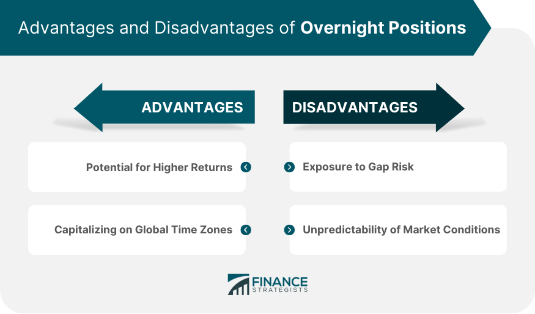

## Table of Contents

## What is an overnight position in trading?

An overnight position in trading is when a trader holds onto a stock, currency, or other financial asset after the market closes for the day. Instead of selling it before the market shuts down, the trader keeps it and plans to sell it the next trading day. This can be risky because a lot can happen overnight that might change the value of the asset when the market opens again.

Traders might choose to hold an overnight position if they believe the asset will increase in value by the next day. For example, if a trader thinks good news about a company will come out overnight, they might hold onto the stock hoping its price will go up. However, there's also a chance that bad news could come out, causing the price to drop. So, traders need to be careful and think about the risks before deciding to keep an overnight position.

## How do overnight positions differ from day trading?

Overnight positions and day trading are two different ways to trade in the stock market. With day trading, a trader buys and sells stocks within the same day. They don't keep any stocks overnight. The goal is to make quick profits from small changes in stock prices during the trading day. Day traders need to watch the market closely and make fast decisions.

On the other hand, an overnight position means a trader keeps a stock after the market closes and plans to sell it the next day. This can be riskier because things can happen overnight that affect the stock's price. Traders might choose to hold an overnight position if they think the stock will go up in value the next day. But they also have to be ready for the possibility that the stock might go down instead.

## What are the potential benefits of holding an overnight position?

One big benefit of holding an overnight position is the chance to make more money. If you think a stock will go up in value because of news or events happening after the market closes, you can hold onto it overnight. If you're right, you could sell it the next day for a higher price than if you had sold it before the market closed. This can lead to bigger profits than just trading during the day.

Another benefit is that you don't have to watch the market all day. Day trading can be stressful because you need to keep an eye on your stocks and make quick decisions. With an overnight position, you can buy a stock at the end of the day and then relax until the market opens again. This can save you time and reduce the stress of constantly monitoring the market.

## What risks are associated with overnight positions?

One risk of holding an overnight position is that the price of the stock can change a lot overnight. Bad news or unexpected events can happen after the market closes, causing the stock to drop when it opens the next day. If this happens, you could lose money because you'll have to sell the stock at a lower price than you bought it for.

Another risk is that you can't react to changes in the market until it opens again. If you see the stock starting to go down during the day, you can't sell it right away to avoid losing money. You have to wait until the next trading day, which means you might lose more money than if you could sell it immediately. So, holding an overnight position can be riskier than trading during the day because you have less control over what happens to your stock.

## How can market volatility affect overnight positions?

Market volatility can make holding an overnight position riskier. Volatility means the price of a stock can change a lot in a short time. If the market is very volatile, the price of your stock could go up or down a lot overnight. If bad news comes out after the market closes, the stock might drop a lot when it opens the next day. This means you could lose more money than if the market was calm.

On the other hand, high volatility can also be good if you're lucky. If good news comes out overnight and the market is volatile, your stock could go up a lot by the next day. This means you could make more money than if the market was less volatile. But because you can't control what happens overnight, it's a bigger risk when the market is very up and down.

## What strategies can traders use to manage overnight positions?

Traders can use a few strategies to manage overnight positions safely. One strategy is to do a lot of research before deciding to hold a stock overnight. This means looking at the news and events that might happen after the market closes. If there's a big risk of bad news, it might be better to sell the stock before the market closes. Another strategy is to set stop-loss orders. A stop-loss order is like a safety net. It tells the market to sell your stock automatically if the price drops to a certain level. This can help limit how much money you could lose overnight.

Another way to manage overnight positions is to diversify your investments. Instead of putting all your money into one stock, you can spread it out over several different stocks. This way, if one stock goes down a lot overnight, you won't lose all your money. You can also pay attention to market trends and volatility. If the market is very up and down, it might be safer to avoid holding overnight positions. By using these strategies, traders can make smarter decisions about holding stocks overnight and reduce the risks involved.

## How do economic reports and news impact overnight trading?

Economic reports and news can have a big effect on overnight trading. If a big economic report comes out after the market closes, it can change how people think about a stock or the whole market. For example, if a report shows that a company did better than expected, people might want to buy more of its stock the next day. This can make the stock price go up. But if the report is bad, people might want to sell the stock, making the price go down. So, traders need to pay attention to when these reports are coming out and what they might say.

News can also make a difference. If something big happens in the world, like a natural disaster or a big political event, it can change how the market works. For example, if there's a big earthquake in a country that makes a lot of cars, people might worry that fewer cars will be made. This could make car company stocks go down when the market opens the next day. Traders need to think about these kinds of news events when they decide to hold a stock overnight. By keeping an eye on economic reports and news, traders can make better choices about their overnight positions.

## What role does margin and leverage play in overnight positions?

Margin and leverage can make overnight positions riskier but also more profitable. When you trade on margin, you borrow money from your broker to buy more stocks than you could with just your own money. Leverage is like a multiplier that lets you control a bigger position with less of your own money. If you use margin and leverage to hold an overnight position, any changes in the stock price overnight will affect your account more. If the stock goes up, you can make more money because you're controlling a bigger position. But if the stock goes down, you can lose more money too.

Using margin and leverage for overnight positions means you need to be very careful. If the stock price drops a lot overnight, you might get a margin call. This means you have to put more money into your account right away or the broker will sell your stocks to cover the loan. This can happen suddenly and without warning, which can be stressful. So, traders need to think about the risks and make sure they can handle the extra costs before using margin and leverage for overnight positions.

## How can traders use technical analysis to decide on overnight positions?

Traders can use technical analysis to help them decide if they should hold a stock overnight. Technical analysis is about looking at charts and patterns to guess where a stock's price might go next. For example, if a trader sees that a stock is following a certain pattern and it looks like the price might go up, they might decide to keep the stock overnight. They might look at things like support and resistance levels, which are prices where the stock tends to stop going down or up. If the stock is near a strong support level at the end of the day, a trader might feel safer holding it overnight because they think the price won't drop much.

Another way traders use technical analysis is by looking at indicators like moving averages or the Relative Strength Index (RSI). These tools can show if a stock is overbought or oversold, which means it might be due for a price change. If the RSI shows that a stock is oversold at the end of the day, a trader might think it's a good time to hold it overnight because the price could go up the next day. By using these technical tools, traders can make more informed decisions about whether to hold a stock overnight, but they still need to remember that the market can be unpredictable.

## What are the tax implications of profits from overnight positions?

When you make money from overnight positions, you need to think about taxes. If you hold a stock for less than a year before selling it, any profit you make is called a short-term capital gain. The IRS treats short-term capital gains as regular income, so you'll pay the same tax rate on them as you do on your salary or wages. This can be anywhere from 10% to 37%, depending on how much money you make in a year.

If you hold a stock for more than a year before selling it, your profit is considered a long-term capital gain. The tax rate for long-term capital gains is usually lower, at 0%, 15%, or 20%, depending on your income. So, if you're planning to hold an overnight position and you think the stock will go up a lot, it might be smart to keep it for more than a year to get the lower tax rate on your profits. But remember, tax rules can change, so it's always a good idea to talk to a tax advisor to make sure you're doing everything right.

## How do different asset classes (stocks, forex, commodities) behave differently in overnight positions?

Different asset classes like stocks, [forex](/wiki/forex-system), and commodities can act differently when you hold them overnight. Stocks can be affected a lot by news and economic reports that come out after the market closes. For example, if a company announces good earnings after the market shuts down, its stock might go up a lot the next day. But if there's bad news, like a CEO resigning, the stock could drop. This makes stocks risky to hold overnight because so much can change while the market is closed.

Forex, or foreign exchange, markets are open 24 hours a day from Monday to Friday, so they don't really have an "overnight" in the same way stocks do. But the forex market can still be affected by news and events happening around the world. If there's a big political event or economic report in one country, it can change the value of that country's currency against others. Traders need to keep an eye on these events, even if they're not planning to trade during the night.

Commodities like gold, oil, and wheat can also be influenced by news and events, but they often follow different patterns. For example, oil prices might change a lot if there's news about production cuts or increases from big oil countries. Gold might go up if there's uncertainty in the world because people see it as a safe investment. Holding commodities overnight can be less risky than stocks in some ways because they're not tied to one company's news, but they can still be affected by global events and market trends.

## What advanced risk management techniques should expert traders consider for overnight positions?

Expert traders can use advanced risk management techniques to make their overnight positions safer. One way is to use options to hedge their positions. This means they can buy options that will make money if their stock goes down overnight. This can help limit how much they lose if the stock price drops a lot. Another technique is to use [algorithmic trading](/wiki/algorithmic-trading) systems that can analyze a lot of data quickly and make smart decisions about when to buy or sell. These systems can help traders react faster to changes in the market, even if they're not watching it all night.

Another important technique is to use position sizing carefully. This means deciding how much money to put into each trade based on how risky it is. If a stock is very volatile, an expert trader might put less money into it to reduce the risk of big losses overnight. They can also use advanced stop-loss orders that are more flexible. For example, a trailing stop-loss order can move up as the stock price goes up, locking in more profit while still protecting against big drops. By using these advanced techniques, expert traders can manage the risks of holding stocks overnight better.

## What are the risks associated with overnight positions?

Overnight position trading exposes traders to specific risks primarily stemming from market dynamics outside standard trading hours. The baselined [volatility](/wiki/volatility-trading-strategies) during these hours can manifest in significant price swings, primarily due to reduced trading volumes. Lower trading activity often results in a restrained market depth, increasing the likelihood of larger price fluctuations when new information or trades are introduced.

One of the main contributors to this volatility is overnight news events. These events, which include economic reports, geopolitical developments, or unexpected financial disclosures, can lead to substantial market movements. Since markets are closed, traders cannot adjust their positions in real-time. Consequently, when markets reopen, the initial reaction to such news can lead to gap openings — sudden shifts in prices from the previous closing levels, which may result in unexpected gains or losses for those holding positions overnight.

Liquidity risks compound the challenges associated with overnight trading. Liquidity, defined as the ease with which an asset can be bought or sold without affecting its price, tends to fluctuate during non-standard hours. During these times, the pool of buyers and sellers diminishes, making it harder to [exit](/wiki/exit-strategy) trades at desired prices. This scarcity of counterparties can lead to higher bid-ask spreads, forcing traders to settle for less favorable prices or to hold positions longer than intended.

Mathematically, the price change $\Delta P$ of an asset can be expressed in terms of its volatility $\sigma$ and the market impact $I$ as:

$$
\Delta P = \sigma \times \sqrt{T} + I
$$

where $T$ represents the time elapsed since the last market activity. In the context of overnight trading, $T$ can represent the duration from market close to market open, during which period the volatility $\sigma$ is often magnified due to external events, and the impact $I$ grows due to low liquidity.

To navigate these risks, traders can implement various strategies such as hedging overnight positions or using stop-loss orders to mitigate potential adverse impacts. These financial instruments allow traders to limit potential losses while maintaining upside potential, though they too come with associated costs and limitations. Understanding the nuanced interplay between these factors is crucial for traders looking to leverage overnight positions effectively.

## References & Further Reading

[1]: Narang, R. (2009). ["Inside the Black Box: The Simple Truth About Quantitative Trading."](https://onlinelibrary.wiley.com/doi/book/10.1002/9781118267738) John Wiley & Sons.

[2]: Kissell, R. (2014). ["The Science of Algorithmic Trading and Portfolio Management."](https://www.sciencedirect.com/book/9780124016897/the-science-of-algorithmic-trading-and-portfolio-management) Academic Press.

[3]: Lopez de Prado, M. (2018). ["Advances in Financial Machine Learning."](https://www.amazon.com/Advances-Financial-Machine-Learning-Marcos/dp/1119482089) Wiley.

[4]: Aldridge, I. (2013). ["High-Frequency Trading: A Practical Guide to Algorithmic Strategies and Trading Systems."](https://www.ahmetbeyefendi.com/wp-content/uploads/2020/07/High-Frequency-Trading-Irene-Aldridge.pdf) Wiley.

[5]: Chan, E. (2009). ["Quantitative Trading: How to Build Your Own Algorithmic Trading Business."](https://github.com/ftvision/quant_trading_echan_book) Wiley Trading.