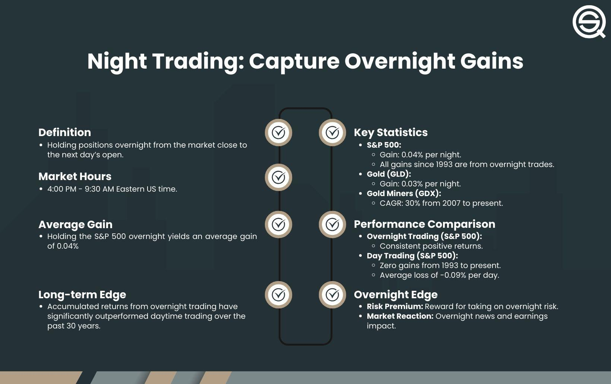

## Table of Contents

## What is overnight trading?

Overnight trading refers to the buying and selling of financial instruments like stocks, commodities, or currencies outside of the regular trading hours of the main stock exchanges. This usually happens after the market closes in the evening and before it opens again in the morning. Many traders engage in overnight trading to take advantage of news and events that occur outside of regular trading hours, which can significantly impact the prices of financial instruments.

For example, if a company releases important news after the market closes, traders can buy or sell that company's stock overnight, hoping to profit from the expected price movement when the market opens the next day. However, overnight trading can be riskier than trading during regular hours because the market is less liquid, meaning fewer people are trading, which can lead to larger price swings. It's important for traders to be aware of these risks and to have a solid understanding of the market before engaging in overnight trading.

## How does overnight trading differ from regular trading hours?

Overnight trading happens when the main stock markets are closed, usually from the evening until the morning. During this time, traders can still buy and sell things like stocks or currencies. This is different from regular trading hours, which are the times when the main stock markets are open, usually during the day. Regular trading hours have more people trading, so it's easier to buy and sell things quickly.

The main difference between overnight trading and regular trading hours is the amount of activity. During regular hours, there are lots of people trading, so the prices of stocks and other things don't change as much. But during overnight trading, fewer people are trading, so the prices can change a lot more. This makes overnight trading riskier because the prices can go up or down a lot more than during the day. Traders who do overnight trading need to be careful and know what they're doing.

## What are the risks associated with overnight trading?

Overnight trading can be riskier than trading during the day because there are fewer people trading. When fewer people are trading, it's harder to buy or sell things quickly. This can make the prices of stocks or other things go up or down a lot more than during regular trading hours. If you're not careful, you might end up buying something at a high price or selling it at a low price, which can lead to losing money.

Another risk is that important news or events can happen overnight that can change the prices of stocks or other things a lot. For example, a company might release bad news after the market closes, and the price of its stock could drop a lot by the time the market opens again. If you're trading overnight, you need to keep an eye on the news and be ready to make quick decisions. This can be stressful and requires a good understanding of the market to do well.

## Can you explain the mechanism of overnight trading?

Overnight trading happens when the main stock markets are closed, usually from the evening until the morning. During this time, traders can still buy and sell things like stocks or currencies using electronic trading platforms. These platforms let traders trade even when the big stock exchanges are not open. The prices of stocks and other things can change a lot during overnight trading because fewer people are trading. This means that if you want to buy or sell something, it might be harder to find someone to trade with.

One important thing about overnight trading is that news and events can happen while the markets are closed. For example, a company might release important news after the market closes, and this news can make the price of its stock go up or down a lot by the time the market opens again. Traders who are trading overnight need to keep an eye on the news and be ready to make quick decisions. This can be tricky and requires a good understanding of the market to do well.

## What types of assets are commonly traded overnight?

Stocks are one of the most common assets traded overnight. When the main stock markets are closed, traders can still buy and sell stocks using electronic trading platforms. These platforms let traders trade even when the big stock exchanges are not open. The prices of stocks can change a lot during overnight trading because fewer people are trading. This means that if you want to buy or sell a stock, it might be harder to find someone to trade with.

Another type of asset commonly traded overnight is currencies. The foreign exchange market, or forex market, is open 24 hours a day, so traders can buy and sell different currencies at any time. This makes it easy to trade currencies overnight. Just like with stocks, the prices of currencies can change a lot during overnight trading. Traders need to keep an eye on the news and be ready to make quick decisions because important events can happen while the markets are closed.

Futures and options are also often traded overnight. These are contracts that let traders buy or sell something at a set price in the future. Like stocks and currencies, futures and options can be traded on electronic platforms when the main markets are closed. The prices of these contracts can change a lot overnight, so traders need to be careful and know what they're doing.

## How do market conditions affect overnight trading?

Market conditions can change a lot during overnight trading. When fewer people are trading, the prices of stocks, currencies, and other things can go up or down more than during the day. This is because there are not as many buyers and sellers, so it can be harder to find someone to trade with. If something important happens, like a company releasing bad news, the price of its stock might drop a lot by the time the market opens again. Traders need to be careful and watch the news closely because what happens overnight can affect the prices a lot.

Also, the overall mood of the market can change overnight. If there is a lot of worry or excitement about something, like a big economic report coming out, it can make people want to buy or sell more. This can lead to big price changes. Traders who do overnight trading need to understand how these market conditions can affect the prices of what they are trading. It can be tricky, but knowing what to expect can help them make better decisions.

## What are the benefits of engaging in overnight trading?

One benefit of overnight trading is that you can take advantage of news and events that happen when the main stock markets are closed. For example, if a company releases important news after the market closes, you can buy or sell its stock before the market opens again. This can help you make money if the price goes up or down a lot because of the news. Another benefit is that you can trade 24 hours a day. This means you don't have to wait for the market to open to start trading. If you see a good opportunity, you can act on it right away, even if it's the middle of the night.

Also, overnight trading can help you spread out your trading over more hours. Instead of just trading during the day, you can trade at night too. This can give you more chances to make money. Plus, sometimes the prices of stocks or other things don't change as much during the day, but they can change a lot overnight. If you're good at understanding the market, you can use these big price changes to your advantage. Just remember, overnight trading can be riskier, so you need to be careful and know what you're doing.

## What strategies are effective for overnight trading?

One effective strategy for overnight trading is to keep an eye on the news. Important news or events can happen after the market closes, and these can make the prices of stocks or other things go up or down a lot by the time the market opens again. If you know about these events, you can buy or sell before everyone else does. For example, if a company releases good news after the market closes, you can buy its stock overnight and then sell it for a profit when the market opens and the price goes up. This strategy requires you to be quick and ready to act on new information.

Another strategy is to use stop-loss orders. These are orders that automatically sell your stock if the price goes down to a certain level. This can help you limit your losses if the price drops a lot overnight. For example, if you buy a stock at $50, you can set a stop-loss order at $45. If the price drops to $45 overnight, your stock will be sold automatically, so you don't lose more money. This strategy can help you manage the risks of overnight trading, but you need to set your stop-loss orders carefully so you don't sell too early and miss out on potential gains.

A third strategy is to focus on trading assets that are more likely to move a lot overnight, like stocks of companies that often release news after the market closes or currencies in the forex market. By focusing on these assets, you can take advantage of the big price changes that can happen overnight. This strategy requires you to do some research and understand which assets are more likely to move a lot. It can be more risky, but if you're good at predicting these moves, it can also be more rewarding.

## How do regulatory environments impact overnight trading?

Regulatory environments can have a big impact on overnight trading. Different countries have different rules about what traders can and can't do when the main stock markets are closed. For example, some countries might have strict rules about who can trade overnight or what types of assets they can trade. These rules can make it harder for traders to do overnight trading, or they might have to follow certain steps before they can start trading. If the rules change, it can affect how traders make decisions and what strategies they use.

Also, regulatory environments can affect the safety and fairness of overnight trading. Regulators might set rules to make sure that the electronic trading platforms used for overnight trading are safe and fair for everyone. This can help prevent things like fraud or big price changes that aren't fair. But these rules can also make it more complicated for traders to do overnight trading. They might have to learn about new rules or use different platforms that follow the regulations. So, understanding the regulatory environment is important for anyone who wants to do overnight trading.

## What role do overnight sessions play in global financial markets?

Overnight sessions are important in global financial markets because they let traders keep trading even when the main stock markets are closed. This means that people from different countries can trade with each other all the time, not just during the day. For example, if it's nighttime in New York, it might be daytime in Tokyo, so traders in Tokyo can still trade while New York is closed. This helps keep the markets active and lets traders take advantage of news and events that happen around the world, no matter what time it is.

Also, overnight sessions help make the global markets more connected. When something important happens in one part of the world, like a big economic report or a natural disaster, it can affect the prices of stocks and other things everywhere. Overnight trading lets traders react to these events quickly, even if they happen when their local markets are closed. This can make the prices change a lot, but it also helps keep the markets fair and up-to-date with what's happening around the world.

## How can one manage the risks of overnight trading?

One way to manage the risks of overnight trading is by using stop-loss orders. These are orders that automatically sell your stock if the price goes down to a certain level. This can help you limit your losses if the price drops a lot overnight. For example, if you buy a stock at $50, you can set a stop-loss order at $45. If the price drops to $45 overnight, your stock will be sold automatically, so you don't lose more money. This strategy can help you manage the risks of overnight trading, but you need to set your stop-loss orders carefully so you don't sell too early and miss out on potential gains.

Another way to manage the risks is by keeping an eye on the news. Important news or events can happen after the market closes, and these can make the prices of stocks or other things go up or down a lot by the time the market opens again. If you know about these events, you can make better decisions about when to buy or sell. For example, if a company releases bad news after the market closes, you might decide to sell your stock before the price drops too much. This strategy requires you to be quick and ready to act on new information, but it can help you avoid big losses.

Lastly, you can manage the risks by focusing on trading assets that are more likely to move a lot overnight, like stocks of companies that often release news after the market closes or currencies in the forex market. By focusing on these assets, you can take advantage of the big price changes that can happen overnight. This strategy requires you to do some research and understand which assets are more likely to move a lot. It can be more risky, but if you're good at predicting these moves, it can also be more rewarding.

## What advanced tools and platforms support overnight trading?

Many advanced tools and platforms support overnight trading. One popular platform is the Electronic Communication Network (ECN), which lets traders buy and sell stocks and other things even when the main stock markets are closed. ECNs connect buyers and sellers directly, so you can trade anytime, day or night. Another tool is trading software like MetaTrader 4 or 5, which is often used for trading currencies in the forex market. These platforms have lots of features that can help you trade overnight, like charts and tools to analyze the market.

Other platforms that support overnight trading include Interactive Brokers and Thinkorswim. These platforms offer advanced features like real-time data, customizable charts, and the ability to set up automated trading strategies. This means you can set rules for your trades to happen automatically, even when you're not watching the market. These tools can help you manage the risks of overnight trading by giving you more information and control over your trades.

## References & Further Reading

[1]: Harris, L. (2003). ["Trading and Exchanges: Market Microstructure for Practitioners."](https://academic.oup.com/book/52292) Oxford University Press.

[2]: Frank, M. Z., & Stengos, T. (1989). ["After-Hours Stock Prices Change Due to International News: Testing the Efficiency of Covering the Foreign Exchange Market."](https://www.jstor.org/stable/pdf/20756037.pdf?ab_segments=0%2Fbasic_search_gsv2%2Fcontrol&initiator=search-results) Journal of Financial and Quantitative Analysis.

[3]: Domowitz, I. (2001). ["Liquidity and Price Discovery in an Automated Securities Market."](https://papers.ssrn.com/sol3/papers.cfm?abstract_id=295765) The Journal of Trading.

[4]: Menkveld, A. J. (2013). ["High Frequency Trading and the New Market Makers."](https://www.sciencedirect.com/science/article/pii/S1386418113000281) The Review of Financial Studies.

[5]: Tabb, L. (2004). ["After-Hours Trading: Risks and Rewards."](https://www.investing.com/academy/trading/after-hours-trading/) Waters Technology.