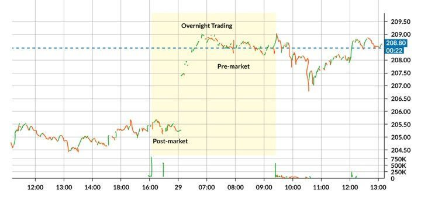
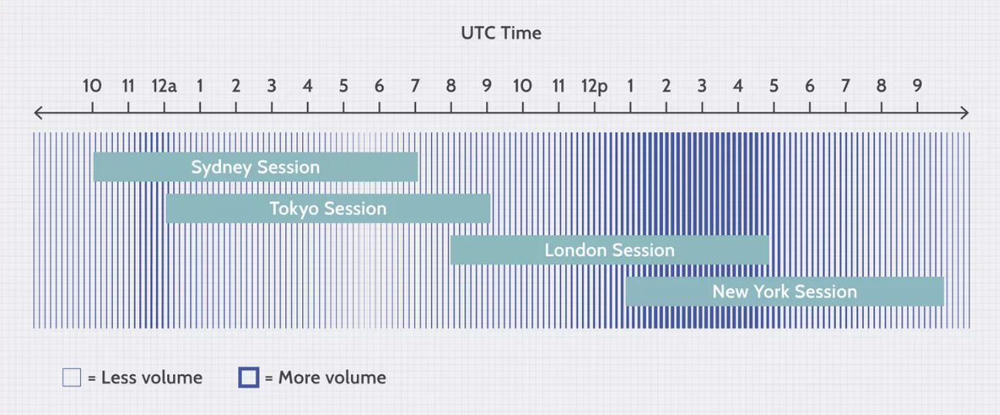
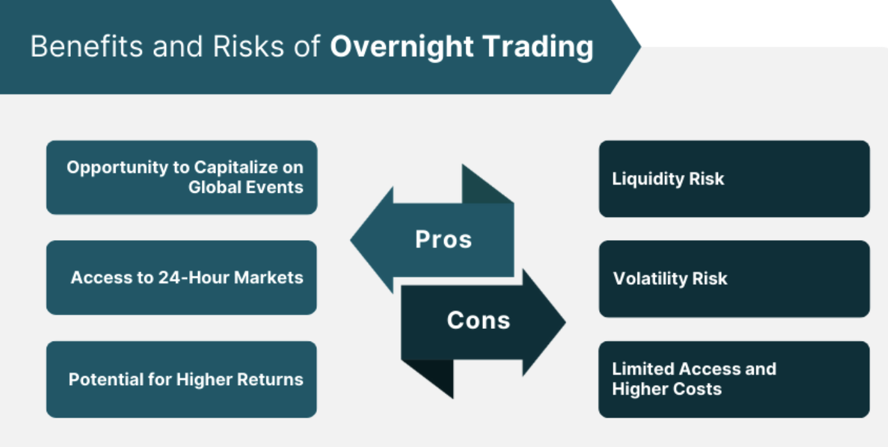
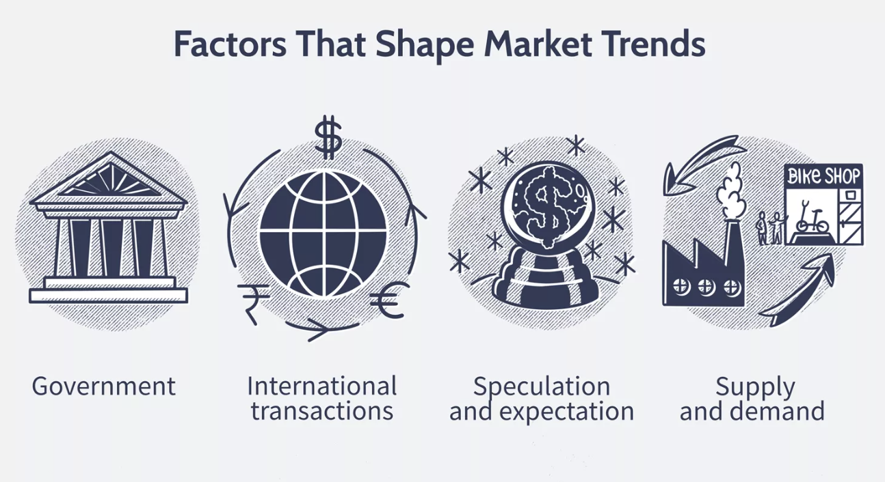

Overnight trading refers to the buying and selling of securities when the main markets are closed. Unlike after-hours trading, which occurs directly following the market close, overnight trading can signify any trade executed during the non-standard hours between one market close and the opening of the next trading day. This type of trading has become more accessible and popular due to the globalization of markets and advancements in technology that allow for 24-hour trading in various assets.

Historically, overnight trading was the domain of large institutional investors and high-net-worth individuals who had access to extended-hours trading systems. However, with the rise of online brokerages and electronic trading platforms, retail investors have increasingly participated in overnight trading, capitalizing on the potential opportunities that arise from market events occurring outside of standard trading hours.

Understanding the nuances between overnight and after-hours trading is crucial, as the risks and price volatility can differ significantly. Overnight trading encompasses a longer period where more variables can affect market sentiment, including economic announcements, political events, or significant changes in other global markets.

The evolution of overnight trading is tied closely to the development of electronic communication networks (ECNs), which facilitated a move towards a nearly 24-hour trading environment. These networks match buy and sell orders electronically without the need for a traditional stock exchange. The growth of ECNs has been instrumental in the expansion of overnight trading, allowing for continuous trading and giving investors the ability to respond rapidly to events that occur outside regular market hours.

## Table of Contents

## Understanding Overnight Trading

Overnight trading is the activity of buying and selling securities when the primary markets are closed, which occurs between the close of one session and the opening of the next. This type of trading is prevalent in markets that offer around-the-clock operations, such as the forex market, or through electronic communication networks (ECNs) and after-hours trading sessions for stocks.

In the stock market, overnight trading can take place on ECNs, which match potential buyers and sellers without using a traditional stock exchange during non-market hours. In the forex market, however, there is no close; it operates 24 hours a day during the week, providing a constant opportunity for overnight trades. Commodities markets also see overnight trading, particularly through futures contracts that trade on electronic platforms.

Time zones play a critical role in overnight trading due to the sunsetting nature of the global markets. When one major market closes, another opens in a different part of the world. This seamless handover is what makes forex markets particularly suitable for overnight trading. For instance, as the New York forex market is closing, the Sydney market is opening, followed by Tokyo and then London, creating continuous trading opportunities.

Understanding the dynamics of time zones is crucial for overnight traders. An event occurring during the trading hours in Asia can significantly impact the open of the European markets, and vice versa. Traders must be aware of international economic calendars, central bank announcements, and geopolitical events that could affect market sentiment and trigger volatility during overnight sessions.

## Dynamics of the Overnight Market

The overnight market is characterized by a shift in liquidity and volatility from the levels typically observed during regular trading hours. Liquidity tends to decrease when markets close, leading to wider bid-ask spreads and less efficient price discovery. This can cause greater price volatility, especially in response to significant events or news that occur after the main market has closed. Traders in the overnight market may experience more pronounced price movements both in anticipation of and in reaction to such events.

Global events, including economic data releases, political uncertainties, and developments in international conflicts, can all have a substantial impact on overnight markets. For example, an election result or a central bank decision announced after hours in one country can lead to significant price action in another country's opening market. These events can also influence traders' strategies and the overall market sentiment, sometimes resulting in sharp overnight price movements.

The contrast between overnight trading and regular hours is also marked by the participation of different types of traders. Institutional traders who dominate trading during the day give way to a smaller number of retail traders and automated trading systems overnight. This can lead to different trading behaviors and patterns emerging. Furthermore, the lack of news flow and lower trading volumes can exacerbate the effects of significant trades, leading to potentially larger impacts on asset prices.

## Strategies for Overnight Trading

Overnight trading strategies often capitalize on the predictable quiet of the market when major exchanges are closed. Traders use these strategies to take advantage of price movements driven by news events, earnings announcements, or economic reports released after the regular trading session. Common strategies include holding positions that benefit from the volatility following such events or entering trades based on technical setups that tend to resolve overnight.

Risk assessment and management are crucial components of successful overnight trading. The reduced liquidity can lead to slippage, where orders are filled at a different price than expected, thus managing position size and employing stop-loss orders are key to mitigating potential losses. Additionally, traders must be cognizant of overnight margin requirements and the possibility of gap risk, which can result in significant losses if the market moves against a position when it reopens.

Backtesting is an essential process in validating the effectiveness of overnight trading strategies. It involves applying trading rules to historical data to determine how the strategy would have performed in the past. This can help traders identify profitable patterns and adjust their strategies accordingly. Backtesting requires access to historical price data and can be performed using various trading software and platforms that simulate overnight market conditions.

## The Psychology of Overnight Trading

The psychology of overnight trading is a complex interplay of anticipation, reaction, and discipline. Behavioral biases often come to the fore when traders are faced with the prospect of holding positions while the market is closed. The fear of missing out (FOMO) can drive traders to take on overnight positions in hopes of capturing potential gains from events such as earnings announcements or geopolitical developments that could affect the opening prices.

Conversely, the fear of gaps – when an asset's price opens significantly higher or lower than its previous close without any trading in between – is a common concern. Gaps can result from overnight news or events and can lead to substantial profits or losses. To manage this fear and the associated risk, traders often set strict stop-loss orders or hedge their positions with options or other instruments to mitigate potential losses.

Discipline is paramount in overnight trading, requiring a strict adherence to pre-established trading plans and risk management rules. Overnight traders must resist the temptation to overtrade or react impulsively to pre-market news, which can be amplified by the thinner liquidity and higher volatility often seen after hours. Emotional discipline also involves the ability to detach from the need for immediate gratification, which is more challenging when results are not instantly observable as they are during regular trading hours[1].

## Technical Analysis for Overnight Trading

Technical analysis for overnight trading involves the meticulous study of chart patterns and the application of indicators that can provide insights into market behavior when the traditional trading session is closed. Patterns such as flags, pennants, and wedges can often be observed on shorter time frame charts and may signal continuation or reversal that could occur in the next trading session. Indicators such as moving averages, Bollinger Bands, and the Average True Range (ATR) are crucial for assessing potential price movements and volatility in overnight markets.

Specific indicators like the Relative Strength Index (RSI) and the Moving Average Convergence Divergence (MACD) are instrumental in determining overbought or oversold conditions before the market opens. For instance, an RSI reading above 70 might indicate a potential pullback, while a reading below 30 could suggest a bounce in the next session. The MACD can provide signals on the momentum behind a price move, helping traders decide whether a pre-market trend might continue or fade during the next session.

Traders also use volume-based indicators such as the Volume-Weighted Average Price (VWAP) to understand where most of the trading activity took place and to gauge the strength of any pre-market moves. While volume is typically lower in overnight sessions, significant deviations from the VWAP can indicate strong institutional interest that may carry over into the next trading day.

Case studies often focus on overnight movements triggered by specific events such as earnings releases, economic reports, or geopolitical news. For example, a company announcing better-than-expected earnings after the market closes may result in a price gap up on the following day. Technical analysts would study the pre-market reaction, historical post-earnings movements, and chart patterns to predict the possible opening price and subsequent action.

Moreover, with the advancement in technology, automated trading systems and algorithmic strategies are becoming increasingly popular in overnight trading. These systems can be programmed to execute trades based on specific technical criteria without manual intervention, capitalizing on opportunities that occur outside of regular trading hours. However, it's crucial for these systems to include robust risk management protocols to handle sudden market moves that can occur with low liquidity.

Incorporating machine learning and artificial intelligence, algorithmic strategies can adapt to new data and patterns, making them particularly useful for overnight trading where market conditions can change rapidly. Traders often rely on backtesting these strategies using historical data to validate their effectiveness before implementing them in live trading.

For those seeking a deeper understanding of technical analysis tools and their application in overnight trading, resources like John Murphy's "Technical Analysis of the Financial Markets" provide comprehensive knowledge, while platforms like MetaTrader offer the ability to automate trading strategies based on technical analysis. Furthermore, the Chartered Market Technician (CMT) program offers professional certification and education on various technical analysis techniques relevant to overnight trading.

## Risks and Rewards of Overnight Trading

Overnight trading offers the potential for profits due to price movements that occur outside of standard market hours. This can be particularly true in markets such as forex, which operates nearly 24 hours a day, and in stock markets where after-hours earnings announcements or other news can lead to significant price changes at the next day’s open. For example, traders might capitalize on the tendency for markets to move toward prevailing trends or bounce back from overreactions to news events.

However, these opportunities also come with unique risks. **Liquidity** is often lower during overnight trading sessions, which can lead to wider spreads between bid and ask prices. This lack of liquidity can result in slippage, where a trade is executed at a less favorable price than intended. **Volatility** can also be higher, particularly in the forex market, during times when economic reports are released or during the opening hours of major international markets.

Traders holding positions overnight need to consider the risk of gaps, which are sharp price changes that occur when the market moves significantly with little to no trading in between. Gaps are common when markets react to news events that occur after the close or before the open of the next trading session. This can be a double-edged sword: positions may gap in a trader’s favor, leading to profits, but they can also gap against a position, leading to losses.

To manage these risks, traders often employ strict risk management strategies. This includes setting **stop-loss orders** to limit potential losses if the market moves against a position. Additionally, **position sizing** is crucial; by limiting the size of any single overnight trade, traders can ensure that one bad trade does not significantly impact their overall portfolio.

The reward potential of overnight trading should be weighed against these risks. For traders willing to do their homework, such as analyzing market trends and news events, and who have a strong risk management framework in place, overnight trading can be a worthwhile endeavor. It's important for traders to remember that while profits are never guaranteed, losses can be managed and minimized with the right strategies.

## Adapting to Market Changes

Overnight trading strategies are not static; they must be dynamic and flexible to adapt to the ever-changing landscape of global financial markets. As economic indicators and market cycles play pivotal roles in market sentiment and price action, overnight traders must remain vigilant and responsive to such changes.

**Economic indicators** such as GDP growth rates, employment statistics, and consumer price indexes can drastically alter market conditions. These indicators often drive investor sentiment and market volatility, which can lead to significant price movements during overnight sessions, especially when they differ from market expectations.

**Market cycles**, including bull and bear phases, expansion and contraction periods, and even geopolitical events, can influence overnight trading. A bear market might see more pronounced overnight price drops due to increased investor pessimism, while a bull market could experience overnight gains as optimism drives buying behavior.

To stay ahead, overnight traders should continuously hone their **skills and knowledge**. This includes staying up-to-date with financial news, understanding the implications of new economic data, and refining trading strategies to align with current market conditions. The use of backtesting and historical data analysis is crucial for validating strategies before implementation.

Moreover, technological advancements have made it possible to employ sophisticated automated trading systems that can monitor markets and execute trades based on predefined criteria. These **algorithmic strategies** can be particularly effective in overnight trading, where they can respond instantly to market movements triggered by events occurring in different time zones.

However, reliance on technology should not replace the trader's insight. A balanced approach that leverages both algorithmic precision and human judgment can provide a solid foundation for adapting to market changes effectively.

The continuous learning process involves not only studying market patterns and trading techniques but also understanding one’s psychological profile as a trader. Self-awareness helps in managing the emotional aspects of trading, such as the discipline to adhere to a trading plan and the resilience to cope with losses.

## Conclusion

Overnight trading has emerged as an integral facet of the modern financial landscape, offering opportunities and challenges that differ from traditional day trading. It presents a viable avenue for traders to capitalize on market movements outside regular trading hours, driven by global events, economic announcements, and other factors that can influence price action while most traders are away.

The evolution of technology and the advent of electronic communication networks (ECNs) have facilitated the growth of overnight trading, enabling seamless execution of trades across time zones and asset classes. Traders can now access a myriad of markets—from equities and forex to commodities and futures—leveraging the inherent volatility and liquidity variations that overnight sessions offer.

Key strategies for overnight trading involve thorough market analysis, an understanding of the factors that drive overnight price movements, and a disciplined approach to risk management. Successful overnight traders often employ a combination of technical analysis, automated trading systems, and rigorous backtesting to validate their strategies and adapt to the dynamic nature of overnight markets.

Balancing risk and reward is crucial, as the overnight market can be less liquid and more volatile, potentially leading to significant price gaps. Traders must remain vigilant about the unique risks, including the impact of global events that can occur outside of regular trading hours, which may affect market sentiment and price action.

Incorporating an overnight trading bias into strategies has proven beneficial for some traders, exploiting the tendency of markets to exhibit certain behaviors during the night session. However, this requires an in-depth understanding of historical market performance and a statistical approach to trading.

From a legal and regulatory standpoint, it is imperative for traders to stay informed about the rules governing overnight trading in various markets. These regulations are in place to protect market integrity and ensure fair trading practices.

Adaptability is key in the realm of overnight trading. As market conditions shift and economic indicators fluctuate, strategies that once yielded profit may need adjustment. Continuous education and a willingness to evolve with the markets are vital traits of a proficient overnight trader.

Building an overnight trading portfolio should align with a trader's broader investment objectives, incorporating a well-thought-out diversification strategy and sound portfolio management practices. Whether focusing on long-term trends or short-term movements, an effective portfolio should reflect a trader's goals, risk tolerance, and trading style.

The guide concludes with a reminder of the potential that overnight trading holds within the broader context of financial markets. It underscores the importance of applying the concepts discussed with due diligence and a measured approach. Traders are encouraged to harness the insights provided, to remain disciplined, and to pursue continuous learning and adaptation as they navigate the intriguing world of overnight trading.

## References & Further Reading

[1]: ["The Psychology of Trading"](https://www.goodreads.com/book/show/1322562.The_Psychology_of_Trading) by Dr. Brett Steenbarger

[2]: [“Overnight Returns and Firm-Specific Investor Sentiment”](https://anderson-review.ucla.edu/wp-content/uploads/2021/03/Aboody-et-al_overnight_returns_and_firmspecific_investor_sentiment_JFQA2018.pdf) by Kelley and Tetlock (2013)

<aside>
📖

Table of content:

</aside>