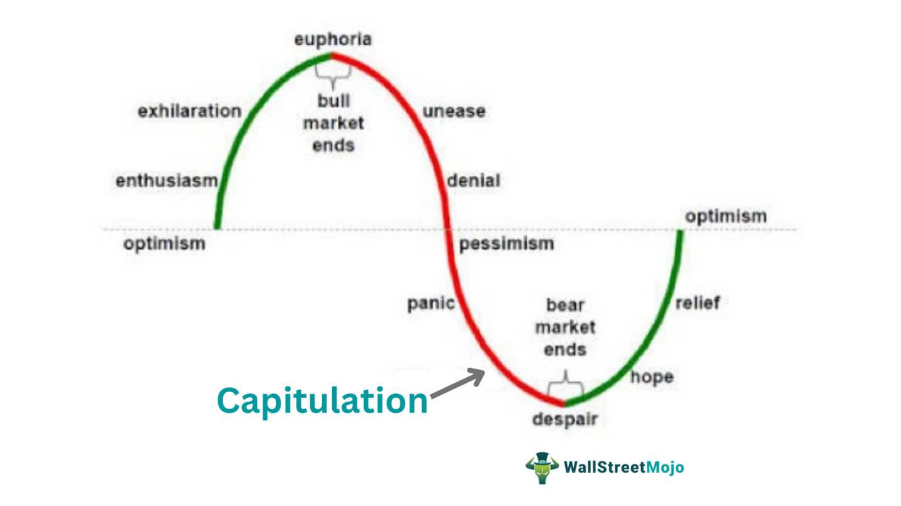

In recent years, the integration of psychology and finance has developed into a comprehensive study within the field of behavioral finance. This interdisciplinary approach seeks to understand and explain the emotional and cognitive factors that influence market decisions. Behavioral finance challenges the traditional notion of markets operating efficiently based solely on rational evaluations, instead highlighting the significant impact of psychological responses on financial markets.

Algorithmic trading, which involves using computer algorithms to execute trades at high speed and precision, provides an effective mechanism for utilizing these behavioral insights. By analyzing vast datasets at lightning speed, algorithmic trading systems can identify and exploit short-term market inefficiencies that arise from human psychological behaviors.



A key aspect of this study involves examining the phenomenon of overreaction in markets. Overreaction occurs when prices of securities significantly deviate from their intrinsic values due to investors' exaggerated responses to new information. These exaggerated responses are often driven by cognitive biases, such as fear and greed, leading to situations where securities become overbought or oversold.

This article examines how psychological responses and behavioral analysis influence overreaction in algorithmic trading strategies. It explores fundamental principles controlling overreaction, the impact of cognitive biases, and how algorithmic models can be tailored to identify and leverage these inefficiencies in the market. By understanding these aspects, traders can develop more sophisticated and adaptive trading strategies.

## Table of Contents

## Understanding the Overreaction Phenomenon

An overreaction in financial markets describes a scenario wherein security prices are significantly influenced by new information, leading the assets to become considerably overbought or oversold. This phenomenon is frequently analyzed through the lens of behavioral finance, which attributes such market movements to cognitive and emotional biases inherent in investor behavior. These biases, notably fear and greed, may skew rational assessments and decision-making, causing investors to react disproportionately to new data and resulting in price anomalies.

Market bubbles and crashes serve as quintessential examples of extreme overreactions. During a bubble, investor exuberance and overly optimistic projections drive prices to unsustainable levels. Conversely, during a crash, panic and pessimism cause prices to plummet beyond intrinsic values. These events illustrate how collective psychological biases can magnify price movements, deviating from fundamental valuations.

The efficient market hypothesis (EMH), a central tenet in traditional finance theory, posits that asset prices reflect all available information at any given time, implying that overreactions are unlikely in well-functioning markets. However, empirical studies in behavioral finance challenge this notion by demonstrating that investors are not always rational actors. For instance, the work by De Bondt and Thaler (1985) on stock market overreaction showed how subsequent price reversals often follow excessive market reactions, suggesting that cognitive biases play a pivotal role in these dynamics.

Such insights create potential opportunities for traders and investors. By recognizing these non-rational behaviors and incorporating behavioral phenomena into their strategies, market participants can exploit the inefficiencies created by overreactions. Evolution in trading strategies, spurred by advancements in behavioral finance, provides traders with tools to predict and respond appropriately to these fleeting price inefficiencies. Hence, understanding overreaction is not only central to explaining past market occurrences but is also vital for developing strategies to capitalize on these moments of irrational exuberance or unwarranted panic.

## Cognitive Biases in Overreaction

Cognitive biases play a pivotal role in market overreactions, affecting how investors interpret and respond to information. Overconfidence, confirmation bias, and herd behavior are among the most influential biases impacting trading decisions and security pricing.

Overconfidence bias refers to investors' unwarranted belief in their judgment or market predictions. This bias often leads them to underestimate risks and overvalue their knowledge, resulting in excessive trading and erroneous evaluations of asset prices. Investors may assume that their analysis is superior to others', causing them to disregard signals that contradict their beliefs. Overconfidence can thus foster an environment where security prices deviate significantly from their intrinsic values.

Confirmation bias is another cognitive distortion that influences investor behavior. This bias occurs when individuals seek out or give undue weight to information that supports their pre-existing views, while neglecting contrary evidence. In trading, this can result in skewed assessments of a stock's value or market trends, perpetuating incorrect investment strategies. Confirmation bias may lead traders to hold onto losing positions under the mistaken belief that the market will align with their expectations over time.

Herd behavior, driven by the innate human tendency to conform to the actions of a larger group, can exacerbate market overreactions. In volatile markets, investors may mimic the trades of others, assuming that the collective wisdom of the crowd guides their actions. This can amplify price movements, causing securities to become excessively overbought or oversold. Herd behavior undermines rational decision-making, as it prompts investors to prioritize group dynamics over individual analysis and objective assessment.

These cognitive biases manifest in trading environments through various patterns that influence security pricing. For instance, during a market bubble, overconfidence can inflate asset prices beyond their fundamental values, as investors collectively overestimate the prospects of continued price increases. Conversely, during a market crash, confirmation bias and herd behavior can contribute to panic selling, driving prices well below their fundamental worth.

Understanding these biases allows traders to recognize patterns of overreaction and adjust their strategies accordingly. Incorporating behavioral analysis into [algorithmic trading](/wiki/algorithmic-trading) models aids in anticipating such overreactions, thereby enabling the mitigation of potentially adverse effects on investment portfolios.

## Behavioral Analysis in Algorithmic Trading

Algorithmic trading harnesses mathematical models and automated systems to execute trades with remarkable precision and speed. These systems operate based on predefined criteria, allowing for minimal human intervention and the ability to process vast amounts of data swiftly. By integrating behavioral analysis into these algorithms, traders are increasingly capable of anticipating and capitalizing on market conditions influenced by cognitive biases, such as overreaction.

Harnessing behavioral insights in algorithmic trading involves understanding how psychological biases influence market dynamics and subsequently incorporating this understanding into trading models. Behavioral analysis aims to identify patterns of mispricing caused by investor psychology, enabling traders to devise strategies that exploit these temporary inefficiencies.

Two primary strategies used in this context are mean reversion and [momentum](/wiki/momentum) trading. Mean reversion strategy is predicated on the principle that excessive market reactions often lead to prices deviating significantly from their intrinsic value or long-term average. The assumption is that prices will eventually revert to their mean. Traders employing this strategy typically look for opportunities to buy assets that appear undervalued due to overreaction or sell those that seem overvalued. The algorithm identifies statistical anomalies in price movements and executes trades automatically when predetermined conditions are met. The formula for mean reversion can be represented as:

$$
\text{Signal} = \frac{P_t - \mu}{\sigma}
$$

where $P_t$ is the current price, $\mu$ is the historical mean price, and $\sigma$ is the standard deviation of historical prices. A positive signal indicates overvaluation, while a negative signal suggests undervaluation.

Momentum trading, on the other hand, differs fundamentally. It capitalizes on the continuation of existing market trends rather than assuming a return to a historical mean. This strategy assumes that assets currently experiencing strong performance will continue to perform well in the near term, driven by trends that are reinforced by investor behavior. Algorithms implementing momentum strategies analyze historical price and [volume](/wiki/volume-trading-strategy) data to identify ongoing trends, executing trades in the direction of the trend until a reversal signal is detected. 

Furthermore, advancements in natural language processing (NLP) and [machine learning](/wiki/machine-learning) are being used to perform sentiment analysis on news articles, social media, and other textual data sources. By gauging investor sentiment, trading algorithms can ascertain potential market movements that traditional technical indicators might overlook. For example, an algorithm may scan news headlines to detect an emerging positive sentiment towards a specific stock, prompting a momentum-based purchase before the broader market adjusts.

The integration of behavioral analysis into algorithmic trading is an evolving field, with significant potential for enhancing trading strategies. By recognizing and exploiting market inefficiencies induced by human cognitive biases, traders can develop sophisticated models that adapt to the ever-changing financial landscape.

## Algorithmic Trading Strategies Exploiting Overreaction

Algorithmic trading strategies that exploit market overreactions leverage quantitative models to identify and trade on temporary mispricings of securities. These strategies are built on the premise that security prices will either revert to a mean or continue trending in response to behavioral inconsistencies driven by investor sentiment.

**Mean Reversion Strategy**

Mean reversion strategies are predicated on the statistical phenomenon where the price of a security tends to move back to its average value over time. The central concept is that prices deviating significantly from their historical average are likely to revert. Traders utilizing this strategy will identify oversold securities (those priced below their average) as buy opportunities and overbought securities (those priced above their average) as shorting opportunities. 

In practical terms, implementing a mean reversion strategy involves calculating moving averages or other statistical measures [such as Bollinger Bands] to determine the extent of deviation. The formula for a simple moving average, which can be used in such strategies, is as follows:

$$
\text{SMA}_n = \frac{1}{n} \sum_{i=0}^{n-1} P_{t-i}
$$

where $P_t$ is the price at time $t$ and $n$ is the window length.

**Momentum Trading Strategy**

Momentum trading strategies, on the other hand, capitalize on the persistence of existing market trends. While mean reversion anticipates reversal, momentum trading profits from continuation. These strategies are effective when markets are trending due to overreactions that lead to prolonged price movements. 

To execute momentum trading, traders often rely on indicators such as moving average convergence divergence (MACD) or relative strength index (RSI). The basic premise is to buy securities with upward trending prices and sell those with downward momentum. In this context, momentum can be calculated with a simple formula such as:

$$
\text{Momentum} = P_t - P_{t-n}
$$

where $P_t$ is the current price and $P_{t-n}$ is the price $n$ periods ago.

**Sentiment Analysis**

An advanced method of exploiting market overreactions is sentiment analysis, which uses natural language processing (NLP) and machine learning techniques to assess the mood or sentiment of investors based on textual data from news articles, social media, and other sources. By quantifying sentiment, algorithmic traders can predict market directions driven by collective emotional states ahead of price movements.

An example of a Python implementation for sentiment analysis might involve the use of libraries such as NLTK or TextBlob to process and classify text data for positive or negative sentiment. Additionally, machine learning models like logistic regression or neural networks can be trained on historical data to enhance predictive accuracy.

```python
from textblob import TextBlob

def analyze_sentiment(text):
    analysis = TextBlob(text)
    if analysis.sentiment.polarity > 0:
        return 'positive'
    elif analysis.sentiment.polarity < 0:
        return 'negative'
    else:
        return 'neutral'

sentiment = analyze_sentiment("The company's future looks bright after recent advancements in technology.")
print(sentiment)  # Output: positive
```

By integrating sentiment analysis into trading algorithms, traders gain a substantial edge in predicting how investor emotions will affect market behavior, allowing them to time their trades more effectively to capture potential overreactions.

## Risks and Challenges in Behavioral Algorithmic Trading

Exploiting overreactions in algorithmic trading can be profitable, yet it presents several significant challenges. One critical issue is the accurate timing of the market. Due to the complex and often unpredictable nature of financial markets, determining the optimal moments to enter or [exit](/wiki/exit-strategy) trades is inherently challenging. Algorithms designed to exploit overreactions must be fine-tuned continuously as market dynamics change. Additionally, transaction costs can erode potential profits, especially in high-frequency trading scenarios where the number of trades is substantial.

Human psychology's adaptive nature necessitates that models must be continuously updated and validated against new data. Psychological responses and behaviors evolve over time, influenced by a plethora of factors, including economic conditions, news cycles, and prevailing market sentiments. Consequently, algorithms that incorporate behavioral insights must adapt to these changes to maintain their effectiveness. This requires a robust framework for model validation, ensuring that strategies remain relevant in the face of evolving market conditions.

Furthermore, changing market conditions can significantly impact the performance of trading strategies based on behavioral analysis. Events such as economic downturns, geopolitical tensions, or changes in monetary policy can alter market sentiments and, consequently, the effectiveness of algorithms relying on these insights. Therefore, robust risk management practices are crucial to mitigating these risks. This involves setting parameters for stop-loss orders, diversifying trading portfolios, and continuously monitoring algorithm performance to adjust strategies as needed.

In practice, implementing these strategies may involve using technologies such as machine learning and natural language processing (NLP) to analyze vast amounts of data efficiently. For example, sentiment analysis tools can be developed in Python using libraries such as TensorFlow or PyTorch to process and interpret data from social media, news, and other sources to gauge market sentiment. However, it's essential to remain cautious about overfitting models to historical data, as this can reduce their adaptability to future market conditions.

In conclusion, while the integration of behavioral insights into algorithmic trading holds promise, it requires careful consideration of these associated risks and challenges. Adapting to psychological and market changes, managing transaction costs, and employing effective risk management strategies are vital components for success in this domain. Continuous technological advancements will be instrumental in refining these approaches for better exploitation of market inefficiencies.

## Conclusion

The integration of psychological responses and behavioral analysis into algorithmic trading represents a powerful tool for navigating the financial markets. By leveraging insights from behavioral finance, traders can align their strategies with the underlying psychological dynamics that often influence market movements. Recognizing and understanding human cognitive biases, such as overconfidence and herd behavior, enables the development of more informed and adaptable trading strategies. These biases can be systematically incorporated into algorithms, creating opportunities to exploit market inefficiencies.

Algorithmic trading, with its capacity for rapid analysis and execution, provides an effective platform for implementing such strategies. By continuously adapting to new data and market conditions, these algorithms can more accurately predict and respond to trends driven by investor sentiment and psychological factors. This adaptability is crucial, given the evolving nature of financial markets and the complex interplay of behavioral influences.

As technological advancements continue to evolve, the potential for even more sophisticated behavioral analysis in algorithmic trading will grow. Machine learning, natural language processing, and [artificial intelligence](/wiki/ai-artificial-intelligence) are at the forefront of these developments, enhancing the ability of algorithms to interpret and act on market signals rooted in human psychology. These innovations hold promise for refining trading strategies further, making them more adept at identifying and capitalizing on market overreactions and other inefficiencies.

In conclusion, by integrating behavioral insights and acknowledging the psychological elements of trading, market participants can enhance their strategy formulation and execution. This approach not only improves the precision of trading decisions but also offers the potential for increased returns. As the fields of technology and behavioral finance continue to advance, they will likely present new avenues for understanding and engaging with the financial markets, paving the way for more robust and effective trading models.

## References & Further Reading

[1]: De Bondt, W. F. M., & Thaler, R. (1985). ["Does the Stock Market Overreact?"](https://onlinelibrary.wiley.com/doi/full/10.1111/j.1540-6261.1985.tb05004.x) The Journal of Finance, 40(3), 793-805.

[2]: Barberis, N., & Thaler, R. (2003). ["A Survey of Behavioral Finance"](https://www.nber.org/papers/w9222) in Handbook of the Economics of Finance.

[3]: "Advances in Financial Machine Learning" by Marcos Lopez de Prado. [Link](https://www.amazon.com/Advances-Financial-Machine-Learning-Marcos/dp/1119482089)

[4]: "Evidence-Based Technical Analysis: Applying the Scientific Method and Statistical Inference to Trading Signals" by David Aronson. [Link](https://www.amazon.com/Evidence-Based-Technical-Analysis-Scientific-Statistical/dp/0470008741)

[5]: Jansen, S. (2020). "Machine Learning for Algorithmic Trading: Predictive models to extract signals from market and alternative data for systematic trading strategies in Python." [Link](https://www.amazon.com/Machine-Learning-Algorithmic-Trading-alternative/dp/1839217715)

[6]: "Quantitative Trading: How to Build Your Own Algorithmic Trading Business" by Ernest P. Chan. [Link](https://www.amazon.com/Quantitative-Trading-Build-Algorithmic-Business/dp/1119800064)

[7]: Tsai, C. F., & Wu, T. L. (2010). ["Using neural network ensembles for predicting stock trends"](https://www.sciencedirect.com/science/article/pii/S0957417407001558) in Expert Systems with Applications.