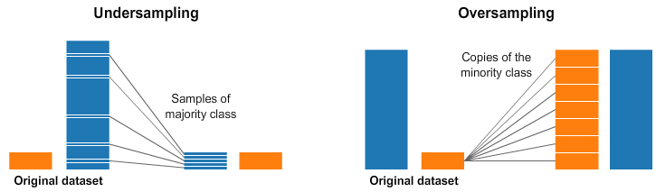

## Table of Contents

## What is oversampling in the context of machine learning?

Oversampling is a technique used in machine learning to address the problem of imbalanced datasets. When a dataset has an unequal distribution of classes, with one class having significantly fewer examples than others, it can lead to biased models that perform poorly on the minority class. Oversampling helps by increasing the number of instances in the minority class, bringing the dataset closer to balance. This is often done by duplicating existing minority class examples or generating new synthetic examples.

One common method of oversampling is the Synthetic Minority Over-sampling Technique (SMOTE). SMOTE works by creating synthetic examples of the minority class. It does this by selecting a minority class instance and finding its k nearest neighbors from the same class. Then, it creates new instances by interpolating between the selected instance and its neighbors. This approach helps to avoid overfitting that might occur from simply duplicating existing examples, as it introduces new, slightly varied data points to the dataset.

By using oversampling techniques like SMOTE, machine learning models can be trained on a more balanced dataset, potentially improving their ability to correctly classify instances from the minority class. However, it's important to use these techniques carefully, as they can sometimes lead to overfitting if not properly managed. Additionally, the effectiveness of oversampling can vary depending on the specific dataset and problem at hand, so it's often beneficial to experiment with different approaches to find the best solution.

## Why is oversampling used in machine learning?

Oversampling is used in machine learning to help fix a problem where the data is not balanced. Imagine you have a dataset where one type of data, let's call it the minority class, has a lot fewer examples than the other types. If you train a machine learning model on this data, it might not learn well about the minority class because it sees fewer examples of it. Oversampling helps by adding more examples of the minority class, making the dataset more balanced. This way, the model can learn better about all types of data, not just the ones with lots of examples.

One popular way to do oversampling is called SMOTE, which stands for Synthetic Minority Over-sampling Technique. SMOTE doesn't just copy the existing examples of the minority class. Instead, it creates new, similar examples by mixing the features of existing minority class examples. This can help the model learn without just repeating the same data over and over. By using oversampling, the model can perform better on the minority class, which is really important in fields like medicine or fraud detection, where missing a rare event can be very costly.

## What are the common scenarios where oversampling is applied?

Oversampling is often used in situations where the data is not evenly split between different categories. For example, in medical diagnosis, diseases like cancer might be much less common than non-cancer cases. If a [machine learning](/wiki/machine-learning) model is trained on this data without any adjustments, it might miss the cancer cases because it sees so few of them. By using oversampling, more examples of cancer cases are added to the dataset, helping the model learn to recognize these important but rare cases better.

Another common scenario where oversampling is applied is in fraud detection. Fraudulent transactions are typically much rarer than normal ones, making it hard for models to spot them. Oversampling helps by creating more examples of fraudulent transactions, allowing the model to learn the patterns of fraud more effectively. This can lead to better detection rates, which is crucial for protecting against financial losses.

In both of these cases, oversampling helps to balance the dataset, making it easier for the model to learn about all categories, not just the most common ones. This technique can be applied using methods like SMOTE, which creates new examples of the minority class by mixing features of existing ones, helping to avoid overfitting while improving model performance.

## How does oversampling differ from undersampling?

Oversampling and undersampling are two ways to fix the problem of having too few examples of some types of data in a machine learning dataset. Oversampling means adding more examples of the less common type, called the minority class. This can be done by copying the existing examples or creating new ones that are similar. For example, if you're trying to detect a rare disease, oversampling would add more examples of people with the disease to help the model learn better. A common method for this is called SMOTE, which makes new examples by mixing features of the existing ones.

On the other hand, undersampling means removing examples from the more common type, called the majority class. This reduces the total number of examples but makes the dataset more balanced. For instance, if you're looking at credit card transactions and most are normal but a few are fraudulent, undersampling would remove some of the normal transactions to balance the dataset. Both methods aim to help the machine learning model perform better on the minority class, but they do it in opposite ways: oversampling adds data, while undersampling takes it away.

Choosing between oversampling and undersampling depends on the situation. If you have a small dataset and can't afford to lose any data, oversampling might be better. But if you have a large dataset and losing some majority class examples won't hurt, undersampling could work well. Sometimes, people even use both methods together to get the best results. The goal is always to help the model learn more fairly about all types of data, so it can make better predictions.

## What are the basic techniques used for oversampling?

Oversampling is a way to help machine learning models learn better from data where some types are rare. One simple technique is just copying the existing examples of the rare type, called the minority class. For example, if you're trying to detect a rare disease and only have a few cases, you might copy those cases to have more to work with. This can help the model learn about the disease better, but it might also make the model too focused on the exact examples it's seen, which is called overfitting.

Another technique for oversampling is called SMOTE, which stands for Synthetic Minority Over-sampling Technique. Instead of just copying the existing examples, SMOTE creates new ones by mixing features of the minority class examples. Imagine you have a few examples of a rare disease. SMOTE would take these examples and create new ones that are similar but not exactly the same, helping the model learn about the disease without just repeating the same data. This can be a good way to avoid overfitting while still giving the model more to learn from.

Both of these techniques aim to balance the dataset so the machine learning model can learn about all types of data, not just the common ones. Choosing the right technique depends on the specific problem and dataset. Sometimes, a mix of copying and creating new examples might work best, helping the model perform better on the rare types of data it needs to learn about.

## Can you explain the Random Oversampling technique?

Random Oversampling is a simple way to help machine learning models learn better from data where some types are rare. It works by copying the examples of the rare type, called the minority class, until there are more of them. For example, if you're trying to detect a rare disease and only have a few cases, you might copy those cases to have more to work with. This helps the model see more examples of the disease, making it easier to learn about it. But, there's a downside: if you copy the same examples too much, the model might get too focused on those exact examples and not learn well about new ones, which is called overfitting.

To use Random Oversampling, you don't need any special formulas or code. You just need to count how many examples you have of each type and then copy the minority class examples until the numbers are more even. For instance, if you have 100 examples of the common type and only 10 of the rare type, you might copy the rare type examples to get 50 or even 100 of them. This way, the model gets a more balanced dataset to learn from, which can help it perform better on the rare type of data it needs to recognize.

## What is SMOTE and how does it work?

SMOTE, which stands for Synthetic Minority Over-sampling Technique, is a way to help machine learning models learn better from data where some types are rare. It works by creating new examples of the rare type, called the minority class, instead of just copying the existing ones. Imagine you have a few examples of a rare disease. SMOTE would take these examples and create new ones that are similar but not exactly the same. This helps the model learn about the disease without just repeating the same data, which can make the model too focused on the exact examples it's seen, a problem called overfitting.

To create these new examples, SMOTE looks at each minority class example and finds its nearest neighbors from the same class. Then, it picks one of these neighbors and creates a new example by mixing the features of the original example and the neighbor. For example, if the original example has features $$x_1, x_2, ..., x_n$$ and the neighbor has features $$y_1, y_2, ..., y_n$$, SMOTE might create a new example with features $$z_i = x_i + \text{random}(0, 1) \times (y_i - x_i)$$ for each feature $$i$$. This way, SMOTE helps balance the dataset so the machine learning model can learn about all types of data, not just the common ones, without overfitting.

## How does ADASYN improve upon SMOTE?

ADASYN, which stands for Adaptive Synthetic Sampling, is a way to help machine learning models learn better from data where some types are rare. It improves on SMOTE by focusing more on the examples that are harder for the model to learn. While SMOTE creates new examples by mixing features of all minority class examples equally, ADASYN pays more attention to the minority class examples that are often misclassified. This means ADASYN creates more new examples around these harder-to-learn cases, helping the model learn better about them.

To do this, ADASYN first looks at how well the model does on the minority class examples. It then calculates how many new examples to create for each minority class example based on how often it's misclassified. If an example is misclassified a lot, ADASYN will create more new examples around it. For example, if an original example has features $$x_1, x_2, ..., x_n$$ and a neighbor has features $$y_1, y_2, ..., y_n$$, ADASYN might create a new example with features $$z_i = x_i + \text{random}(0, 1) \times (y_i - x_i)$$ for each feature $$i$$, but it will do this more often for the harder examples. This way, ADASYN helps the model focus on learning the parts of the data that are most challenging, which can lead to better performance overall.

## What are the potential drawbacks of using oversampling techniques?

Oversampling can make a machine learning model learn better about the rare types of data, but it also has some problems. One big problem is that it might make the model too focused on the examples it's seen, which is called overfitting. When you copy or create new examples of the rare type, the model might start to think those exact examples are more important than they really are. This can make the model not work as well when it sees new, different examples of the rare type. Also, if you create too many new examples, the model might start to see patterns that aren't really there, which can lead to bad predictions.

Another issue with oversampling is that it can make the dataset bigger, which can slow down the training process. If you're using a technique like SMOTE to create new examples, it can take a lot of time and computer power to make all those new examples. This can be a problem if you're working with a big dataset or if you don't have a lot of computing resources. Plus, if you're not careful, oversampling might not help as much as you hope. Sometimes, even after oversampling, the model might still have trouble learning about the rare types of data, especially if the new examples aren't very different from the old ones.

## How can one evaluate the effectiveness of oversampling in a model?

To evaluate how well oversampling works in a machine learning model, you can look at how the model performs on the rare type of data, called the minority class. One way to do this is by checking the model's accuracy, precision, recall, and F1 score. Accuracy tells you how often the model is right overall, but it might not be the best measure if the rare type of data is very rare. Precision shows how many of the model's positive predictions for the rare type are actually right. Recall shows how many of the actual rare type examples the model finds. The F1 score is a mix of precision and recall, giving you a good overall idea of how well the model does on the rare type. If these measures get better after oversampling, it means the technique is helping.

Another way to check if oversampling is working is by using cross-validation. This means splitting your data into different parts and testing the model on each part to see how it does. By doing this, you can make sure that the model's better performance on the rare type of data isn't just because of the specific examples you used for oversampling. If the model does better on the rare type across all the different parts of the data, then you know oversampling is really helping. You can also compare the model's performance before and after oversampling to see the difference it makes. If the model does better after oversampling, it's a sign that the technique is effective.

## What advanced oversampling methods are used in imbalanced datasets?

Advanced oversampling methods like ADASYN and Borderline-SMOTE go beyond basic techniques like SMOTE to help machine learning models learn better from imbalanced datasets. ADASYN, or Adaptive Synthetic Sampling, focuses on the minority class examples that are harder for the model to learn. It creates more new examples around these harder-to-learn cases by calculating how often they're misclassified and then generating new examples based on that. For instance, if an original example has features $$x_1, x_2, ..., x_n$$ and a neighbor has features $$y_1, y_2, ..., y_n$$, ADASYN might create a new example with features $$z_i = x_i + \text{random}(0, 1) \times (y_i - x_i)$$ for each feature $$i$$, but it does this more often for the harder examples. This way, ADASYN helps the model focus on learning the parts of the data that are most challenging, which can lead to better performance overall.

Borderline-SMOTE is another advanced method that improves on SMOTE by focusing on the examples that are near the decision boundary between the minority and majority classes. These borderline examples are the ones that are most likely to be misclassified, so creating new examples around them can help the model learn better. Borderline-SMOTE works by identifying these borderline examples and then using a similar process to SMOTE to generate new examples, but only around these key cases. This targeted approach can help the model better distinguish between the classes and improve its performance on the minority class. Both ADASYN and Borderline-SMOTE aim to make the model more effective by addressing the specific challenges posed by imbalanced datasets.

## How can oversampling be integrated into a machine learning pipeline?

Oversampling can be easily added to a machine learning pipeline to help the model learn better from data where some types are rare. You start by splitting your data into training and testing sets. Then, before training the model, you apply the oversampling technique to the training set. For example, if you're using SMOTE, you would create new examples of the rare type by mixing features of the existing ones. If an original example has features $$x_1, x_2, ..., x_n$$ and a neighbor has features $$y_1, y_2, ..., y_n$$, SMOTE might create a new example with features $$z_i = x_i + \text{random}(0, 1) \times (y_i - x_i)$$ for each feature $$i$$. After oversampling, you train your model on the balanced dataset and then test it on the original test set to see how well it performs.

To make this process easier, you can use libraries like `imbalanced-learn` in Python, which has tools for oversampling. Here's a simple example of how you might add SMOTE to your pipeline:

```python
from sklearn.model_selection import train_test_split
from sklearn.ensemble import RandomForestClassifier
from imblearn.over_sampling import SMOTE
from sklearn.metrics import classification_report

# Split the data into training and testing sets
X_train, X_test, y_train, y_test = train_test_split(X, y, test_size=0.2, random_state=42)

# Apply SMOTE to the training data
smote = SMOTE(random_state=42)
X_train_resampled, y_train_resampled = smote.fit_resample(X_train, y_train)

# Train the model on the resampled data
model = RandomForestClassifier()
model.fit(X_train_resampled, y_train_resampled)

# Evaluate the model on the original test set
y_pred = model.predict(X_test)
print(classification_report(y_test, y_pred))
```

This way, oversampling becomes a part of your regular machine learning workflow, helping your model learn about all types of data, not just the common ones.

## References & Further Reading

[1]: Chawla, N. V., Bowyer, K. W., Hall, L. O., & Kegelmeyer, W. P. (2002). ["SMOTE: Synthetic Minority Over-sampling Technique."](https://arxiv.org/abs/1106.1813) Journal of Artificial Intelligence Research, 16, 321-357.

[2]: He, H., & Garcia, E. A. (2009). ["Learning from Imbalanced Data."](https://ieeexplore.ieee.org/document/5128907) IEEE Transactions on Knowledge and Data Engineering, 21(9), 1263-1284.

[3]: Han, H., Wang, W., & Mao, B. H. (2005). ["Borderline-SMOTE: A New Over-Sampling Method in Imbalanced Data Sets Learning."](https://link.springer.com/chapter/10.1007/11538059_91) In: Huang, D.S., Zhang, X.P., Huang, G.B. (eds) Advances in Intelligent Computing. ICIC 2005. 

[4]: Bunkhumpornpat, C., Sinapiromsaran, K., & Lursinsap, C. (2009). ["Safe-Level-SMOTE: Safe-Level-Synthetic Minority Over-Sampling Technique for Handling the Class Imbalanced Problem."](https://link.springer.com/chapter/10.1007/978-3-642-01307-2_43) In: Theeramunkong, T., Kijsirikul, B., Cercone, N., Ho, T.B. (eds) Advances in Knowledge Discovery and Data Mining. PAKDD 2009.

[5]: Haibo He, Yang Bai, Edwardo A. Garcia, and Shutao Li. (2008). ["ADASYN: Adaptive Synthetic Sampling Approach for Imbalanced Learning."](https://ieeexplore.ieee.org/document/4633969) In Proceedings of the 2008 IEEE International Joint Conference on Neural Networks (IEEE World Congress on Computational Intelligence), 1322-1328. 

[6]: Fernández, A., García, S., Galar, M., Prati, R. C., Krawczyk, B., & Herrera, F. (2018). ["Learning from Imbalanced Data Sets."](https://link.springer.com/book/10.1007/978-3-319-98074-4) Springer International Publishing.