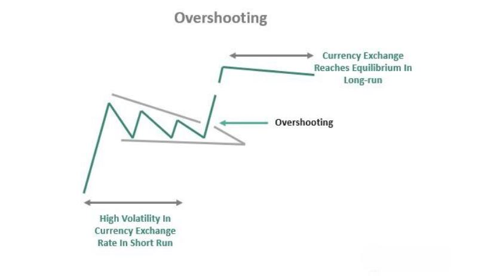

Exchange rates play a crucial role in global economics, acting as a barometer for cross-border trade and investment, influencing economic growth, price stability, and financial stability. These rates reflect the relative value of one currency against another and are influenced by various factors including inflation rates, interest rates, and political stability. A fundamental understanding of exchange rate dynamics is vital for policymakers, businesses, and investors who operate in a globalized economy.

The concept of overshooting in exchange rate economics is pivotal in understanding short-term volatility in currency markets. The overshooting hypothesis, formulated by economist Rudi Dornbusch in 1976, proposes that exchange rates may temporarily exceed their long-term equilibrium value due to changes in monetary policy or economic conditions. This phenomenon is typically caused by the sluggish adjustment of goods prices compared to financial markets, leading to an initial overreaction in currency values before a gradual return to equilibrium. Understanding overshooting is essential for currency traders and policymakers as it impacts decision-making and strategies in managing economic stability.



Algorithmic trading, the use of computer algorithms to automate trading decisions, has significantly influenced currency markets. Algorithms are designed to execute trades based on predefined parameters and can respond to market changes within milliseconds. This technology-driven approach to trading can increase market efficiency but also introduces complexities such as increased volatility and the risk of market manipulation. Machine learning and high-frequency trading have become integral, with algorithms constantly evolving to adapt to market conditions.

The purpose of this article is to integrate these complex topics—exchange rates, overshooting, and algorithmic trading—and highlight their interconnections. By examining the interactions among these elements, we aim to provide insight into the contemporary currency market landscape. This is crucial as the economic environment is increasingly influenced by technological advancements and macroeconomic policies.

Understanding these dynamics is paramount, not only for participants in financial markets but also for policymakers and economists. As currency markets become more interconnected and influenced by rapid technological changes, recognizing the interplay between exchange rates and trading mechanisms is essential for developing robust economic and financial strategies. This article seeks to underscore the importance of these elements and encourage further exploration and research in this ever-evolving field.

## Table of Contents

## Understanding Exchange Rates

Exchange rates, often referred to as the price of one currency in terms of another, are a fundamental aspect of the global financial system, facilitating international trade and investment. These rates are typically expressed as a ratio or a pair, such as USD/EUR, which indicates how many US dollars are required to purchase one Euro.

Several factors influence exchange rates, including inflation, interest rates, and political stability. Inflation, the general increase in prices, erodes the purchasing power of a currency. A country with a consistently high inflation rate tends to see its currency depreciate relative to the currencies of countries with lower inflation rates. For instance, if the US experiences higher inflation than the Eurozone, the USD is likely to depreciate against the EUR.

Interest rates, controlled by a nation's central bank, also play a significant role. Higher interest rates offer lenders in an economy a higher return relative to other countries. Therefore, higher interest rates attract foreign capital, causing the exchange rate to appreciate, assuming other factors remain constant. The relationship between interest rates and exchange rates can be illustrated through the [interest rate](/wiki/interest-rate-trading-strategies) parity theory, which suggests that differential interest rates between two countries will be offset by changes in the exchange rate:

$$
\frac{1 + i_{\text{domestic}}}{1 + i_{\text{foreign}}} = \frac{E_{\text{expected}}}{E_{\text{current}}}
$$

Where $i_{\text{domestic}}$ and $i_{\text{foreign}}$ are the domestic and foreign interest rates, respectively, and $E_{\text{expected}}$ and $E_{\text{current}}$ are the expected future and current exchange rates.

Political stability and economic performance are crucial as well. Countries with less risk to political and economic stability are more attractive to foreign investors, increasing demand for the stable country’s currency and potentially appreciating its exchange rate. Conversely, political turmoil or economic uncertainty can lead to depreciation.

Exchange rates significantly impact international trade and investment by affecting the relative price of goods between countries. A stronger domestic currency makes imports cheaper and exports more expensive, potentially leading to a trade deficit. Conversely, a weaker domestic currency has the opposite effect, making exports cheaper and imports more expensive, potentially improving trade balances.

Central banks and governments play a pivotal role in managing exchange rates. They may intervene directly in the currency markets by buying or selling currencies to stabilize or induce movement in the exchange rate, often termed as '[forex](/wiki/forex-system) intervention'. Additionally, through monetary policy tools such as altering interest rates and setting reserve requirements, central banks influence exchange rates indirectly. Some countries adopt specific exchange rate regimes like fixed, floating, or pegged systems, to achieve economic objectives. For instance, China's managed float system allows for controlled flexibility to ensure stable trade conditions.

In summary, understanding the mechanics of exchange rates and their influencing factors is essential for comprehending global economic dynamics and the interplay of international trade and investment.

## The Economics of Overshooting

The overshooting hypothesis is a concept in international finance that explains the short-term [volatility](/wiki/volatility-trading-strategies) of exchange rates following a change in monetary policy. Formulated by economist Rudiger Dornbusch in 1976, the hypothesis posits that exchange rates tend to "overshoot" their long-run equilibrium levels in response to changes in monetary policy, such as adjustments in interest rates or money supply.

Overshooting occurs when an immediate change in monetary policy leads to a disproportionate effect on exchange rates. Suppose a central bank unexpectedly raises interest rates. According to the overshooting hypothesis, the immediate effect will be an excessive appreciation of the domestic currency, beyond its long-term equilibrium value. This overreaction occurs because capital flows quickly adjust to the interest rate change, while goods prices and wages, due to their sticky nature, adjust more slowly. Over time, as prices begin to adjust, the exchange rate gradually moves back to its long-term path.

This phenomenon can be mathematically represented using the Dornbusch model. In this model, the exchange rate $E$ is determined by the formula:

$$
E = P \times \left( \frac{i - i^*}{\pi - \pi^*} \right)^{\phi}
$$

where $P$ is the price level, $i$ and $i^*$ are domestic and foreign interest rates respectively, $\pi$ and $\pi^*$ are domestic and foreign inflation rates, and $\phi$ is a factor representing the speed of price adjustment. This formula highlights the roles of interest rates and inflation differentials in determining exchange rates and their potential for overshooting.

The implications of overshooting are significant for currency traders and policymakers. For traders, sudden and pronounced exchange rate fluctuations present both risks and opportunities for profit. Those who can predict or quickly react to these changes can capitalize on short-term currency movements. However, the uncertainty associated with overshooting also increases the risk of substantial financial loss.

Policymakers must consider the potential for overshooting when enacting monetary policy. Unanticipated adjustments can destabilize markets and disrupt economic planning and international trade. Effective communication and gradual policy changes can help mitigate these adverse effects.

Historical instances of overshooting are well-documented. A notable example is the reaction of exchange rates following the Federal Reserve's tight monetary policy in the early 1980s. The unexpected increase in U.S. interest rates led to a rapid appreciation of the U.S. dollar, followed by a gradual return to more stable levels. Similar patterns were observed during the European Exchange Rate Mechanism crisis in the early 1990s.

In conclusion, understanding the dynamics of the overshooting hypothesis is essential for navigating the complexities of currency markets and monetary policy. The hypothesis provides a framework for anticipating how changes in economic policy can lead to temporary misalignments in exchange rates, with far-reaching implications for global trade and investment.

## Algorithmic Trading and Its Impact on Exchange Rates

Algorithmic trading is a method of executing orders using automated and pre-programmed trading instructions to account for variables such as time, price, and [volume](/wiki/volume-trading-strategy). This technique relies on algorithms, which are sets of rules and instructions executed by computers to perform tasks in the financial markets. These algorithms can process vast quantities of data at speeds unmatched by human traders, enabling the efficient execution of trades.

Algorithms in trading are employed to predict and respond to currency fluctuations by analyzing historical data and recognizing patterns. For instance, if an algorithm detects a consistent pattern when a certain economic indicator is released, it can execute a trade before human traders can even react. The implementation of algorithms allows for strategies such as [trend following](/wiki/trend-following), statistical [arbitrage](/wiki/arbitrage), and [market making](/wiki/market-making), each designed to leverage specific market conditions and inefficiencies.

The benefits of [algorithmic trading](/wiki/algorithmic-trading) include improved market [liquidity](/wiki/liquidity-risk-premium), reduced transaction costs, and enhanced speed and accuracy in trade execution. Automated systems eliminate the emotional biases of human trading, allowing for more objective decision-making. However, algorithmic trading also introduces risks, such as the potential for significant market disruptions caused by faulty algorithms or power outages. The infamous "Flash Crash" of 2010 illustrated how the rapid selling triggered by algorithms could lead to substantial market upheaval.

High-frequency trading ([HFT](/wiki/high-frequency-trading-strategies)) is a subset of algorithmic trading characterized by executing a large number of orders at extremely high speeds. HFT relies on the capability of computers to process market data in real time and execute orders within microseconds. While HFT can contribute to market efficiency by narrowing bid-ask spreads, it also has been associated with increased exchange rate volatility. The ultra-fast execution of trades can amplify price movements, leading to more extreme fluctuations in currency values.

Machine learning, a branch of [artificial intelligence](/wiki/ai-artificial-intelligence), enhances algorithmic trading by enabling systems to learn from data and improve over time. Machine learning algorithms can adjust to new information without being explicitly programmed for each change, offering traders adaptive strategies in unpredictable market conditions. The introduction of [machine learning](/wiki/machine-learning) in trading has heightened the potential for analyzing complex market dynamics and improving prediction accuracy.

The combination of HFT and machine learning introduces both promising opportunities and significant challenges in the currency markets. The main challenge is the potential for models to become overfit to historical data, failing to perform in unanticipated conditions. Moreover, the competitive advantage gained by using these sophisticated algorithms underscores the need for regulatory oversight to ensure market fairness and stability.

In conclusion, while algorithmic trading offers undeniable advantages in terms of efficiency and precision, it is also accompanied by risks requiring careful management. The impact of high-frequency trading and machine learning on exchange rate volatility continues to be a pivotal area of study and debate, influencing both trading strategies and regulatory policies.

## Interconnections: Overshooting and Algorithmic Trading

Algorithmic trading has become a prominent feature in modern financial markets, leveraging computational algorithms to execute trades at speeds and frequencies unattainable by human traders. This technological advancement introduces complexity into currency markets, particularly when considering the overshooting phenomenon, where exchange rates temporarily exceed their long-term equilibrium levels.

**Amplification of Overshooting by Algorithmic Trading**

Algorithmic trading can amplify overshooting in currency markets due to its speed and responsiveness. When an economic shock occurs, such as a change in interest rates, algorithms are designed to act on the resulting information instantaneously. These algorithms often rely on predefined models and historical data to predict short-term market movements, prompting rapid buying or selling actions that can exacerbate initial price movements beyond sustainable levels. This immediate reaction can push exchange rates further from their equilibrium position, intensifying the overshooting effect.

**Exacerbating and Mitigating Overshooting Behavior**

Algorithms may exacerbate overshooting behavior under conditions of high market uncertainty or volatility. For example, when market conditions are turbulent, algorithms might interpret sudden price movements as trends, leading to a cascade of trades that amplify these deviations. However, not all algorithms contribute to overshooting. Some are designed to identify and correct market inefficiencies, which can mitigate overshooting behavior. These algorithms apply counter-cyclical strategies by capitalizing on the reversion of exchange rates toward equilibrium, thus dampening excessive volatility.

**Strategies to Profit from Overshooting**

Algorithmic trading strategies can be developed to profit from overshooting phenomena by employing [statistical arbitrage](/wiki/statistical-arbitrage) and mean-reversion strategies. For instance, traders might utilize a combination of technical indicators and statistical models to identify overshoots, initiating trades when exchange rates deviate significantly from historical norms. Python libraries such as `pandas` and `numpy` can be used to calculate moving averages and standard deviations to pinpoint potential overshooting scenarios.

```python
import pandas as pd
import numpy as np

def identify_overshoot(signals, window=20, threshold=2):
    signals['mean'] = signals['price'].rolling(window=window).mean()
    signals['std'] = signals['price'].rolling(window=window).std()
    signals['z_score'] = (signals['price'] - signals['mean']) / signals['std']
    return signals[signals['z_score'] > threshold]
```

This function calculates the z-score of a currency's price, identifying instances where the price exceeds a specified threshold, indicating potential overshooting.

**Regulatory Responses to Algorithmic Trading and Overshooting**

Given the potential market destabilization caused by algorithmic trading, especially in the context of overshooting, regulatory bodies have considered various approaches. Regulators might impose restrictions on high-frequency trading (HFT) practices, such as implementing minimum resting times for orders or transaction taxes designed to curb excessive trading volumes. Additionally, increased transparency in algorithmic models and trading data may assist regulators in better understanding and managing the effects of these technologies on currency markets.

In conclusion, while algorithmic trading can exacerbate or mitigate overshooting in currency markets, strategic implementation and regulatory oversight are essential to harness its potential benefits while minimizing risks. As technology evolves, understanding these interconnections will be crucial for traders and policymakers alike.

## Future Trends and Implications

Emerging trends in exchange rate economics and algorithmic trading are shaping the landscape of global finance. One significant trend is the increasing use of artificial intelligence and machine learning models to predict and analyze exchange rate movements. These models can process vast amounts of data in real-time, identifying patterns and making predictions with a level of accuracy that was previously unattainable. As these technologies continue to evolve, they are expected to enhance the ability of traders to make informed decisions quickly, thereby potentially increasing market efficiency.

Furthermore, the integration of blockchain technology and smart contracts is poised to impact currency trading substantially. These technologies offer the promise of reducing transaction costs, improving transparency, and enhancing security in trading operations. Blockchain-based platforms could streamline the currency exchange process by enabling peer-to-peer transactions without the need for intermediaries, thereby reducing the time and cost associated with traditional currency exchanges.

Technology may further change the currency trading landscape by enabling the operation of decentralized finance (DeFi) systems, which use blockchain and cryptocurrencies to replicate traditional financial systems. These systems could lead to the development of new trading markets, thus increasing liquidity and providing traders with more options to hedge against currency risks. Additionally, advancements in quantum computing could revolutionize algorithmic trading by solving complex problems at unprecedented speeds, further enhancing the execution of trades and the development of sophisticated trading strategies.

Public policy and regulation considerations are critical as exchange rates and algorithmic trading continue to evolve. Regulators must balance promoting innovation with ensuring market stability and protecting investors. As algorithmic trading becomes more prevalent, there is an increased risk of market manipulation and systemic risk due to the high-speed nature of these transactions. Regulators may consider implementing measures such as circuit breakers to prevent flash crashes and requiring greater transparency in trading algorithms to mitigate these risks.

Moreover, international cooperation among regulatory bodies will be essential to manage the global nature of currency markets and the potential spillover effects of national policies. Establishing standardized regulations for algorithmic trading and ensuring robust risk management frameworks are in place will be crucial to fostering a stable and secure trading environment.

The importance of ongoing research and adaptation for traders and economists cannot be overstated. As technology continues to advance, staying informed about the latest developments will be crucial for market participants to remain competitive. Economists and traders must continuously update their models and strategies to incorporate new data and technologies, ensuring they can accurately assess and respond to market conditions. Collaborative efforts between academia, industry, and regulatory bodies will drive the development of innovative solutions and help address the challenges posed by the rapidly evolving landscape of exchange rate economics and algorithmic trading.

## Conclusion

In conclusion, the interplay between exchange rates, overshooting, and algorithmic trading represents a multifaceted domain of modern economics and finance. This article explored the key elements that influence exchange rates, such as economic indicators and governmental policies, emphasizing their importance in shaping global trade and investment. It also unpacked the overshooting hypothesis, illustrating how sudden adjustments in monetary policies can lead to short-term exchange rate volatility, often beyond long-term equilibrium levels. Furthermore, the impact of algorithmic trading was dissected, showing both its capability to increase market efficiency and its potential to intensify market volatility, particularly through high-frequency trading activities.

The technology-driven advancements in algorithmic trading require a balanced approach that integrates traditional economic theories with emerging digital strategies. As algorithms continue to evolve, their role in either mitigating or amplifying overshooting phenomena needs careful examination. Policymakers and market participants must therefore work collaboratively to identify optimal regulatory frameworks that protect market integrity while fostering innovation.

The dynamics between these systems underscore the importance of continuous research and adaptation. As the global financial landscape evolves, understanding the nuances of these interactions becomes crucial for traders, economists, and policymakers. Future research should aim to explore these interconnections more deeply, potentially developing robust models to predict and influence currency markets effectively. This article serves as a foundation, encouraging further exploration and discussion on the challenges and opportunities within the complex relationship between exchange rates, overshooting, and algorithmic trading.

## References & Further Reading

[1]: Dornbusch, R. (1976). ["Expectations and Exchange Rate Dynamics."](https://www.jstor.org/stable/1831272) Journal of Political Economy, 84(6), 1161-1176.

[2]: Friedman, M. (1953). ["The Case for Flexible Exchange Rates."](https://www.cato.org/cato-journal/spring/summer-2018/milton-friedman-case-flexible-exchange-rates-monetary-rules) Essays in Positive Economics. University of Chicago Press.

[3]: Lopez de Prado, M. (2018). ["Advances in Financial Machine Learning."](https://www.amazon.com/Advances-Financial-Machine-Learning-Marcos/dp/1119482089) Wiley.

[4]: Aronson, D. (2006). ["Evidence-Based Technical Analysis: Applying the Scientific Method and Statistical Inference to Trading Signals."](https://www.amazon.com/Evidence-Based-Technical-Analysis-Scientific-Statistical/dp/0470008741) Wiley.

[5]: Chan, E. P. (2009). ["Quantitative Trading: How to Build Your Own Algorithmic Trading Business."](https://github.com/ftvision/quant_trading_echan_book) Wiley.

[6]: Jansen, S. (2018). ["Machine Learning for Algorithmic Trading."](https://github.com/stefan-jansen/machine-learning-for-trading) Packt Publishing.

[7]: Black, F. (1976). ["Studies of Stock Price Volatility Changes."](https://www.scirp.org/reference/ReferencesPapers?ReferenceID=1969803) Proceedings of the American Statistical Association, Business and Economic Statistics Section.