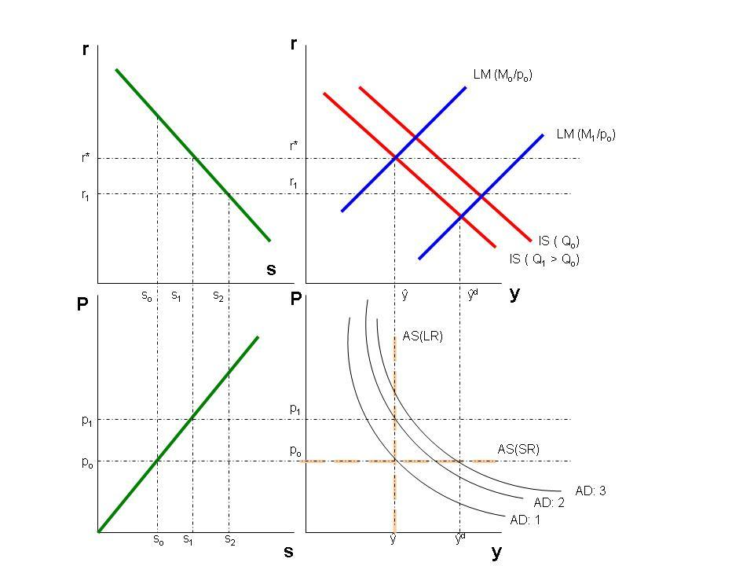

## Table of Contents

## What is overshooting in economics?

Overshooting in economics is a theory that explains why exchange rates can move a lot more than what basic economic models predict. It happens when a country's currency value changes more than expected because of new information or changes in economic policies. For example, if a country raises its interest rates, its currency might become stronger right away. But according to the overshooting theory, the currency might get stronger by too much at first, before it settles down to a more normal level.

This idea was first explained by economist Rudi Dornbusch in the 1970s. He said that because prices and wages in an economy don't change quickly, the exchange rate has to do a lot of the adjusting when something big happens. So, the exchange rate might jump a lot at first, then slowly move back to where it should be as the rest of the economy catches up. This helps explain why exchange rates can be so unpredictable and why they can swing so widely in the short term.

## How does the concept of overshooting relate to exchange rates?

Overshooting is a big idea in economics that helps us understand why a country's money value, or exchange rate, can jump around a lot more than we might expect. Imagine a country decides to raise its interest rates. Right away, its money might become worth more compared to other countries' money. But according to the overshooting theory, this jump might be too big at first. The country's money becomes much stronger quickly, but then it slowly comes back to a more normal level over time.

This happens because prices and wages in the economy don't change as fast as the exchange rate does. When something big happens, like a change in interest rates, the exchange rate has to do a lot of the adjusting right away. So, it might jump a lot at first, then slowly move back to where it should be as the rest of the economy catches up. This idea was first talked about by an economist named Rudi Dornbusch in the 1970s, and it helps explain why exchange rates can be so hard to predict and why they can swing so widely in the short term.

## What is the basic mechanism behind overshooting?

Overshooting happens because exchange rates can change a lot faster than other things in the economy, like prices and wages. When something important changes, like a country raising its interest rates, the exchange rate has to adjust quickly. It might jump up a lot right away, making the country's money much stronger than expected. This big jump is called overshooting.

After the big jump, the exchange rate slowly comes back to a more normal level as the rest of the economy catches up. Prices and wages start to change, and the exchange rate doesn't have to do all the adjusting anymore. So, it moves back to where it should be, but it took that big jump first. This helps explain why exchange rates can be so unpredictable and swing a lot in the short term.

## Who developed the overshooting model and when?

The overshooting model was developed by an economist named Rudi Dornbusch. He came up with this idea in the 1970s. Dornbusch wanted to explain why a country's money value, or exchange rate, can change a lot more than we might expect when something big happens in the economy.

His theory says that when something important changes, like a country raising its interest rates, the exchange rate has to adjust quickly. It might jump up a lot right away, making the country's money much stronger than expected. This big jump is what we call overshooting. After the big jump, the exchange rate slowly comes back to a more normal level as the rest of the economy catches up.

## Can you explain the Dornbusch overshooting model?

The Dornbusch overshooting model is a way to understand why a country's money value, or exchange rate, can change a lot more than we might expect. It was created by an economist named Rudi Dornbusch in the 1970s. The idea is that when something big happens in the economy, like a country raising its interest rates, the exchange rate has to adjust quickly. It might jump up a lot right away, making the country's money much stronger than expected. This big jump is what we call overshooting.

After the big jump, the exchange rate slowly comes back to a more normal level as the rest of the economy catches up. Prices and wages in the economy don't change as fast as the exchange rate does. So, when something important changes, the exchange rate has to do a lot of the adjusting right away. It might jump a lot at first, then slowly move back to where it should be as the rest of the economy adjusts. This helps explain why exchange rates can be so unpredictable and why they can swing so widely in the short term.

## What are the key assumptions of the overshooting model?

The overshooting model makes a few important guesses about how the economy works. One big guess is that prices and wages in the economy don't change quickly. They take time to adjust. Because of this, when something important happens, like a country raising its interest rates, the exchange rate has to do a lot of the adjusting right away. The exchange rate can jump a lot because it's the quickest thing to change.

Another key guess is that people expect the economy to go back to normal over time. This means that even though the exchange rate might jump a lot at first, people think it will slowly move back to where it should be. This idea helps explain why the exchange rate might overshoot at first, then slowly come back to a more normal level as the rest of the economy catches up. These guesses help us understand why exchange rates can be so hard to predict and why they can swing so widely in the short term.

## How does overshooting affect monetary policy?

Overshooting can make it hard for people who make money rules, like central bankers, to decide what to do. When a country changes its interest rates, the value of its money might jump a lot more than expected. This big jump can make it tricky for central bankers to know if they should change interest rates again or wait for things to calm down. If they see the money getting too strong or too weak, they might think about changing interest rates to fix it, but they have to be careful because the big jump might not last.

Because of overshooting, central bankers need to think about the long run, not just what's happening right now. They know that the big jump in the money's value might go away over time as prices and wages catch up. So, they might decide to wait and see what happens instead of making quick changes. This helps them make better choices about interest rates and keep the economy stable, even when the exchange rate is jumping around a lot.

## What are the empirical evidences supporting the overshooting hypothesis?

There are a few studies that show the overshooting hypothesis might be true. One big study looked at how exchange rates changed after big events like changes in interest rates. They found that when a country raised its interest rates, its money often got much stronger right away, just like the overshooting model says. But then, over time, the money's value came back down to a more normal level as the rest of the economy caught up. This shows that the big jump in the money's value at first might be too much, and it slowly fixes itself.

Another piece of evidence comes from looking at many different countries over a long time. Researchers saw that exchange rates often moved a lot more than what basic economic models predicted. They found that these big moves happened right after important changes in the economy, like interest rate changes or big news. This fits with the overshooting idea, where the exchange rate jumps a lot at first because it has to adjust quickly, then slowly moves back to where it should be. These studies help support the idea that overshooting is a real thing that happens in the real world.

## How does overshooting interact with other economic variables like interest rates and inflation?

Overshooting affects interest rates and inflation because when a country changes its interest rates, the value of its money can jump a lot more than expected. If a country raises its interest rates, its money might get much stronger right away. This can make things that the country buys from other countries cheaper, which might lower inflation. But because of overshooting, the money might get too strong at first, so the country might need to wait and see if the money's value comes back down before changing interest rates again.

Inflation can also affect overshooting. If people expect prices to go up a lot, they might want to buy things now instead of later. This can make the country's money weaker because people want to spend it quickly. If the country tries to stop inflation by raising interest rates, the money's value might jump up a lot at first because of overshooting. But over time, as prices and wages catch up, the money's value might come back to a more normal level. This shows how overshooting, interest rates, and inflation all work together in the economy.

## What are the criticisms and limitations of the overshooting model?

Some people say the overshooting model is not perfect because it makes guesses that might not always be true. One big guess is that prices and wages take a long time to change. But in the real world, sometimes prices and wages can change faster than the model thinks. This means the exchange rate might not have to jump as much as the model says. Another problem is that the model assumes people always expect the economy to go back to normal. But in real life, people might not always think this way, and their guesses about the future can change how the exchange rate moves.

Another criticism is that the overshooting model doesn't look at everything that can affect exchange rates. Things like how much people want to buy from other countries, how much money people want to save, and big news events can also change exchange rates a lot. The model focuses mostly on interest rates and doesn't always consider these other things. This means it might not explain everything we see in the real world. Even though the overshooting model helps us understand why exchange rates can jump around a lot, it's not perfect and there are other things to think about too.

## How has the concept of overshooting evolved since its introduction?

Since Rudi Dornbusch introduced the overshooting model in the 1970s, people have been thinking about it and trying to make it better. They've looked at more things that can affect exchange rates, like how much people want to buy from other countries and how much money people want to save. They've also thought about how big news events can change exchange rates a lot. These new ideas help make the overshooting model more complete and better at explaining what happens in the real world.

Even though the basic idea of overshooting is still the same, people have added new parts to the model to make it work better. They've thought about how quickly prices and wages can change and how people's guesses about the future can affect exchange rates. These changes help the model explain more of what we see in the real world. But even with these updates, the overshooting model is still not perfect, and people keep working on it to make it even better.

## Can you discuss a historical case where overshooting was observed and its impact on the economy?

In the early 1980s, the United States had a big example of overshooting when the Federal Reserve, which is like the country's money boss, decided to raise interest rates a lot to fight high inflation. When the interest rates went up, the value of the US dollar got much stronger very quickly. This was more than people expected, and it's a good example of overshooting. The dollar became so strong that it made things the US bought from other countries cheaper, which helped lower inflation. But it also made US products more expensive for other countries to buy, which hurt US businesses that sold things abroad.

Over time, as prices and wages in the US economy started to catch up, the value of the dollar slowly came back down to a more normal level. This shows how overshooting works: the exchange rate jumps a lot at first, then slowly moves back to where it should be. The big jump in the dollar's value in the early 1980s had a big impact on the US economy. It helped lower inflation, but it also made it harder for US businesses to sell things to other countries. This example helps us see how overshooting can affect a country's money value and its economy in big ways.

## What is the understanding of exchange rates?

Exchange rates, often referred to as the price of one currency in terms of another, are a fundamental aspect of the global financial system, facilitating international trade and investment. These rates are typically expressed as a ratio or a pair, such as USD/EUR, which indicates how many US dollars are required to purchase one Euro.

Several factors influence exchange rates, including inflation, interest rates, and political stability. Inflation, the general increase in prices, erodes the purchasing power of a currency. A country with a consistently high inflation rate tends to see its currency depreciate relative to the currencies of countries with lower inflation rates. For instance, if the US experiences higher inflation than the Eurozone, the USD is likely to depreciate against the EUR.

Interest rates, controlled by a nation's central bank, also play a significant role. Higher interest rates offer lenders in an economy a higher return relative to other countries. Therefore, higher interest rates attract foreign capital, causing the exchange rate to appreciate, assuming other factors remain constant. The relationship between interest rates and exchange rates can be illustrated through the [interest rate](/wiki/interest-rate-trading-strategies) parity theory, which suggests that differential interest rates between two countries will be offset by changes in the exchange rate:

$$
\frac{1 + i_{\text{domestic}}}{1 + i_{\text{foreign}}} = \frac{E_{\text{expected}}}{E_{\text{current}}}
$$

Where $i_{\text{domestic}}$ and $i_{\text{foreign}}$ are the domestic and foreign interest rates, respectively, and $E_{\text{expected}}$ and $E_{\text{current}}$ are the expected future and current exchange rates.

Political stability and economic performance are crucial as well. Countries with less risk to political and economic stability are more attractive to foreign investors, increasing demand for the stable country’s currency and potentially appreciating its exchange rate. Conversely, political turmoil or economic uncertainty can lead to depreciation.

Exchange rates significantly impact international trade and investment by affecting the relative price of goods between countries. A stronger domestic currency makes imports cheaper and exports more expensive, potentially leading to a trade deficit. Conversely, a weaker domestic currency has the opposite effect, making exports cheaper and imports more expensive, potentially improving trade balances.

Central banks and governments play a pivotal role in managing exchange rates. They may intervene directly in the currency markets by buying or selling currencies to stabilize or induce movement in the exchange rate, often termed as '[forex](/wiki/forex-system) intervention'. Additionally, through monetary policy tools such as altering interest rates and setting reserve requirements, central banks influence exchange rates indirectly. Some countries adopt specific exchange rate regimes like fixed, floating, or pegged systems, to achieve economic objectives. For instance, China's managed float system allows for controlled flexibility to ensure stable trade conditions.

In summary, understanding the mechanics of exchange rates and their influencing factors is essential for comprehending global economic dynamics and the interplay of international trade and investment.

## What are the Economics of Overshooting?

The overshooting hypothesis is a concept in international finance that explains the short-term [volatility](/wiki/volatility-trading-strategies) of exchange rates following a change in monetary policy. Formulated by economist Rudiger Dornbusch in 1976, the hypothesis posits that exchange rates tend to "overshoot" their long-run equilibrium levels in response to changes in monetary policy, such as adjustments in interest rates or money supply.

Overshooting occurs when an immediate change in monetary policy leads to a disproportionate effect on exchange rates. Suppose a central bank unexpectedly raises interest rates. According to the overshooting hypothesis, the immediate effect will be an excessive appreciation of the domestic currency, beyond its long-term equilibrium value. This overreaction occurs because capital flows quickly adjust to the interest rate change, while goods prices and wages, due to their sticky nature, adjust more slowly. Over time, as prices begin to adjust, the exchange rate gradually moves back to its long-term path.

This phenomenon can be mathematically represented using the Dornbusch model. In this model, the exchange rate $E$ is determined by the formula:

$$
E = P \times \left( \frac{i - i^*}{\pi - \pi^*} \right)^{\phi}
$$

where $P$ is the price level, $i$ and $i^*$ are domestic and foreign interest rates respectively, $\pi$ and $\pi^*$ are domestic and foreign inflation rates, and $\phi$ is a factor representing the speed of price adjustment. This formula highlights the roles of interest rates and inflation differentials in determining exchange rates and their potential for overshooting.

The implications of overshooting are significant for currency traders and policymakers. For traders, sudden and pronounced exchange rate fluctuations present both risks and opportunities for profit. Those who can predict or quickly react to these changes can capitalize on short-term currency movements. However, the uncertainty associated with overshooting also increases the risk of substantial financial loss.

Policymakers must consider the potential for overshooting when enacting monetary policy. Unanticipated adjustments can destabilize markets and disrupt economic planning and international trade. Effective communication and gradual policy changes can help mitigate these adverse effects.

Historical instances of overshooting are well-documented. A notable example is the reaction of exchange rates following the Federal Reserve's tight monetary policy in the early 1980s. The unexpected increase in U.S. interest rates led to a rapid appreciation of the U.S. dollar, followed by a gradual return to more stable levels. Similar patterns were observed during the European Exchange Rate Mechanism crisis in the early 1990s.

In conclusion, understanding the dynamics of the overshooting hypothesis is essential for navigating the complexities of currency markets and monetary policy. The hypothesis provides a framework for anticipating how changes in economic policy can lead to temporary misalignments in exchange rates, with far-reaching implications for global trade and investment.

## References & Further Reading

[1]: Dornbusch, R. (1976). ["Expectations and Exchange Rate Dynamics."](https://www.jstor.org/stable/1831272) Journal of Political Economy, 84(6), 1161-1176.

[2]: Friedman, M. (1953). ["The Case for Flexible Exchange Rates."](https://www.cato.org/cato-journal/spring/summer-2018/milton-friedman-case-flexible-exchange-rates-monetary-rules) Essays in Positive Economics. University of Chicago Press.

[3]: Lopez de Prado, M. (2018). ["Advances in Financial Machine Learning."](https://www.amazon.com/Advances-Financial-Machine-Learning-Marcos/dp/1119482089) Wiley.

[4]: Aronson, D. (2006). ["Evidence-Based Technical Analysis: Applying the Scientific Method and Statistical Inference to Trading Signals."](https://www.amazon.com/Evidence-Based-Technical-Analysis-Scientific-Statistical/dp/0470008741) Wiley.

[5]: Chan, E. P. (2009). ["Quantitative Trading: How to Build Your Own Algorithmic Trading Business."](https://github.com/ftvision/quant_trading_echan_book) Wiley.

[6]: Jansen, S. (2018). ["Machine Learning for Algorithmic Trading."](https://github.com/stefan-jansen/machine-learning-for-trading) Packt Publishing.

[7]: Black, F. (1976). ["Studies of Stock Price Volatility Changes."](https://www.scirp.org/reference/ReferencesPapers?ReferenceID=1969803) Proceedings of the American Statistical Association, Business and Economic Statistics Section.