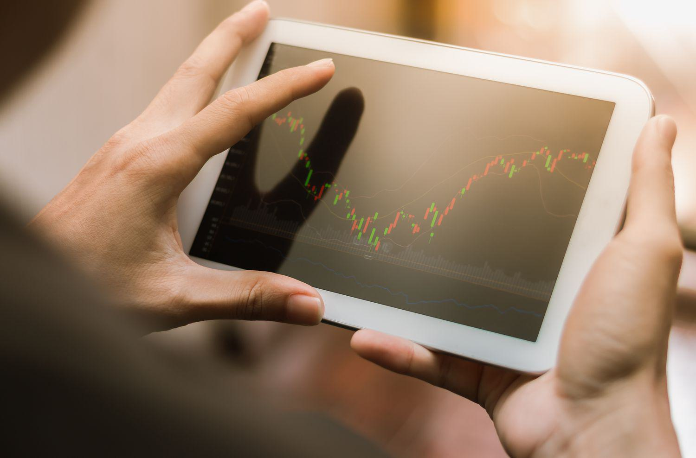

## Table of Contents

## What is an oversold bounce in trading?

An oversold bounce in trading happens when a stock's price drops a lot and then suddenly starts to go up again. This happens because the stock was being sold too much, making its price lower than it should be. Traders see this as a good time to buy the stock because they think the price will go back up soon.

When a stock is oversold, it means that a lot of people were selling it, and not many were buying. This can make the price go down too far, too fast. When the price gets to a point where it seems too low, other traders might start buying it, thinking it's a good deal. This buying can cause the price to bounce back up, which is called an oversold bounce.

## How can you identify when a market is oversold?

You can tell if a market is oversold by looking at something called the Relative Strength Index, or RSI. The RSI is a number that goes from 0 to 100. When the RSI gets below 30, it usually means the market is oversold. This means that a lot of people have been selling, and the price has gone down a lot. Traders use this as a sign that the price might start going up soon because it has gone down too far.

Another way to spot an oversold market is by looking at the price chart. If the price keeps dropping fast and then starts to level off or go up a little, it might be a sign that the market is oversold. This is because when the price gets too low, some traders might start buying, thinking it's a good deal. This can cause the price to bounce back up a bit, showing that the market might be oversold.

## What are common indicators used to detect an oversold condition?

One common indicator used to detect an oversold condition is the Relative Strength Index (RSI). The RSI is a number that ranges from 0 to 100. When the RSI drops below 30, it suggests that a stock or market might be oversold. This means that a lot of people have been selling, causing the price to go down a lot. Traders watch the RSI because it can signal that the price might start to go up soon, as it has fallen too far.

Another indicator is the Stochastic Oscillator. This tool also ranges from 0 to 100, and when it falls below 20, it can indicate an oversold condition. The Stochastic Oscillator compares a stock's closing price to its price range over a certain period. If the closing price is near the low end of the range, it might mean the stock is oversold and due for a bounce back up.

Looking at price charts can also help identify an oversold market. If the price of a stock or market has been falling quickly and then starts to level off or rise slightly, it might be a sign of an oversold condition. This happens because when the price gets very low, some traders may start buying, thinking it's a good deal. This buying can cause the price to bounce back up, showing that the market might be oversold.

## What causes an oversold bounce?

An oversold bounce happens when a stock's price has dropped a lot and then starts to go up again. This is because the stock was being sold too much, making its price lower than it should be. When the price gets really low, some traders see it as a good time to buy. They think the price will go back up soon because it has fallen too far. This buying pushes the price up, causing the bounce.

The main reason for an oversold bounce is that the market corrects itself. When a lot of people are selling a stock, it can go down too far, too fast. But when the price gets to a point where it seems too low, other traders step in. They buy the stock, thinking it's a good deal. This new buying pressure makes the price start to go up again, creating the bounce. It's like the market saying, "Okay, that's enough selling. Time to go back up a bit."

## Can you explain the mechanism of an oversold bounce?

An oversold bounce happens when a stock's price has been falling a lot and then starts to go up again. It's like the stock was being sold too much, making its price drop too low. When the price gets really low, some traders see it as a good time to buy. They think the price will go back up soon because it has gone down too far. This buying pushes the price up, causing the bounce.

The main reason for an oversold bounce is that the market corrects itself. When a lot of people are selling a stock, it can go down too far, too fast. But when the price gets to a point where it seems too low, other traders step in. They buy the stock, thinking it's a good deal. This new buying pressure makes the price start to go up again, creating the bounce. It's like the market saying, "Okay, that's enough selling. Time to go back up a bit."

## What are the risks associated with trading an oversold bounce?

Trading an oversold bounce can be risky because the price might not go up right away. Even if a stock looks oversold, it can keep going down before it starts to go back up. This means you could lose money if you buy the stock thinking it will bounce back quickly, but it doesn't.

Another risk is that other traders might think the same way and buy the stock at the same time. This can cause the price to go up a bit, but then it might fall again if everyone decides to sell at once. It's hard to know exactly when the bounce will happen, so you need to be careful and not put all your money into one trade.

## How does an oversold bounce differ from a market reversal?

An oversold bounce and a market reversal are different things. An oversold bounce happens when a stock's price drops a lot and then goes up a little bit. It's like the stock was being sold too much, so it got too cheap. When the price gets really low, some people start buying it again, thinking it's a good deal. This makes the price go up a bit, but it might not keep going up. It's just a small bounce back.

A market reversal is bigger and more important. It happens when the whole trend of the market changes direction. If the market was going down for a long time, a reversal means it starts going up and keeps going up. It's not just a small bounce; it's a big change that lasts longer. A market reversal shows that something big has changed in the market, like people feeling more positive about the future.

## What are some strategies to capitalize on an oversold bounce?

One way to make money from an oversold bounce is to watch for stocks that have gone down a lot and are starting to go up a little. You can use tools like the Relative Strength Index (RSI) to see if a stock is oversold. When the RSI goes below 30, it might mean the stock is a good buy. Once you see the stock starting to go up, you can buy it and then sell it when the price goes up more. This works because when a stock is oversold, some people start buying it again, pushing the price up.

Another strategy is to use a stop-loss order. This means you set a price at which you will sell the stock if it keeps going down. This can help you not lose too much money if the stock doesn't bounce back like you thought it would. You can also set a target price to sell the stock when it goes up to that price. This way, you can make sure you make some money from the bounce without waiting too long and risking the price going down again.

## Can you provide historical examples of oversold bounces in major markets?

One famous example of an oversold bounce happened in the stock market in March 2020. At the start of the COVID-19 pandemic, a lot of people were scared and started selling their stocks. This made the prices of stocks go down a lot, really fast. The S&P 500 index dropped by about 30% in just a few weeks. But then, the market started to bounce back. Some people thought the prices were too low and started buying stocks again. This buying made the S&P 500 go up by about 20% in the next month. It was a big oversold bounce because so many people thought the stocks were a good deal at those low prices.

Another example happened in the cryptocurrency market with Bitcoin in early 2018. Bitcoin had been going up a lot in 2017, but then it started to go down in early 2018. By February, Bitcoin had dropped from almost $20,000 to around $6,000. A lot of people were selling, and it seemed like the price might keep going down. But then, some people started buying Bitcoin again, thinking the price was too low. This caused Bitcoin to go up to around $11,000 by June 2018. It was a big bounce because so many people thought Bitcoin was a good buy at those lower prices.

## How do technical analysts predict the strength and duration of an oversold bounce?

Technical analysts use different tools to guess how strong and how long an oversold bounce will be. One tool they use a lot is the Relative Strength Index (RSI). When the RSI goes below 30, it means a stock might be oversold. But they also look at how fast the RSI is moving. If the RSI is going up really fast from being oversold, it might mean the bounce will be strong and last a while. They also look at how much the stock price has gone down before the bounce. If the price dropped a lot, the bounce might be bigger and last longer because people think the stock is a really good deal.

Another thing technical analysts look at is the trading volume. If a lot of people are buying the stock when it's oversold, it can mean the bounce will be strong and last longer. They also use other tools like moving averages and chart patterns. For example, if the stock price breaks above a moving average after being oversold, it might mean the bounce will keep going. By looking at all these things together, technical analysts can make better guesses about how strong and how long an oversold bounce will be.

## What role does market sentiment play in an oversold bounce?

Market sentiment is how people feel about the market. It plays a big role in an oversold bounce. When a stock's price drops a lot, people might start to feel that it's too cheap. This can make them want to buy the stock, thinking it's a good deal. If a lot of people feel this way, it can cause the price to go up again, which is the oversold bounce. So, if the market sentiment turns from negative to positive, it can help make the bounce stronger and last longer.

But market sentiment can also make things tricky. If people are still feeling scared or unsure, they might keep selling the stock even if it's oversold. This can make the price keep going down instead of bouncing back. So, understanding how people feel about the market is important for figuring out if an oversold bounce will happen and how strong it will be.

## How can advanced traders use options to hedge against potential failures of an oversold bounce?

Advanced traders can use options to protect themselves if an oversold bounce doesn't happen like they expect. One way they do this is by buying put options. A put option gives them the right to sell a stock at a certain price. If the stock keeps going down instead of bouncing back, the put option can help them make some money or lose less money. They can buy the put option at the same time they buy the stock, so if the stock goes down, the put option goes up in value, helping to cover their losses.

Another way traders use options is by selling call options. When they sell a call option, they get money upfront, but they have to sell the stock at a certain price if someone wants to buy it. If the stock does bounce back but not too high, the call option might not get used, and the trader keeps the money they got for selling it. This can help them make some money even if the bounce isn't as big as they hoped. By using options like this, advanced traders can manage their risks better when trying to take advantage of an oversold bounce.

## How can we identify oversold conditions?

Identifying oversold conditions is a critical component of market analysis, focusing on determining when a security has dropped to levels below its perceived value. This is achieved primarily through technical and fundamental analyses.

From a technical perspective, the Relative Strength Index (RSI) and Moving Average Convergence Divergence (MACD) are pivotal indicators. The RSI is a [momentum](/wiki/momentum) oscillator that measures the speed and change of price movements, providing a value between 0 and 100. Securities are generally considered oversold when the RSI falls below 30. 

$$
RSI = 100 - \frac{100}{1 + \text{RS}}
$$

where RS (Relative Strength) is the average of x days' up closes divided by the average of x days' down closes.

On the other hand, MACD, which is calculated by subtracting the 26-period Exponential Moving Average (EMA) from the 12-period EMA, offers insights into price trends. A MACD below the signal line can indicate an oversold condition.

Fundamental analysis provides another lens, examining whether the security's current market price reflects its intrinsic or book value. If a stock trades below its intrinsic value or book value, it might indicate undervaluation. This assessment involves calculating ratios like Price-to-Earnings (P/E) or Price-to-Book (P/B), providing a framework for determining a security's fundamental worth relative to its current price.

By integrating both technical and fundamental analyses, investors can make informed decisions about potential oversold conditions, allowing them to identify and exploit opportunities for potential market rebounds.

## References & Further Reading

[1]: Bergstra, J., Bardenet, R., Bengio, Y., & Kégl, B. (2011). ["Algorithms for Hyper-Parameter Optimization."](https://dl.acm.org/doi/10.5555/2986459.2986743) Advances in Neural Information Processing Systems 24.

[2]: ["Advances in Financial Machine Learning"](https://www.amazon.com/Advances-Financial-Machine-Learning-Marcos/dp/1119482089) by Marcos Lopez de Prado

[3]: ["Evidence-Based Technical Analysis: Applying the Scientific Method and Statistical Inference to Trading Signals"](https://www.amazon.com/Evidence-Based-Technical-Analysis-Scientific-Statistical/dp/0470008741) by David Aronson

[4]: Wilder, J. W. (1978). ["New Concepts in Technical Trading Systems."](https://archive.org/details/newconceptsintec00wild) Trend Research

[5]: Chan, E. P. (2008). ["Quantitative Trading: How to Build Your Own Algorithmic Trading Business"](https://github.com/ftvision/quant_trading_echan_book) by Ernest P. Chan

[6]: Jansen, S. (2018). ["Machine Learning for Algorithmic Trading"](https://github.com/stefan-jansen/machine-learning-for-trading) by Stefan Jansen