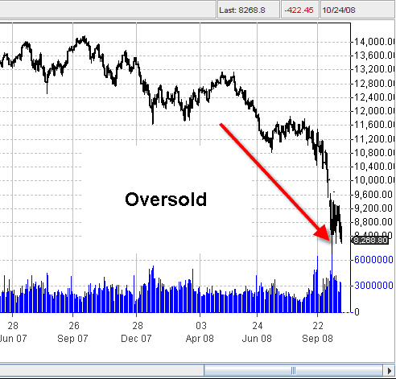

## Table of Contents

## What does 'oversold' mean in the context of the stock market?

In the stock market, 'oversold' means that a stock or market has been sold a lot in a short time. This happens when many people want to sell their stocks quickly, often because they think the price will go down more. When a stock is oversold, its price can drop a lot, sometimes more than it should based on the company's real value.

Traders and investors watch for oversold conditions because they can signal a good time to buy. If a stock is oversold, it might be a good deal because the price is low. People use tools like the Relative Strength Index (RSI) to find out if a stock is oversold. If the RSI shows a low number, it might mean the stock is oversold and could go up soon.

## How can an investor identify if a stock is oversold?

An investor can identify if a stock is oversold by using a tool called the Relative Strength Index (RSI). The RSI is a number that goes from 0 to 100. If the RSI is below 30, it means the stock might be oversold. This happens when a lot of people have sold the stock quickly, making its price drop a lot. The RSI helps investors see if the stock's price has gone down too much and might be a good buy.

Another way to spot an oversold stock is by looking at the stock's price compared to its moving average. If the stock's price is much lower than its moving average, it could be a sign that the stock is oversold. The moving average is like a line that shows the average price of the stock over a certain time, like 50 days or 200 days. If the stock's price is far below this line, it might mean the stock has been sold too much and could be ready to go back up.

Investors also pay attention to market sentiment and news. If there's a lot of bad news about a company, people might sell the stock and make it oversold. But if the bad news is not as bad as people think, the stock might be a good buy. By watching these signs, investors can find stocks that are oversold and might be ready to increase in value.

## What are the common indicators used to determine if a stock is oversold?

The most common indicator used to determine if a stock is oversold is the Relative Strength Index (RSI). The RSI is a number that ranges from 0 to 100. When the RSI falls below 30, it suggests that the stock might be oversold. This means that a lot of people have sold the stock quickly, causing its price to drop a lot. Investors use the RSI to see if the stock's price has gone down too much and might be a good time to buy.

Another indicator is the stock's price compared to its moving average. A moving average is a line that shows the average price of the stock over a certain period, like 50 days or 200 days. If the stock's price is much lower than its moving average, it could be a sign that the stock is oversold. This happens when the stock has been sold a lot and its price has dropped far below what is normal for it.

Investors also look at market sentiment and news to determine if a stock is oversold. If there's a lot of bad news about a company, people might sell the stock, making it oversold. But if the bad news is not as bad as people think, the stock might be a good buy. By watching these signs, investors can find stocks that are oversold and might be ready to go back up in value.

## Can you explain the Relative Strength Index (RSI) and its role in identifying oversold stocks?

The Relative Strength Index, or RSI, is a tool that helps investors see if a stock is being bought or sold too much. It gives a number between 0 and 100. When the RSI number is below 30, it means the stock might be oversold. This happens when a lot of people sell the stock quickly, making its price drop a lot. The RSI helps investors find out if the stock's price has gone down too much and might be a good time to buy.

The RSI is important because it shows when a stock might be a good deal. If the RSI is below 30, it means the stock has been sold a lot and its price might be lower than it should be. Investors look at the RSI to see if the stock is oversold and could go up soon. By using the RSI, investors can find stocks that might be ready to increase in value and make a smart buying decision.

## What are the potential risks of buying oversold stocks?

Buying oversold stocks can be risky because the stock's price might keep going down. Just because a stock is oversold does not mean it will go back up right away. Sometimes, the reasons for the stock being oversold, like bad news about the company, might be true and the stock's price could drop even more. If an investor buys the stock hoping it will go up, they could lose money if the price keeps falling.

Another risk is that the stock might stay low for a long time. Even if the stock is oversold and seems like a good deal, it might take a while for the price to go back up. Investors need to be patient and have enough money to wait for the stock to recover. If they need to sell the stock quickly, they might have to sell it at a loss. So, buying oversold stocks can be tricky and requires careful thinking about how long you can wait and how much risk you can take.

## How does the concept of oversold differ from being undervalued?

Oversold and undervalued are two different ideas about why a stock's price is low. A stock is oversold when a lot of people sell it quickly, making its price drop a lot in a short time. This can happen because of panic or bad news, but it doesn't always mean the stock is a bad investment. It just means a lot of people wanted to sell it fast. Investors use tools like the Relative Strength Index (RSI) to see if a stock is oversold. If the RSI number is low, it might mean the stock is oversold and could be a good time to buy.

Being undervalued means the stock's price is lower than what the company is really worth. This can happen for many reasons, like the market not understanding the company's true value or the company being ignored by investors. An undervalued stock might be a good investment because its price could go up when people realize its real worth. Unlike being oversold, being undervalued is about the stock's price compared to its true value, not just how quickly people are selling it. So, an oversold stock might also be undervalued, but they are different ideas about why the stock's price is low.

## What are some historical examples of stocks that were considered oversold and later recovered?

One famous example of an oversold stock that later recovered is Apple in 2008. During the financial crisis, Apple's stock dropped a lot. Many people sold their Apple stocks because they were scared about the economy. The stock's price went down to around $80 per share. But Apple was still a good company with great products like the iPhone. After the crisis, Apple's stock started to go back up. By 2012, it was over $600 per share. People who bought Apple stock when it was oversold made a lot of money.

Another example is Netflix in 2011. Netflix had a big problem when they tried to split their DVD and streaming services, and their stock price fell a lot. It went from over $300 per share down to around $65 per share. Many people thought Netflix was in big trouble and sold their stocks. But Netflix fixed their problems and kept growing. By 2015, their stock was back up to over $500 per share. Investors who bought Netflix when it was oversold and held onto their stocks saw big gains.

## How do market conditions affect the reliability of oversold signals?

Market conditions can make oversold signals less reliable. When the whole market is going down, like during a big economic problem, many stocks can look oversold. But just because a stock looks oversold does not mean it will go back up soon. If the market keeps going down, the stock's price might keep falling too. So, in bad market times, an oversold signal might not be a good reason to buy a stock right away.

On the other hand, in a strong market, oversold signals can be more reliable. When the market is doing well, a stock that looks oversold might be a good buy. This is because the market's overall good mood can help the stock's price go back up faster. But even in good market times, investors need to look at other things too, like the company's news and how it is doing, to make sure the oversold signal is a good sign to buy.

## What strategies can traders use when they believe a stock is oversold?

When traders think a stock is oversold, they might decide to buy it. They believe the stock's price has dropped too much and will go back up soon. To do this, they look at the Relative Strength Index (RSI). If the RSI is below 30, it means the stock might be oversold. Traders also check the stock's price compared to its moving average. If the price is much lower than the moving average, it could be another sign the stock is oversold. By buying the stock when it's low, traders hope to sell it later for a higher price and make money.

Another strategy is to use stop-loss orders. This means setting a price at which the stock will be sold automatically if it keeps going down. This helps traders not lose too much money if the stock does not go back up as expected. Traders also need to keep an eye on the news and the company's performance. If the reasons for the stock being oversold are still there, like bad news about the company, the stock might not recover quickly. So, traders need to be patient and ready to wait for the stock's price to go up.

## How can technical analysis enhance the decision-making process when dealing with oversold stocks?

Technical analysis can help traders make better choices when they think a stock is oversold. It uses charts and numbers to look at how the stock's price has moved in the past. One important tool is the Relative Strength Index (RSI). If the RSI is below 30, it means the stock might be oversold. Traders can use this to find a good time to buy the stock. They also look at the stock's price compared to its moving average. If the price is much lower than the moving average, it could be another sign the stock is oversold. By using these tools, traders can see if the stock's price has dropped too much and might be ready to go back up.

Another way technical analysis helps is by showing patterns in the stock's price. Traders look for signs like a stock bouncing back after hitting a low point. This can tell them if other people are starting to buy the stock again. Technical analysis also helps traders set stop-loss orders. This means they can decide a price at which to sell the stock if it keeps going down. This helps them not lose too much money if the stock does not go back up as expected. By using technical analysis, traders can make smarter decisions about when to buy and sell oversold stocks.

## What are the psychological factors that contribute to a stock becoming oversold?

When a stock becomes oversold, it often has a lot to do with how people feel. If there's bad news about a company, like a problem with their product or a big loss, people can get scared. They might start selling their stocks quickly because they're worried the price will keep going down. This fear can make a lot of people sell at the same time, pushing the stock's price down even more. It's like a chain reaction where one person's fear makes others scared too, and they all want to get out of the stock fast.

But sometimes, the fear is bigger than the real problem. People might overreact to the news and sell the stock more than they need to. This can make the stock's price drop a lot, even if the company is still okay. When this happens, the stock can become oversold. It's not just about the numbers or the company's real value; it's also about how people feel and react to what's happening around them. Understanding these feelings can help investors see when a stock might be oversold and could be a good time to buy.

## How do institutional investors influence the oversold status of a stock?

Institutional investors, like big banks or investment funds, can make a stock become oversold. They have a lot of money and can buy or sell a lot of stocks at once. If they decide to sell a lot of their stocks in a company because they think it's not doing well, it can push the stock's price down a lot. When other people see big investors selling, they might get scared and start selling their stocks too. This can make the stock become oversold because so many people are trying to sell it at the same time.

But institutional investors can also help a stock that's oversold to recover. If they think the stock has gone down too much and is now a good deal, they might start buying it again. When big investors start buying, it can make other people feel more confident and they might start buying too. This can help the stock's price go back up. So, what institutional investors do can have a big effect on whether a stock becomes oversold and how quickly it can recover.

## References & Further Reading

[1]: Bergstra, J., Bardenet, R., Bengio, Y., & Kégl, B. (2011). ["Algorithms for Hyper-Parameter Optimization."](https://dl.acm.org/doi/10.5555/2986459.2986743) Advances in Neural Information Processing Systems 24.

[2]: ["Advances in Financial Machine Learning"](https://www.amazon.com/Advances-Financial-Machine-Learning-Marcos/dp/1119482089) by Marcos Lopez de Prado

[3]: ["Evidence-Based Technical Analysis: Applying the Scientific Method and Statistical Inference to Trading Signals"](https://www.amazon.com/Evidence-Based-Technical-Analysis-Scientific-Statistical/dp/0470008741) by David Aronson

[4]: ["Machine Learning for Algorithmic Trading"](https://github.com/stefan-jansen/machine-learning-for-trading) by Stefan Jansen

[5]: ["Quantitative Trading: How to Build Your Own Algorithmic Trading Business"](https://www.amazon.com/Quantitative-Trading-Build-Algorithmic-Business/dp/1119800064) by Ernest P. Chan