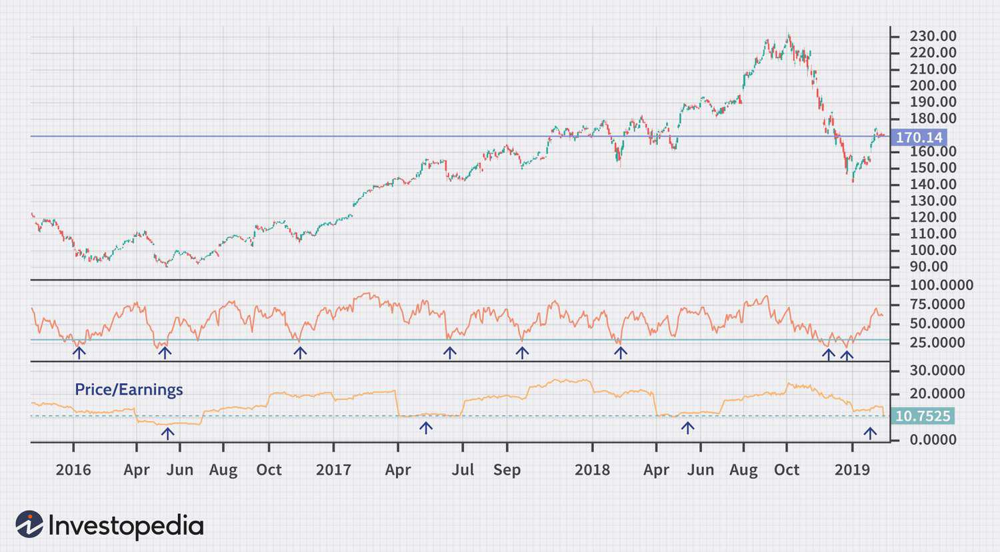

The stock market is a dynamic and complex environment where investors trade equities and other securities to achieve financial goals. It serves as a bellwether for the economy and reflects investor sentiment and macroeconomic trends. Recently, the market has experienced increased volatility due to geopolitical tensions, fluctuating interest rates, and technological advancements that reshape trading practices. Navigating this intricate landscape requires a robust understanding of market mechanics and the formulation of effective investment strategies.

Two critical concepts in the stock market are 'oversold stocks' and 'algo trading.' Oversold stocks are equities that have experienced a sharp decline in price, often attributed to investor overreaction, and are considered undervalued by traditional metrics. They present potential investment opportunities, particularly if the decline is not supported by the company's fundamentals. Various technical indicators, such as the Relative Strength Index (RSI) and Moving Average Convergence Divergence (MACD), help identify these stocks.*



On the other hand, algorithmic trading, or 'algo trading', involves using computer algorithms to execute trades at speeds and frequencies impossible for human traders. This approach leverages mathematical models and programming to capture market inefficiencies, providing a competitive edge to traders who implement it effectively. Algorithmic trading has revolutionized the financial markets by increasing the speed of transactions and providing sophisticated tools for executing complex trading strategies.

Formulating sound investment strategies is imperative for investors seeking to maximize returns while managing risk. A well-considered approach takes into account market analysis, individual financial goals, and risk tolerance. The integration of market analysis into investment strategies enables investors to make informed decisions based on empirical data and market trends. By understanding economic indicators, corporate fundamentals, and technical analysis, investors gain insights that guide their investment choices.

This article aims to explore these pivotal components of the stock market: the identification and strategic investment in oversold stocks, the incorporation of algorithmic trading, and the integration of market analysis to optimize investment outcomes. The article will illustrate how these elements interact and contribute to a cohesive strategy that can navigate the complexities of the modern stock market. Through a comprehensive examination, readers will gain a deeper understanding of effective investment practices and the tools available to enhance portfolio performance.

## Table of Contents

## Understanding Oversold Stocks

Oversold stocks are those that have experienced significant price declines over a short period, often due to either broad market trends or company-specific events. This phenomenon typically suggests that the stock's price is undervalued, at least if viewed from a short-term perspective. Characteristics of oversold stocks include substantial declines in price with a lack of corresponding material changes in the company’s fundamentals. Market participants may view these stocks as potential opportunities for reversal or recovery, but they also come with inherent risks.

Several technical indicators are employed to identify oversold conditions in stocks. Two widely used metrics are the Relative Strength Index (RSI) and the Moving Average Convergence Divergence (MACD). The RSI is a [momentum](/wiki/momentum) oscillator that measures the rate and change of price movements, presented as an index ranging from 0 to 100. A stock is generally considered oversold when its RSI falls below 30, suggesting it may be poised for a reversal or bounce. The MACD, on the other hand, is a trend-following momentum indicator that shows the relationship between two moving averages of a stock’s price. It is calculated by subtracting the 26-period Exponential Moving Average (EMA) from the 12-period EMA. An oversold condition can be indicated when the MACD crosses above the signal line or when there is a positive divergence.

Investing in oversold stocks presents both opportunities and risks. The primary opportunity lies in potentially acquiring equity at a lower price before a price correction or upward trend, leading to significant financial gains. Historical examples abound where oversold stocks have rebounded, such as during the recovery phases following major market downturns like the 2008 financial crisis. Stocks of companies with strong fundamentals but temporary setbacks have shown potential for recovery and substantial gains for discerning investors willing to shoulder the risk.

However, risks associated with investing in oversold stocks must be considered. Oversold conditions can persist if underlying issues related to the economy, industry, or company fundamentals are not resolved, leading to further depreciation in the stock’s value. Market conditions such as economic recessions, [interest rate](/wiki/interest-rate-trading-strategies) changes, or disruptions in specific sectors can exacerbate the decline, keeping the stocks oversold for extended periods.

The status of oversold stocks is influenced by prevailing market conditions. A bullish market environment might enhance the chances of a swift recovery for oversold stocks, while a bearish market may entrench their undervaluation. Investor sentiment, [liquidity](/wiki/liquidity-risk-premium) considerations, and broader economic indicators are all factors that affect how quickly and significantly oversold stocks might recover or continue to decline.

In summary, while oversold stocks present attractive opportunities due to their low valuation, they require a careful analysis of market indicators and conditions to mitigate potential risks. Understanding the tools and market scenarios that influence these stocks is crucial for any investor looking to capitalize on the opportunities they present.

## Investment Strategies for Oversold Stocks

Investment strategies for oversold stocks require a nuanced understanding of market indicators and a well-calibrated approach toward risk and opportunity. These strategies often hinge on the ability to discern market signals and take advantage of price corrections that can happen when a stock is oversold.

### Description of Strategies

1. **Value Investing:** This strategy involves identifying oversold stocks that have strong fundamentals but are currently undervalued in the market due to temporary issues or broader market trends. Investors look for a margin of safety, focusing on companies with solid earnings, low debt, and a sustainable business model.

2. **Technical Trading:** Here, investors use technical analysis tools such as the Relative Strength Index (RSI) and Moving Average Convergence Divergence (MACD) to spot oversold conditions. Traders typically set specific entry and exit points to capture anticipated rebounds in stock prices.

3. **Contrarian Approach:** This involves going against prevailing market trends by purchasing stocks that have been heavily sold off due to market pessimism. The rationale is that mass psychology leads to exaggerated sell-offs, creating opportunities for gains as the market corrects.

### Long-term vs. Short-term Investment Approaches

- **Long-term Approach:**
  - *Pros:* Potential for substantial returns as companies recover, accompanying dividend income, less sensitivity to market volatility.
  - *Cons:* Requires patience and may involve long periods of holding underperforming stocks, opportunity cost against better-performing investments.

- **Short-term Approach:**
  - *Pros:* Quick gains from price corrections, active trading opportunities, benefits from volatility.
  - *Cons:* Higher transaction costs, increased risk, and need for constant market monitoring.

### Role of Diversification

Diversification is crucial when dealing with potentially volatile oversold stocks. By spreading investments across different sectors or assets, investors can mitigate specific risks associated with individual stocks. This strategy reduces the portfolio's overall risk while allowing investors to participate in the recovery of selected oversold assets.

### Tips for Minimizing Risks

- **Set Stop-Loss Orders:** These automatically sell a stock if its price drops to a predetermined level, limiting potential losses.

- **Conduct Thorough Research:** Evaluate the fundamental aspects and market conditions affecting a stock to ascertain if it is genuinely undervalued.

- **Follow a Disciplined Approach:** Stick to your investment plan and avoid emotional reactions to market fluctuations.

### Case Studies of Successful Strategies

One historical example includes the rebound of certain technology stocks after the dot-com crash. Stocks like Apple and Amazon were oversold due to broader market conditions but demonstrated strong fundamentals and eventually delivered substantial long-term returns to investors who held their positions. Another case highlights the recovery of financial stocks post-2008 financial crisis; banks like JPMorgan Chase, identified as oversold, rebounded strongly due to effective management and regulatory support.

In conclusion, investing in oversold stocks can yield significant rewards if approached with diligence, informed analysis, and strategic diversification. Each strategy, whether value investing or technical trading, carries its risks and potential benefits, and investors should tailor their approach based on individual risk tolerance and market conditions.

## Stock Market Analysis Techniques

Stock market analysis is a critical component of evaluating stocks, aiming to forecast future price movements and make informed investment decisions. Two primary methodologies dominate this analytical landscape: [fundamental analysis](/wiki/fundamental-analysis) and technical analysis.

**Fundamental Analysis** examines a company's intrinsic value through financial statements, economic indicators, industry analysis, and management evaluation. Analysts typically scrutinize balance sheets, income statements, and cash flow statements to assess a firm's financial health. Ratios such as the Price-to-Earnings (P/E) ratio, Return on Equity (ROE), and Debt-to-Equity ratio are frequently employed to determine a stock’s value relative to its financial performance.

**Technical Analysis**, on the other hand, focuses on price patterns and market trends using historical data. This analysis type relies on chart patterns, volume analysis, and statistical indicators. Notable indicators include Moving Averages (MA), Bollinger Bands, and the Relative Strength Index (RSI). Technical analysis often involves python libraries like `matplotlib` or `pandas` for visualizing and computing trends in stock prices.

Below is a simple Python example calculating and visualizing moving averages:

```python
import pandas as pd
import matplotlib.pyplot as plt

# Assume df is a DataFrame containing 'Date' and 'Close' price columns
df['MA50'] = df['Close'].rolling(window=50).mean()
df['MA200'] = df['Close'].rolling(window=200).mean()

plt.figure(figsize=(10, 6))
plt.plot(df['Date'], df['Close'], label='Close Price')
plt.plot(df['Date'], df['MA50'], label='50-Day MA')
plt.plot(df['Date'], df['MA200'], label='200-Day MA')
plt.legend()
plt.show()
```

**Tools and Resources** that facilitate market analysis are pivotal. Platforms such as Bloomberg Terminal and Reuters Eikon provide extensive financial data and analytics, while online resources like Yahoo Finance and Google Finance offer accessible stock insights. For quantitative analysis, software like MATLAB or Python libraries (`numpy`, `scipy`) can be used to model and simulate stock behaviors.

Staying informed with **financial news and reports** is indispensable. Financial publications like The Wall Street Journal, Financial Times, and major news sites like CNBC deliver updates that help investors respond to market developments swiftly. Annual reports, earnings calls, and regulatory filings also provide essential data for evaluating a company's performance.

**Sentiment Analysis** has emerged as a novel approach to gauge market conditions by analyzing news articles, social media posts, and analyst opinions to predict stock movements. Natural Language Processing (NLP) techniques are used to automate this process. For instance, using Python's `TextBlob` or `vaderSentiment` library can help in extracting sentiment scores from financial news headlines.

```python
from vaderSentiment.vaderSentiment import SentimentIntensityAnalyzer

analyzer = SentimentIntensityAnalyzer()
headline = "Stock prices soar after new merger announcement"
score = analyzer.polarity_scores(headline)
print(score)
```

The **interplay between market analysis and stock valuation** involves aligning qualitative and quantitative insights from both fundamental and technical analyses to form a comprehensive valuation approach. Understanding macroeconomic trends, consumer behavior, and market psychology complements numerical analysis to refine investment decisions. Effective stock market analysis integrates these diverse aspects, enabling investors to optimize their portfolios in an informed and strategic manner.

## Algo Trading: An Effective Tool for Modern Investors

Algorithmic trading, or algo trading, refers to the use of computer programs and software to execute stock market orders at high speed and frequency. This practice utilizes algorithms based on various market variables to make trading decisions, offering advantages like precision, speed, and reduced transaction costs. Initially emerging in the 1970s with simple quantitative algorithms, algo trading has evolved significantly with advancements in technology and data analytics. Today, it represents a significant portion of trading [volume](/wiki/volume-trading-strategy) on global stock exchanges.

Algo trading can significantly enhance investment strategies, especially for oversold stocks, by leveraging data-driven insights to identify potential buy signals more accurately than traditional methods. For instance, algorithms can apply technical indicators such as the Relative Strength Index (RSI) or Moving Average Convergence Divergence (MACD) to detect oversold conditions and initiate trades swiftly when certain thresholds are met. This automation allows traders to execute trades based on structured criteria without the emotional biases that often affect human decision-making.

When selecting an [algorithmic trading](/wiki/algorithmic-trading) platform, investors should consider factors such as user interface, latency, available features, and the quality of customer support. Additionally, the ability to back-test strategies using historical data is crucial, as it allows traders to evaluate the effectiveness of their algorithms before executing trades in live markets.

Popular algo trading strategies include mean reversion and trend-following. Mean reversion assumes that prices will revert to their historical average, using statistical tools to identify deviation points where buying or selling is likely to be profitable. A basic mean reversion strategy might be implemented as follows in Python:

```python
import pandas as pd

# Assume 'data' is a DataFrame with historical price data
data['rolling_mean'] = data['Close'].rolling(window=20).mean()
data['signal'] = 0
data.loc[data['Close'] < data['rolling_mean'], 'signal'] = 1  # Buy signal
data.loc[data['Close'] > data['rolling_mean'], 'signal'] = -1  # Sell signal
```

Trend-following strategies capitalize on identifying and riding out market trends. These strategies rely on indicators such as moving averages to determine the direction of the market, initiating buys in upward trends and sells in downward trends.

The integration of algo trading into portfolio management offers substantial benefits but also presents challenges. Advantages include increased trading efficiency, improved execution speeds, and the ability to process large volumes of data. However, challenges arise in terms of algorithm complexity, the need for constant monitoring and updating, and the potential for large losses in volatile markets if not carefully managed.

Overall, algo trading serves as a formidable tool in modern investing, particularly when navigating oversold stocks, by providing systematic and disciplined approaches to trading that traditional strategies may lack. As technology advances, the role of algorithmic trading in achieving investment objectives is likely to expand further.

## Integrating Strategies and Analysis for Optimal Results

A balanced portfolio involves diversifying investments across various asset classes and strategies to mitigate risk while optimizing returns. This approach is crucial in navigating the [volatility](/wiki/volatility-trading-strategies) and dynamism of the stock market. A strategic mix of investment approaches, such as combining traditional market analysis with modern technologies like algorithmic trading, can enhance portfolio performance.

Traditional market analysis, encompassing both fundamental and technical analysis, provides insights into stock valuation and market trends. Fundamental analysis focuses on evaluating a company's financial health, while technical analysis examines historical price patterns. Synchronizing these methods with algorithmic trading enables investors to leverage data-driven decision-making.

Algorithmic trading, or algo trading, uses computer programs to execute trades based on pre-defined criteria. This technology can process vast amounts of data rapidly, responding to market changes and executing trades at optimal prices. A Python script for a basic moving average crossover strategy could look like this:

```python
import pandas as pd

# Load historical stock data
data = pd.read_csv('stock_data.csv')

# Calculate moving averages
data['SMA_50'] = data['Close'].rolling(window=50).mean()
data['SMA_200'] = data['Close'].rolling(window=200).mean()

# Define trading signals
data['Signal'] = 0
data['Signal'][50:] = [1 if data['SMA_50'][i] > data['SMA_200'][i] else -1 for i in range(50, len(data))]
data['Position'] = data['Signal'].diff()

# Trading signals: 1 for buy, -1 for sell
print(data[['Close', 'SMA_50', 'SMA_200', 'Signal', 'Position']].dropna())
```

Continuous learning and adaptability are vital for investors accommodating the ever-evolving stock market. Staying informed about technological advancements, regulatory changes, and market trends allows investors to refine strategies and exploit new opportunities. Participating in webinars, reading financial news, and attending investment seminars can foster a deeper understanding and adaptability.

Regular testing and optimization of investment strategies help mitigate risks and enhance returns. Backtesting enables investors to evaluate how a strategy would have performed using historical data. It involves adjusting parameters to improve performance metrics like return and volatility. A disciplined approach to testing ensures that strategies remain effective under varying market conditions.

By integrating strategies and analysis, investors can gain actionable insights. Utilizing traditional and technological tools provides a comprehensive understanding of market dynamics, enabling informed decision-making. The synergy between market analysis and algo trading supports a proactive approach to navigating stock market complexities, ultimately fostering financial success.

## Conclusion

In summarizing the core ideas related to investment strategies for oversold stocks, it is crucial to emphasize the importance of informed and strategic decision-making in financial markets. Oversold stocks present unique opportunities for investors willing to engage in thorough market analysis. Such opportunities often arise from temporary market inefficiencies where stock prices fall below their intrinsic value due to panic selling or broader market downturns. Identifying these opportunities requires a deep understanding of technical indicators like the Relative Strength Index (RSI) and Moving Average Convergence Divergence (MACD), which provide insights into the stock's momentum and potential reversal points.

Market analysis and algorithmic trading are indispensable in refining investment strategies. Effective market analysis, which may include both fundamental and technical evaluations, allows investors to make informed decisions by understanding the intrinsic value of stocks and assessing market conditions. Algorithmic trading, with its ability to analyze vast datasets and execute trades at speeds unattainable by human traders, enhances this process by facilitating precise and timely investment actions, particularly in rapidly changing market environments. By leveraging algorithms, traders can implement strategies like mean reversion or trend-following to capitalize on the mispricing of oversold stocks.

Investing with diligence and informed judgment involves staying updated with financial news, continuously learning new strategies, and adapting to the market's dynamic nature. As stock markets remain volatile, it is wise to employ a diversified approach that balances risk and reward. This involves not only investing in oversold stocks but also ensuring that the portfolio is well-rounded with a mix of growth, value, and defensive assets. 

Looking ahead, the future of investing in oversold stocks seems promising, especially as technological advancements continue to innovate algorithmic trading methods. However, it is essential for investors to remain wary of market volatility and emerging risks in the financial landscape. With impending economic shifts and regulatory changes, maintaining a flexible and adaptive strategy is key to navigating potential fluctuations successfully.

In conclusion, investors are encouraged to continuously refine their strategies to achieve financial success. This involves a commitment to education, technological integration, and diligent market analysis. By honing these skills and leveraging modern tools, investors can effectively capitalize on the opportunities presented by oversold stocks while minimizing exposure to risk.

## References & Further Reading

[1]: Bergstra, J., Bardenet, R., Bengio, Y., & Kégl, B. (2011). ["Algorithms for Hyper-Parameter Optimization."](https://dl.acm.org/doi/10.5555/2986459.2986743) Advances in Neural Information Processing Systems 24.

[2]: ["Advances in Financial Machine Learning"](https://www.amazon.com/Advances-Financial-Machine-Learning-Marcos/dp/1119482089) by Marcos Lopez de Prado

[3]: ["Evidence-Based Technical Analysis: Applying the Scientific Method and Statistical Inference to Trading Signals"](https://www.amazon.com/Evidence-Based-Technical-Analysis-Scientific-Statistical/dp/0470008741) by David Aronson

[4]: ["Machine Learning for Algorithmic Trading"](https://github.com/stefan-jansen/machine-learning-for-trading) by Stefan Jansen

[5]: ["Quantitative Trading: How to Build Your Own Algorithmic Trading Business"](https://www.amazon.com/Quantitative-Trading-Build-Algorithmic-Business/dp/1119800064) by Ernest P. Chan