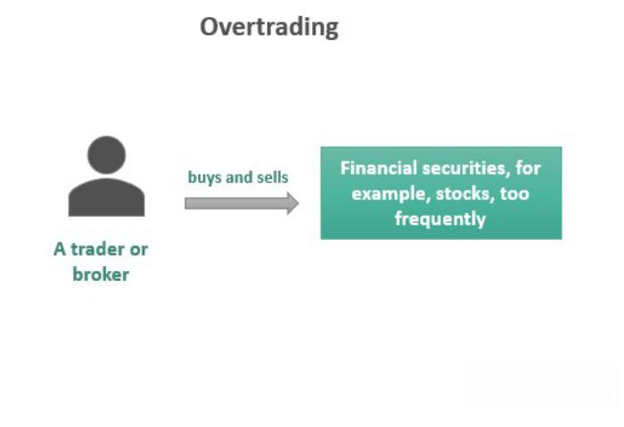

In the dynamic world of stock trading, staying informed about key concepts and techniques is essential. The concept of overtrading represents a significant phenomenon where excessive buying and selling activities can influence both individual traders and the broader financial markets. This article aims to shed light on overtrading, exploring its effects and how it is intertwined with algorithmic trading practices.

Overtrading is characterized by a series of rapid, often emotionally-driven trades that can have detrimental impacts not only on the trader's financial health but also on market stability. Understanding the cause and effect of this behavior can be pivotal in navigating the often volatile landscape of stock markets. Traders and brokers alike might fall into the patterns of overtrading, each experiencing unique implications that necessitate distinct preventive measures.

As automation and technological advances permeate trading floors, algorithms play an increasingly significant role in potentially exacerbating or mitigating overtrading tendencies. Automated trading programs can execute hundreds, if not thousands, of trades in microseconds, adding layers of complexity to market behavior and trader psychology.

This article will explore how individuals and brokers are affected by overtrading and will discuss strategies to prevent such behavior. By understanding these dynamics, traders can develop more disciplined approaches to trading, thereby reducing their risk exposure and helping stabilize market conditions.

## Table of Contents

## Understanding Overtrading

Overtrading occurs when traders engage in the excessive buying and selling of stocks, often driven by emotional reactions or misinterpretations of market conditions. This behavior can be particularly detrimental to financial stability. For brokers, overtrading primarily manifests as churning, a practice aimed at increasing commissions by encouraging unnecessary frequent trades. Brokers may prioritize personal gain over clients' financial health, resulting in increased transaction costs for the client without corresponding benefits.

For individual traders, overtrading often represents an attempt to recuperate financial losses. Emotional states such as anxiety, fear, or overconfidence can trigger this behavior, leading to impulsive decisions rather than strategic planning. Market misinterpretations, such as false signals from indicators or news events, may also prompt traders to enter and exit positions too frequently, resulting in increased exposure to transaction costs and potential losses.

Recognizing the symptoms of overtrading is essential for individuals to protect their investments and maintain financial discipline. Symptoms include unusually high trading volumes relative to typical levels, rapid depletion of capital, and engaging in frequent short-term trades without a clear strategic rationale. By identifying these signs early, traders and brokers can take steps to mitigate its negative impacts, preserving both financial resources and market stability.

## Causes and Symptoms of Overtrading

Overtrading is a phenomenon in stock trading characterized by excessive buying and selling of financial instruments. The underlying causes of overtrading are multifaceted, driven primarily by psychological factors and technological advancements in trading platforms.

Psychologically, fear and greed are prominent drivers of overtrading. Traders may panic and make impulsive decisions when faced with adverse market conditions, leading to rapid buying and selling without a thoughtful strategy. Conversely, the greed of capitalizing on short-term market fluctuations can compel traders to execute frequent trades to maximize gains, often increasing their exposure to risk.

Technological advancements in digital trading platforms have made access to financial markets easier and more immediate, which can contribute to overtrading. With low barriers to entry, traders can engage in trades with just a few clicks. This ease of access rewards instant decision-making but, paradoxically, encourages trading behavior that lacks rigorous analysis and long-term planning.

Symptoms of overtrading manifest through various indicators, such as high trading volumes and frequent execution of short-term trades. High trading volumes indicate that a trader is participating in numerous transactions, often without a strategic basis. This pattern of behavior is typically accompanied by rapid capital depletion, as transaction costs and potential losses accumulate over time. 

Furthermore, frequent short-term trades, often executed without substantial backing in research or a coherent strategy, signify a departure from disciplined trading practices. This absence of a structured approach can hinder long-term profitability and increase the likelihood of financial loss.

Mitigating overtrading entails recognizing these symptoms early and addressing the psychological and technological factors influencing trading behavior. By doing so, traders can avoid the pitfalls associated with excessive trading activities.

## Impact of Overtrading on the Stock Market

Overtrading has significant repercussions on the stock market, primarily contributing to increased market [volatility](/wiki/volatility-trading-strategies). When traders engage in excessive buying and selling, the frequent transactions can lead to rapid fluctuations in stock prices. This volatility arises because overtrading often lacks the backing of strategic analysis, resulting in impulsive decisions driven by market noise rather than fundamental data. As traders react to short-term price changes, this behavior amplifies price movements, making the market more unpredictable.

Another impact of overtrading is the creation of inefficient pricing. Efficient market hypothesis (EMH) suggests that asset prices reflect all available information; however, overtrading can distort this process. When trades are made based on emotional responses or speculative impulses rather than economic indicators, stock prices may deviate from their intrinsic values. This mispricing can mislead investors about a security's real worth, potentially leading to misguided investment decisions.

Overtrading also has the potential to contribute to the formation of financial bubbles. These bubbles occur when asset prices significantly exceed their intrinsic value, primarily driven by exuberant market behavior and speculative trading. As overtrading often involves chasing market trends without solid backing, it can inflate asset prices unsustainably. When the market eventually corrects the mispricing, it can trigger abrupt asset value declines, leading to a bubble burst with severe financial repercussions.

Furthermore, the implications of overtrading extend beyond individual traders, impacting broader market dynamics. High trading volumes can overwhelm market infrastructure, increasing transaction costs and straining [liquidity](/wiki/liquidity-risk-premium). This strain can pose systemic risks, particularly if it leads to an inability for the market to absorb trades efficiently, possibly resulting in delays and execution difficulties.

In conclusion, overtrading is a multifaceted issue that affects both individual market participants and the collective stability of financial markets. Its propensity to increase market volatility, lead to inefficient pricing, and potentially inflate financial bubbles highlights the importance of recognizing and addressing overtrading tendencies in investment strategies.

## Types of Overtrading

Overtrading manifests in several forms, each with unique characteristics and challenges. Understanding these forms is essential for developing effective prevention strategies.

Discretionary overtrading occurs when traders rely on personal judgment rather than structured strategies. This form is typically driven by emotional responses such as greed or fear. Discretionary traders might execute numerous trades based on market rumors or unverified information, often leading to irrational decision-making and financial losses. The primary challenge in managing discretionary overtrading is cultivating self-discipline and implementing strict trading rules. Traders are encouraged to maintain a trading journal to evaluate their decisions and recognize patterns that lead to overtrading.

Technical overtrading is characterized by excessive reliance on technical indicators to make trading decisions. Traders might execute numerous trades based on short-term signals from moving averages, relative strength indices, or other technical tools, without considering the broader market context. This approach can lead to high transaction costs and portfolio volatility. To counteract technical overtrading, traders should focus on a few key indicators that align with their trading strategy and timeframe. Overdependence on multiple indicators often results in contradictory signals, confusing the trader and prompting unnecessary trades.

Algorithmic overtrading involves automated trading systems that execute high-frequency trades based on pre-set algorithms. These systems can rapidly open and close positions, sometimes thousands in a day, without human intervention. While [algorithmic trading](/wiki/algorithmic-trading) can be highly efficient, it poses risks of flash crashes and market disruptions if not adequately controlled. A core challenge is the absence of emotional oversight, which could prevent rash decisions. To manage algorithmic overtrading, developers and traders should set stringent risk management protocols within the algorithms, including limits on trade frequency and position sizes. Incorporating [machine learning](/wiki/machine-learning) and [artificial intelligence](/wiki/ai-artificial-intelligence) can also enhance these systems' adaptability and precision.

Each form of overtrading demands a customized approach to prevention. For discretionary overtrading, psychological strategies and disciplined frameworks are essential. Technical traders need to streamline their indicator use and prioritize strategic alignment over signal quantity. In contrast, algorithmic traders must focus on robust coding practices and comprehensive risk measures. By addressing the specific attributes of each type, traders can mitigate the risks associated with overtrading and enhance their market performance.

## Algorithmic Trading and Overtrading

Algorithmic trading has revolutionized financial markets by introducing systems capable of executing complex trading strategies at lightning speed with minimal human intervention. This automation relies heavily on algorithms—sets of rules and instructions designed to execute trades based on pre-defined criteria. A significant benefit of algorithmic trading is its ability to enhance market efficiency by improving liquidity and narrowing bid-ask spreads. However, this automation also presents unique challenges, particularly concerning overtrading.

Overtrading, in the context of algorithmic trading, is primarily driven by high-frequency trading ([HFT](/wiki/high-frequency-trading-strategies)) practices. These involve executing a large number of orders at extremely rapid speeds, often within microseconds. High-frequency traders utilize sophisticated technological setups to gain competitive advantages, seeking profits through minute price differences across various markets or exploiting other traders' order flows. While such trading can lead to tighter spreads and increased liquidity, it can also result in heightened market volatility and contribute to systemic risks.

A primary concern with algorithmic overtrading lies in its propensity to exacerbate price fluctuations. The algorithms executing these high-frequency trades react to market signals almost instantaneously, often amplifying trends that might otherwise dissipate under slower trading conditions. For instance, in situations where algorithms misinterpret extraneous market data or incorrectly predict price movements, they can trigger cascades of trades that lead to flash crashes—sudden, severe market downturns occurring within minutes.

Furthermore, algorithmic trading systems, if poorly designed or inadequately monitored, can spiral into excessive trading behavior unintentionally. Such scenarios may arise from bugs in the code or from feedback loops where the algorithm continuously reacts to its own trading patterns, setting off a chain of self-reinforcing transactions. These feedback loops can significantly impact market stability by creating artificial volumes and increasing the instances of mispricing.

To mitigate the risks associated with algorithmic overtrading, several strategies have been suggested. Regulators and financial institutions implement circuit breakers, which pause trading temporarily to prevent excessive trading during extreme market movements. Additionally, strict testing and evaluation of algorithms are essential before deployment, ensuring they can handle various market conditions without adverse effects.

Despite the challenges, algorithmic trading remains an integral component of modern financial markets. By continually refining algorithms and incorporating robust risk management protocols, traders and institutions can harness the benefits of algorithmic trading while minimizing its potential downsides, particularly in relation to overtrading and market volatility.

## Preventing Overtrading

Preventing overtrading is essential for sustaining a healthy trading environment and ensuring long-term profitability. Several strategies can help traders avoid the pitfalls of excessive trading, primarily focusing on discipline, risk management, and technological tools.

Maintaining a disciplined trading strategy necessitates adhering to a well-defined plan. Traders should develop a comprehensive trading plan that outlines entry and [exit](/wiki/exit-strategy) points, position sizing, and specific criteria that must be met before executing a trade. This plan acts as a roadmap, guiding traders and reducing impulsive decisions that often lead to overtrading. Consistency and restraint are key components of disciplined trading. By sticking to a predetermined plan, traders can minimize the emotional reactions that contribute to excessive trading activity.

Risk management techniques are vital in preventing overtrading. Traders can manage risk by setting strict limits on the amount of capital allocated to each trade and diversifying their portfolios. Proper diversification spreads risk across various assets and reduces the negative impact of any single position's performance. Furthermore, implementing risk management strategies like the use of stop-loss orders can protect against significant losses. A stop-loss order automatically sells a security when its price falls to a specific level, thereby limiting potential losses.

Technology offers additional tools to help traders prevent overtrading. Stop-loss orders, as mentioned, are automated systems that play a critical role in risk management by limiting losses without requiring constant monitoring. Other technological tools, such as trading algorithms, can assist in executing trades based on preset criteria, thereby reducing the emotional influence on trading decisions.

Self-awareness is essential for managing overtrading tendencies. Traders must regularly evaluate their trading actions, recognizing patterns that may indicate overtrading. This introspection allows traders to adjust their behaviors and regain control over impulsive actions.

Educating oneself about the implications of overtrading is another preventative measure. Traders who understand the costs associated with overtrading, such as transaction fees and potential losses, are more likely to avoid it. Continuous learning and staying informed about market trends and trading strategies can empower traders to make informed decisions rather than impulsive ones.

In summary, preventing overtrading involves a combination of disciplined trading strategies, robust risk management, technology utilization, self-awareness, and education. By adopting these practices, traders can reduce the likelihood of falling into the overtrading trap and enhance their chances of achieving long-term success in the stock market.

## Conclusion

Overtrading is an enduring challenge in financial markets, affecting not only individual traders who might find themselves ensnared in cycles of excessive transactions but also impacting broader market dynamics. This phenomenon can lead to increased volatility, inefficient pricing, and the formation of financial bubbles. The consequences underscore the importance of grasping the intricacies of overtrading to develop effective strategies that mitigate its risks.

Implementing robust strategies is essential for preventing the tendency toward overtrading. Disciplined trading practices, including setting clear objectives and adhering to a defined risk management framework, are vital. Techniques such as employing stop-loss orders can effectively cap potential losses, helping traders to maintain control over their portfolios. Moreover, education plays a crucial role in prevention; understanding the psychological and emotional triggers that prompt overtrading can equip traders to avoid these pitfalls.

Embracing technology intelligently and responsibly also serves as a key measure in preventing overtrading. Automated trading systems, when used judiciously, can enhance trading efficiency without exacerbating excessive trading behaviors. However, these systems must be carefully monitored to ensure they do not inadvertently encourage high-frequency trades that contribute to market disruption.

In conclusion, while overtrading presents significant challenges, it is possible to navigate these through awareness and strategic planning. By recognizing the potential dangers and implementing well-considered approaches, traders can avoid the adverse effects of excessive trading and contribute to more stable and efficient markets.

## References & Further Reading

[1]: Bergstra, J., Bardenet, R., Bengio, Y., & Kégl, B. (2011). ["Algorithms for Hyper-Parameter Optimization."](https://proceedings.neurips.cc/paper/2011/file/86e8f7ab32cfd12577bc2619bc635690-Paper.pdf) Advances in Neural Information Processing Systems 24.

[2]: ["Advances in Financial Machine Learning"](https://www.amazon.com/Advances-Financial-Machine-Learning-Marcos/dp/1119482089) by Marcos Lopez de Prado

[3]: ["Evidence-Based Technical Analysis: Applying the Scientific Method and Statistical Inference to Trading Signals"](https://www.amazon.com/Evidence-Based-Technical-Analysis-Scientific-Statistical/dp/0470008741) by David Aronson

[4]: ["Machine Learning for Algorithmic Trading"](https://github.com/stefan-jansen/machine-learning-for-trading) by Stefan Jansen

[5]: ["Quantitative Trading: How to Build Your Own Algorithmic Trading Business"](https://www.amazon.com/Quantitative-Trading-Build-Algorithmic-Business/dp/1119800064) by Ernest P. Chan