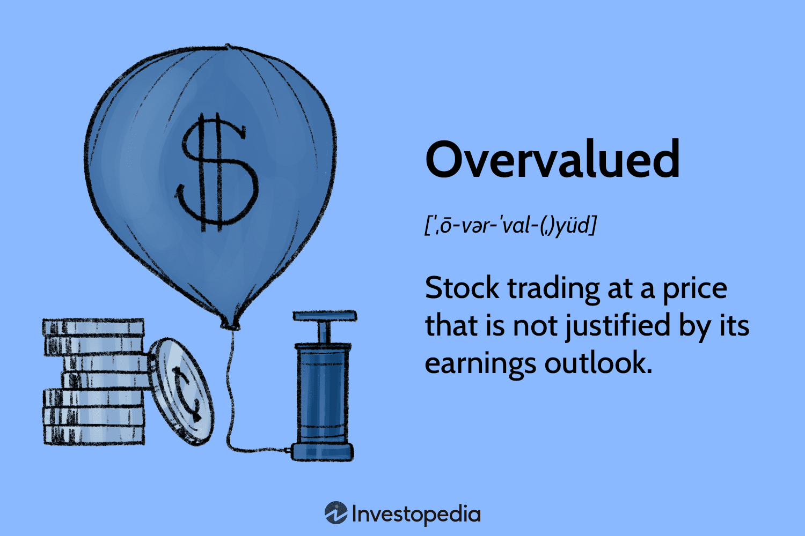

## Table of Contents

## What is an overvalued stock?

An overvalued stock is when the price of a stock is higher than what it should be, based on the company's actual worth. This can happen because of many reasons, like too much excitement about the company or because people think it will grow a lot in the future. But, the high price might not match the company's real value, like how much money it makes or what it owns.

When a stock is overvalued, it might be risky to buy it. If the price goes down to what it should be, people who bought it at the high price could lose money. It's important for investors to look at a company's numbers and future plans to decide if a stock is overvalued. They can use tools like the price-to-earnings ratio to help figure this out.

## How can you identify an overvalued stock?

To spot an overvalued stock, you need to compare the stock's price to the company's real value. One way to do this is by looking at the price-to-earnings (P/E) ratio. This ratio tells you how much you're paying for each dollar of the company's earnings. If the P/E ratio is much higher than the average for similar companies, the stock might be overvalued. Another way is to check the price-to-book (P/B) ratio, which compares the stock price to the company's net assets. A high P/B ratio can also suggest that the stock is overvalued.

You can also use other financial measures like the price-to-sales (P/S) ratio and the price-to-cash-flow (P/CF) ratio. These ratios help you see if the stock price is too high compared to the company's sales or cash flow. Sometimes, stocks can seem overvalued because of high expectations for future growth. If the company doesn't meet these expectations, the stock price might drop. So, it's important to look at the company's future plans and see if they seem realistic.

Remember, no single measure can tell you for sure if a stock is overvalued. It's best to use a mix of these ratios and do your own research. Look at the company's financial health, its industry, and what's happening in the market. This will give you a better idea of whether a stock's price is too high or if it's a good buy.

## What are the common metrics used to determine if a stock is overvalued?

To figure out if a stock is overvalued, people often look at something called the price-to-earnings (P/E) ratio. This ratio tells you how much you're paying for each dollar of the company's earnings. If the P/E ratio is much higher than what's normal for similar companies, it might mean the stock's price is too high. Another useful measure is the price-to-book (P/B) ratio, which compares the stock price to what the company is actually worth if you looked at its assets. A high P/B ratio can be a sign that the stock is overvalued.

There are other ways to check if a stock is overvalued too. The price-to-sales (P/S) ratio helps you see if the stock price is too high compared to the company's sales. And the price-to-cash-flow (P/CF) ratio looks at the stock price in relation to how much cash the company is bringing in. High numbers in these ratios might mean the stock is overvalued. But remember, these numbers don't tell the whole story. Sometimes, a stock can seem overvalued because people expect the company to grow a lot in the future. If those expectations don't come true, the stock price might go down.

It's best to use a mix of these ratios and do your own research. Look at the company's financial health, what's happening in its industry, and what's going on in the market. This will help you get a better idea if the stock's price is too high or if it's a good buy. No single measure can tell you for sure if a stock is overvalued, so it's important to look at everything together.

## What are the risks of investing in overvalued stocks?

Investing in overvalued stocks can be risky. If a stock's price is too high compared to what the company is really worth, it might go down when the market realizes it's overvalued. This means you could lose money if you bought the stock at its high price. Also, if many people start selling the stock because they think it's too expensive, the price can drop fast. This is called a market correction, and it can be hard to predict when it will happen.

Another risk is that overvalued stocks often come with high expectations for future growth. If the company doesn't meet these expectations, the stock price can fall. For example, if a company was expected to grow a lot but doesn't, investors might sell their shares, causing the price to drop. This can be especially risky if you paid a lot for the stock because you believed in the company's future plans. It's important to do your research and not just follow the crowd when it comes to investing in stocks that seem overvalued.

## Can overvalued stocks still be good investments? Why or why not?

Yes, overvalued stocks can still be good investments, but it depends on a lot of things. Just because a stock seems expensive now doesn't mean it won't keep going up. If the company keeps growing and making more money, the stock price might stay high or even go higher. Also, if everyone thinks the company will do well in the future, the stock price might stay overvalued for a long time. So, if you believe in the company's future, buying an overvalued stock might still be a smart move.

But, there are risks too. If the stock is overvalued and the company doesn't meet the high expectations, the price can drop a lot. This means you could lose money if you bought the stock at its high price. It's important to look at the company's financial health, its plans for the future, and what's happening in the market. If you think the company will keep doing well, an overvalued stock might be worth the risk. But if you're not sure, it might be safer to wait for the price to come down or look at other stocks.

## What are some historical examples of overvalued stocks and their outcomes?

One famous example of an overvalued stock is the dot-com bubble in the late 1990s and early 2000s. Companies like Pets.com and Webvan had stock prices that were way too high compared to what they were actually worth. People were excited about the internet and thought these companies would make a lot of money in the future. But, when it turned out that many of these companies were losing money and not growing as fast as expected, their stock prices crashed. Pets.com went from being valued at over $300 million to going out of business in less than a year.

Another example is Tesla in 2020 and 2021. At one point, Tesla's stock price was so high that its market value was more than all the other car companies combined. Some people thought Tesla was overvalued because its price-to-earnings ratio was much higher than other car companies. But, Tesla kept growing and making more money, so its stock price stayed high. Even though some people thought it was overvalued, those who believed in Tesla's future and held onto their stocks made a lot of money.

These examples show that overvalued stocks can go either way. Sometimes, they crash and people lose money. Other times, if the company keeps doing well, the stock price can stay high or even go higher. It's important for investors to look at the company's numbers and future plans to decide if a stock is really overvalued or if it might still be a good investment.

## How does market sentiment affect the valuation of stocks?

Market sentiment is how people feel about the stock market and certain companies. It can make a big difference in how much a stock is worth. When people are excited and think a company will do well, they might buy a lot of its stock. This makes the stock price go up, even if the company's real value hasn't changed. For example, if everyone thinks a new tech company will be the next big thing, the stock might get overvalued because of all the excitement.

On the other hand, if people are worried or think a company won't do well, they might sell the stock. This can make the stock price go down, even if the company is still doing okay. Sometimes, bad news or a general feeling that the market is risky can make people sell stocks, causing prices to drop. So, market sentiment can push stock prices higher or lower, sometimes making them overvalued or undervalued based on how people feel, not just on the company's actual worth.

## What role do economic cycles play in stock valuations?

Economic cycles, which are the ups and downs in the economy, can have a big impact on how much stocks are worth. When the economy is doing well and growing, people feel more confident and are more likely to invest in stocks. This can push stock prices up, sometimes making them overvalued because everyone is excited about the good times. Companies also tend to make more money during these good times, which can support higher stock prices. But if the economy is in a boom, people might start to think prices are too high and could come down if the economy slows down.

On the other hand, when the economy is not doing so well, like during a recession, people might get worried and start selling their stocks. This can make stock prices go down, sometimes making them undervalued because everyone is scared about the bad times. Companies might make less money during these tough times, which can also push stock prices down. So, understanding where we are in the economic cycle can help investors figure out if stock prices are too high or too low and make better choices about when to buy or sell.

## What are some advanced valuation models used to assess stock prices?

One advanced way to figure out if a stock is priced right is by using the Discounted Cash Flow (DCF) model. This model looks at how much money a company is expected to make in the future and then figures out what that money is worth today. It's like saying, "If I know this company will make a lot of money in the future, how much should I pay for its stock now?" To do this, you need to guess how much the company will grow and what interest rates will be. If the stock's price is a lot higher than what the DCF model says it should be, the stock might be overvalued.

Another advanced model is the Residual Income Model (RIM). This model looks at how much money a company makes after paying for everything it needs to run its business. It then figures out what that extra money is worth today. The idea is to see if the company is making more money than it needs to and if that extra money is enough to justify the stock's price. If the stock's price is much higher than what the RIM says it should be, it might be overvalued. Both of these models need a lot of guesses about the future, so they're not perfect, but they can help investors make smarter choices.

## How can investors use short selling as a strategy when dealing with overvalued stocks?

Short selling is a way for investors to make money when they think a stock's price is too high and will go down. Instead of buying the stock, they borrow it from someone else and sell it right away at the high price. Then, if the stock price does go down like they thought, they buy it back at the lower price and give it back to the person they borrowed it from. The difference between the high price they sold it at and the lower price they bought it back at is their profit. This can be a good way to make money if you're sure a stock is overvalued and will drop soon.

But, short selling can be risky. If the stock price goes up instead of down, the investor loses money. They still have to buy the stock back to give it back to the person they borrowed it from, but now they have to pay more than they sold it for. This can lead to big losses if the stock keeps going up. Also, there's no limit to how much a stock can go up, so the potential losses can be huge. That's why short selling is usually done by experienced investors who have done a lot of research and are willing to take on this kind of risk.

## What are the long-term investment strategies to mitigate the risks of overvalued stocks?

One way to lower the risks of overvalued stocks over a long time is to spread out your money across different kinds of investments. This is called diversification. Instead of putting all your money into one stock that you think might be too expensive, you can buy stocks in different companies, in different industries, and even in different countries. This way, if one stock goes down because it was overvalued, the other stocks might still do well and help balance out your losses. It's like not putting all your eggs in one basket.

Another good strategy is to focus on the long term and not get too caught up in short-term price changes. Overvalued stocks might go down in the short term, but if you believe in the company's future, holding onto the stock for a long time might still pay off. It's important to keep checking the company's performance and the overall market, but if the company keeps growing and making money, the stock price might eventually catch up to its real value. Patience and doing your homework can help you make smarter choices about when to buy or sell.

## How can portfolio diversification help manage the risks associated with overvalued stocks?

Portfolio diversification means spreading your money across different kinds of investments. This can help you manage the risks of overvalued stocks. If you think a stock is too expensive and might go down, but you still want to invest, you can put some money in that stock and the rest in other stocks or investments. This way, if the overvalued stock does drop in price, the other parts of your portfolio might still do well and help balance out your losses. It's like not putting all your eggs in one basket, so if one egg breaks, you still have others that are okay.

Diversification also helps you stay calm when the market gets bumpy. If you have a mix of stocks, some might go up while others go down. This can make your overall portfolio more stable. Over time, this can protect you from big losses if one or two stocks were overvalued and dropped a lot. By spreading your investments, you give yourself a better chance of having some winners that can make up for any losers, helping you manage the risks of overvalued stocks in the long run.

## What is the key to understanding overvalued stocks?

An overvalued stock is identified when its current market price exceeds what analysts and investors believe it should be, based on the company's earnings outlook and other underlying fundamental factors. This discrepancy often arises when market sentiment drives stock prices to levels that cannot be rationally justified by the company's actual or projected performance. A common metric used to assess stock valuation is the price-earnings (P/E) ratio, which is calculated as:

$$
\text{P/E Ratio} = \frac{\text{Market Price per Share}}{\text{Earnings per Share (EPS)}}
$$

Stocks trading at higher P/E ratios than their industry peers are frequently considered overvalued. The rationale is that higher P/E ratios imply higher expectations for growth that may not materialize, making these stocks susceptible to price corrections when expectations are not met.

Investors should exercise caution with overvalued stocks, as history suggests that their prices are likely to decline over time to align with intrinsic values. This corrective process is often referred to as "mean reversion," a concept where prices eventually gravitate towards their historical average. An overly optimistic market sentiment can lead to an asset bubble, characterized by sharp price increases followed by significant declines once the bubble bursts. As a safeguard, investors scrutinize various aspects, including the competitive landscape, revenue growth, and economic indicators, to determine if a stock's price reflects an inflated value not supported by its fundamentals.

In summary, while the allure of high-priced stocks might seem promising, the inherent risks underline the importance of thorough analysis and cautious investment decisions. Understanding and identifying overvalued stocks can be crucial in maintaining a balanced and prudent investment portfolio.

## How can one identify and trade overvalued stocks using algorithms?

Identifying and trading overvalued stocks using algorithms involves leveraging technology to streamline the decision-making process in stock trading. One effective method is to use algorithms to scan for stocks with high price-to-earnings (P/E) ratios, which often indicate potential overvaluation. The P/E ratio is calculated by dividing the current share price by the earnings per share (EPS):

$$
\text{P/E Ratio} = \frac{\text{Share Price}}{\text{Earnings Per Share}}
$$

Stocks with unusually high P/E ratios compared to industry averages may be overvalued, suggesting that their market price does not align with their earnings potential. By continuously monitoring and comparing P/E ratios, algorithms can flag these stocks for further analysis or action.

Once potential overvalued stocks are identified, algorithms can automate the process of short selling. Short selling involves selling borrowed stocks with the intention of buying them back at a lower price. This strategy is based on the expectation that the stock's price will decline to its intrinsic value over time. The automation of short selling through algorithms enhances speed and accuracy, reducing human error and emotional bias in trading decisions.

Risk management is critical in trading, especially when dealing with overvalued stocks susceptible to price [volatility](/wiki/volatility-trading-strategies). Algorithms can be designed to implement various risk management techniques. For example, algorithms can include mechanisms to set stop-loss orders, which automatically sell a stock when it reaches a certain price to prevent further loss:

```python
def set_stop_loss(current_price, stop_loss_percentage):
    stop_loss_price = current_price * (1 - stop_loss_percentage / 100)
    return stop_loss_price

# Example usage
current_price = 100
stop_loss_percentage = 5
stop_loss_price = set_stop_loss(current_price, stop_loss_percentage)
print(f"Stop Loss Price: {stop_loss_price}")
```

Additionally, risk management algorithms can distribute capital across different stocks and sectors, diversifying exposure and minimizing potential losses from any single overvalued position. They can also adjust trading rules dynamically based on market conditions, using historical data to refine strategies and improve future performance.

Ultimately, identifying and trading overvalued stocks with algorithms incorporates a systematic approach, reducing reliance on intuition while simultaneously enhancing precision and efficiency in the face of market fluctuations. This capability allows investors to manage overvalued stock risks effectively and capitalize on price adjustments.

## References & Further Reading

[1]: ["Advances in Financial Machine Learning"](https://www.amazon.com/Advances-Financial-Machine-Learning-Marcos/dp/1119482089) by Marcos Lopez de Prado

[2]: ["Evidence-Based Technical Analysis: Applying the Scientific Method and Statistical Inference to Trading Signals"](https://www.amazon.com/Evidence-Based-Technical-Analysis-Scientific-Statistical/dp/0470008741) by David Aronson

[3]: ["Machine Learning for Algorithmic Trading"](https://www.amazon.com/Machine-Learning-Algorithmic-Trading-alternative/dp/1839217715) by Stefan Jansen

[4]: ["Quantitative Trading: How to Build Your Own Algorithmic Trading Business"](https://www.amazon.com/Quantitative-Trading-Build-Algorithmic-Business/dp/1119800064) by Ernest P. Chan