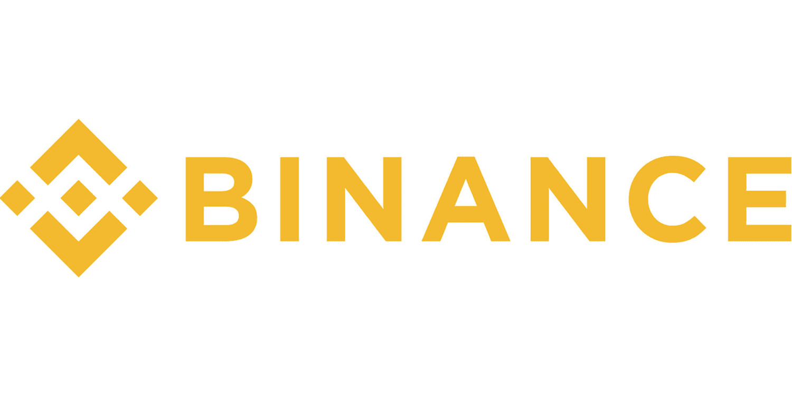

Cryptocurrency exchanges serve as pivotal platforms in the digital trading landscape, enabling the buying, selling, and exchange of cryptocurrencies. These platforms have revolutionized traditional trading systems by providing real-time access to a wide array of digital assets. Among the plethora of crypto exchanges, Binance stands out as one of the most significant players globally. Established in 2017, Binance has rapidly ascended to prominence, becoming a dominant force in the cryptocurrency market. Its extensive range of services, including spot trading, futures, and staking, coupled with a vast user base, underscores its influence in digital finance.

Algorithmic trading, a method that uses automated pre-programmed trading instructions, is gaining traction in crypto markets. Its advantages include executing trades at optimal prices, timely responses based on pre-set conditions, and the elimination of emotional bias that often plagues human traders. The speed and efficiency provided by algorithms are invaluable in volatile markets such as cryptocurrencies, where price movements can be swift and unpredictable.

This article focuses on reviewing Binance’s extensive offerings in 2024, particularly with regard to algorithmic trading. Binance’s algorithmic trading tools and features provide traders with a robust framework to capitalize on market opportunities. The review will examine the specific tools and updates Binance has introduced, evaluate its pros and cons, and explore its security measures and regulatory compliance. Additionally, we will incorporate user experiences and speculate about future developments in algorithmic trading on Binance. Through this comprehensive analysis, readers will gain insights into the evolving landscape of cryptocurrency trading and Binance's pivotal role.

## Table of Contents

## What is Binance?

Binance, founded in 2017 by Changpeng Zhao and Yi He, is a leading cryptocurrency exchange platform globally renowned for its comprehensive suite of digital asset services. Originally based in China, Binance quickly relocated its operations to various countries in response to increasing regulatory scrutiny, maintaining compliance while achieving rapid expansion. It has since established itself as a dominant force in the cryptocurrency market, boasting millions of users worldwide.

Binance offers a diverse range of services to cater to different levels of trading expertise. Its spot trading platform allows users to trade a vast array of cryptocurrencies with competitive fees, while its futures trading service provides advanced options for leveraged trading, attracting both retail and institutional investors. In addition to trading, Binance offers staking options for users to earn rewards on their holdings, which involves participating in the network's consensus process and helping to secure the blockchain.

The exchange's influence extends beyond traditional trading avenues. Binance's launchpad feature supports the development of new blockchain projects by facilitating token sales, providing a gateway for new and innovative ventures in the crypto space. Additionally, Binance has introduced its native cryptocurrency, Binance Coin (BNB), which is used for various transactions within the Binance ecosystem, including trading fee discounts and participation in token sales.

With a substantial and active user base, Binance continues to exert significant influence on the [cryptocurrency](/wiki/cryptocurrency) market. It reshapes how digital assets are exchanged and perceived, primarily through its commitment to innovation and expansion of service offerings. As of 2024, Binance remains at the forefront of the cryptocurrency exchange landscape, continually enhancing its platform to accommodate the growing and evolving needs of its users.

## Understanding Algorithmic Trading

Algorithmic trading, often referred to as algo trading, involves using computer programs to execute trades based on predefined criteria. It leverages mathematical models and statistical analysis to determine the optimal timing and price for trades, aiming to maximize profitability while managing risk. In cryptocurrency markets, where price fluctuations can be rapid and unpredictable, [algorithmic trading](/wiki/algorithmic-trading) has become particularly valuable.

The primary advantages of algorithmic trading include speed, efficiency, and the elimination of emotional bias. Computers can analyze vast amounts of data and execute trades in milliseconds, far quicker than a human trader. This speed is especially beneficial in cryptocurrency markets, where opportunities and risks alike can emerge and vanish quickly. The efficiency of algorithms allows traders to handle complex strategies across multiple trading pairs without constant manual monitoring. Moreover, algorithmic trading removes emotional influences from the decision-making process, a crucial [factor](/wiki/factor-investing) in the volatile and often highly speculative world of cryptocurrencies.

Several common strategies are employed in algorithmic trading. *Arbitrage* exploits price differences of the same asset on different exchanges. For example, a trader might buy Bitcoin on one exchange where the price is lower and simultaneously sell it on another where the price is higher, profiting from the spread. *Trend-following* involves using algorithms to identify and capitalize on market trends. These algorithms use historical data and technical indicators to predict potential directions, buying assets at the start of an upward trend and selling when the trend reverses. *Market making* is another strategy where traders provide [liquidity](/wiki/liquidity-risk-premium) to the market, buying and selling large volumes of a cryptocurrency within a narrow price range to earn the bid-ask spread.

To successfully engage in algorithmic trading, certain technological requirements and a robust knowledge base are essential. A high level of programming skills is often required to develop, test, and fine-tune trading algorithms. Python is a popular language due to its extensive libraries and frameworks that facilitate data analysis and [machine learning](/wiki/machine-learning), both integral to algorithmic trading. The infrastructure needs include a powerful computational setup to handle data processing and network capabilities to ensure real-time data access and trade execution. Understanding financial markets, statistical analysis, and risk management principles is equally important to design effective algorithms that adapt to market dynamics and avoid significant losses.

## Binance's Algorithmic Trading Tools and Features in 2024

In 2024, Binance continues to be a frontrunner in the cryptocurrency exchange arena by enhancing its offerings for algorithmic traders. Recognizing the growing importance of automation and algorithmic strategies in trading, Binance has bolstered its suite of tools designed to attract and support traders looking to leverage these techniques.

One of the key elements of Binance's offerings is its comprehensive API suite. The Binance API provides extensive endpoints that facilitate seamless integration with trading systems, ensuring that users can execute trades, retrieve market data, and manage their accounts programmatically. This robust API is essential for automated trading, allowing algos to interact with market data and execute trades in real time.

Additionally, in 2024, Binance introduced several upgrades to its trading bots and API capabilities. The updated Binance Spot and Futures APIs now offer enhanced latency measures, improved rate limits, and more sophisticated order types, aiding traders in implementing speed-sensitive strategies like [arbitrage](/wiki/arbitrage). These improvements ensure that algorithmic traders have the precision and flexibility needed to execute complex strategies.

Binance also supports integration with third-party trading platforms, expanding the usability for those preferring external software. This compatibility extends to popular trading software, enabling users to write custom scripts and algorithms to execute on Binance's market. For developers and traders unfamiliar with Binance's environment, this ensures a smooth transition and minimizes the technical barriers to entry.

Educational resources provided by Binance are another focal point for 2024. Binance Academy, its educational platform, includes a vast array of content covering the principles and practices of algorithmic trading. Tutorials, webinars, and detailed documentation on bot creation and API usage help both beginners and seasoned traders enhance their skills. This comprehensive support structure ensures that users have access to up-to-date information and can continually refine their trading strategies.

Moreover, Binance's customer support and community forums remain active in resolving queries related to algorithmic trading. By fostering an environment for discussion and troubleshooting, Binance encourages collaborative learning, aiding its users to navigate the intricacies of algorithmic trade efficiently.

Overall, Binance's continuous innovation and commitment to providing sophisticated tools, comprehensive educational resources, and community support underline its dedication to catering to algorithmic traders in 2024, maintaining its position as a leading exchange for high-frequency and automated trading strategies.

## Pros and Cons of Using Binance for Algo Trading

Binance stands out as a premier choice for algorithmic trading, offering numerous features tailored to cater to the needs of both novice and seasoned traders. One of the primary advantages is its exceptional liquidity. Binance consistently ranks among the top cryptocurrency exchanges by trading [volume](/wiki/volume-trading-strategy), which is crucial for executing large trades efficiently and ensuring minimal slippage. This liquidity makes Binance an attractive platform for high-frequency traders who rely on quick execution to capitalize on market opportunities.

Another advantage is Binance’s user-friendly interface. The platform is designed to be intuitive, offering clear navigation that helps traders easily access various functionalities. This aspect is especially beneficial for algorithmic traders who need to monitor multiple parameters simultaneously. Additionally, Binance offers competitive and low trading fees, which are critical for frequent traders whose profits can be significantly impacted by high transaction costs. Binance's tiered fee structure and the option to further reduce fees by using the native Binance Coin (BNB) make it cost-effective.

However, there are downsides to consider. One major concern is risk management, a crucial aspect of any trading strategy. While Binance provides tools to limit risk, the inherent [volatility](/wiki/volatility-trading-strategies) of the cryptocurrency market poses significant risks to traders using algorithms. Market conditions can change rapidly, and while algorithms aim to exploit these movements, they can also amplify losses if not properly managed. Furthermore, regulatory issues pose a potential downside. Binance has faced scrutiny from various regulatory bodies worldwide, and changes in regulatory policies could impact its operations or the legality of certain trading practices.

User reviews and expert opinions generally highlight Binance's robust performance in algorithmic trading. Many users commend its API capabilities, which allow for seamless integration with custom trading bots and third-party software. The API's flexibility and comprehensive documentation are appreciated by developers and traders who create and deploy complex strategies. However, some criticism arises from the occasional system overload or downtime during peak trading periods, which can disrupt algorithmic trading systems that rely on uninterrupted data feeds and execution capabilities.

In comparison to other exchanges offering algorithmic trading, Binance maintains a competitive edge due to its extensive market reach, liquidity, and diverse range of supported coins and tokens. Competitors, such as Coinbase Pro and Kraken, also provide solid algorithmic trading environments but may fall short on liquidity or have higher trading fees. Binance’s continuous introduction of new products and innovations keeps it at the forefront, appealing to traders looking for a dynamic trading ecosystem.

Overall, Binance presents a compelling platform for algorithmic trading with notable advantages like liquidity, a user-friendly interface, and low fees, while also facing challenges related to market risks and regulatory scrutiny. Traders considering Binance must weigh these factors carefully to determine whether it aligns with their trading strategies and risk tolerance.

## Security and Regulatory Compliance

Binance, as one of the largest cryptocurrency exchange platforms, prioritizes the security of its platform and users. It implements robust security measures, especially crucial for activities like algorithmic trading which involves high-frequency transactions and significant capital movement. Binance employs multi-tier and multi-cluster system architecture that ensures a secure and fast trading experience. Critical security features include two-factor authentication (2FA), withdrawal whitelist, and advanced data encryption. These measures collectively help in safeguarding users' assets and personal information from potential breaches.

In terms of regulatory compliance, Binance has taken steps to adapt to the rapidly evolving landscape of cryptocurrency regulations across various jurisdictions. The platform has made concerted efforts to comply with anti-money laundering (AML) and know your customer (KYC) regulations stipulated by national and international regulatory bodies. Binance regularly updates its KYC policies to enhance user verification processes, thereby minimizing risks related to fraud and ensuring a legitimate trading environment.

However, Binance has faced scrutiny and regulatory challenges in multiple regions. For instance, in recent years, regulatory bodies from countries such as the United States, United Kingdom, and Japan have raised concerns about the platform's adherence to local financial regulations. In response, Binance has shown willingness to cooperate with regulators, sometimes suspending services in certain regions or modifying its offerings to align with legal requirements. These regulatory challenges have invariably impacted its algorithmic trading services, potentially affecting the availability and functionality of these services depending on regional regulations.

The regulatory environment plays a significant role in shaping the security measures and operational strategies for Binance's algo trading services. Stricter regulations may result in enhanced security protocols but could also lead to restricted service availability or increased operational costs. Conversely, a more favorable regulatory climate can create opportunities for expansion and innovation within the platform's algorithmic trading offerings.

In summary, Binance's commitment to security and regulatory compliance is evident in its comprehensive security protocols and ongoing adjustments to regulatory requirements. Despite facing challenges, Binance's proactive approach to governance and user protection reflects its dedication to maintaining a secure and compliant trading platform.

## Case Studies and User Experiences

In examining real-world applications of algorithmic trading on Binance, several case studies highlight the effective use of such systems by traders. One trader, John, utilized a trend-following algorithm which monitored 15-min and 1-hour moving averages to execute trades. The bot was set up using Python, implementing the Binance API for real-time data access and execution. Over a six-month period, John reported a 20% increase in portfolio value, attributing his success to the bot's ability to eliminate emotional decision-making and react faster than manual trades.

Another example features a trader named Alice, who applied a market-making strategy. Market making involves placing both buy and sell limit orders in the market, profiting from the spread between the two. Alice leveraged Binance's deep liquidity and low fees to perform thousands of such trades daily. She configured her bot to employ an adaptive algorithm that adjusted spreads based on volatility measures. Her experience underscores two critical factors for success: understanding market structure and constant monitoring to update the algorithm's parameters as needed.

User testimonials on Binance's algorithmic trading tools vary. Some traders appreciate the platform's reliable API and integration with third-party applications such as 3Commas and TradingView, which facilitate more accessible bot management. However, others note challenges, particularly surrounding initial setup and strategy development. Many emphasize the steep learning curve associated with algorithmic trading. Key obstacles include mastering technical analysis, programming languages such as Python, and the initial investment of time to test and refine strategies.

To address these challenges, users often recommend beginning with simple strategies and gradually advancing to more complex systems as one's programming and analytical skills develop. Additionally, educational resources provided by Binance, such as webinars and tutorials, are valuable but may still require supplementary learning from external resources to gain a comprehensive understanding.

In conclusion, while algorithmic trading on Binance has proven beneficial for many, the path to success involves overcoming significant barriers. Technical proficiency, continual learning, and strategic finesse are crucial to navigating the complexities of algorithmic systems effectively. Consequently, prospective algo traders should prepare for a rigorous yet potentially rewarding journey in the dynamic environment of cryptocurrency trading.

## Future Outlook for Binance and Algorithmic Trading

As we look to the future of algorithmic trading on Binance, several key developments and trends are poised to influence this domain significantly. A primary driver of change will be advancements in technology, which continue to reshape the landscape of digital trading. Machine learning and [artificial intelligence](/wiki/ai-artificial-intelligence) are expected to play increasingly pivotal roles, offering traders enhanced predictive analytics, improved risk management, and more sophisticated trade execution strategies. These technologies could enable the creation of algorithms that adapt in real-time to market conditions, enhancing efficiency and profitability.

Quantum computing is another emerging technology that could have profound implications for algorithmic trading. Though still in its nascent stages, quantum computing promises to process complex calculations at unprecedented speeds, potentially revolutionizing data analysis in trading systems. This would allow traders to design more advanced algorithms capable of executing trades at optimal times and prices, leveraging minute market inefficiencies.

Binance's strategic direction is likely to align with these technological trends. The exchange has consistently demonstrated a commitment to innovation and may continue to develop and integrate cutting-edge technology within its platform. Initiatives might include expanding its suite of algorithmic trading tools, enhancing API functionalities for smoother integration with advanced trading software, and offering enriched data analytics services. Binance might also invest in partnerships with tech firms specializing in AI and machine learning to remain at the forefront of trading technology.

However, with these opportunities come challenges. Binance may face increased competition from other cryptocurrency exchanges that are similarly investing in technological advancements. Moreover, the regulatory landscape for cryptocurrency trading is becoming increasingly stringent. Binance must navigate potential regulatory hurdles by ensuring compliance and maintaining robust security measures to protect against cyber threats, which could be exacerbated by more complex technologies.

The shift towards decentralized finance (DeFi) platforms also presents a challenge and an opportunity for Binance. As DeFi continues to grow, traders may favor decentralized exchanges for their algorithmic trading activities, craving transparency and autonomy. Binance could respond by enhancing its own DeFi offerings or integrating DeFi functionalities within its existing framework.

Overall, Binance's future in algorithmic trading appears promising, contingent on its ability to adapt to technological advancements and regulatory changes. Continuous innovation and a keen focus on user needs will likely remain central to maintaining and enhancing its market position.

## Conclusion

In 2024, Binance continues to solidify its position as a leading cryptocurrency exchange, especially notable for its offerings in algorithmic trading. Key advantages include access to robust liquidity, a user-friendly interface, competitive fee structures, and a variety of tools that accommodate both novice and experienced algo traders. Binance's advanced APIs, integration opportunities with third-party software, and educational resources bolster its appeal for those seeking efficiency and precision in their trading strategies.

However, challenges persist, such as market volatility and the complexities inherent to algorithmic trading, which require traders to have a considerable depth of knowledge and a technological setup capable of executing complex strategies. Additionally, the dynamic regulatory environment presents an ongoing challenge, requiring vigilance and adaptability from both Binance and its users.

Prospective algorithmic traders should evaluate their own technical expertise and risk tolerance while considering Binance's features. Conducting further research and engaging with educational materials provided by the platform can aid in making an informed decision. The broader landscape of cryptocurrency trading is continually evolving, driven by advancements in technology and shifting global financial trends. Binance's proactive engagement with these developments suggests its continuing influence in shaping the future of digital trading.

## References & Further Reading

[1]: Bergstra, J., Bardenet, R., Bengio, Y., & Kégl, B. (2011). ["Algorithms for Hyper-Parameter Optimization."](https://dl.acm.org/doi/10.5555/2986459.2986743) Advances in Neural Information Processing Systems 24.

[2]: ["Advances in Financial Machine Learning"](https://www.amazon.com/Advances-Financial-Machine-Learning-Marcos/dp/1119482089) by Marcos Lopez de Prado

[3]: ["Evidence-Based Technical Analysis: Applying the Scientific Method and Statistical Inference to Trading Signals"](https://www.wiley.com/en-us/Evidence+Based+Technical+Analysis%3A+Applying+the+Scientific+Method+and+Statistical+Inference+to+Trading+Signals-p-9780470008744) by David Aronson

[4]: ["Machine Learning for Algorithmic Trading"](https://github.com/stefan-jansen/machine-learning-for-trading) by Stefan Jansen

[5]: ["Quantitative Trading: How to Build Your Own Algorithmic Trading Business"](https://www.amazon.com/Quantitative-Trading-Build-Algorithmic-Business/dp/1119800064) by Ernest P. Chan