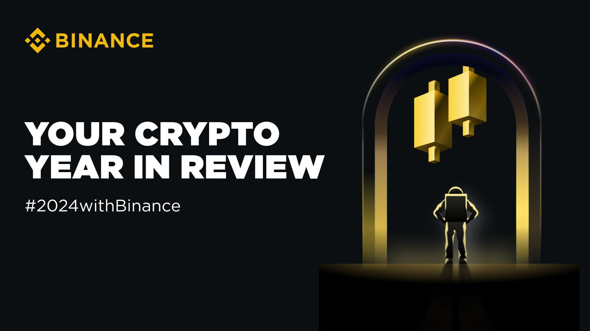

## Table of Contents

## What is Binance and what services does it offer?

Binance is a big company that helps people buy and sell different types of money, like Bitcoin and other cryptocurrencies. It started in 2017 and has become very popular because it is easy to use and has many different kinds of money to trade. People from all over the world use Binance to trade their money and try to make more money.

Binance offers many services to help people with their money. You can trade different cryptocurrencies on their website or app. They also have a special kind of money called Binance Coin (BNB) that you can use on their platform. Besides trading, Binance lets you keep your money safe in their wallets, and they have a place where you can learn more about cryptocurrencies. They also have something called Binance Earn, where you can earn more money by keeping your cryptocurrencies with them.

## How has Binance evolved since its inception?

Since starting in 2017, Binance has grown a lot. At first, it was just a place where people could trade different cryptocurrencies. But soon, it added more kinds of money to trade and made it easier for people all over the world to use. Binance became very popular because it was fast and had low fees. They also started their own special money called Binance Coin (BNB), which people could use on the platform.

Over time, Binance added many new services. They made it possible for people to keep their money safe in Binance wallets. They also started Binance Earn, where people could earn more money by keeping their cryptocurrencies with Binance. To help people learn, they created a place on their website with lots of information about cryptocurrencies. Binance also started working in more countries and even bought other companies to offer more services, like ways to pay with cryptocurrencies in everyday life.

## What are the key features of Binance in 2024?

In 2024, Binance is still a big and popular place for people to trade cryptocurrencies. It has many different kinds of money you can trade, and it's easy to use. Binance has low fees, which means you don't have to pay a lot of money when you trade. They also have their own special money called Binance Coin (BNB), which you can use on their platform. Binance keeps adding new kinds of money and ways to trade, so there's always something new to try.

Binance also offers many other services to help people with their money. You can keep your money safe in Binance wallets, and there's a place on their website where you can learn more about cryptocurrencies. Binance Earn is another feature where you can earn more money by keeping your cryptocurrencies with them. They also work in many countries and have bought other companies to offer more services, like ways to pay with cryptocurrencies in everyday life. This makes Binance a one-stop place for all your cryptocurrency needs.

## How does Binance ensure the security of user funds and data?

Binance takes many steps to keep your money and information safe. They use strong security systems to protect your account. For example, they have something called two-factor authentication, which means you need two ways to prove it's really you when you log in. They also keep most of the money in special safe places called cold wallets, which are not connected to the internet, so it's harder for hackers to steal it. Binance also checks all the money that comes in and goes out to make sure it's safe and follows the rules.

Besides these, Binance has a team that works all the time to watch for anything strange or dangerous. If they see something that doesn't look right, they can stop it before it causes problems. They also have insurance to help if something bad happens. Binance keeps updating their security to stay ahead of people who might try to steal money or information. This way, they can keep your money and data as safe as possible.

## What are the fees associated with trading on Binance in 2024?

In 2024, Binance still has low fees for trading, which is one reason why many people like to use it. When you trade on Binance, you pay a fee that depends on how much you trade and whether you use their special money, Binance Coin (BNB). If you trade a lot, you can get a lower fee. Also, if you pay your fees with BNB, you get a discount, which can save you money.

Besides trading fees, there are other fees to know about. If you want to take your money out of Binance, you might have to pay a withdrawal fee, and this fee can be different for each kind of money. There are no fees for putting money into Binance, but if you use a credit card or other ways to add money, there might be fees from the company that helps with the payment. So, it's good to check all the fees before you start trading on Binance.

## How can beginners start using Binance and what tools are available to them?

Beginners can start using Binance by first creating an account on their website or app. You'll need to give some basic information and set up two-factor authentication to keep your account safe. Once your account is ready, you can add money to it. You can do this by sending cryptocurrencies from another wallet or by using a credit card or bank transfer. After you have money in your account, you can start trading. Binance has a simple interface that makes it easy to buy and sell different kinds of cryptocurrencies.

Binance offers many tools to help beginners learn and trade. They have a special section called Binance Academy where you can find lots of information about cryptocurrencies and how to trade them. There's also a demo trading feature where you can practice trading without using real money. This can help you get used to how everything works. Plus, Binance has customer support that can answer your questions if you need help. All these tools make it easier for beginners to start using Binance and feel more confident about trading.

## What advanced trading options does Binance offer to experienced users?

Binance offers many advanced trading options for experienced users. One of these is margin trading, which lets you borrow money to trade more than you have. This can help you make more money if the price goes the right way, but it can also be risky if the price goes the wrong way. Another option is futures trading, where you can bet on what the price of a cryptocurrency will be in the future. This can be a good way to make money if you know a lot about the market, but it's also very risky.

Binance also has a feature called Binance Options, where you can buy the right to buy or sell a cryptocurrency at a certain price in the future. This can be a good way to protect your money or make more money if you think the price will change a lot. For those who want even more control, Binance offers an API that lets you connect your own trading programs to the platform. This way, you can set up your own rules for trading and let the computer do the work for you. All these advanced options give experienced users more ways to trade and try to make money, but they also come with more risk.

## How does Binance comply with global regulations in 2024?

In 2024, Binance works hard to follow the rules in different countries. They have teams of people who make sure they are doing everything right. Binance talks to the people who make the rules and changes how they work to fit what each country needs. They also check who is using their platform to make sure no one is doing anything wrong. This helps them stay out of trouble and keep their users safe.

Binance also has special licenses in many places. These licenses show that they are allowed to do business there. They keep updating their rules and how they work to match what different countries want. By doing this, Binance can keep offering their services to people all over the world while following the law.

## What are the most popular cryptocurrencies traded on Binance in 2024?

In 2024, the most popular cryptocurrencies traded on Binance are still Bitcoin (BTC) and Ethereum (ETH). These two are like the big stars of the cryptocurrency world. People like to trade them because they are well-known and have been around for a long time. Bitcoin is often called digital gold because many people see it as a safe way to keep their money. Ethereum is popular because it lets people build things like apps and games on its platform.

Besides Bitcoin and Ethereum, other cryptocurrencies like Binance Coin (BNB), Tether (USDT), and Solana (SOL) are also very popular on Binance. BNB is special because it's made by Binance and you can use it to pay for things on their platform. Tether is a stablecoin, which means its price doesn't change much because it's tied to the US dollar. Solana is liked by many because it's fast and can handle a lot of transactions. All these cryptocurrencies are easy to trade on Binance, which is why so many people use them.

## How does Binance's native token, BNB, function within its ecosystem?

BNB, or Binance Coin, is a special kind of money that Binance made. You can use BNB to pay for things on the Binance platform, like trading fees. If you use BNB to pay your fees, you get a discount, which can save you money. BNB also lets you join special events and programs that Binance runs, like token sales where you can buy new kinds of cryptocurrencies before other people.

Besides using BNB on Binance, you can also use it in other places. Many apps and games that run on the Binance Smart Chain, which is like a special road for BNB, accept it as payment. You can also keep your BNB in Binance and earn more money through something called staking. This means you help keep the Binance Smart Chain running smoothly, and in return, you get more BNB. So, BNB is not just for trading on Binance; it's a big part of a whole world of things you can do with cryptocurrencies.

## What are the recent technological advancements implemented by Binance?

Binance keeps making its platform better with new technology. One big change they made is improving how fast you can trade. They use special computers that can do a lot of work quickly, so when you want to buy or sell something, it happens almost right away. They also added something called a decentralized exchange, which means you can trade without Binance being in the middle. This makes trading safer because you keep control of your money.

Another cool thing Binance did is making their own special road for their money, called the Binance Smart Chain. This road lets you do things like play games or use apps that work with BNB. They also made it easier to use their platform on your phone with a new app that works really well. All these changes help make trading easier and safer for everyone who uses Binance.

## How does Binance's performance compare to other major cryptocurrency exchanges in 2024?

In 2024, Binance is still one of the biggest and most popular cryptocurrency exchanges around the world. It has a lot of different kinds of money you can trade, and it's easy to use. Binance is known for having low fees, which means you don't have to pay a lot of money when you trade. They also have many tools and services, like ways to learn about cryptocurrencies and ways to earn more money by keeping your cryptocurrencies with them. Compared to other big exchanges like Coinbase and Kraken, Binance often has more kinds of money to trade and usually lower fees. But, some people might find other exchanges easier to use or more trusted in their own country.

Other exchanges, like Coinbase, are really good at making things simple and safe for people who are new to trading cryptocurrencies. Coinbase has a strong focus on following the rules in different countries, which makes it a good choice for people who want to make sure they are doing everything right. Kraken is another big exchange that is known for being very safe and good at helping people with big trades. While Binance has more kinds of money and lower fees, Coinbase and Kraken might be better for people who want a simpler experience or more help with the rules. So, it really depends on what you need and want from a cryptocurrency exchange.

## References & Further Reading

[1]: Bergstra, J., Bardenet, R., Bengio, Y., & Kégl, B. (2011). ["Algorithms for Hyper-Parameter Optimization."](https://dl.acm.org/doi/10.5555/2986459.2986743) Advances in Neural Information Processing Systems 24.

[2]: ["Advances in Financial Machine Learning"](https://www.amazon.com/Advances-Financial-Machine-Learning-Marcos/dp/1119482089) by Marcos Lopez de Prado

[3]: ["Evidence-Based Technical Analysis: Applying the Scientific Method and Statistical Inference to Trading Signals"](https://www.wiley.com/en-us/Evidence+Based+Technical+Analysis%3A+Applying+the+Scientific+Method+and+Statistical+Inference+to+Trading+Signals-p-9780470008744) by David Aronson

[4]: ["Machine Learning for Algorithmic Trading"](https://github.com/stefan-jansen/machine-learning-for-trading) by Stefan Jansen

[5]: ["Quantitative Trading: How to Build Your Own Algorithmic Trading Business"](https://www.amazon.com/Quantitative-Trading-Build-Algorithmic-Business/dp/1119800064) by Ernest P. Chan