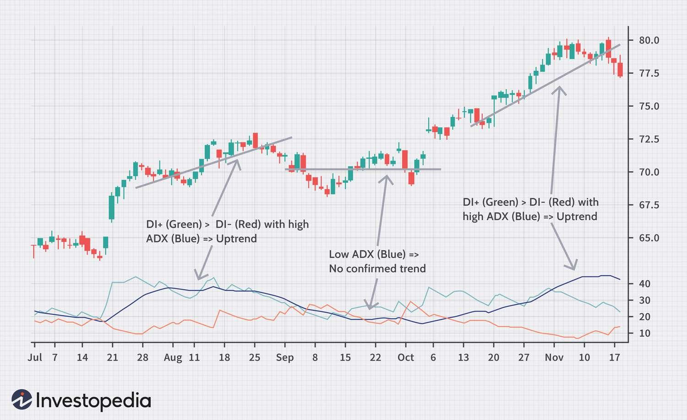

## Table of Contents

## What are binary options and how do they work?

Binary options are a type of financial trading where you predict if the price of something, like a stock or a currency, will go up or down in a certain time. It's called "binary" because there are only two outcomes: you win or you lose. If you think the price will go up, you buy a "call" option. If you think it will go down, you buy a "put" option. You decide how much money to bet, and if you're right at the end of the time you picked, you get your money back plus a profit. If you're wrong, you lose the money you bet.

The way binary options work is pretty simple. When you make a trade, you choose the asset you want to trade, like gold or a company's stock. Then, you pick how long you want to wait before the trade ends, which could be a few minutes or a few hours. You also decide how much money you want to bet. If the price of the asset is higher than the starting price when the time ends and you bought a call option, or lower if you bought a put option, you win. If not, you lose your bet. It's like betting on whether it will rain or not, but with stocks and currencies instead of weather.

## What are the basic types of binary options?

There are a few basic types of binary options that people use when they trade. The first one is called a "High/Low" or "Call/Put" option. This is the simplest type. If you think the price of something will go up, you buy a "Call" option. If you think it will go down, you buy a "Put" option. You pick how long to wait, and if you're right at the end, you win money.

Another type is the "Touch/No Touch" option. With this one, you win if the price touches a certain level before the time runs out. If you think the price will reach that level, you choose "Touch." If you think it won't, you choose "No Touch." It's a bit more exciting because it can happen anytime during the time you set, not just at the end.

The last common type is the "In/Out" or "Range" option. Here, you bet on whether the price will stay within a certain range or go outside of it. If you think it will stay in the range, you choose "In." If you think it will go out, you choose "Out." This type can be good if you think the price will be stable or if you think it will move a lot.

## What is the importance of choosing a reliable broker for binary options trading?

Choosing a reliable broker for binary options trading is really important because it keeps your money safe. A good broker follows the rules and is honest about how they work. They use strong security to protect your information and money. If you pick a broker that's not reliable, you might lose your money because they could be dishonest or not secure.

Also, a reliable broker gives you the right tools and information to help you trade better. They have good customer service to answer your questions and help you if you have problems. A bad broker might not give you the right information or might make it hard for you to take your money out. So, [picking](/wiki/asset-class-picking) a good broker helps you trade safely and with confidence.

## What are the fundamental analysis techniques used in binary options trading?

Fundamental analysis in binary options trading involves looking at the overall health and performance of an asset to predict its future price movements. Traders use this method to understand the underlying factors that might affect the price of a stock, commodity, or currency. For example, if you're trading stocks, you might look at a company's earnings, its debt levels, and how well it's managed. If a company is doing well and making more money, its stock price might go up, so you might choose to buy a "Call" option. On the other hand, if the company is struggling, its stock price could go down, and you might choose a "Put" option.

Another important part of [fundamental analysis](/wiki/fundamental-analysis) is keeping an eye on economic indicators and news events. These can have a big impact on the markets. For instance, if a country's central bank raises interest rates, it might make that country's currency stronger. If you're trading currency pairs, this could be a sign to buy a "Call" option on that currency. Also, big news like a new law or a natural disaster can shake up the markets. By staying informed about these events, you can make better guesses about where prices are headed and choose your binary options trades more wisely.

## How can technical analysis be applied to develop binary options trading strategies?

Technical analysis is a way to predict where prices might go by looking at charts and patterns. In binary options trading, you can use this to figure out if you should buy a "Call" or a "Put" option. You look at things like moving averages, which smooth out price data over time to see trends. If the price is above the moving average and going up, it might be a good time to buy a "Call" option because the price could keep going up. On the other hand, if the price is below the moving average and going down, you might want to buy a "Put" option because the price might keep falling.

Another tool you can use is called support and resistance levels. These are like invisible lines on the chart where the price often stops and turns around. If the price is near a support level and you think it will bounce back up, you might choose a "Call" option. If it's near a resistance level and you think it will drop down, a "Put" option could be the way to go. By using these technical indicators, you can make better guesses about where prices are headed and choose your binary options trades more wisely.

## What are the most common binary options trading strategies for beginners?

For beginners, one of the simplest and most common strategies is the "Trend Following" strategy. This means you look at a chart to see if the price of something is going up or down over time. If the price is going up, you buy a "Call" option because you think it will keep going up. If the price is going down, you buy a "Put" option because you think it will keep going down. You can use tools like moving averages to help you see the trend better. This strategy is easy to understand and can help you make money if you follow the trend correctly.

Another strategy for beginners is the "Breakout" strategy. This is when you watch the price to see if it breaks out of a certain range. If the price has been moving between two levels and then suddenly goes above the top level, you might buy a "Call" option because you think the price will keep going up. If the price breaks below the bottom level, you might buy a "Put" option because you think it will keep going down. This strategy can be exciting because it's about catching big moves in the market, but it also needs you to be quick and watch the price closely.

Lastly, the "Hedging" strategy can be useful for beginners to manage risk. This means you make two trades at the same time to protect yourself. For example, if you buy a "Call" option because you think the price will go up, you might also buy a "Put" option with a different expiration time or price level. This way, if the price goes down instead of up, you can still make some money from the "Put" option. Hedging helps you not lose all your money if your first guess is wrong.

## How does the '60 Seconds' trading strategy work in binary options?

The '60 Seconds' trading strategy in binary options is all about making quick trades that last just one minute. You look at a chart to see what the price is doing right now. If you think the price will go up in the next 60 seconds, you buy a "Call" option. If you think it will go down, you buy a "Put" option. It's fast and exciting because you don't have to wait long to see if you win or lose.

To use this strategy, you need to pay close attention to short-term price movements. You might use simple tools like moving averages or look for quick patterns on the chart to help you decide. Because the trades are so short, you need to be quick and sure about your choices. This strategy can be risky because prices can change a lot in just one minute, but it can also be fun and give you a chance to make money fast if you get it right.

## What are the advanced strategies for managing risk in binary options trading?

One advanced strategy for managing risk in binary options trading is called "position sizing." This means you decide how much money to bet on each trade based on how much risk you're willing to take. Instead of betting the same amount every time, you might bet less on trades that seem riskier and more on trades that seem safer. This way, if you lose on a risky trade, you don't lose too much money. It's like spreading your bets around to keep your overall risk lower.

Another strategy is using "stop-loss orders." Even though binary options don't have traditional stop-loss orders like stocks do, you can still manage your risk by setting limits on how much you're willing to lose in a day or over a series of trades. For example, if you decide you won't lose more than a certain amount in a day, you stop trading once you hit that limit. This helps you avoid big losses if the market moves against you. It's a way to protect your money and keep your trading under control.

Lastly, "diversification" is an important strategy for managing risk. Instead of putting all your money into one type of asset or one trade, you spread your bets across different assets and different types of trades. This means if one trade goes badly, you still have other trades that might do well. It's like not putting all your eggs in one basket. By diversifying, you can lower your overall risk and have a better chance of making money in the long run.

## How can traders use candlestick patterns to predict binary options outcomes?

Candlestick patterns are a way to look at charts and guess where prices might go next. Each candlestick shows what happened to the price in a certain time, like a minute or an hour. There are many different patterns, but some common ones can help you decide if you should buy a "Call" or a "Put" option. For example, a "Bullish Engulfing" pattern happens when a small red candle is followed by a bigger green candle that covers it completely. This might mean the price will go up, so you might want to buy a "Call" option. On the other hand, a "Bearish Engulfing" pattern is when a small green candle is followed by a bigger red candle, which might mean the price will go down, so you might buy a "Put" option.

Another useful pattern is the "Doji," which looks like a cross and shows that the price didn't move much during the time. A Doji can mean that the market is unsure and might change direction soon. If you see a Doji after prices have been going up, it might be a sign to buy a "Put" option because the price could start going down. If you see it after prices have been going down, it might be a sign to buy a "Call" option because the price could start going up. By learning to spot these patterns, you can make better guesses about where prices are headed and choose your binary options trades more wisely.

## What role do economic indicators and news events play in binary options trading?

Economic indicators and news events are really important for people who trade binary options. These things can change how the markets move a lot. For example, if a country's central bank says they are going to raise interest rates, it might make that country's currency stronger. If you're trading currency pairs, this could be a sign to buy a "Call" option on that currency. Also, if a company reports good earnings, its stock price might go up, so you might want to buy a "Call" option on that stock. By paying attention to these indicators and events, you can make better guesses about where prices are headed and choose your trades more wisely.

News events like big laws changing or natural disasters can also shake up the markets. For example, if there's a big hurricane coming, it might affect oil prices because it could stop oil from being moved around. If you think oil prices will go up because of this, you might buy a "Call" option on oil. On the other hand, if a new law makes it harder for companies to make money, their stock prices might go down, so you might want to buy a "Put" option. Staying informed about these events helps you understand what might happen next in the market and can help you trade better.

## How can algorithmic trading be implemented in binary options strategies?

Algorithmic trading in binary options means using a computer program to make trades for you. The program follows rules you set up based on things like price patterns or economic news. For example, you can tell the program to buy a "Call" option if the price of a stock goes above a certain level, or to buy a "Put" option if it goes below another level. The computer can watch the market all the time and make trades much faster than a person could. This can help you take advantage of small price changes that happen quickly.

Using algorithms can also help you stick to your trading plan without letting your emotions get in the way. Sometimes, people might feel scared or excited and make bad trading choices. But a computer program will follow the rules you set without getting nervous or greedy. This can lead to more consistent trading and help you manage your risk better. By setting up the right rules and letting the computer do the work, you can try to make more money from binary options trading.

## What are the best practices for optimizing and backtesting binary options trading strategies?

To optimize and backtest binary options trading strategies, you first need to collect historical data on the assets you want to trade. This data should include price movements and any economic indicators or news events that might affect those prices. Once you have this data, you can use it to test your strategy by seeing how it would have worked in the past. This is called [backtesting](/wiki/backtesting). You run your strategy on the historical data to see if it would have made money or lost money. If it didn't work well, you can change your rules or the way you make decisions to try to make it better. Keep testing and changing until you find a strategy that works well with the past data.

After you have a strategy that looks good in backtesting, you need to try it in the real market, but start small. This is called forward testing. You use real money, but you only bet a little bit at first to see how your strategy works in real time. This helps you see if it works as well in the real world as it did with the historical data. If it doesn't, you can make more changes to your strategy. It's important to keep track of how your strategy is doing and to keep learning and improving. By doing this, you can make your binary options trading strategy better and more likely to make money over time.

## What are Binary Options and How Do They Work?

Binary options are a type of financial instrument through which traders can speculate on the price movement of various underlying assets, such as stocks, commodities, currencies, or indices. These instruments are particularly distinct due to their straightforward payout structure: upon the expiration of a binary option, the result is either a fixed monetary gain or total loss of the invested amount. This mechanism contrasts with traditional options, where payouts can vary based on the extent to which the option is in the money.

The core principle behind binary options is a binary proposition, or a simple 'yes or no' scenario. This proposition is usually centered around whether the price of the chosen asset will exceed a predetermined level at the expiration time. For instance, a binary option might be based on whether the price of gold will be above $1,800 at the end of the trading day. If a trader correctly predicts the outcome, they receive a pre-defined payout, often ranging between 60% to 90% of their initial stake. If the prediction proves incorrect, the trader loses their entire investment in that option.

Mathematically, the payoff for a binary option can be modeled using a simple conditional payout structure:

$$

P = 
\begin{cases} 
I \cdot R & \text{if the prediction is correct} \\ 
0 & \text{if the prediction is incorrect} 
\end{cases} 
$$

Where $P$ is the payout, $I$ is the initial investment, and $R$ is the return rate offered by the binary option. This model underscores the all-or-nothing nature of binary options, as there is no intermediate payoff.

Despite their appeal due to simplicity, binary options come with substantial risk, primarily due to their speculative nature and the potential for entire capital loss. Traders are encouraged to comprehend the financial implications and inherent risks tied to this form of trading before engaging in the market. Regulatory bodies in many countries have scrutinized binary options trading due to concerns over fraud and the high-risk profile of these investments.

## What are the types of binary options trading strategies?

Binary options trading strategies are diverse, each catering to specific market conditions and trader preferences. Here, we explore four primary types of strategies: trend-following, range trading, [volatility](/wiki/volatility-trading-strategies), and news trading.

### Trend-Following Strategies

Trend-following strategies capitalize on a prevailing market direction, either upward or downward. Traders employing this strategy look to benefit from sustained movements in asset prices. Technical indicators such as moving averages, trendlines, and the Relative Strength Index (RSI) are commonly used to identify and confirm market trends. 

For example, a simple moving average crossover can signal a potential buying opportunity when a shorter-term moving average crosses above a longer-term average, suggesting the beginning of an uptrend. The mathematical expression for a simple moving average (SMA) is:

$$
\text{SMA} = \frac{1}{N} \sum_{i=0}^{N-1} P_i
$$

where $P_i$ is the price at time $i$ and $N$ is the number of periods.

### Range Trading Strategies

Range trading strategies are suitable when markets exhibit no clear long-term trend, moving instead within a predictable range between support and resistance levels. Traders engage in buying near support and selling near resistance, anticipating that prices will remain within these boundaries. The Bollinger Bands indicator is often utilized to identify overbought or oversold conditions during ranging markets. 

To implement a range trading strategy, traders need to establish key support and resistance levels and monitor price movements closely to react to potential breakouts from the range.

### Volatility Strategies

Volatility strategies thrive during periods of market instability, often coinciding with major economic reports or geopolitical events. These strategies aim to benefit from large price swings, irrespective of the direction. Straddle and strangle options strategies, though more commonly associated with traditional options, can conceptually be applied to binary options by taking simultaneous ‘call’ and ‘put’ positions.

A Python example of calculating historical volatility, which could influence strategy decisions, might look like this:

```python
import numpy as np

def calculate_volatility(price_data, window_size):
    returns = np.log(price_data[1:] / price_data[:-1])
    volatility = np.std(returns[-window_size:]) * np.sqrt(window_size)
    return volatility

price_data = np.array([60, 62, 61, 63, 64, 65])  # Example price data
volatility = calculate_volatility(price_data, 5)
print("Historical Volatility:", volatility)
```

### News Trading Strategies

News trading strategies rely on market movements triggered by major news releases, such as monetary policy updates, employment reports, or corporate earnings announcements. Traders must act swiftly to capitalize on the rapid price changes that often accompany such events. This strategy requires staying informed about economic calendars and being prepared to react to news outcomes immediately.

The quick nature of news trading necessitates a strategy that includes real-time data feeds and possibly algorithmic executions to capture opportunities as they arise. 

Each of these binary options trading strategies requires an understanding of market dynamics and careful planning to manage associated risks effectively.

## How do Risk Management and Emotional Intelligence relate to each other?

In financial trading, especially within binary options and algorithmic setups, risk management is vital for safeguarding capital and ensuring longevity in the market. One foundational technique is position sizing, which revolves around determining the appropriate amount of capital to allocate to each trade. This technique not only helps in controlling the risk but also enables traders to maximize their profit potential. A commonly used method for calculating position size is the Kelly Criterion, which can be mathematically expressed as:

$$
f^* = \frac{bp - q}{b}
$$

where $f^*$ is the fraction of the portfolio to bet, $b$ is the odds received on the wager (net odds), $p$ is the probability of winning, and $q$ is the probability of losing (i.e., $q = 1 - p$).

Stop-loss orders are another critical risk management tool, designed to limit a trader's loss on a position in a security. By pre-setting a stop order, traders can execute a trade automatically once a particular price level is reached, thereby reducing the risk of holding a losing position for too long.

Emotional intelligence plays a significant role in effective trading. The financial markets are often volatile and can evoke a range of emotions that, if not managed properly, can lead to irrational decision-making. Emotional discipline involves maintaining composure and sticking to the predetermined trading plan even when faced with market extremes. Techniques such as mindfulness and cognitive behavioral strategies can assist traders in recognizing emotional triggers and mitigating impulsive actions.

Moreover, emotional intelligence facilitates better stress management, which is crucial in maintaining mental clarity during trading sessions. Understanding personal emotional responses allows traders to adjust their strategies accordingly, ensuring decisions are based on rational analysis rather than emotional reactions. By incorporating emotional intelligence into their trading practices, traders can improve their ability to respond to unexpected market developments, leading to enhanced decision-making and overall trading performance.

## References & Further Reading

[1]: Hull, J. C. (2018). ["Options, Futures, and Other Derivatives."](https://www.semanticscholar.org/paper/Options%2C-Futures%2C-and-Other-Derivatives-Hull/89bdee500c8623864fc9eb7a471546aa713acc44) Pearson Education.

[2]: Espen Gaarder Haug (2003). ["The Complete Guide to Option Pricing Formulas."](https://books.google.com/books/about/The_Complete_Guide_to_Option_Pricing_For.html?id=cSRMtQAACAAJ) McGraw-Hill.

[3]: Friedman, J., Hastie, T., & Tibshirani, R. (2001). ["The Elements of Statistical Learning"](https://link.springer.com/book/10.1007/978-0-387-84858-7) Springer Series in Statistics.

[4]: Kissell, R. (2013). ["The Science of Algorithmic Trading and Portfolio Management."](https://www.sciencedirect.com/book/9780124016897/the-science-of-algorithmic-trading-and-portfolio-management) Academic Press.

[5]: Taleb, N. N. (2010). ["The Black Swan: The Impact of the Highly Improbable."](https://www.jstor.org/stable/23045073) Random House Trade Paperbacks.

[6]: Duhigg, C. (2012). ["The Power of Habit: Why We Do What We Do in Life and Business."](https://psycnet.apa.org/record/2012-09134-000) Random House Trade Paperbacks.

[7]: Aldridge, I. (2013). ["High-Frequency Trading: A Practical Guide to Algorithmic Strategies and Trading Systems."](https://www.ahmetbeyefendi.com/wp-content/uploads/2020/07/High-Frequency-Trading-Irene-Aldridge.pdf) Wiley.