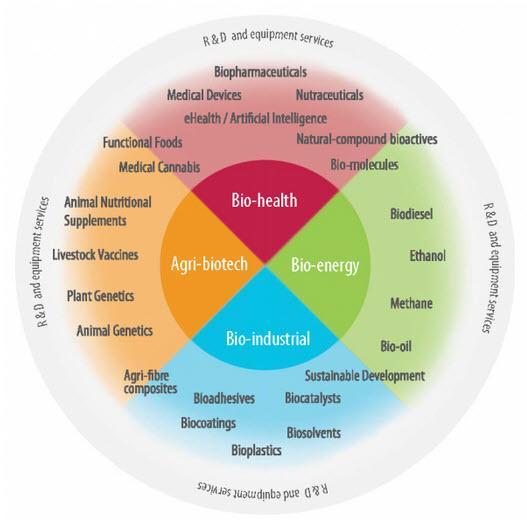

## Table of Contents

## What is biotechnology and how does it impact our daily lives?

Biotechnology is a field of science that uses living things, like plants, animals, and microbes, to make useful products or solve problems. It involves changing the DNA of these living things to make them do what we want. For example, scientists can change the DNA of bacteria to make them produce medicine, or they can change the DNA of crops to make them grow bigger and resist pests.

Biotechnology impacts our daily lives in many ways. For instance, many medicines we take, like insulin for diabetes, are made using biotechnology. This means people with certain diseases can live healthier lives. Also, biotechnology helps farmers grow more food. By creating crops that can survive harsh conditions or resist diseases, we can have more food to eat. This is important because it helps feed more people around the world and can make food cheaper and more available.

## What are the main areas of focus within the biotechnology sector?

The biotechnology sector focuses on several key areas. One main area is healthcare, where biotechnology helps make new medicines and treatments. Scientists use it to create drugs for diseases like cancer, diabetes, and heart disease. They can also make vaccines to protect us from viruses. Another focus is on agriculture, where biotechnology helps farmers grow better crops. By changing the DNA of plants, scientists can make them grow bigger, resist pests, and survive in tough conditions. This helps farmers produce more food and can make it cheaper for us to buy.

Another important area is environmental biotechnology, where scientists use living things to clean up pollution and make energy. For example, they can use bacteria to break down oil spills or turn waste into biofuels. This helps keep our planet cleaner and provides new ways to get energy. The last main focus is industrial biotechnology, which uses living things to make products like chemicals, plastics, and textiles. This can be more eco-friendly than traditional methods because it often uses less energy and creates less waste. These areas show how biotechnology touches many parts of our lives, from our health to the food we eat and the environment we live in.

## How has biotechnology evolved over the past few decades?

Over the past few decades, biotechnology has grown a lot. In the 1970s and 1980s, scientists learned how to change the DNA of living things. This was a big step because it let them make new medicines and change crops. For example, they started making insulin for diabetes using bacteria. This was a big help for people who needed this medicine. Also, they began making crops that could resist pests and grow better. This helped farmers produce more food.

As time went on, biotechnology kept getting better. In the 1990s and 2000s, scientists started using biotechnology to make vaccines and treatments for diseases like cancer and AIDS. They also began to use it to clean up pollution and make energy. For example, they used bacteria to break down oil spills and turn waste into biofuels. This helped the environment. Today, biotechnology is still growing. Scientists are working on new ways to use it to fix health problems, make food better, and help the planet. It's amazing to see how much biotechnology has changed and how it keeps helping us in new ways.

## What are some of the major breakthroughs in biotechnology?

One of the biggest breakthroughs in biotechnology was the development of recombinant DNA technology in the 1970s. This allowed scientists to take genes from one organism and put them into another. A famous example is making insulin for diabetes using bacteria. Before this, insulin was hard to get and expensive. Now, it's easier to make and more people can use it to stay healthy. This technology also helped make other medicines and changed how we grow crops to make them better and stronger.

Another major breakthrough was the Human Genome Project, finished in 2003. This project mapped all the genes in the human body. Knowing this helped scientists understand diseases better and find new ways to treat them. It also led to personalized medicine, where treatments are made just for one person based on their genes. This is a big step forward in healthcare because it can make treatments work better and have fewer side effects.

More recently, CRISPR-Cas9 technology has been a game-changer. It's a tool that lets scientists edit genes very precisely. This can fix genetic diseases, make crops better, and even help fight viruses. For example, scientists are using CRISPR to try to cure diseases like sickle cell anemia and to make crops that can survive climate change. This technology is still new, but it has a lot of potential to change our lives in big ways.

## What role does genetic engineering play in biotechnology?

Genetic engineering is a big part of biotechnology. It's when scientists change the DNA of living things on purpose. They do this to make the living things do what they want. For example, they can make bacteria produce medicine or make crops grow bigger and resist pests. This is important because it helps us make new medicines and grow more food. Without genetic engineering, we wouldn't have many of the medicines and foods we use every day.

Genetic engineering also helps us understand and fix diseases. By changing the DNA of animals or cells in a lab, scientists can learn how diseases work and find new ways to treat them. For example, they can make mice that have the same diseases as humans to test new medicines. This helps make sure the medicines are safe and work well before people use them. Genetic engineering is a powerful tool that keeps making biotechnology better and helping more people.

## How does biotechnology contribute to medical advancements?

Biotechnology helps make new medicines and treatments for diseases. Scientists use it to make drugs for cancer, diabetes, and heart disease. They can change the DNA of bacteria or cells to make them produce medicines like insulin. This is important because it helps people with these diseases live healthier lives. Biotechnology also helps make vaccines to protect us from viruses. For example, the vaccines for COVID-19 were made using biotechnology. This shows how biotechnology can quickly respond to new health problems and keep us safe.

Another way biotechnology helps with medical advancements is by understanding diseases better. The Human Genome Project, which mapped all the genes in the human body, helped scientists learn how diseases work. This led to personalized medicine, where treatments are made just for one person based on their genes. This can make treatments work better and have fewer side effects. Also, new technologies like CRISPR let scientists edit genes to fix genetic diseases. This is a big step forward because it could cure diseases that were hard to treat before. Biotechnology keeps finding new ways to help us stay healthy and live longer.

## What are the ethical considerations in biotechnology research and applications?

Biotechnology can do amazing things, but it also brings up some big questions about what is right and wrong. One big worry is about changing the DNA of living things. Some people think it's not right to change the genes of plants, animals, or even humans. They worry about what might happen if these changes get out into nature. For example, if we make a new kind of crop that can resist pests, it might harm other plants or animals in the wild. There are also worries about making new kinds of animals or plants that might not be good for the environment.

Another big ethical issue is about using biotechnology in medicine. When scientists change the DNA of people to fix diseases, it can help a lot. But it also raises questions about fairness. Not everyone can afford these new treatments, so some people might get better care than others. There are also worries about privacy. If we know someone's genes, we might learn private things about them. This could be used in ways that are not fair, like by insurance companies or employers. So, we need to think carefully about how to use biotechnology in a way that is fair and respects everyone's rights.

Lastly, there are concerns about how biotechnology is used in research. Scientists often use animals to test new medicines and treatments. While this can lead to important discoveries, it also raises questions about animal rights. Is it right to use animals in this way? There are also worries about who gets to decide how biotechnology is used. Should it be scientists, governments, or the public? These are big questions that need careful thought to make sure biotechnology is used in a way that is good for everyone.

## How does biotechnology intersect with other industries like agriculture and pharmaceuticals?

Biotechnology plays a big role in agriculture by helping farmers grow better crops. Scientists use biotechnology to change the DNA of plants so they can grow bigger, resist pests, and survive in tough conditions. This means farmers can produce more food, which is important for feeding more people around the world. It also helps make food cheaper and more available. For example, crops like corn and soybeans have been changed to resist insects and weeds, making it easier for farmers to grow them. This shows how biotechnology can make a big difference in what we eat every day.

In the pharmaceutical industry, biotechnology is used to make new medicines and treatments. Scientists change the DNA of bacteria or cells to make them produce drugs like insulin for diabetes. This has helped a lot of people with diseases live healthier lives. Biotechnology also helps make vaccines, like the ones for COVID-19, which protect us from viruses. By understanding how diseases work through biotechnology, scientists can create personalized medicine, where treatments are made just for one person based on their genes. This can make treatments work better and have fewer side effects, showing how biotechnology is changing the way we take care of our health.

## What are the current trends and future predictions for the biotechnology sector?

Right now, one big trend in biotechnology is personalized medicine. This means making treatments that are just right for one person based on their genes. It's becoming more common because it can make treatments work better and have fewer side effects. Another trend is using biotechnology to fight climate change. Scientists are making crops that can grow in tough conditions and turning waste into biofuels. This helps the environment and makes our food supply safer. Also, gene editing with tools like CRISPR is getting a lot of attention. It lets scientists change genes to fix diseases, which could lead to big breakthroughs in medicine.

Looking into the future, biotechnology is expected to keep growing and changing how we live. We might see more gene therapies that can cure diseases that are hard to treat now. This could help a lot of people live healthier lives. Biotechnology might also play a bigger role in making our food. Scientists could create new kinds of crops that can grow in places where it's hard to grow food now. This could help feed more people around the world. Lastly, biotechnology could help us make new kinds of energy and clean up pollution better. This would be good for the planet and could lead to new ways of living that are kinder to the environment.

## What are the challenges and barriers to entry in the biotechnology industry?

The biotechnology industry faces many challenges. One big challenge is the high cost of research and development. Making new medicines or changing crops takes a lot of time and money. Scientists need special tools and labs, and they have to do a lot of tests to make sure their work is safe and works well. This means that starting a biotechnology company can be very expensive, and it can be hard for new companies to get the money they need to get started. Another challenge is getting approval from governments. Before a new medicine or crop can be sold, it has to be checked by people who make sure it's safe. This can take a long time and cost a lot of money, which can be hard for small companies.

There are also barriers to entry in the biotechnology industry. One big barrier is the need for a lot of knowledge and skills. Biotechnology is a very hard field, and people who work in it need to know a lot about science and technology. This means that it can be hard for new people to get into the industry because they need to learn a lot before they can start working. Another barrier is competition. Big companies with a lot of money and experience can make it hard for new companies to succeed. These big companies already have a lot of customers and resources, so it can be tough for new companies to find their place in the market.

## How is biotechnology regulated around the world?

Biotechnology is regulated differently in different parts of the world, but the main goal is the same everywhere: to make sure it's safe and used in a good way. In the United States, the Food and Drug Administration (FDA) checks new medicines to make sure they are safe and work well before people can use them. The U.S. Department of Agriculture (USDA) looks at new crops to make sure they are safe for the environment and for people to eat. In Europe, the European Medicines Agency (EMA) does a similar job for medicines, and the European Food Safety Authority (EFSA) checks new crops. These groups look at a lot of information and do many tests to make sure biotechnology is used safely.

In other countries, like those in Asia and South America, there are also groups that check biotechnology. For example, in Japan, the Ministry of Health, Labour and Welfare (MHLW) and the Ministry of Agriculture, Forestry and Fisheries (MAFF) work together to regulate biotechnology. In Brazil, the National Health Surveillance Agency (ANVISA) and the National Biosafety Technical Commission (CTNBio) do the same. These groups make rules and check that companies follow them. They also talk to each other to make sure biotechnology is safe all over the world. This helps make sure that biotechnology is used in a way that is good for everyone.

## What are the career opportunities and educational paths in biotechnology?

There are many different jobs in biotechnology. You can work in a lab doing experiments, or you can work in a company making new medicines or crops. There are also jobs in government, where you might help make rules about biotechnology, or in schools, where you can teach others about it. If you like working with people, you might be a science writer or a salesperson for a biotechnology company. The jobs are varied, so you can find one that fits what you like to do and what you're good at.

To get a job in biotechnology, you usually need to go to school for a long time. Most people start with a bachelor's degree in biology, chemistry, or a related field. This takes about four years. After that, many people get a master's degree or a PhD, which can take another two to six years. These degrees help you learn more about biotechnology and do your own research. Some people also go to school to learn how to run a business or how to teach. The more you learn, the more kinds of jobs you can do in biotechnology.

## References & Further Reading

[1]: Roberts, M.J., Stevens, A. (2020). ["The Promise and Peril of Algorithmic Trading in the Biotechnology Sector."](https://www.taylorfrancis.com/books/edit/10.4324/9780203843130/applied-multivariate-statistics-social-sciences-james-stevens) Nature Biotechnology.

[2]: Chakravarthy, R. (2015). ["Understanding Biotechnology’s Growth Trajectory: Key Trends and Implications."](https://www.researchgate.net/publication/235304077_From_a_hierarchy_to_a_heterarchy_of_strategies_Adapting_to_a_changing_context) Wired.

[3]: Campillos, M., Kuhn, M., Gavin, A.C., Jensen, L.J., & Bork, P. (2008). ["Drug Target Identification Using Side-Effect Similarity."](https://pubmed.ncbi.nlm.nih.gov/18621671/) Science.

[4]: Breijyeh, Z., Karaman, R. (2020). ["Comprehensive Review on Alzheimer's Disease: Causes and Treatment."](https://pubmed.ncbi.nlm.nih.gov/33302541/) Molecules.

[5]: Pisano, G.P. (2006). ["Science Business: The Promise, the Reality, and the Future of Biotech."](https://archive.org/details/sciencebusinessp00pisa) Harvard Business Review Press.