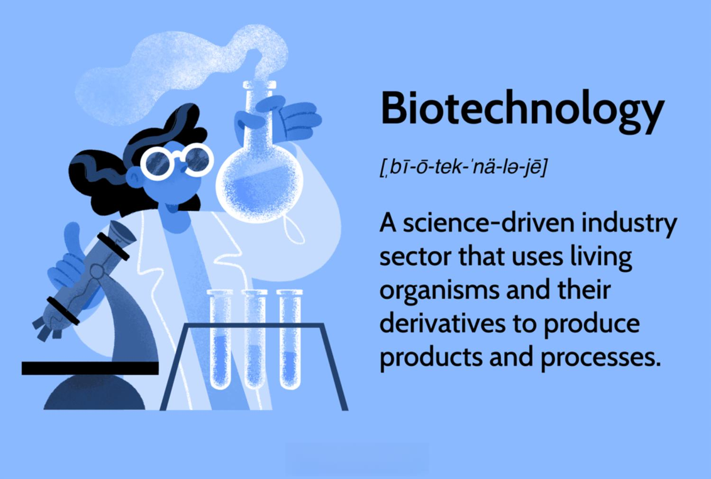

The biotechnology sector is rapidly emerging as one of the most exhilarating arenas for contemporary investors. It uniquely integrates scientific research with industrial applications to create innovative treatments and medicines that have the potential to transform healthcare. This fusion of science and industry offers remarkable opportunities for substantial financial growth. The allure of the biotech sector lies in its capacity to deliver significant returns on investment, primarily when pioneering treatments successfully navigate the intricate and demanding path from research to market. However, the sector is equally characterized by significant challenges. The complexities of drug development, coupled with high regulatory standards and scientific uncertainties, contribute to the daunting risks associated with biotech investments.

Biotechnology firms operate at the forefront of life-changing technologies, pushing the boundaries of what is scientifically possible. These companies are engaged in drug development, genetic engineering, and molecular biology, offering novel solutions to treat various diseases and conditions that have been previously unaddressable. For instance, advancements in CRISPR technology and personalized medicine exemplify the transformative potential biotechnology holds, promising to revolutionize how diseases are understood and treated ([Nature Biotechnology](https://www.nature.com/nbt/)).

Investing in biotech can be lucrative, but it requires a sophisticated understanding of the sector's nuances. Unlike traditional industries, biotech investments often involve navigating long development cycles and the probabilistic outcomes of clinical trials. The success of a single product can lead to exponential financial gains, rapidly increasing a company's market valuation. Conversely, setbacks in clinical trials or regulatory approval processes can result in significant financial losses.

This article aims to provide a comprehensive overview of the biotechnology sector, highlighting the significant role algorithmic trading could play. As the sector continues to evolve with rapid technological advancements, algorithmic trading emerges as a potential tool for mitigating some of the inherent risks. It utilizes complex algorithms and artificial intelligence to make informed trading decisions, offering a strategic approach to capitalizing on market shifts. This introduction sets the stage for further exploration of the intricacies and potential of investing in the biotech sector.

## Table of Contents

## Understanding Biotechnology and Its Market Impact

Biotechnology companies primarily concentrate on the development of new drugs and clinical research targeting the treatment of various diseases and conditions. This focus stems from the innovative application of biological systems, organisms, or derivatives to develop processes or products that significantly improve human health. The biotechnology sector, therefore, plays a crucial role in addressing unmet medical needs and enhancing the overall quality of life.

Drug development within biotechnology is inherently challenging, characterized by extensive research and development (R&D) periods and high levels of risk, particularly due to the scientific complexities involved. The development pipeline often spans multiple years, encompassing phases from initial discovery to preclinical research, clinical trials, and finally, regulatory approval. This lengthy timeframe is coupled with considerable uncertainty, as the majority of drug candidates fail to successfully transition from conception to market.

Failure rates in drug development, particularly during clinical trials, remain high. According to the Biotechnology Innovation Organization, only about 10% of drugs that enter clinical trials ultimately receive approval from regulatory bodies like the U.S. Food and Drug Administration (FDA). This high attrition rate is due to various factors including inadequate efficacy, safety concerns, and unforeseen adverse effects that may emerge during larger patient testing cohorts.

Despite these challenges, successful biotech companies can yield substantial financial gains. Novel therapeutic breakthroughs can lead to significant market opportunities, turning small biotech firms into major industry players. Investors are particularly attracted to the potential of high returns generated when a drug candidate successfully completes the development process and receives regulatory approval. This potential for substantial financial gain makes the biotechnology sector appealing, despite the high levels of risk involved.

Biotechnological advancements also exert a profound impact on the healthcare and pharmaceutical markets. Innovations in personalized medicine, gene therapies, and novel drug delivery systems are transforming conventional treatment paradigms. For instance, personalized medicine tailors treatment strategies to individual genetic profiles, promising more effective and targeted therapies. Gene therapies, which involve the insertion, alteration, or removal of genes within an individual's cells, hold potential for treating genetic disorders at their root cause. These advancements not only enhance patient outcomes but also stimulate significant shifts in market dynamics, encouraging pharmaceutical companies to integrate biotechnology into their R&D pipelines.

Consequently, biotechnology is a driving force in the ongoing evolution of the healthcare and pharmaceutical landscapes, fostering scientific innovation and creating new investment opportunities. The sector's ability to address complex medical challenges makes it an indispensable component of modern medicine and an attractive prospect for investment, albeit with its associated risks.

## The Risks and Rewards of Investing in Biotech

Investing in the biotechnology sector presents both significant risks and potential rewards, largely due to the unique dynamics that characterize the industry. Firstly, biotechnology companies are heavily reliant on substantial capital investment to support long development cycles required for research and clinical trials. The process of discovering and developing new drugs or therapies can span several years, often with no guarantee of success. This lengthy timeline is associated with high burn rates of capital, where funds are expended faster than they are generated, frequently resulting in a precarious financial position for many biotechnology firms.

Regulatory hurdles further complicate the investment landscape in biotechnology. Companies must navigate stringent regulatory requirements imposed by agencies such as the U.S. Food and Drug Administration (FDA), which can result in delays or denials of approvals for new drugs. The outcomes of clinical trials and regulatory decisions are inherently binary, meaning they can lead to either a significant stock price surge or a plummet, depending on the results. This introduces an element of [volatility](/wiki/volatility-trading-strategies) that investors must be prepared to manage.

Moreover, scientific uncertainties inherent in biotechnology add another layer of risk. The success of a biotech firm is contingent on the scientific validity and efficacy of its products, which can be uncertain due to the complex nature of biological systems and variability in human biology. These factors contribute to a high failure rate for new drug candidates, further emphasizing the speculative nature of biotech investments.

Despite these challenges, the rewards of investing in successful biotechnology companies can be substantial. A breakthrough drug or therapy that receives approval can transform a company's financial prospects, significantly boosting stock valuation. This potential for high returns is exemplified by instances where a company's stock price doubles overnight following positive trial results or regulatory approvals.

For investors, the key to mitigating risks while capitalizing on potential rewards lies in comprehensive research and a deep understanding of the unique drivers of biotechnology advancements. Investors must evaluate not only the scientific potential of a company's pipeline but also its financial health, management team expertise, and ability to navigate regulatory pathways. Additionally, staying informed about broader industry trends and technological innovations is crucial for making informed investment decisions in this dynamic sector.

While the prospect of investing in biotechnology can be enticing due to the potential for extraordinary gains, it requires a strategic approach that balances enthusiasm with caution, grounded in meticulous research and preparedness for inherent risks.

## Key Players in the Biotechnology Sector

The biotechnology sector comprises a diverse range of companies, each contributing significantly to advancements in healthcare and pharmaceuticals. Among these, Novo Nordisk, Vertex Pharmaceuticals, and Moderna stand out as key players due to their substantial market influence and innovative ventures.

Novo Nordisk, a Danish multinational, has established itself as a leader in the treatment of diabetes, hemophilia, growth disorders, and hormone replacement therapies. The company's focus on diabetes care, including the development of insulin products and diabetes management tools, has significantly impacted the global healthcare market. Novo Nordisk's commitment to innovation is evident in its robust pipeline, which includes the exploration of oral insulin formulations and treatments for obesity-related conditions [1].

Vertex Pharmaceuticals, based in the United States, is renowned for its groundbreaking work in cystic fibrosis (CF) treatment. Their CF portfolio, notably comprising drugs like Trikafta, has transformed the therapeutic landscape for patients with this genetic disorder. Beyond cystic fibrosis, Vertex is also expanding its research into areas such as sickle cell disease, pain management, and Type 1 diabetes, leveraging cutting-edge genetic and cellular therapies [2].

Moderna, a biotechnology firm that gained prominence through its rapid development of a COVID-19 vaccine, exemplifies the potential of mRNA technology. Since its establishment, Moderna has focused on pioneering mRNA-based therapies across various domains, including infectious diseases, oncology, and cardiovascular conditions. This innovative approach not only contributed to the global pandemic response but also opened avenues for future therapeutic developments [3].

These companies, with their large market capitalizations, frequently lead in research and development, driving substantial industry shifts. Their ability to consistently innovate and address unmet medical needs underscores their pivotal role within the biotech sector. As the industry continues to evolve, Novo Nordisk, Vertex Pharmaceuticals, and Moderna are likely to maintain their influential positions through strategic advancements and their dynamic product pipelines.

---
**References:**

[1] Novo Nordisk Annual Report. (2023). Novo Nordisk's initiatives in diabetes and obesity care. Retrieved from [Novo Nordisk official website](https://www.novonordisk.com/).

[2] Vertex Pharmaceuticals Incorporated. (2023). Vertex’s contributions to cystic fibrosis treatment and other therapeutic areas. Retrieved from [Vertex Pharmaceuticals official website](https://www.vrtx.com/).

[3] Moderna, Inc. (2023). The role of mRNA technology in Moderna's therapeutic strategies. Retrieved from [Moderna official website](https://www.modernatx.com/).

## The Role of Algorithmic Trading in Biotech Investments

Algorithmic trading has increasingly become a pivotal tool for investors in the biotechnology sector. This modern trading technique leverages complex algorithms and [artificial intelligence](/wiki/ai-artificial-intelligence) (AI) to automate trading decisions, aiming to capitalize on market inefficiencies and rapid price movements that are often characteristic of biotech stocks. Given the volatile nature of the biotechnology market, attributable to factors such as clinical trial results, regulatory approvals, and technological breakthroughs, [algorithmic trading](/wiki/algorithmic-trading) provides the agility needed to promptly respond to market changes.

The core advantage of algorithmic trading in biotech investments lies in its ability to process vast amounts of data at exceptional speeds. AI and [machine learning](/wiki/machine-learning) models, integral to algorithmic trading, are capable of analyzing historical data, news sentiment, and even clinical data, to identify trading opportunities in real time. These technologies facilitate high-frequency trading strategies, which can execute multiple trades per second, thus allowing investors to act on timely and fleeting market signals that might not be perceptible through traditional trading methods.

Moreover, algorithmic trading can significantly mitigate some of the risks associated with investing in the biotech sector. The unpredictable outcomes of drug trials and FDA approvals often lead to substantial price swings. By using predictive analytics and real-time data processing, algorithms can adjust investment positions dynamically, helping to hedge against adverse price movements and optimize the risk-return profile of a biotech investment portfolio.

Success stories of algorithmic trading in the biotech sector demonstrate its potential to deliver impressive returns. For instance, hedge funds and investment firms that have adopted algorithmic strategies report substantial improvements in trade execution, efficiency, and profitability. These successes are often attributed to bespoke algorithms that are tailored to the idiosyncrasies of the biotech sector, which include a high degree of regulatory scrutiny and innovation-driven market dynamics.

In conclusion, algorithmic trading represents a powerful approach for navigating the complex and rapidly evolving biotech market. Its ability to harness technology for strategic decision-making offers investors a significant edge, especially in a sector where timely and informed actions can lead to substantial financial gains. As the technology underpinning algorithmic trading continues to evolve, its influence on biotech investments is expected to grow, providing even more sophisticated tools for managing the sector's inherent challenges and opportunities.

## Challenges in Biotech Stock Evaluation

Biotech stocks present unique challenges for evaluation due to the binary nature of clinical trials and the uncertainty that accompanies them. Unlike stocks in more established industries, where cash flow models and earnings projections provide a foundation for valuation, biotech investments rely heavily on the outcomes of clinical trials. The outcomes of these trials can dramatically alter the value of a company overnight—success can propel a stock upwards significantly, while failure can result in sharp declines. This inherent uncertainty poses a significant challenge for investors seeking to assess the potential value of biotech firms.

Common valuation methods like discounted cash flow (DCF) models, which rely on the predictability of future cash flows, often prove inadequate for early-stage biotech companies. These firms typically lack consistent revenue streams until their products receive regulatory approval and enter the market. As a result, traditional financial metrics may fail to capture the potential highs and lows associated with these stocks. Instead, investors might use alternative approaches such as risk-adjusted net present value (rNPV) models, which incorporate the probabilistic nature of clinical trial success rates into the valuation process.

Regulatory bodies, particularly the U.S. Food and Drug Administration (FDA), play a decisive role in shaping the prospects of biotech companies, adding further complexity to stock evaluation. The FDA's approval process involves multiple stages, each with stringent requirements and uncertainty. From preclinical research to Phase 1, 2, and 3 trials, the regulatory hurdles are significant. The outcome at any stage can suddenly influence a company's trajectory, making it essential for investors to stay informed about regulatory developments and timelines.

The unpredictable nature of scientific discovery in biotechnology compounds these challenges. Even promising initial results in early-stage research may not translate into successful therapies due to unforeseen complications in later trial phases. Consequently, investors need to possess not only financial acumen but also a solid understanding of the science behind the companies in which they invest.

In summary, the evaluation of biotech stocks requires a multifaceted approach that considers the binary outcomes of clinical trials, the limited applicability of traditional valuation models, the pivotal role of regulatory bodies like the FDA, and the inherent scientific unpredictability linked to biotech innovations.

## Conclusion: The Future of Biotech Investing

The biotech sector presents unique investment opportunities with high potential returns, but it necessitates a cautious and well-informed approach. Investors must navigate through significant challenges such as scientific uncertainties, regulatory hurdles, and the long timelines often associated with drug development. However, the future of biotech investing appears promising due to ongoing technological advancements and the emergence of innovative financial strategies like algorithmic trading.

Algorithmic trading algorithms use complex algorithms and artificial intelligence to analyze large datasets, make predictions, and execute trades at speeds impossible for human traders. This technology has the potential to revolutionize biotech investments by providing more consistent and data-driven strategies, mitigating some inherent sector risks, and reacting swiftly to new market information. For instance, algorithms can process clinical trial data, monitor news releases regarding regulatory approvals, and track market sentiment, thereby offering valuable insights for trading decisions.

Moreover, the success in biotech investing will hinge upon a judicious blend of thorough research, strategic financial planning, and an acceptance of the necessary risk level. Investors must leverage both traditional financial analysis and cutting-edge technological tools to gain a comprehensive understanding of market dynamics and make informed decisions.

In conclusion, while the biotech sector offers lucrative prospects, it demands a deliberate and informed investment strategy. As algorithmic trading continues to evolve, it may serve as a significant tool for investors aiming to capitalize on the sector's growth potential. Ultimately, a successful investment in biotechnology will depend on a well-balanced approach that integrates scientific advancements, financial acumen, and technology-driven insights.

## References & Further Reading

[1]: Roberts, M.J., Stevens, A. (2020). ["The Promise and Peril of Algorithmic Trading in the Biotechnology Sector."](https://www.taylorfrancis.com/books/edit/10.4324/9780203843130/applied-multivariate-statistics-social-sciences-james-stevens) Nature Biotechnology.

[2]: Chakravarthy, R. (2015). ["Understanding Biotechnology’s Growth Trajectory: Key Trends and Implications."](https://www.researchgate.net/publication/235304077_From_a_hierarchy_to_a_heterarchy_of_strategies_Adapting_to_a_changing_context) Wired.

[3]: Campillos, M., Kuhn, M., Gavin, A.C., Jensen, L.J., & Bork, P. (2008). ["Drug Target Identification Using Side-Effect Similarity."](https://pubmed.ncbi.nlm.nih.gov/18621671/) Science.

[4]: Breijyeh, Z., Karaman, R. (2020). ["Comprehensive Review on Alzheimer's Disease: Causes and Treatment."](https://pubmed.ncbi.nlm.nih.gov/33302541/) Molecules.

[5]: Pisano, G.P. (2006). ["Science Business: The Promise, the Reality, and the Future of Biotech."](https://archive.org/details/sciencebusinessp00pisa) Harvard Business Review Press.