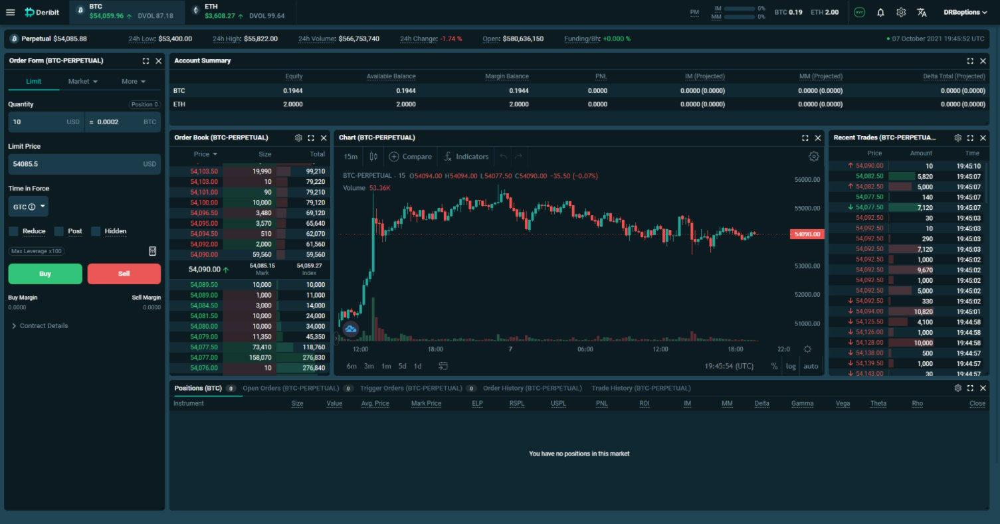

## Table of Contents

## What is Deribit and what services does it offer?

Deribit is a cryptocurrency exchange that focuses on trading options and futures. It was started in 2016 and is based in the Netherlands. The name "Deribit" comes from "derivative" and "bitcoin," which shows that it mainly deals with bitcoin and other cryptocurrencies.

Deribit offers trading in options and futures for bitcoin and other cryptocurrencies like Ethereum. Options let you buy or sell a cryptocurrency at a set price in the future, while futures are agreements to buy or sell at a future date. Deribit also has a platform that is easy to use, with tools to help traders make smart choices. They focus on keeping the platform safe and reliable for users.

## How can someone start trading on Deribit?

To start trading on Deribit, first go to their website and sign up for an account. You'll need to give your email and create a strong password. After signing up, you'll need to verify your identity. This is called KYC, which stands for "Know Your Customer." You'll need to send some documents like your ID or passport to prove who you are. Once your identity is verified, you can add money to your account. Deribit accepts deposits in cryptocurrencies like Bitcoin and Ethereum, and also in some fiat currencies.

Once your account is set up and funded, you can start trading. Deribit offers options and futures for cryptocurrencies. Options let you buy or sell at a set price in the future, and futures are agreements to buy or sell at a later date. To trade, go to the trading section of the website, choose what you want to trade, and place your order. Deribit has tools to help you make decisions, like charts and market data. Always remember to trade carefully and only with money you can afford to lose.

## What are the key features that distinguish Deribit from other cryptocurrency platforms?

Deribit stands out from other [cryptocurrency](/wiki/cryptocurrency) platforms because it focuses mainly on options and futures trading. While many exchanges offer spot trading, Deribit specializes in derivatives, which are financial instruments that get their value from an underlying asset like Bitcoin or Ethereum. This focus makes Deribit a go-to place for traders who want to use more advanced trading strategies. Deribit also offers high leverage, which means traders can control larger positions with less money, but this also comes with higher risk.

Another key feature of Deribit is its user-friendly interface and advanced trading tools. The platform is designed to be easy to use, even for people new to trading. It includes features like real-time market data, customizable charts, and an [order book](/wiki/order-book-trading-strategies) that shows current buy and sell orders. Deribit also has a mobile app, so traders can manage their trades on the go. These tools help traders make informed decisions and execute their strategies effectively.

Lastly, Deribit places a strong emphasis on security and reliability. The platform uses strong security measures to protect users' funds and personal information. It also has a good track record of uptime, meaning the platform is usually available when traders need it. This focus on security and reliability helps build trust with users, making Deribit a safe choice for trading cryptocurrency derivatives.

## Can you explain the types of financial products available on Deribit?

Deribit offers two main types of financial products: options and futures. Options are contracts that give you the right, but not the obligation, to buy or sell a cryptocurrency at a set price before a certain date. There are two kinds of options: call options, which let you buy at the set price, and put options, which let you sell at the set price. This can be useful if you think the price of a cryptocurrency will go up or down, and you want to make money from that movement without actually owning the cryptocurrency.

Futures are agreements to buy or sell a cryptocurrency at a set price on a specific date in the future. Unlike options, futures require you to follow through with the trade when the date arrives. This can be helpful if you want to lock in a price now for something you plan to buy or sell later. Both options and futures on Deribit are available for cryptocurrencies like Bitcoin and Ethereum, allowing traders to use different strategies to make money from price changes.

## How does Deribit handle user security and privacy?

Deribit takes user security and privacy very seriously. They use strong security measures to keep your money and personal information safe. For example, they use two-[factor](/wiki/factor-investing) authentication, which means you need more than just a password to log in. They also keep most of the money in cold storage, which is like a safe that's not connected to the internet, so it's harder for hackers to steal. Deribit also follows strict rules to make sure they are following the law and keeping your information private.

On top of that, Deribit has a good track record of being reliable. They work hard to make sure their platform is always working and available when you need it. They also have a team that watches for any strange activity to stop fraud and keep your account safe. By focusing on these things, Deribit helps build trust with users and makes sure you can trade without worrying about your security and privacy.

## What are the fees associated with trading on Deribit?

Deribit charges different fees depending on what you're doing on their platform. For trading options, there's a fee for buying and selling. When you buy an option, you pay a fee that's a small percentage of the option's price. When you sell an option, you pay a fee based on the option's value too. For futures trading, Deribit uses a maker-taker fee model. Makers, who add [liquidity](/wiki/liquidity-risk-premium) to the market by placing orders that aren't immediately filled, pay lower fees than takers, who take liquidity by filling existing orders right away.

There are also fees for moving money in and out of your Deribit account. Depositing cryptocurrencies like Bitcoin and Ethereum is usually free, but withdrawing them costs a small fee. The fee for withdrawals can change based on how busy the network is. If you're using fiat currencies, there might be fees for both deposits and withdrawals, depending on the method you use. It's a good idea to check Deribit's fee page to see the latest rates before you start trading or moving money.

## How does the trading process work on Deribit, including order types and execution?

When you want to trade on Deribit, you first need to go to the trading section of their website. You can choose to trade options or futures for cryptocurrencies like Bitcoin and Ethereum. To start trading, you pick what you want to trade and then decide on the type of order you want to place. There are different types of orders you can use. A market order is when you want to buy or sell right away at the current price. A limit order lets you set a specific price you're willing to buy or sell at, and it will only happen if the market reaches that price. There are also stop orders, which trigger a market order when the price hits a certain level, and stop-limit orders, which trigger a limit order at a certain price.

Once you've chosen your order type, you enter the details like how much you want to trade and at what price. Then you send the order to the market. Deribit's system will try to match your order with someone else's order. If it matches, your trade will be executed, and you'll see it in your account. If it doesn't match right away, your order will stay in the order book until it can be matched or until you cancel it. The whole process is designed to be quick and easy, so you can trade without any trouble.

## What are the benefits of using Deribit's options and futures markets?

Using Deribit's options and futures markets can help you make money from changes in cryptocurrency prices without actually owning the cryptocurrencies. Options let you bet on whether the price will go up or down. If you think the price will go up, you can buy a call option. If you think it will go down, you can buy a put option. This way, you can make money from your guess without having to buy the cryptocurrency itself. Futures, on the other hand, let you lock in a price now for something you want to buy or sell later. This can be useful if you want to protect yourself from big price swings or if you want to make money from those swings.

Another benefit is that Deribit offers high leverage, which means you can control a big position with a small amount of money. This can make your potential profits bigger, but it also makes the risk bigger. Deribit's platform is also easy to use and has lots of tools to help you make smart trading decisions. You can see real-time market data, use charts, and check the order book to see what other people are buying and selling. All these things together make Deribit a good choice for people who want to trade options and futures in cryptocurrencies.

## How does Deribit manage liquidity and what impact does it have on trading?

Deribit works hard to make sure there is enough liquidity on its platform. Liquidity means there are lots of people buying and selling, so you can easily trade without waiting too long. Deribit does this by attracting many traders and by using market makers. Market makers are special traders who always offer to buy and sell, which helps keep the market moving. This means when you want to trade, you can usually do it quickly because there are always people on the other side of your trade.

Having good liquidity on Deribit makes trading better for everyone. It means you can buy or sell at prices that are close to what you see on the screen, and you don't have to worry about the price changing a lot while you're waiting for your trade to happen. This makes trading smoother and less risky. Good liquidity also means you can trade bigger amounts without affecting the price too much, which is important for people who want to make big trades.

## What advanced trading tools and features does Deribit offer to experienced traders?

Deribit offers a lot of advanced tools and features that experienced traders can use to make smart trading choices. One of the main tools is the ability to customize charts. Traders can change how the charts look and add different indicators to help them see trends and patterns in the market. Deribit also has a feature called the order book, which shows all the current buy and sell orders. This helps traders see what other people are doing and make better decisions about their own trades. Another useful tool is the real-time market data, which gives traders up-to-date information on prices and trading volumes.

In addition to these tools, Deribit offers advanced order types that experienced traders can use to manage their trades better. For example, there are stop orders and stop-limit orders, which let traders set specific conditions for when their trades should happen. This can help them control their risk and take advantage of market movements. Deribit also has a feature called the trading API, which lets traders connect their own software to the platform. This is great for people who want to use their own trading strategies or automate their trades. All these tools and features make Deribit a powerful platform for experienced traders who want to do more than just simple buying and selling.

## How does Deribit comply with regulatory requirements in different jurisdictions?

Deribit works hard to follow the rules in different places around the world. They have a team that keeps an eye on the laws and makes sure Deribit does what it needs to do to stay legal. For example, they have a process called KYC, which stands for "Know Your Customer." This means they check who their users are to make sure they're not doing anything wrong. Deribit also follows rules about how they handle money and keep it safe, which helps them stay trusted and legal.

Even though Deribit is based in the Netherlands, they know they need to follow rules in other countries too. They do this by working with local rules and sometimes getting special permissions to operate in those places. This can be different in each country, but Deribit always tries to do what's needed to keep trading safe and fair for everyone. By focusing on these things, Deribit helps make sure they can keep offering their services without breaking any laws.

## What are some expert strategies for maximizing returns on Deribit?

One expert strategy for maximizing returns on Deribit is to use options to hedge your bets. This means you can buy options to protect yourself from big price swings in the market. For example, if you own Bitcoin and you're worried the price might go down, you can buy a put option. This gives you the right to sell Bitcoin at a set price, even if the market price drops lower. This way, you can limit your losses. Another part of this strategy is to sell options when you think the market will stay the same or move in your favor. Selling options can bring in extra money, but it also comes with risks, so you need to be careful and know what you're doing.

Another strategy is to use futures to take advantage of market trends. If you think the price of a cryptocurrency will go up, you can buy a futures contract at a lower price now and sell it later at a higher price. This can help you make money from the price going up without actually owning the cryptocurrency. On the other hand, if you think the price will go down, you can sell a futures contract now and buy it back later at a lower price. This strategy works well if you're good at predicting market movements. Both of these strategies need a lot of research and understanding of the market, but they can help you make more money if you use them right.

## References & Further Reading

[1]: Bergstra, J., Bardenet, R., Bengio, Y., & Kégl, B. (2011). ["Algorithms for Hyper-Parameter Optimization."](https://papers.nips.cc/paper/4443-algorithms-for-hyper-parameter-optimization) Advances in Neural Information Processing Systems 24.

[2]: ["Advances in Financial Machine Learning"](https://www.amazon.com/Advances-Financial-Machine-Learning-Marcos/dp/1119482089) by Marcos Lopez de Prado

[3]: ["Evidence-Based Technical Analysis: Applying the Scientific Method and Statistical Inference to Trading Signals"](https://www.amazon.com/Evidence-Based-Technical-Analysis-Scientific-Statistical/dp/0470008741) by David Aronson

[4]: ["Machine Learning for Algorithmic Trading"](https://github.com/stefan-jansen/machine-learning-for-trading) by Stefan Jansen

[5]: ["Quantitative Trading: How to Build Your Own Algorithmic Trading Business"](https://books.google.com/books/about/Quantitative_Trading.html?id=j70yEAAAQBAJ) by Ernest P. Chan