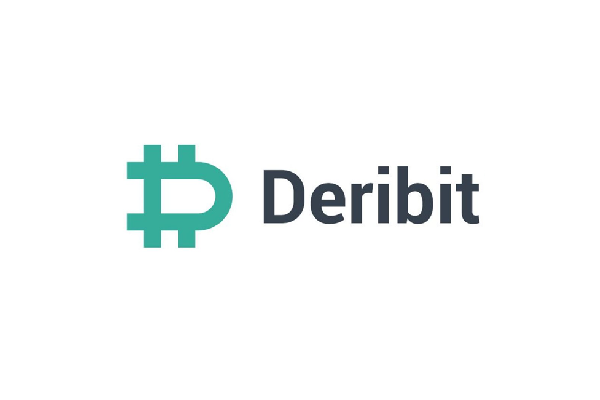

Cryptocurrency trading has emerged as a complex and rapidly evolving field, offering both exciting opportunities and substantial challenges. For traders navigating this landscape, platforms such as Deribit provide a suite of specialized tools designed to facilitate effective trading strategies. Deribit distinguishes itself as a prominent cryptocurrency exchange, primarily focusing on the derivatives market with a strong emphasis on Bitcoin and Ether. It offers futures, options, and perpetual swaps, catering to a broad spectrum of traders, from retail to institutional levels.

This article aims to explore the offerings of Deribit, with a particular focus on its capabilities and tools for algorithmic trading. Algorithmic trading involves using mathematical models and automated rules to execute trades, allowing for precision and speed that manual trading cannot match. The interest in algorithmic trading is rising, as it is increasingly becoming a fundamental component of successful trading strategies within the cryptocurrency domain.



Deribit's appeal to professional traders is largely due to its robust features that support algorithmic trading. The platform's advanced API allows for the development of custom trading solutions, providing traders the flexibility to execute and optimize a wide range of trading strategies. As the crypto market continues to grow in complexity, the ability to implement sophisticated trading algorithms is a significant advantage.

The forthcoming sections will examine the multitude of benefits and potential obstacles that come with utilizing Deribit for algorithmic trading. By offering insights into the platform's functionalities and strategic advantages, this article seeks to equip traders with the knowledge necessary to excel in the competitive world of crypto trading.

## Table of Contents

## Understanding Deribit as a Crypto Trading Platform

Deribit was established in 2016 and has quickly carved out a niche for itself in the competitive world of cryptocurrency derivatives. Initially founded in the Netherlands, the company later relocated its headquarters to Panama. This strategic move was largely aimed at optimizing its operational framework and expanding its reach in a rapidly evolving market. Deribit is widely recognized for its professional trading dashboard, which is designed with precision to cater to both novice and veteran traders.

The platform specializes in cryptocurrency derivatives, primarily offering trading options in Bitcoin and Ether. This includes futures, options, and perpetual swaps, which are financial instruments that allow traders to speculate on the price movements of these digital currencies without needing to own the actual assets. The availability of such instruments on Deribit provides traders with the opportunity to hedge their positions or leverage their capital for potentially higher returns.

One of the standout features of Deribit is its provision of deep [liquidity](/wiki/liquidity-risk-premium) and ultra-low latency. Despite being unregulated, which can be a point of caution for some users, Deribit has managed to establish a reputation for reliability and speed. Deep liquidity ensures that large trades can be executed without significantly affecting the market price, while ultra-low latency minimizes the time lag between order placement and execution—a critical [factor](/wiki/factor-investing) for traders operating in fast-paced markets.

A significant portion of Deribit's appeal lies in its robust API capabilities, making it an attractive choice for those interested in algorithmic and high-frequency trading. The platform's API supports the development of custom trading algorithms, allowing traders to automate their strategies. This is especially beneficial for executing high-frequency trading strategies, which require swift execution times and can capitalize on even minor price discrepancies in the market.

Overall, Deribit's focus on advanced financial instruments, combined with its emphasis on speed and liquidity, positions it as a key player in the [cryptocurrency](/wiki/cryptocurrency) trading sector. Its capabilities in supporting [algorithmic trading](/wiki/algorithmic-trading) make it a preferred choice for experienced traders looking to optimize their trading strategies with cutting-edge technology.

## Algorithmic Trading on Deribit

Algorithmic trading is a method of executing orders using automated and pre-set rules based on mathematical models. Deribit's platform is well suited for traders leveraging algorithmic strategies due to its comprehensive API infrastructure. This API enables the creation and deployment of custom trading solutions tailored to a variety of market conditions and strategies.

Traders on Deribit can implement bots and algorithms to optimize performance across a spectrum of trading strategies. These might include [market making](/wiki/market-making), [arbitrage](/wiki/arbitrage), [trend following](/wiki/trend-following), or [statistical arbitrage](/wiki/statistical-arbitrage). For example, market-making strategies often involve placing buy and sell orders around the current market price, capturing the bid-ask spread. This can be efficiently automated on Deribit due to its rapid execution capabilities and robust API access.

A strong advantage of using Deribit for algorithmic trading is the platform’s high-frequency trading ([HFT](/wiki/high-frequency-trading-strategies)) capabilities. The exchange provides ultra-low latency, essential for executing trades quickly enough to capture market opportunities without significant price slippage. Minimal slippage is crucial in high-frequency strategies, where the speed of execution can directly impact profitability.

While algorithmic trading holds the potential for significant gains, it requires an in-depth understanding of both market dynamics and the technological aspects involved. Traders must grasp how external factors might influence market conditions and take advantage of computational methods to refine their strategies. Additionally, rigorous back-testing of algorithms under historical market data, complemented by stress-testing under simulated conditions, is vital to validate a strategy's robustness before live deployment.

For those programming their strategies, Python is a popular choice due to its extensive libraries and community support. A basic example of a Python script could involve using the ‘ccxt’ library to connect and fetch market data from Deribit, which can then be used to execute a strategy:

```python
import ccxt

# Initialize the Deribit exchange
exchange = ccxt.deribit({
    'enableRateLimit': True,
})

# Retrieve market data
market_data = exchange.fetch_ticker('BTC-PERPETUAL')

# Implement a basic strategy
def basic_strategy(market_data):
    if market_data['close'] > market_data['open']:
        return "Buy"
    else:
        return "Sell"

# Execute the strategy
action = basic_strategy(market_data)
print(f"Action to take: {action}")
```

The example above is a simplistic approach, merely illustrating the execution logic. Real-world applications demand a far more comprehensive understanding and sophisticated strategy incorporating numerous indicators and signals.

## Benefits of Algo Trading on Deribit

Deribit provides a robust trading environment that enhances the efficacy of algorithmic trading strategies. The platform's transparency and detailed [order book](/wiki/order-book-trading-strategies) are vital for developing and executing sophisticated algorithms. These tools allow traders to accurately assess market conditions, providing a reliable data set for modeling and executing trades.

Risk management on Deribit is designed with leveraged positions in mind, offering features such as stop-loss orders and portfolio margining. This is particularly important for algorithmic traders who often employ leveraged strategies to maximize returns. By utilizing these tools, traders can mitigate potential losses and better manage their exposure to volatile markets.

Deribit's infrastructure is engineered for speed and efficiency, with low latency and high liquidity being cornerstones of the platform. Low latency means that trades are executed rapidly, minimizing the risk of slippage – the difference between the expected price of a trade and the actual price. High liquidity ensures that traders can enter and [exit](/wiki/exit-strategy) positions with large volumes without significantly impacting market prices.

Automated trading relieves traders from the emotional burdens that often accompany manual trading. Algorithms execute trades based on predefined criteria, eliminating impulsive decisions driven by market psychology. Furthermore, algorithms can operate continuously, executing trades around the clock without the need for human intervention, which is crucial in the 24/7 cryptocurrency market.

The customization capabilities of Deribit are extensive, supporting a wide range of strategies tailored to the specific needs of both institutional and retail investors. This includes the ability to design and implement complex trading algorithms that take advantage of arbitrage opportunities, trend following, and market making, among others. The platform's API allows for seamless integration with trading bots and external systems, enabling traders to optimize and scale their operations effectively.

These features collectively make Deribit an attractive platform for traders looking to capitalize on the benefits of algorithmic trading. The combination of transparency, risk management, low latency, and customization options enables traders to execute high-frequency and large-[volume](/wiki/volume-trading-strategy) trades with confidence, ultimately contributing to more efficient and potentially profitable trading strategies.

## Challenges and Considerations

Algorithmic trading on Deribit presents a set of challenges and considerations that traders must carefully analyze to execute successful strategies in the cryptocurrency market. One of the primary risks associated with algo trading is the potential for financial losses due to the inherent [volatility](/wiki/volatility-trading-strategies) of digital currencies. The crypto market is known for its rapid price fluctuations, which can pose a significant risk to algorithmic strategies that are not sufficiently adaptive or robust.

To mitigate the risks of algorithmic failures, traders must engage in thorough back-testing of their strategies. This involves simulating trading strategies on historical data to evaluate their effectiveness under various market conditions. For instance, traders can implement back-testing in Python using libraries like `pandas` and `numpy` to fine-tune their algorithms before live deployment. The goal is to ensure that the algorithm behaves consistently and as expected across different scenarios.

```python
import pandas as pd
import numpy as np

# Example of back-testing a moving average strategy
def backtest_strategy(data, short_window, long_window):
    # Compute moving averages
    data['short_mavg'] = data['Close'].rolling(window=short_window, min_periods=1).mean()
    data['long_mavg'] = data['Close'].rolling(window=long_window, min_periods=1).mean()

    # Generate buy/sell signals
    data['signal'] = 0
    data['signal'][short_window:] = np.where(data['short_mavg'][short_window:] 
                                             > data['long_mavg'][short_window:], 1, 0)
    data['position'] = data['signal'].diff()

    # Calculate returns
    data['strategy_returns'] = data['Close'].pct_change() * data['position'].shift(1)

    return data['strategy_returns'].cumsum()
```

Another critical factor is understanding the fee structure on Deribit, which comprises maker-taker fees and liquidation fees. Fee structures can significantly affect the profitability of trading strategies. Maker-taker fees are charged based on whether a trader provides liquidity (maker) or takes liquidity (taker) from the market. Additionally, liquidation fees can accompany leveraged positions that are forcibly closed to maintain market integrity.

Deribit's unregulated status adds another layer of complexity for traders. While many traders are drawn to its advanced features, they must be aware of the potential legal implications and risks associated with trading on an unregulated platform. This lack of regulatory oversight can lead to uncertain legal recourses in case of disputes or platform failures. Therefore, traders should conduct due diligence and understand the implications of using such a platform.

Finally, staying informed about regulatory changes is essential. Cryptocurrency regulations are rapidly evolving, and changes can impact the operations of platforms like Deribit. Keeping track of these developments helps traders anticipate adjustments that may be needed in their strategies or operational practices. By staying informed and adaptable, traders can better navigate the challenges and capitalize on the opportunities that Deribit's platform provides for algo trading.

## Conclusion

Deribit remains a top choice for professional traders seeking to leverage algorithmic trading in the cryptocurrency market. The platform's advanced features and tools provide a distinct advantage for those trading Bitcoin, Ether, and other currencies. Deribit's comprehensive suite of offerings includes options, futures, and perpetual swaps, which are instrumental for traders aiming to implement complex strategies.

Despite inherent challenges, the benefits of algo trading on Deribit open vast opportunities for experienced traders. The platform's low latency and high liquidity are particularly advantageous for executing high-frequency trading strategies, ensuring minimal slippage and precise trade execution. Additionally, Deribit's robust risk management tools enhance the ability to manage leveraged positions effectively, improving overall trading outcomes.

As the cryptocurrency market evolves, Deribit has consistently maintained its focus on derivatives and algorithmic trading, cementing its position at the forefront of crypto trading innovation. Its commitment to improving trading infrastructure and providing deep liquidity supports the growing needs of institutional and retail investors alike.

To maximize success on Deribit, traders should continually research and adapt their strategies. Understanding market dynamics and leveraging the platform's technological capabilities are essential for maintaining an edge. As the regulatory landscape continues to change, staying informed about potential impacts on trading operations will be crucial. By doing so, traders can harness the full potential of Deribit's offerings and enhance their trading performance in the dynamic world of cryptocurrency.

## References & Further Reading

[1]: Bergstra, J., Bardenet, R., Bengio, Y., & Kégl, B. (2011). ["Algorithms for Hyper-Parameter Optimization."](https://papers.nips.cc/paper/4443-algorithms-for-hyper-parameter-optimization) Advances in Neural Information Processing Systems 24.

[2]: ["Advances in Financial Machine Learning"](https://www.amazon.com/Advances-Financial-Machine-Learning-Marcos/dp/1119482089) by Marcos Lopez de Prado

[3]: ["Evidence-Based Technical Analysis: Applying the Scientific Method and Statistical Inference to Trading Signals"](https://www.amazon.com/Evidence-Based-Technical-Analysis-Scientific-Statistical/dp/0470008741) by David Aronson

[4]: ["Machine Learning for Algorithmic Trading"](https://github.com/stefan-jansen/machine-learning-for-trading) by Stefan Jansen

[5]: ["Quantitative Trading: How to Build Your Own Algorithmic Trading Business"](https://books.google.com/books/about/Quantitative_Trading.html?id=j70yEAAAQBAJ) by Ernest P. Chan