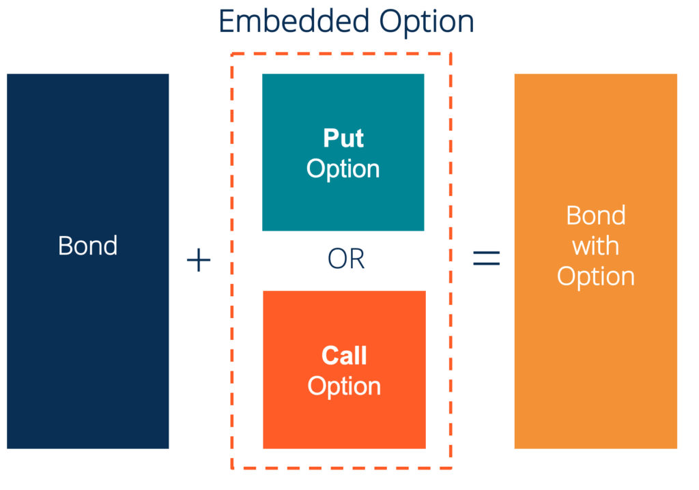

In fixed-income securities, bonds with embedded options present distinct opportunities and challenges for investors. These bonds come with options that can significantly impact their value and investment potential. Understanding the nature of these options—such as callable, putable, and convertible bonds—is essential for investors looking to optimize their returns in an ever-changing market environment.

Callable bonds grant issuers the right to redeem the bonds before they mature, especially when interest rates decrease. This presents a potential reinvestment risk for bondholders, as they may need to reinvest at lower interest rates. Conversely, putable bonds provide investors the ability to sell the bond back to the issuer at a predetermined price, affording a safety net in rising interest rate scenarios. Convertible bonds offer a hybrid approach, providing both debt instrument stability and the chance to convert into equity for potential appreciation.



As technology influences financial markets, algorithmic trading plays a pivotal role in the fixed-income sector, particularly with bonds featuring embedded options. Algorithms help in analyzing, valuing, and effectively trading these complex instruments, enabling investors to respond adeptly to market fluctuations and volatility. By leveraging advanced computational techniques, investors can enhance decision-making processes, potentially boosting returns and mitigating risks inherent in dealing with bonds with embedded options. This article investigates into the complexities of these financial instruments and examines how algorithmic trading strategies are reshaping investment approaches.

## Table of Contents

## Understanding Embedded Options in Bonds

Embedded options in bonds provide either the issuer or the bondholder specific rights that can substantially alter the bond's valuation and investment appeal. These options are integral components of certain fixed-income securities, offering flexibility and strategic advantages in various market conditions. The three main types of embedded options—callable, putable, and convertible features—each influence a bond's risk and return profile differently.

Callable bonds include options that allow issuers to redeem the bond before its maturity date, typically at specified call prices and call dates. This feature can be advantageous for issuers when interest rates drop, enabling them to refinance debt at lower costs. The embedded call option introduces a level of uncertainty for investors, as it creates potential reinvestment risk if the bond is called away in a declining interest rate environment. To compensate for this risk, callable bonds often provide higher yields compared to their non-callable counterparts. Valuing callable bonds involves determining the value of the bond minus the value of the call option, often using models like the Black-Derman-Toy or the Hull-White models. These models factor in variables such as interest rate volatility, credit spread, and the specific terms of the call option.

Putable bonds, on the other hand, provide bondholders with the right to sell the bond back to the issuer at predetermined prices and dates, offering protection against rising interest rates. This option can be especially attractive during periods of increasing interest rates, as bondholders can reinvest funds at higher yields. The valuation of putable bonds considers the value of the straight bond plus the put option using similar modeling techniques as for callable bonds but with different parameters reflecting the put feature.

Convertible bonds allow bondholders the option to convert their holdings into a fixed number of shares of the issuing company. This feature combines the steady income stream of a bond with the potential upside of equity participation. The valuation of convertible bonds can be complex, as it involves modeling both the bond's debt characteristics and the option-like feature of equity conversion. Investors must consider the [volatility](/wiki/volatility-trading-strategies) of the underlying stock, [interest rate](/wiki/interest-rate-trading-strategies) movements, and potential dilution effects.

Embedded options in bonds contribute to a dynamic pricing environment. They necessitate the use of advanced financial models to evaluate the risks and returns associated with each bond type. Understanding these options allows investors to tailor their portfolios according to market expectations and risk tolerance, leveraging the flexibility these financial instruments offer. Consequently, bonds with embedded options play a significant role in diversifying investment strategies, catering to various risk appetites and market forecasts.

## Callable Bonds: Features and Implications

Callable bonds are a type of fixed-income security that grant the issuer the right to redeem the bond before its maturity date, typically in favorable market conditions such as declining interest rates. This feature is advantageous for issuers as it allows them to refinance the bond at lower interest rates, effectively reducing their cost of borrowing. However, this same feature introduces reinvestment risk for bondholders, as they must then reinvest the returned principal at potentially lower prevailing interest rates.

To compensate investors for the possibility of early redemption, callable bonds generally offer a higher yield than non-callable bonds. This additional yield serves as a premium for the embedded call option, reflecting the uncertainty and potential disadvantage to the investor if the bond is called away.

The valuation of callable bonds is more complex than that of non-callable bonds due to the embedded call option. The pricing involves both the standard valuation of cash flows and an option pricing model to account for the call feature. Theoretical valuation models for callable bonds often use the Black-Scholes option pricing model or binomial tree models to simulate different interest rate scenarios. Python, for example, can provide a practical approach to modeling these scenarios:

```python
import numpy as np

def callable_bond_valuation(face_value, coupon_rate, interest_rates, call_price, maturity, call_period):
    cash_flows = [coupon_rate * face_value] * maturity
    cash_flows[-1] += face_value  # Add face value to the last cash flow

    present_value = 0
    for t in range(1, maturity + 1):
        if t > call_period:
            cash_flow = min(call_price, cash_flows[t - 1])
        else:
            cash_flow = cash_flows[t - 1]
        present_value += cash_flow / (1 + interest_rates[t - 1])**t

    return present_value

# Example parameters
face_value = 1000
coupon_rate = 0.05
interest_rates = [0.04, 0.045, 0.042, 0.043, 0.041]  # Hypothetical market interest rates
call_price = 1050
maturity = 5
call_period = 3

price = callable_bond_valuation(face_value, coupon_rate, interest_rates, call_price, maturity, call_period)
print(f"Callable Bond Price: {price}")
```

Callable bonds exhibit specific market behaviors influenced by interest rate movements and the issuer's financial strategy. When interest rates decline significantly, the probability of the bond being called increases, affecting its price. Investors often need to closely monitor interest rate trends and the issuer's likelihood of executing the call option, adjusting their strategies accordingly to mitigate reinvestment risk and attain their desired yield.

## Putable Bonds: A Safety Net for Investors

Putable bonds provide investors with an important safeguard by embedding the option to sell the bond back to the issuer at a predetermined price before maturity. This feature serves as a protective measure in fluctuating market conditions, particularly during periods of rising interest rates. When interest rates increase, bond prices typically decrease. A putable bond allows investors to mitigate this risk by exercising the put option, enabling them to potentially reinvest at higher prevailing yields, thereby optimizing their return on investment.

### Advantages of Putable Bonds

In a rising interest rate environment, finding security in a bond that can be sold back to the issuer offers significant advantages. These bonds provide investors with the flexibility to navigate market volatilities and adjust their portfolios without incurring substantial losses. The embedded put option acts as a hedge against interest rate risks, offering a strategic [exit](/wiki/exit-strategy) route and the opportunity for portfolio reallocation towards more lucrative investment avenues.

### Pricing of Putable Bonds

The valuation of putable bonds involves assessing the intrinsic value of the option embedded within the bond. The bond's price consists of two main components: the price of the plain vanilla bond and the value of the put option. The bond price can be expressed as:

$$

P_{\text{putable}} = P_{\text{vanilla}} + V_{\text{put}}
$$

Where:
- $P_{\text{putable}}$ is the price of the putable bond.
- $P_{\text{vanilla}}$ is the price of the equivalent bond without the put option.
- $V_{\text{put}}$ is the value of the put option.

The valuation of the put option typically requires option pricing models, such as Black-Scholes for European-style options or binomial tree models for American-style options, to account for exercise flexibility prior to expiration.

### Strategic Value in Investment Portfolios

Incorporating putable bonds into an investment portfolio can enhance its defensive attributes. These bonds are particularly appealing to risk-averse investors seeking stable returns amidst changing interest rates. A well-diversified portfolio that includes putable bonds can generate steady income while maintaining an element of [liquidity](/wiki/liquidity-risk-premium) and flexibility. The put option can act as an insurance policy, smoothing the effects of interest rate fluctuations and economic uncertainties.

Overall, putable bonds can play a crucial role in individualized investment strategies. They offer a blend of income and risk management capabilities that align with various market conditions, supporting both conservative and dynamic portfolio approaches. Their strategic application can protect investors against adverse interest rate movements while providing opportunities for reinvestment at favorable terms.

## Convertible Bonds: Balancing Debt and Equity

Convertible bonds are unique financial instruments that provide investors with the benefits of both debt and equity positions. These bonds initially function as traditional bonds, offering regular interest payments, known as coupons. However, they come with an embedded option that allows the bondholder to convert the bonds into a predetermined number of shares of the issuing company's stock. This dual nature allows investors to participate in the equity appreciation of the issuing company while enjoying the regular income of a fixed-income security.

The fixed-income component ensures that investors receive periodic interest payments, which can provide a steady income stream. The conversion feature, on the other hand, offers potential upside if the underlying company's stock price appreciates. This feature is particularly attractive during bullish market conditions when equity values are expected to rise.

The conversion process involves a specific mechanism, often defined by the conversion ratio and the conversion price. The conversion ratio indicates the number of shares one bond can be converted into, while the conversion price is the price at which the bond converts into stock. Mathematically, the conversion ratio can be expressed as:

$$
\text{Conversion Ratio} = \frac{\text{Par Value of Bond}}{\text{Conversion Price}}
$$

For example, if a bond with a par value of $1,000 has a conversion price of $50, the conversion ratio would be 20, meaning the bondholder can receive 20 shares for each bond.

While convertible bonds offer attractive features, they also [carry](/wiki/carry-trading) specific risks. The primary risk is the possibility of the underlying stock not performing well, which could render the conversion option less valuable. Additionally, the issuing company's credit risk plays a role, as default could affect both the bond and equity value.

From a portfolio diversification perspective, convertible bonds can serve as a tool for spreading risk and enhancing potential returns. They offer exposure to both the fixed-income market and the equity market, allowing investors to balance their portfolio against market volatility. As such, convertible bonds can act as a hedge against market downturns or capitalize on market upswings.

In summary, convertible bonds are versatile instruments that blend the stability of bonds with the growth potential of equities. Their strategic utilization in a portfolio can optimize returns while managing risk, making them a valuable asset for diverse investment strategies.

## Algorithmic Trading with Embedded Option Bonds

Algorithmic trading utilizes advanced technology to execute transactions rapidly and accurately based on predefined algorithms, optimizing the management of complex securities like bonds with embedded options. This technology is particularly beneficial when dealing with the intricate nature of these bonds, which include structures like callable, putable, and convertible features. These embedded options add a layer of complexity to trading strategies, as they involve non-linear payoffs and require sophisticated valuation models.

Algorithms play a critical role in analyzing and valuing bonds with embedded options. They allow traders to process vast amounts of data to determine the optimal timing and conditions under which to trade these securities. For instance, algorithms can use the Black-Derman-Toy model or the Hull-White model, which are interest rate models suitable for valuing bonds with embedded options. These models help in simulating different interest rate scenarios to price the bonds accurately and assess potential returns.

Moreover, algorithms assess the impact of market variables such as volatility and interest rate movements, which are pivotal in forming trading strategies. Market volatility can affect the timing and execution of trades, as high volatility might necessitate rapid buying or selling. Algorithms are designed to react to these conditions, determining the appropriate trades that capitalize on market inefficiencies. Interest rate movements are particularly significant for securities with embedded options, as they can trigger the exercising of options, such as calls or puts, by the issuer or holder. Therefore, algorithms must incorporate interest rate forecasts and sensitivity analysis to manage the specific risks associated with these bonds.

In a Python-based [algorithmic trading](/wiki/algorithmic-trading) system, libraries like NumPy and Pandas can process and manipulate large datasets, while performance optimization might involve using C++ extensions or GPU computations for intensive tasks. The pseudocode for an algorithm assessing a callable bond might include scenarios for different interest rate paths, using Monte Carlo simulations for option valuation:

```python
import numpy as np

def monte_carlo_simulation(interest_rate_paths, coupon_rate, maturity, call_price):
    payoffs = []
    for path in interest_rate_paths:
        if should_call_bond(path, coupon_rate, call_price):
            payoffs.append(compute_call_payoff(path, call_price))
        else:
            payoffs.append(compute_maturity_payoff(path, coupon_rate, maturity))
    return np.mean(payoffs)

def should_call_bond(path, coupon_rate, call_price):
    return any(rate < threshold_rate for rate in path)

def compute_call_payoff(path, call_price):
    payoff = max(call_price - np.mean(path), 0)
    return payoff

def compute_maturity_payoff(path, coupon_rate, maturity):
    present_value = sum(coupon_rate / ((1 + rate) ** t) for t, rate in enumerate(path[:maturity]))
    return present_value

# Example usage
sim_paths = np.random.normal(rate_mean, rate_volatility, (n_scenarios, n_periods))
expected_value = monte_carlo_simulation(sim_paths, coupon_rate, maturity, call_price)
print(f"Expected Callable Bond Value: {expected_value}")
```

This process showcases how algorithmic trading systems function to maximize returns by effectively managing the uncertainties and complexities introduced by embedded options. Ultimately, these algorithms enhance the ability of investors to navigate volatile markets, uncover lucrative opportunities, and mitigate potential losses inherent in trading such sophisticated financial instruments.

## Risks and Considerations

Embedded options in bonds offer distinct flexibility but also introduce various risks that must be carefully managed. One primary risk associated with callable bonds is the call risk. This risk arises when issuers decide to repay the bond before maturity, particularly in declining interest rate environments. For investors, this means the uncertainty of cash flows and the potential for reinvestment at lower prevailing rates, thereby reducing the overall return on investment. Reinvestment risk is particularly pronounced in callable bonds, where the bondholder might face limited opportunities to reinvest at comparable yields once the issuer exercises the call option.

Furthermore, equity risk is a significant consideration in convertible bonds. These bonds provide the option to convert debt into equity, linking their value directly to the issuing company's stock performance. As stock prices can be volatile, convertible bondholders may face substantial fluctuation in returns, especially during periods of market instability. This potential volatility underscores the dual nature of convertible bonds as both fixed-income and equity instruments, which requires investors to be vigilant and to assess the equity market conditions alongside traditional bond market metrics.

To effectively manage the risks associated with bonds featuring embedded options, investors must integrate these instruments thoughtfully within their broader investment strategies. Consideration should be given to the overall portfolio's risk tolerance, investment objectives, and market conditions. By balancing the attributes of embedded option bonds with other portfolio components, investors can better align their portfolio performance with their long-term objectives.

Algorithmic trading presents a sophisticated tool to mitigate some of these risks. Algorithms can efficiently process large volumes of data to evaluate bond pricing models, interest rate trends, and equity market dynamics, thereby providing insights that inform buying or selling decisions. For example, algorithms can identify market conditions where callable bonds are likely to be called and initiate timely reinvestment strategies to minimize reinvestment risk. Python, a versatile and widely-used programming language in financial analysis, can be utilized to create such algorithms. Below is a snippet of Python code that demonstrates a basic framework for evaluating callable bonds:

```python
# Simplified Python code snippet for evaluating callable bonds

def callable_bond_valuation(face_value, coupon_rate, market_rate, call_periods):
    pv_coupons = sum([face_value * coupon_rate / (1 + market_rate)**t for t in range(1, call_periods + 1)])
    pv_face_value = face_value / (1 + market_rate)**call_periods
    return pv_coupons + pv_face_value

# Example parameters
face_value = 1000
coupon_rate = 0.05
market_rate = 0.03
call_periods = 3

# Calculate callable bond valuation
valuation = callable_bond_valuation(face_value, coupon_rate, market_rate, call_periods)
print("Callable Bond Valuation: ", valuation)
```

This code calculates the present value of future cash flows from callable bonds, helping investors quantify potential valuations. Integrating algorithms into trading strategies not only aids in decision-making but enhances the agility in responding to market changes, thus optimizing risk-return profiles in fixed-income portfolios.

## The Future of Bonds with Embedded Options

With advancing technology and the evolution of sophisticated trading algorithms, the landscape for trading bonds with embedded options is undergoing significant transformation. Innovations in financial technology are reshaping how these complex instruments are analyzed, valued, and traded, offering promising future trends foreseen in bond markets.

One of the primary advancements is the integration of [artificial intelligence](/wiki/ai-artificial-intelligence) (AI) and [machine learning](/wiki/machine-learning) (ML) in algorithmic trading systems. These technologies enable the processing of vast amounts of data, identifying patterns, and making informed trading decisions with high precision. AI-driven models can enhance predictive accuracy concerning interest rate movements and market volatility, both critical factors affecting the pricing and trading of bonds with embedded options.

For instance, machine learning algorithms can be employed to analyze historical data on callable, putable, and convertible bonds to predict future trends. By utilizing regression models or neural networks, traders and investors can forecast bond performance under varying economic scenarios, such as changes in interest rates or issuer creditworthiness. Here's a simple illustrative Python snippet showcasing how ML might be applied to predict bond yield changes:

```python
from sklearn.model_selection import train_test_split
from sklearn.linear_model import LinearRegression
import numpy as np

# Sample data (interest rates, bond yields)
data = np.array([[1.5, 2.1], [1.7, 2.5], [1.9, 2.8], [2.1, 3.0]])
X = data[:, 0].reshape(-1, 1)  # interest rates
y = data[:, 1]  # bond yields

# Train-test split
X_train, X_test, y_train, y_test = train_test_split(X, y, test_size=0.2)

# Training the model
model = LinearRegression()
model.fit(X_train, y_train)

# Predicting bond yields
predicted_yields = model.predict(X_test)
print("Predicted bond yields:", predicted_yields)
```

Another key trend is the increasing accessibility of real-time market data and the development of platforms that facilitate the execution of complex trading strategies. As infrastructure improves, more investors can implement dynamic strategies that react instantaneously to market shifts, taking advantage of opportunities in bonds with embedded options.

Technology also offers a greater ability to simulate various market scenarios, helping investors understand the potential impacts of macroeconomic changes before they occur. This foresight can aid in constructing portfolios that are resilient across different economic conditions, leveraging the flexibility provided by bonds with embedded features.

As these technological advancements continue, the role of human oversight cannot be understated. While algorithms can efficiently process and execute trades, investor insight and strategic planning remain crucial in adapting to market changes and ensuring ethical considerations are met. Staying informed and adaptable is key, as the rapid pace of technological development necessitates continuous learning and strategy refinement.

Overall, as the bond market embraces more sophisticated technology, investors can anticipate a more dynamic, responsive market environment. The integration of AI and real-time data analytics into trading strategies suggests a future where bonds with embedded options will play an even more vital role in investment portfolios. Staying at the forefront of these advancements will be essential for successful investment management in this evolving landscape.

## Conclusion

Bonds with embedded options represent a sophisticated asset class within fixed-income investing, offering both potential rewards and specific risks inherent in their structure. These instruments enable issuers and investors to leverage unique features, such as the ability to call, put, or convert bonds, thus affecting pricing dynamics and investment outcomes. The embedded options provide flexibility, allowing for strategic maneuvering depending on market conditions such as interest rate fluctuations. For example, callable bonds permit issuers to refinance in declining interest rate environments, whereas putable bonds offer bondholders protection against rising rates.

Incorporating algorithmic trading strategies into managing these securities enhances the precision and efficiency of investment decisions. Algorithmic trading automates processes such as identifying [arbitrage](/wiki/arbitrage) opportunities, optimizing portfolio allocations, and executing trades, thus potentially improving the risk-return profile of investments in bonds with embedded options. These strategies are particularly advantageous in navigating the complex pricing and valuation calculations involved, such as those necessary for callable bond valuation or modeling conversion ratios for convertible bonds.

To maximize the benefits of bonds with embedded options, investors must develop a comprehensive understanding of the interplay between these options and market dynamics. This understanding is crucial for anticipating potential scenarios, such as changes in interest rates or company-specific events, that could impact bond value. By maintaining a well-rounded knowledge of these instruments, investors are better equipped to assess the benefits and drawbacks accurately, enabling more informed decision-making and enhanced investment performance.

Ultimately, bonds with embedded options, when effectively integrated into a broader investment strategy, offer opportunities to optimize returns while managing associated risks. By leveraging technology and a deep understanding of these financial instruments, investors can better navigate the evolving landscape of fixed-income markets.

## References & Further Reading

[1]: Fabozzi, F. J. (2001). ["Bond Markets, Analysis, and Strategies."](https://books.google.com/books/about/Bond_Markets_Analysis_and_Strategies_ten.html?id=bQpNEAAAQBAJ) Pearson College Division.

[2]: Black, F., Derman, E., & Toy, W. (1990). ["A One-Factor Model of Interest Rates and Its Application to Treasury Bond Options."](https://www.semanticscholar.org/paper/A-One-Factor-Model-of-Interest-Rates-and-Its-to-Black-Derman/6ecbf463899fdf6a71e272a13153899e3da7ff88) Financial Analysts Journal, 46(1), 33-39.

[3]: Hull, J. C. (2018). ["Options, Futures, and Other Derivatives."](https://www.semanticscholar.org/paper/Options%2C-Futures%2C-and-Other-Derivatives-Hull/89bdee500c8623864fc9eb7a471546aa713acc44) Pearson.

[4]: Lopez de Prado, M. (2018). ["Advances in Financial Machine Learning."](https://www.amazon.com/Advances-Financial-Machine-Learning-Marcos/dp/1119482089) Wiley.

[5]: Jabbour, G. M., & Attari, M. (2010). ["Convertible Bond Arbitrage."](https://onlinelibrary.wiley.com/doi/full/10.1111/j.1468-5957.2009.02178.x) Wiley.