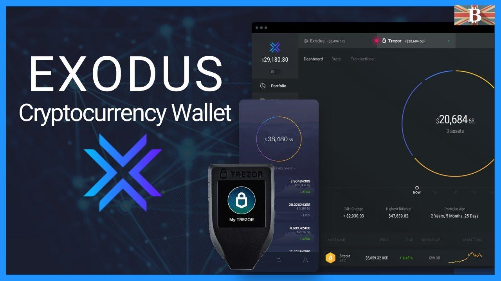

Digital currency storage constitutes a fundamental pillar in the expansive ecosystem of cryptocurrencies. These digital currencies require secure and efficient storage solutions because they lack the physical form attached to traditional money systems. Their storage is primarily handled through cryptocurrency wallets, which play an instrumental role in facilitating various aspects of crypto trading.

Cryptocurrency wallets are specialized software programs designed to store private and public keys that interact with various blockchain networks. They empower users to send and receive digital currencies and monitor their balances. The significance of these wallets in crypto trading cannot be overstated, as they provide the necessary infrastructure for conducting secure transactions and maintaining user anonymity. The use of public and private keys offers a unique mechanism for safeguarding assets, hence underscoring the criticality of selecting the right wallet for one's needs.

Among the different options available, Exodus Wallet is a highly popular choice due to its user-friendly interface and enhanced security protocols. It offers a seamless experience for beginners and seasoned traders alike, making it accessible and efficient for day-to-day transactions and long-term holdings.

Algorithmic trading has emerged as a vital tool in managing cryptocurrencies. By leveraging algorithms, traders can execute orders at speeds and frequencies impossible for a human trader. This type of trading relies on automated systems that make decisions based on pre-programmed rules and strategies, allowing traders to capitalize on market inefficiencies and optimize their investment portfolios.

This article aims to explore the landscape of cryptocurrency wallets, with a particular focus on Exodus Wallet, and its integration with algorithmic trading platforms. Readers can expect to gain insights into the storage solutions available for digital currencies, the features that make Exodus Wallet stand out, and how it can be utilized alongside algorithmic trading to enhance trading outcomes. Additionally, the article will provide guidance on setting up the Exodus Wallet, compare it with other popular options, and discuss future trends in cryptocurrency storage technologies.

## Table of Contents

## Understanding Cryptocurrency Wallets

A cryptocurrency wallet is a digital tool designed to store, manage, and facilitate transactions with cryptocurrencies such as Bitcoin, Ethereum, and many others. Unlike traditional wallets that hold physical currency, cryptocurrency wallets store pairs of public and private keys that enable users to send and receive digital currency, as well as monitor their balance.

### Different Types of Wallets

Cryptocurrency wallets come in various forms, each with its advantages and disadvantages. The primary types include hardware, software, and paper wallets.

1. **Hardware Wallets**: These are physical devices that store a user's private keys offline, which can be considered a form of cold storage. Examples of popular hardware wallets include Ledger and Trezor. They are highly secure because they are immune to online hacks; however, they require purchase and may not be as convenient for frequent transactions.

2. **Software Wallets**: These are applications or programs that run on devices such as a computer or smartphone, storing keys on the device itself. They can be further divided into:
   - **Web Wallets**: Accessible via internet browsers, these wallets store keys online and can be vulnerable to hacking but provide more accessible and often more convenient ways for users to transact.
   - **Desktop Wallets**: Installed on personal computers, they provide a secure way to store coins, as long as the computer is free from malware.
   - **Mobile Wallets**: Apps on smartphones that offer a convenient way for day-to-day transactions. Some examples include Exodus and Trust Wallet.

3. **Paper Wallets**: These wallets involve printing out or writing down the keys, thereby storing them offline. While highly secure from digital threats, they can be damaged or lost and are less user-friendly for transactions.

### Security Features

When choosing a [cryptocurrency](/wiki/cryptocurrency) wallet, several critical security features should be considered:

- **Private Key Control**: Users should ensure they have full control over their private keys as this grants them full access to their funds.
- **Backup Options**: The ability to back up wallet data is crucial. Seed phrases or recovery phrases allow users to recover their wallets if a device is lost or damaged.
- **Two-Factor Authentication (2FA)**: This additional security layer can help protect the wallet even if the password is compromised.

### Accessibility and User-friendly Interfaces

The ease of use can significantly impact a user's experience with accessing funds and making transactions. Wallets with intuitive interfaces make it simpler for both beginners and experienced users to navigate their assets efficiently. Mobile wallets typically excel in this area, offering a streamlined experience for on-the-go transactions.

### Privacy and Protection of Funds

Cryptocurrency wallets ensure privacy through encryption and anonymity features that mask user identities during transactions. For protection, wallets employ encryption and multi-signature features, which require multiple approvals before a transaction is considered valid. Consequently, users can enjoy a secure and private experience, knowing their assets are well-protected from unauthorized access.

## An Overview of Exodus Wallet

Exodus Wallet is a prominent player in the cryptocurrency storage space, known for its user-friendly interface and wide range of features that cater to both novice and experienced cryptocurrency users.

### History and Background of Exodus Wallet

Exodus Wallet was launched in July 2016, founded by Daniel Castagnoli and JP Richardson. The founders aimed to create a software wallet that would provide a seamless experience for users managing digital assets. From its inception, Exodus has focused on offering a balance between comprehensive features and ease of use, setting it apart from other cryptocurrency wallets that often cater to more technically inclined users.

### Key Features That Distinguish Exodus from Other Wallets

Exodus Wallet is renowned for its sleek design and accessibility. One of its defining features is the integrated ShapeShift exchange, which allows users to seamlessly swap between different cryptocurrencies within the wallet without the need for a centralized exchange. This feature enhances convenience and reduces transaction times, benefiting users who require quick asset management.

The wallet also stands out due to its multi-asset capability. Exodus supports a wide array of cryptocurrencies, including Bitcoin, Ethereum, Litecoin, and many others. This diversity makes it an attractive choice for users who hold a portfolio of different digital assets.

### Supported Cryptocurrencies and Integrated Exchange Options

One of Exodus Wallet's major strengths is its support for a plethora of cryptocurrencies, exceeding over 150 at the time of writing. The support for such a wide range of assets allows users to manage diverse portfolios efficiently. Integrated exchange options within Exodus enable direct conversion between supported cryptocurrencies, which is facilitated by partnerships with platforms like ShapeShift and Changelly. This integration offers users the ability to conduct transactions directly within the wallet, adding an additional layer of convenience.

### User Interface and User Experience Design Evaluation

Exodus Wallet places significant emphasis on providing a user-friendly interface, which is reflected in its intuitive design. The wallet's dashboard presents information in a clear and organized manner, showcasing key details like portfolio value, individual asset balances, and recent transactions. The design utilizes vibrant graphics and real-time data updates, enhancing the overall user experience.

The wallet's usability is particularly praised, as it is designed for ease of navigation, making it suitable for users unfamiliar with complex cryptocurrency management tools. The step-by-step onboarding process facilitates quick setup, ensuring that new users can start managing their assets with minimal delay.

### Security Protocols and Measures Exodus Wallet Employs

Security is a critical concern for any cryptocurrency wallet, and Exodus has implemented several measures to safeguard users' assets. The wallet uses encrypted private keys that are stored locally on users' devices, ensuring that users maintain control over their funds. This local storage minimizes the risk associated with centralized servers, which can be vulnerable to hacks.

Exodus also offers a secure backup system, where users are provided with a 12-word recovery phrase upon wallet creation. This phrase allows users to restore their wallet in the event of a device loss or failure. Additionally, the implementation of password protection and optional email restoration adds layers of security to user accounts.

While Exodus Wallet does not currently offer two-[factor](/wiki/factor-investing) authentication (2FA), it encourages users to employ strong passwords and remain vigilant against phishing attempts to enhance security further.

In conclusion, Exodus Wallet emerges as a comprehensive solution for users seeking an easy-to-use platform with robust features and security measures. Its commitment to user experience, combined with support for a wide range of digital assets and integrated exchange functionality, cements its position as a popular choice in cryptocurrency storage solutions.

## Benefits of Using Exodus Wallet for Algo Trading

Exodus Wallet has gained recognition for its compatibility with [algorithmic trading](/wiki/algorithmic-trading) platforms, making it a favored choice for those engaged in cryptocurrency management. Algorithmic trading, or algo trading, involves using computer programs to execute trades at high speed and frequency, which can be particularly advantageous in the volatile cryptocurrency markets. The integration of Exodus Wallet with such trading platforms enhances the efficiency of these operations, offering several key benefits.

Firstly, the compatibility of Exodus Wallet with various trading platforms allows users to seamlessly execute trades across multiple cryptocurrencies. This integration supports both the diversification of portfolios and the optimization of trading strategies. Users can quickly react to market changes, capitalize on [arbitrage](/wiki/arbitrage) opportunities, and deploy complex strategies that require rapid execution, which is facilitated by Exodus's support for a wide range of cryptocurrencies and its intuitive interface.

Users of Exodus Wallet have reported increased efficiency, speed, and accuracy in their trading activities when combined with algorithmic systems. The algorithmic trading process gains a substantial boost due to Exodus's streamlined design, which minimizes latency and maximizes transaction throughput. For example, automated trading bots can be connected to Exodus Wallet to execute trades based on pre-set parameters, ensuring that trades are conducted at the optimal moments without manual intervention.

Additionally, the benefits of algorithmic trading in cryptocurrency management include risk management through systematic, data-driven decision-making. Algorithms can be programmed to conduct [backtesting](/wiki/backtesting) on historical data to identify the most effective trading strategies, manage risk through diversification, and adapt to real-time data more quickly than human traders.

However, despite these benefits, there are limitations and challenges when using Exodus Wallet for algo trading. One significant challenge is ensuring the security of both the wallet and the trading algorithms. While Exodus is known for its robust security measures, users must remain vigilant against potential threats such as hacking and phishing. Furthermore, the dynamic nature of the cryptocurrency market demands constant tweaking and updating of the algorithms to maintain their effectiveness.

In conclusion, the integration of Exodus Wallet with algorithmic trading platforms provides numerous advantages in terms of efficiency, speed, and accuracy. While there are challenges involved, particularly regarding security and maintenance of trading algorithms, the potential benefits in optimizing cryptocurrency portfolios make it a compelling option for traders looking to leverage technology in their trading strategies.

## Step-by-Step Guide to Setting Up Exodus Wallet

To set up an Exodus Wallet for managing your cryptocurrency assets and integrating with algorithmic trading tools, follow these step-by-step instructions.

### Downloading and Installing the Exodus Wallet Application
Exodus Wallet is available on multiple platforms, including Windows, macOS, Linux, iOS, and Android. To begin the setup:

1. **Visit the Official Website or App Store**: Go to the [Exodus Wallet official website](https://www.exodus.com/) or find the application on your mobile device's app store (Google Play Store for Android or Apple App Store for iOS).
2. **Download the Application**: Click on the download button for your specific operating system. For mobile devices, tap the 'Install' button on the app's page.
3. **Installation**: Follow the on-screen instructions to install the application on your device. On desktops, execute the downloaded file and follow the setup wizard.

### Creating a New Wallet and Securing Your Recovery Phrase
Once the installation is complete, you need to create a new wallet:

1. **Launch the Exodus Application**: Open the Exodus app on your device.
2. **Create a New Wallet**: Select the option to create a new wallet. Exodus will guide you through the initial setup.
3. **Secure Your Recovery Phrase**: Exodus will provide a 12-word recovery phrase. It is crucial to write these words down in the exact order provided and store them securely offline. This phrase is the key to restoring your wallet if you lose access to your device.

### Adding and Managing Cryptocurrencies within Exodus
With the wallet set up, you can add cryptocurrencies:

1. **Access the Wallet**: Navigate to the 'Wallet' tab within the Exodus application.
2. **Select Cryptocurrencies**: Click on 'Add More' to choose from the list of supported cryptocurrencies.
3. **Manage Funds**: For each added cryptocurrency, you can view your balance, send, and receive funds using the corresponding options in the wallet.

### Connecting Exodus Wallet with Algorithmic Trading Bots
To integrate Exodus with algorithmic trading platforms, you may need additional tools:

1. **API Integration**: Currently, Exodus does not natively support API connections for trading bots. However, you can use desktop tools or intermediary APIs like Shrimpy, which connect to exchange accounts that can then be managed through Exodus.
2. **Steps to Connect**:
   - Ensure the bot supports integration with third-party wallets.
   - Follow the bot's instructions for linking wallets and exchanges, ensuring alignment with the security practices of Exodus.

### Tips for Optimizing Wallet Settings for Better Performance
For efficient use of Exodus Wallet:

1. **Regular Updates**: Keep your Exodus application updated to the latest version for enhanced security and features.
2. **Customization**: Use the settings panel to customize the appearance and functionalities according to your preferences.
3. **Security Enhancements**: Enable additional security features such as two-factor authentication where available and review backup settings regularly.

These steps will help you get started with Exodus Wallet, providing a secure and accessible platform for managing your cryptocurrency assets and facilitating algorithmic trading operations.

## Comparison with Other Cryptocurrency Wallets

Cryptocurrency wallets are essential tools for managing digital assets, providing security and user-friendly interfaces to facilitate transactions. Exodus Wallet, Ledger, and Trezor are leading options, each offering distinct features.

### Comparison of Exodus Wallet with Ledger and Trezor

**Security Features:**
- **Ledger and Trezor** are hardware wallets, providing robust security by keeping cryptocurrencies offline. They require physical access to authenticate transactions, making them immune to remote hacking attempts.
- **Exodus Wallet** is a software wallet with integrated security measures like encryption and password protection. However, since it is connected to the internet, it is inherently more vulnerable to cyberattacks compared to hardware wallets.

**User Interface and Experience:**
- **Exodus Wallet** is renowned for its intuitive and visually appealing user interface, making it a favorite among beginners and those who prioritize ease of use. The wallet supports seamless transaction tracking and portfolio management.
- **Ledger and Trezor** offer basic interfaces, with a focus on functionality and security. While they are user-friendly, they may not be as visually impressive or as easy to navigate for new users as Exodus.

**Supported Cryptocurrencies:**
- **Exodus Wallet** supports more than 100 cryptocurrencies, with integrated exchange features allowing users to swap assets directly within the wallet.
- **Ledger and Trezor** support a wide range of cryptocurrencies, often exceeding 1,800 and 1,000, respectively. However, exchanging assets may require additional steps, as built-in swap features are limited or require third-party integrations.

**Accessibility:**
- **Exodus** operates as a desktop and mobile application, providing users with sync capabilities across devices, which promotes accessibility and convenience.
- **Ledger and Trezor** can connect to apps on desktops and, in some cases, smartphones, but their reliance on physical devices limits accessibility compared to a purely software-based wallet.

### Pros and Cons of Exodus Wallet

**Pros:**
- User-friendly interface appeals to beginners.
- Frequent updates with new features.
- Built-in exchange feature for convenience.
- Strong emphasis on aesthetic design.
- No account registration required, preserving user privacy.

**Cons:**
- As a software wallet, it lacks the inherent security of offline storage.
- Limited in cryptocurrency support compared to Ledger and Trezor.
- Dependence on internet connectivity increases vulnerability to cyber threats.

### Unique Selling Propositions (USPs) of Exodus Wallet

- **Design and User Experience:** Exodus stands out due to its elegant design and intuitive user interface, removing the complexity often associated with managing cryptocurrencies.
- **Integrated Exchange:** Direct swapping of assets within the platform provides a streamlined trading experience, underlining its convenience in managing diverse portfolios.

### Target Users for Exodus Wallet

Exodus Wallet is well-suited for casual traders, beginners, and users who prioritize an intuitive interface and ease of use over the ultra-security provided by hardware wallets. It caters to those who engage in regular trading and value the convenience of swapping currencies without leaving the wallet environment.

### Future Developments or Updates in Exodus

Exodus Wallet actively develops new features and updates to enhance user experience and security. Future developments are likely to include:
- **Expanded Cryptocurrency Support:** Increasing the number of supported assets and integrating new decentralized applications.
- **Enhanced Security Features:** Introducing advanced security protocols to bolster defenses against cyber threats.
- **Improved Integration Capabilities:** Enabling smoother integration with third-party services, particularly for algorithmic trading platforms, to attract more advanced users. 

These enhancements underscore Exodus Wallet's commitment to catering to its growing user base while maintaining robust functionality and design excellence.

## Conclusion and Final Thoughts

This article has explored the significance and functionality of cryptocurrency wallets, with a particular focus on the Exodus Wallet. Essential to the secure storage and management of digital currencies, cryptocurrency wallets play a crucial role in facilitating everyday transactions and trading activities. Understanding the features and benefits of Exodus Wallet helps users make informed decisions regarding their crypto asset management.

The Exodus Wallet stands out in digital currency storage due to its robust security measures, intuitive interface, and integration capabilities with various algorithmic trading platforms. These features make it a compelling choice for both novice and experienced cryptocurrency traders. By combining Exodus with algorithmic trading tools, users can enhance the efficiency and accuracy of their trading strategies, leading to potentially better outcomes in the fast-paced crypto market.

For potential and current cryptocurrency traders, the choice of wallet should consider key factors such as security, usability, and compatibility with other trading tools. Exodus Wallet offers a balance of these elements while catering to various user needs through its versatile features and continuous updates.

It's essential to remain informed about the latest advancements in cryptocurrency storage technologies, as this field is rapidly evolving. By doing so, traders and investors can stay ahead of potential security threats and leverage new functionalities for optimized digital asset management. Engaging with relevant resources, communities, and educational materials can also aid in deepening one’s understanding and staying abreast of cutting-edge developments in the cryptocurrency space.

## Additional Resources

### Additional Resources

**Official Exodus Wallet Resources and Support**

For comprehensive information and support on Exodus Wallet, visit the [official Exodus website](https://www.exodus.com/). Here, users can access the latest updates, download the software for various platforms, and find detailed support articles. Additionally, Exodus has an extensive [Help Desk](https://support.exodus.com/) providing guidance on common issues and detailed explanations on wallet functionalities.

**Articles and Studies on Cryptocurrency Wallets and Algo Trading**

Understanding cryptocurrency wallets and algorithmic trading can be enhanced through in-depth research and reading. Notable articles include:

- Antonopoulos, A. M. (2016). "Mastering Bitcoin: Unlocking Digital Cryptocurrencies," which gives a deep dive into secure storage methods.
- Harvey, C. R., & Ramachandran, A. (2020). "Cryptocurrency and Blockchain Technology: A Comprehensive Introduction," offering insights into algorithmic trading models in the crypto market.

**Communities and Forums**

Joining communities can be invaluable for sharing experiences and gaining insights from other users:

- [Reddit's r/ExodusWallet](https://www.reddit.com/r/ExodusWallet/) is a community where users discuss issues, updates, and exchange tips.
- [BitcoinTalk](https://bitcointalk.org/) includes forums where topics on algorithmic trading and wallet security are actively discussed.

**Educational Material**

Several online courses and tutorials can enhance understanding of cryptocurrency storage:

- The [Coursera Cryptocurrency Course](https://www.coursera.org/learn/cryptocurrency) offers foundational knowledge on digital currencies.
- The [CryptoZombies](https://cryptozombies.io/) platform provides interactive coding lessons in Solidity to understand smart contract functionalities associated with crypto trading.

**Suggestions for Other Tools**

Effective cryptocurrency management can be bolstered using a variety of tools:

- **CoinTracking**: A portfolio management tool that helps in analyzing gains, losses, and taxes for crypto traders.
- **3Commas**: A platform offering trading bots and automation techniques, beneficial for users engaging with algorithmic trading.
- **Security tools**: Consider hardware wallets like Ledger and Trezor for added security layers to your digital assets.

These resources collectively offer a wealth of information to enhance your experience and understanding in the continuously evolving field of cryptocurrency technology and management.

## References & Further Reading

[1]: Antonopoulos, A. M. (2016). ["Mastering Bitcoin: Unlocking Digital Cryptocurrencies."](https://books.google.com/books/about/Mastering_Bitcoin.html?id=IXmrBQAAQBAJ) O'Reilly Media.

[2]: Harvey, C. R., & Ramachandran, A. (2020). ["Cryptocurrency and Blockchain Technology: A Comprehensive Introduction."](https://papers.ssrn.com/sol3/papers.cfm?abstract_id=3711777) Cambridge University Press.

[3]: ["Advances in Financial Machine Learning"](https://www.amazon.com/Advances-Financial-Machine-Learning-Marcos/dp/1119482089) by Marcos Lopez de Prado

[4]: ["Mastering Ethereum: Building Smart Contracts and DApps"](https://www.amazon.com/Mastering-Ethereum-Building-Smart-Contracts/dp/1491971940) by Andreas M. Antonopoulos and Gavin Wood

[5]: Jansen, S. (2020). ["Machine Learning for Algorithmic Trading."](https://github.com/stefan-jansen/machine-learning-for-trading) Packt Publishing.

[6]: Chan, E. P. (2009). ["Quantitative Trading: How to Build Your Own Algorithmic Trading Business."](https://github.com/ftvision/quant_trading_echan_book) Wiley.