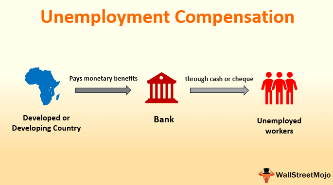

The intricate relationship between federal and state employment benefits programs plays a critical role in supporting individuals during times of unemployment. These programs are essential in ensuring that individuals who lose their jobs, through no fault of their own, receive financial assistance as they transition to new employment opportunities. By understanding the interaction between federal-state program employment benefits and unemployment compensation, individuals can effectively navigate these systems to secure necessary support during challenging periods.

Federal-state employment benefits are designed to provide a financial safety net, offering crucial relief to those facing job loss. However, the scope and administration of these benefits can vary significantly across different states, as each state tailors the specifics of benefit programs to its economic conditions and labor market peculiarities. This variability demands a nuanced understanding from both individuals and policymakers to ensure equitable and efficient distribution of resources.



Simultaneously, the landscape of modern finance is being reshaped by algorithmic trading, which uses complex algorithms to execute trades at high speeds. This innovation in trading technology influences market dynamics and presents new variables in economic models. The intersection of algorithmic trading with employment benefits highlights the need for updated regulatory frameworks to balance technological advancement with economic stability.

Recognizing how these systems operate and interconnect is vital for individuals navigating the job market and for policymakers devising strategies to enhance economic resilience. This article will examine the structure of federal-state unemployment compensation programs, their impact on jobless individuals, and the role of algorithmic trading in modern finance, providing a comprehensive analysis of their significance in today's economy. Understanding these components equips individuals and policymakers to address unemployment challenges effectively, leveraging benefits programs while adapting to technological shifts in financial markets.

## Table of Contents

## Federal-State Program Employment Benefits: An Overview

Federal-state employment benefits programs play a vital role in the economic stability for individuals who find themselves unemployed through no fault of their own. These programs are a collaborative effort between the federal government and individual states, designed to provide temporary financial assistance while unemployed individuals search for new work. 

The funding of these programs involves a dual-layered system: while the federal government provides overarching funding and policy guidelines, each state administers its own program with specific regulations that address the local economic conditions and labor markets. This structure allows states to tailor unemployment benefits to better suit the needs of their populations, although it also results in variations in benefit levels and eligibility criteria across the country.

These benefits serve as a crucial economic safety net, ensuring that individuals can meet their basic needs, such as housing and food, while seeking new employment. This assistance is intended to alleviate immediate financial pressures, thus allowing individuals the opportunity to pursue job searches and retraining opportunities without the added stress of financial insecurity. 

Understanding the qualifications for these benefits is crucial for potential claimants. Typically, eligibility is determined based on factors such as employment history, the nature of job loss, and any earnings received during a benefit period. Generally, individuals who have lost their jobs involuntarily and meet the state's wage requirements within a predetermined base period qualify for benefits. Moreover, claimants are often required to actively search for employment and, in many cases, must be willing to accept suitable work as it becomes available.

Navigating the process of determining benefits can vary significantly from one state to another. States provide detailed guidelines and resources to help claimants understand the application process, which is increasingly accessible through online platforms. These digital systems streamline the submission of claims and ensure the efficient distribution of funds, facilitating prompt support to those in need.

By balancing federal standards with state-specific needs, these programs help maintain economic stability for individuals during periods of unemployment and contribute to broader economic resilience.

## Unemployment Compensation: Key Details

Unemployment compensation, commonly referred to as unemployment insurance, is a fundamental component of the federal-state partnership in employment benefits programs. This system is designed to provide temporary financial assistance to individuals who have lost their jobs through no fault of their own, underscoring its importance in economic stability and individual welfare.

Each state's unemployment compensation scheme is governed by its own set of rules and qualification criteria, shaped by overarching federal guidelines. These criteria often include minimum earnings requirements and work history specifications to ensure that claimants meet certain thresholds for eligibility. The state-specific nature of these rules allows for tailored approaches that consider local economic conditions and labor markets, but also requires claimants to thoroughly understand the requirements specific to their state.

A key requirement for receiving unemployment compensation is the necessity for weekly or biweekly claims. Beneficiaries must actively seek employment and remain available for suitable work, as evidenced by documenting job search activities and being prepared to accept reasonable job offers. States typically define what constitutes 'suitable work', a definition which can vary based on local job markets and individual circumstances such as prior work experience and salary levels.

The process through which individuals apply for and manage their unemployment benefits can differ significantly across states. To streamline this process, many states have adopted online systems that facilitate the submission of applications and weekly claims. This digital transformation is aimed at reducing administrative burdens and providing a more user-friendly experience for claimants. Claimants are often required to set up online profiles, which they use to submit documentation and track the status of their claims.

Despite these efficiencies, variability in processing times and bureaucratic hurdles can affect the timeliness and accessibility of benefits, necessitating ongoing improvements in the system’s design and operation. The effective administration of unemployment compensation is integral to its role as a safety net, helping individuals transition between jobs without the immediate pressure of financial instability.

## Algorithmic Trading: Transforming Modern Markets

Algorithmic trading refers to the use of computer algorithms to execute trading orders at exceptionally fast speeds. These algorithms are designed to make decisions about timing, price, and quantity of orders, often operating with minimal or no human intervention. This approach to trading has revolutionized financial markets, providing numerous advantages alongside certain challenges.

The advancement of technology has been the catalyst for the rapid development of [algorithmic trading](/wiki/algorithmic-trading). By employing mathematical models and formulas, algorithmic trading systems can process and analyze large volumes of market data with high efficiency. This capability allows for the execution of trades at optimal prices, thereby enhancing market [liquidity](/wiki/liquidity-risk-premium) and reducing trading costs for investors. For example, an algorithm might be designed to identify favorable trading opportunities by evaluating price trends and market signals, executing trades within milliseconds.

Python is one of the preferred programming languages in this domain due to its extensive libraries and frameworks that facilitate algorithm development. Below is a simple example of using Python to implement a basic trading algorithm:

```python
import numpy as np

def calculate_moving_average(prices, window_size):
    return np.convolve(prices, np.ones(window_size), 'valid') / window_size

def basic_trade_strategy(prices, short_window, long_window):
    short_ma = calculate_moving_average(prices, short_window)
    long_ma = calculate_moving_average(prices, long_window)
    signals = short_ma > long_ma
    return signals

# Example usage
prices = np.array([100, 101, 102, 101, 102, 103, 104])
signals = basic_trade_strategy(prices, 2, 3)
print("Buy signals:", signals)
```

This example demonstrates a simple moving average cross-over strategy, which is a common starting point for algorithmic trading strategies.

Despite its benefits, algorithmic trading also poses several challenges. Market [volatility](/wiki/volatility-trading-strategies) can be exacerbated by the speed and [volume](/wiki/volume-trading-strategy) of trades executed by algorithms, particularly in situations where multiple algorithms interact or respond to market events simultaneously. An example of such a scenario was the "Flash Crash" of May 6, 2010, when the U.S. stock market experienced a rapid and steep decline, attributed in part to algorithmic trading activities.

Moreover, algorithmic trading introduces complexities that regulators must address to ensure market stability and fair practices. The need for appropriate regulation and oversight becomes crucial as the potential for systemic risk increases with high-frequency trading practices.

In conclusion, while algorithmic trading has transformed modern financial markets by enhancing liquidity and efficiency, it also requires careful management to mitigate associated risks. Investors and regulators alike must develop an understanding of these technologies to harness their benefits while maintaining market integrity.

## The Impact of Algorithmic Trading on Employment

Algorithmic trading has significantly transformed the finance sector by automating and expediting trade executions, which has led to substantial shifts in employment dynamics within the industry. This transformation brings both opportunities and challenges, profoundly altering the job landscape.

On one hand, algorithmic trading has spurred growth in technology-driven roles. The demand for professionals skilled in computer science, mathematics, and data analysis has increased, as these individuals are crucial in developing and maintaining the complex algorithms that power automated trading systems. According to a report by the World Economic Forum, roles such as data scientists, quantitative analysts, and software developers are experiencing burgeoning demand in the financial sector due to advancements in technology, including algorithmic trading [1].

On the other hand, while opportunities in tech-driven roles flourish, traditional brokerage and trading positions face displacement. Algorithmic trading systems can execute trades much faster and more efficiently than human traders, often rendering some roles less necessary. This shift has led to a notable reduction in floor trading positions, as the majority of trades now occur electronically without human intervention.

Moreover, understanding the implications of these changes can aid workers in adapting to the evolving landscape. Continuous upskilling and reskilling have become critical. Financial professionals can benefit from acquiring new competencies in coding languages such as Python or learning how to interpret and leverage big data for strategic decisions. Here is an example of a simple algorithm for implementing a moving average crossover strategy in Python, a popular programming language for algorithmic trading:

```python
import pandas as pd
import numpy as np

def moving_average_crossover(data, short_window, long_window):
    signals = pd.DataFrame(index=data.index)
    signals['signal'] = 0.0

    # Create short and long simple moving averages
    signals['short_mavg'] = data['close'].rolling(window=short_window, min_periods=1).mean()
    signals['long_mavg'] = data['close'].rolling(window=long_window, min_periods=1).mean()

    # Create a signal when the short moving average crosses above the long moving average
    signals['signal'][short_window:] = np.where(signals['short_mavg'][short_window:] > signals['long_mavg'][short_window:], 1.0, 0.0)

    # Generate trading orders
    signals['positions'] = 0.0
    signals['positions'] = signals['signal'].diff()

    return signals

# Example usage with hypothetical data
data = pd.DataFrame({'close': [100, 101, 102, 101, 100, 99, 98, 101, 102, 103]})
signals = moving_average_crossover(data, 3, 5)
print(signals)
```

This code highlights how simple command structures can be used to process and analyze market data, illustrating the fundamental role of programming skills in the new financial workforce.

Acknowledging the impact of algorithmic trading on employment, financial institutions and policymakers must devise strategies to support workforce transitions. Enabling access to educational resources and fostering environments conducive to continuous learning can help mitigate the negative impacts of job displacement.

[1] World Economic Forum (2020). "The Future of Jobs Report 2020".

## Navigating the Intersection of Benefits and Trading

The intersection of federal-state unemployment benefits and algorithmic trading offers a multifaceted view of the contemporary economic landscape. These two elements, though seemingly disparate, converge to influence both individual livelihoods and broader financial systems.

Federal-state unemployment programs are designed to provide financial relief to those who are involuntarily unemployed, enabling them to meet basic needs while searching for new jobs. This safety net helps stabilize the economy by sustaining consumer demand during periods of unemployment, thereby preventing deeper recessions. These programs are vital for maintaining economic stability, as they cushion the impact of job losses and contribute to the resiliency of the labor market.

In contrast, algorithmic trading utilizes sophisticated algorithms and high-speed data connections to execute trades at speeds and volumes beyond human capabilities. This activity significantly influences market dynamics through enhanced liquidity, reduced transaction costs, and altered price discovery processes. Its prevalence has transformed the financial services industry, requiring adaptations in regulatory frameworks to address challenges like market volatility and systemic risks.

Balancing these systems necessitates effective policy-making and active engagement from all stakeholders. Policymakers must ensure unemployment benefits are adequately funded and reach eligible individuals efficiently. Simultaneously, they must regulate algorithmic trading to mitigate potential risks, such as flash crashes or algorithmic bias. A stable regulatory environment that facilitates fair market practices without stifling innovation is crucial.

Individuals, too, play a role in this balance. Job seekers must adapt to changing employment landscapes influenced by technological advancements and financial market trends. This might involve upskilling or reskilling to meet market demands shaped by algorithmic innovations. Moreover, informed participation in financial markets can empower individuals to leverage opportunities provided by increased market efficiencies.

In summary, the orchestration of these elements within the economic framework requires a harmonious approach blending regulatory oversight, adaptive workforce strategies, and proactive market participation. Such alignment can lead to a more resilient economy capable of withstanding the disruptive forces of technology and economic fluctuation.

## Conclusion

The synergy between federal-state employment benefits and algorithmic trading underscores the dynamic and interconnected nature of today’s economy. Federal-state employment benefits play a crucial role in providing a financial safety net for individuals facing unemployment. Simultaneously, algorithmic trading has revolutionized the financial markets, introducing both opportunities and challenges.

Understanding these elements empowers individuals to effectively manage periods of unemployment and make informed decisions when engaging with modern financial markets. For instance, familiarity with unemployment compensation processes can reduce the stress associated with job loss, allowing individuals to focus on retraining or seeking new opportunities in industries influenced by technological change, such as finance.

As technology continues to evolve, it is imperative for future policies to address and adapt to these changes. Policymakers should aim to refine unemployment benefits systems to ensure they remain robust and adaptive, providing adequate support as workers transition to new roles shaped by technological advancements like algorithmic trading. Additionally, regulatory frameworks must evolve to manage the impacts of algorithmic trading on market stability and employment within the financial sector, addressing issues such as market volatility and job displacement.

By leveraging these advancements, both individuals and policymakers can harness the potential for growth and resilience in the economy. Understanding the interconnected nature of employment benefits and algorithmic trading will be key to successfully navigating the future economic landscape, ultimately contributing to a balanced and sustainable economic system.

## References & Further Reading

[1]: Bergstra, J., Bardenet, R., Bengio, Y., & Kégl, B. (2011). ["Algorithms for Hyper-Parameter Optimization."](https://dl.acm.org/doi/10.5555/2986459.2986743) Advances in Neural Information Processing Systems 24.

[2]: ["Advances in Financial Machine Learning"](https://www.amazon.com/Advances-Financial-Machine-Learning-Marcos/dp/1119482089) by Marcos Lopez de Prado

[3]: ["Evidence-Based Technical Analysis: Applying the Scientific Method and Statistical Inference to Trading Signals"](https://www.amazon.com/Evidence-Based-Technical-Analysis-Scientific-Statistical/dp/0470008741) by David Aronson

[4]: ["Machine Learning for Algorithmic Trading"](https://github.com/stefan-jansen/machine-learning-for-trading) by Stefan Jansen

[5]: ["Quantitative Trading: How to Build Your Own Algorithmic Trading Business"](https://www.amazon.com/Quantitative-Trading-Build-Algorithmic-Business/dp/1119800064) by Ernest P. Chan