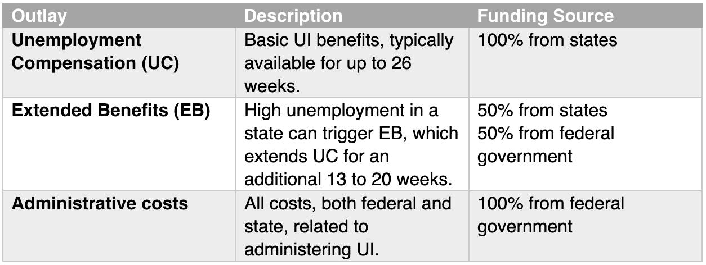

## Table of Contents

## What is unemployment compensation?

Unemployment compensation is money that the government gives to people who have lost their jobs. It helps them pay for things like food, rent, and other bills while they look for a new job. To get this money, people usually need to have worked for a certain amount of time before they lost their job and must be actively looking for new work.

The amount of money someone gets from unemployment compensation can be different depending on where they live and how much they earned at their old job. Usually, the payments last for a certain number of weeks, but sometimes the government can extend this time if there are a lot of people out of work. It's important for people to follow the rules, like reporting any income they earn while receiving these benefits, to keep getting the money.

## How does federal unemployment insurance differ from state unemployment insurance?

Federal unemployment insurance and state unemployment insurance are two parts of the system that help people who lose their jobs. State unemployment insurance is run by each state and gives money to people who lost their jobs through no fault of their own. The amount of money and how long you can get it can be different in each state. To get state unemployment, you usually need to have worked a certain amount of time and be looking for a new job.

Federal unemployment insurance comes from the national government and is meant to help when there are a lot of people out of work, like during a big economic problem. It can give extra money on top of what you get from your state, or it can help you for a longer time if the state benefits run out. The rules for federal unemployment can change depending on what's happening in the country, and it's usually set up by laws that Congress passes.

Together, these two types of unemployment insurance work to help people who are out of work. State insurance is the main support, while federal insurance steps in to provide extra help when it's really needed.

## Who is eligible for unemployment benefits?

To get unemployment benefits, you usually need to have lost your job through no fault of your own, like being laid off or having your hours cut. You also need to have worked for a certain amount of time before you lost your job. This time can be different depending on which state you live in. You need to be able to work and be actively looking for a new job while you get these benefits.

Some people might not be able to get unemployment benefits. If you quit your job without a good reason or if you were fired for doing something wrong, you might not be eligible. Also, some workers, like self-employed people or certain types of temporary workers, might not be able to get these benefits. It's important to check the rules in your state because they can be different everywhere.

## What are the basic requirements to file for unemployment?

To file for unemployment, you need to have lost your job through no fault of your own. This means you were laid off or your hours were cut, not that you quit or were fired for doing something wrong. You also need to have worked for a certain amount of time before you lost your job. Each state has its own rules about how long you need to have worked, so you should check with your state's unemployment office.

While you are getting unemployment benefits, you need to be able to work and be actively looking for a new job. This means you should be applying for jobs and keeping records of your job search. You might need to report your job search activities to the unemployment office. If you start earning money from a new job, you need to tell the unemployment office because it can affect how much money you get from unemployment benefits.

## How are unemployment benefits calculated?

Unemployment benefits are figured out based on how much money you earned before you lost your job. Each state has its own way of doing this, but usually, they look at your wages from the last year or so. They might take your highest earning quarter and use a formula to find out your weekly benefit amount. This amount can be different from one state to another, and it might be less than what you were earning at your old job.

There's also a limit to how much money you can get each week. This is called the maximum weekly benefit amount, and it changes depending on where you live. Some states might give you a fixed amount, while others might give you a percentage of what you were earning before. On top of this, there might be extra money from the federal government during tough economic times, which can add to what you get from your state.

## What is the maximum duration one can receive unemployment benefits?

The longest time you can get unemployment benefits usually depends on where you live. Most states let you get benefits for up to 26 weeks. But sometimes, if a lot of people are out of work, the government might let you get benefits for longer.

During big economic problems, the federal government can step in and give extra weeks of benefits. This can make the total time you get benefits longer than the usual 26 weeks. How long you can get these extra benefits can change, so it's good to check with your state's unemployment office to know for sure.

## How do state laws affect unemployment compensation?

State laws have a big say in how unemployment compensation works. Each state sets its own rules for who can get unemployment benefits, how much money they can get, and how long they can get it. For example, some states might say you need to have worked for a certain number of weeks before you can get benefits. Other states might have different rules about what counts as losing your job through no fault of your own. This means that what you need to do to get unemployment benefits can be different depending on where you live.

Also, state laws decide how much money you can get each week and how long you can get it. The amount of money can be based on how much you earned before you lost your job, but the exact way it's figured out can be different from one state to another. Usually, you can get benefits for up to 26 weeks, but some states might let you get them for a shorter or longer time. These rules can change, so it's important to check with your state's unemployment office to know what applies to you.

## What federal programs supplement state unemployment benefits?

The federal government has programs that can add to the unemployment benefits you get from your state. One big program is called Federal-State Extended Benefits. This program gives you more weeks of benefits if a lot of people in your state are out of work. It helps when the regular state benefits run out, so you can keep getting money while you look for a new job.

Another program is called Pandemic Unemployment Assistance (PUA). This was set up to help people who usually can't get regular unemployment benefits, like self-employed workers or people who work part-time. During the COVID-19 crisis, PUA gave money to these workers if they lost their jobs because of the pandemic. The rules for these federal programs can change, so it's good to check with your state's unemployment office to see what help you can get.

## How can one appeal a denial of unemployment benefits?

If your unemployment benefits are denied, you can appeal the decision. To do this, you need to file an appeal with your state's unemployment office. You usually have to do this within a certain number of days after you get the denial letter. It's important to read the denial letter carefully because it will tell you why your benefits were denied and how to appeal. When you file your appeal, you should explain why you think the decision was wrong and include any evidence that supports your case, like pay stubs or letters from your old job.

After you file your appeal, there will be a hearing. This can be in person, over the phone, or online, depending on your state's rules. At the hearing, you can explain your side of the story, and a judge or hearing officer will listen to you and any witnesses you bring. The person or company that denied your benefits will also get a chance to explain their side. After the hearing, the judge will make a decision. If you still don't agree with the decision, you might be able to appeal again, but the rules for this can be different in each state.

## What are the tax implications of receiving unemployment compensation?

When you get unemployment benefits, you need to know that this money is taxable. The government sees unemployment benefits as income, just like money you earn from a job. So, you have to pay federal taxes on it, and maybe state taxes too, depending on where you live. Usually, when you start getting unemployment, you can choose to have taxes taken out right away, or you can wait and pay them when you file your taxes at the end of the year.

If you don't have taxes taken out of your unemployment benefits, you might have to pay a big amount when you file your taxes. This can be a surprise if you're not ready for it. It's a good idea to set aside some money from your benefits to cover your taxes later. You'll get a form called a 1099-G at the end of the year that shows how much unemployment money you got, and you'll use this form to figure out your taxes.

## How have recent federal reforms impacted unemployment insurance?

Recent federal reforms have made big changes to unemployment insurance, especially during the COVID-19 crisis. One big change was the creation of the Pandemic Unemployment Assistance (PUA) program. This program helped people who usually can't get regular unemployment benefits, like self-employed workers or part-time workers. If they lost their jobs because of the pandemic, they could get money to help them out. Another change was adding extra money to the regular unemployment benefits. For a while, people got an extra $600 a week on top of their state benefits, which made a big difference for a lot of people.

These changes were meant to help more people and give them more money during a tough time. But they also made the system more complicated. States had to figure out new rules and set up new ways to give out the money. This sometimes caused delays and confusion. Even though the extra programs like PUA have ended, the experience showed that the government can change unemployment insurance quickly when it needs to. This might help in the future if there are more big problems that affect a lot of jobs.

## What future changes are anticipated in unemployment compensation policies?

In the future, unemployment compensation policies might change to help more people and make the system easier to use. One big change could be making the rules the same in every state. Right now, each state has its own rules, which can be confusing. If the rules were the same everywhere, it would be easier for people to know what to do and get the help they need. Another change might be to help more kinds of workers, like people who work for themselves or part-time. These workers often can't get unemployment benefits now, but new rules could change that.

Also, technology might play a bigger role in unemployment compensation. Right now, applying for benefits can be hard and take a long time. In the future, new computer systems could make it easier and faster to apply and get money. This would help people get the help they need more quickly. There might also be more focus on helping people find new jobs while they get benefits. Programs that train people for new jobs or help them look for work could become a bigger part of unemployment insurance.

## References & Further Reading

[1]: Bergstra, J., Bardenet, R., Bengio, Y., & Kégl, B. (2011). ["Algorithms for Hyper-Parameter Optimization."](https://dl.acm.org/doi/10.5555/2986459.2986743) Advances in Neural Information Processing Systems 24.

[2]: ["Advances in Financial Machine Learning"](https://www.amazon.com/Advances-Financial-Machine-Learning-Marcos/dp/1119482089) by Marcos Lopez de Prado

[3]: ["Evidence-Based Technical Analysis: Applying the Scientific Method and Statistical Inference to Trading Signals"](https://www.amazon.com/Evidence-Based-Technical-Analysis-Scientific-Statistical/dp/0470008741) by David Aronson

[4]: ["Machine Learning for Algorithmic Trading"](https://github.com/stefan-jansen/machine-learning-for-trading) by Stefan Jansen

[5]: ["Quantitative Trading: How to Build Your Own Algorithmic Trading Business"](https://www.amazon.com/Quantitative-Trading-Build-Algorithmic-Business/dp/1119800064) by Ernest P. Chan