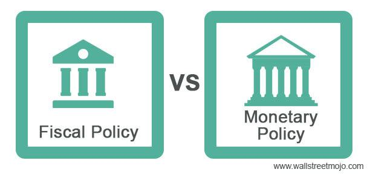

Economic strategies encompass a range of policies and tools used by governments and financial institutions to achieve stability and growth. This article explores three core components of economic management: fiscal policy, monetary policy, and algorithmic trading. These elements are fundamental to shaping the economic landscape and play a significant role in the strategies employed by both public and private entities.

Fiscal policy pertains to government actions regarding spending and taxation that influence the nation's economic conditions. It primarily aims at economic stabilization, fostering growth, and redistributing income. The effectiveness of fiscal policy often depends on its ability to coordinate with other economic strategies, such as monetary policy, which is another critical tool managed by central banks. Monetary policy focuses on controlling the money supply and interest rates to maintain price stability and support economic growth.



Algorithmic trading introduces a technological dimension to financial markets, employing computer algorithms to execute trades at high speed and precision. This approach can significantly enhance market efficiency by reducing human error and increasing liquidity. However, it also introduces potential challenges, such as market volatility and ethical concerns. The integration of algorithmic trading with macroeconomic indicators offers new avenues for optimizing trading strategies, aligning with broader economic objectives.

Understanding the interplay between these elements is crucial for financial professionals and policymakers alike. The interaction between fiscal and monetary policies and advanced trading technologies represents a complex dynamic that influences both short-term and long-term economic outcomes. By examining how these strategies can be integrated, this article sets the stage for a detailed exploration of enhancing economic performance and navigating financial markets effectively.

As economic theories evolve and new technologies emerge, the ability to adapt and leverage these core components becomes increasingly important. Policymakers and financial professionals must continuously innovate to address complex economic challenges and capitalize on opportunities for growth and stability. Consequently, the integration of fiscal and monetary policies with algorithmic trading is not just a theoretical exercise but a practical necessity in the contemporary economic environment.

## Table of Contents

## Understanding Fiscal Policy

Fiscal policy is a critical component of economic strategy, entailing the adjustment of government spending and taxation to influence a nation’s economic activity. The primary objectives of fiscal policy encompass economic stabilization, growth promotion, and income redistribution. By manipulating fiscal instruments, governments seek to achieve sustainable economic performance and address various economic challenges.

### Key Objectives and Strategies

Economic stabilization aims to smooth the fluctuations inherent in the business cycle, reducing the amplitude of economic expansions and contractions. To promote growth, fiscal policy can increase government expenditure or cut taxes, thereby raising aggregate demand. This approach, known as expansionary fiscal policy, is often used in times of economic downturn to stimulate economic activity. Conversely, contractionary fiscal policy involves decreasing spending or increasing taxes to cool down an overheating economy and control inflation.

Income redistribution is another objective of fiscal policy, achieved through progressive taxation and targeted government spending. Progressive taxation imposes a higher tax rate on those with higher incomes, helping to reduce income inequality. Meanwhile, government spending on social programs, education, and healthcare can help redistribute wealth and provide opportunities for those in lower-income brackets.

### Challenges in Implementation

Implementing fiscal policy involves several challenges. A significant dilemma is balancing short-term economic requirements with the need for long-term fiscal sustainability. During economic crises, governments might increase spending significantly, leading to enlarged budget deficits and public debt. However, excessive public debt can lead to higher interest rates and potential crowding out of private investment, posing a risk to economic stability.

Effective fiscal policy requires predicting economic conditions accurately, which can be inherently uncertain. Policymakers need to consider the time lags associated with implementing fiscal measures and their eventual impact on the economy. Misjudgments can lead to policies that are too little or too late, exacerbating economic [volatility](/wiki/volatility-trading-strategies) rather than mitigating it.

### Coordination with Monetary Policy

The efficacy of fiscal policy is also dependent on its coordination with monetary policy, which involves the regulation of the money supply and interest rates by central banks. The interplay between fiscal and monetary policies is critical in ensuring coherent economic management. For instance, during a recession, a combination of expansionary fiscal policy and low-interest rates can provide a more comprehensive stimulus to the economy than either policy applied in isolation.

Fiscal policy needs to be flexible to react to unexpected economic shifts, necessitating strategic collaboration between government entities and central banks. This coordination helps align fiscal actions with broader economic goals, enhancing policy effectiveness.

### Conclusion

In summary, fiscal policy serves as a fundamental tool in economic management, with objectives that extend beyond mere economic growth to encompass stabilization and redistribution. Achieving these goals involves a careful balance of spending and taxation, as well as effective coordination with monetary policy. The challenges of implementation underscore the critical need for precision and foresight in policymaking, as well as the importance of reevaluating strategies in light of evolving economic conditions.

## Monetary Policy: A Tool for Economic Stability

Monetary policy is a central pillar of economic management, primarily overseen by central banks, which regulate the money supply and interest rates to achieve macroeconomic objectives. The central goal of monetary policy is to control inflation, stabilize the currency, and influence economic growth. Control over inflation is crucial as excessive inflation can erode purchasing power and savings, whereas deflation can lead to decreased consumer spending and economic stagnation.

Central banks, such as the Federal Reserve in the United States, utilize several tools to implement monetary policy. Among the most significant are open market operations, which involve the buying and selling of government securities to influence the level of bank reserves and interest rates. Another vital tool is the adjustment of the discount rate, the [interest rate](/wiki/interest-rate-trading-strategies) charged to commercial banks for loans obtained from the central bank's discount window. By altering these rates, central banks can influence borrowing costs throughout the economy, thereby promoting or restricting consumer spending and investment.

The effectiveness of monetary policy is particularly pronounced during different phases of economic cycles. During periods of recession, an expansionary monetary policy—characterized by lower interest rates and increased money supply—can stimulate economic activity by making borrowing cheaper and boosting consumer and business confidence. Conversely, in times of economic boom, a contractionary monetary policy may be used to temper inflationary pressures by raising interest rates and reducing the money supply.

The relationship between fiscal and monetary policy is a subject of extensive debate and critical importance. While fiscal policy, involving government spending and tax decisions, can directly influence aggregate demand, monetary policy provides a more indirect approach through interest rates and credit conditions. Effective coordination between these two types of policies is essential to avoid situations where they work at cross purposes, such as one stimulating and the other restraining economic activity.

Furthermore, the transmission mechanism of monetary policy—the process by which policy actions affect the economy and inflation—relies heavily on the expectations and behaviors of households, businesses, and investors. Interest rate changes, for instance, influence exchange rates, asset prices, and consumer and business spending.

The ongoing debate around monetary policy often centers on the trade-offs between targeting inflation, economic growth, and unemployment levels. Meanwhile, emerging technologies and financial innovations present new challenges and opportunities for monetary policy implementation, calling for adaptive approaches to policy formulation and analysis. Understanding these dynamics enables policymakers to better navigate the complexities of the modern economy and ensure sustainable economic stability and growth.

## Algorithmic Trading: Revolutionizing Financial Markets

Algorithmic trading, a transformative force in financial markets, employs computer algorithms to execute transactions with exceptional speed and precision. By analyzing vast datasets to identify trading opportunities, these systems autonomously perform trades, significantly enhancing the efficiency of financial markets.

### Advantages of Algorithmic Trading

**1. Increased Market Efficiency:** Algorithmic trading contributes to market efficiency by executing trades at lightning speed, minimizing latency, and exploiting price disparities. Algorithms can process information and react to changes much faster than human traders, thus ensuring that assets are priced more precisely according to current market conditions.

**2. Reduced Human Error:** The systematic nature of algorithmic trading reduces the likelihood of errors that can arise from human emotions or miscalculations. This objectivity helps in maintaining consistency across trading activities.

**3. Enhanced Liquidity:** With high-frequency trading, which is a subset of algorithmic trading, markets experience increased liquidity. Algorithms constantly offer to buy or sell assets, ensuring that there is always a counterparty ready to trade, thus narrowing bid-ask spreads and fostering a more resilient market environment.

### Challenges of Algorithmic Trading

Despite its advantages, [algorithmic trading](/wiki/algorithmic-trading) poses several challenges:

**1. Potential Market Volatility:** The rapid execution of trades by algorithms can sometimes lead to extreme volatility. Events such as the "Flash Crash" of 2010, where the Dow Jones Industrial Average plummeted and recovered sharply within minutes, highlight how algorithmic trading can exacerbate market fluctuations if not properly regulated and monitored.

**2. Ethical Concerns:** Algorithmic trading raises ethical questions, particularly concerning fairness and market manipulation. High-frequency trading can sometimes disadvantage retail investors who cannot execute trades at the same speed or volume, leading to a potential imbalance in market opportunities.

### Integration with Macroeconomic Indicators

Integration of macroeconomic indicators into algorithmic trading strategies offers the potential to optimize decision-making. By incorporating data such as GDP growth rates, unemployment figures, and inflation metrics, algorithms can better predict market trends and adjust trading strategies accordingly. Python, a prevalent programming language in the finance sector, can be used to develop algorithms that respond to these indicators:

```python
import pandas as pd

# Example of a simple algorithmic trading strategy using macroeconomic indicators
def trading_strategy(data):
    signals = []
    for index, row in data.iterrows():
        if row['gdp_growth'] > 0.02 and row['inflation'] < 0.03:
            signals.append('buy')
        elif row['gdp_growth'] < 0.01 and row['inflation'] > 0.04:
            signals.append('sell')
        else:
            signals.append('hold')
    return signals

# Sample dataframe with macroeconomic indicators
data = pd.DataFrame({
    'gdp_growth': [0.025, 0.01, 0.03],
    'inflation': [0.02, 0.05, 0.03]
})

print(trading_strategy(data))  # Output: ['buy', 'sell', 'hold']
```

### Interaction with Economic Policy

Algorithmic trading impacts economic policy by influencing [liquidity](/wiki/liquidity-risk-premium), market stability, and pricing mechanisms. Policymakers must account for algorithmic trading while designing frameworks to ensure market robustness. Regulatory measures, such as circuit breakers and trade limits, are essential in curbing excessive volatility and protecting market integrity.

In conclusion, algorithmic trading revolutionizes financial markets by offering remarkable advantages in efficiency, accuracy, and liquidity. However, it necessitates careful consideration of its challenges, including market volatility and ethical concerns. The continued integration of algorithmic trading with macroeconomic indicators and thoughtful regulation will be crucial for its sustainable evolution within financial ecosystems.

## Integrating Economic Policies and Algo Trading

Integrating economic policies with algorithmic trading presents several advantages, particularly in terms of improving decision-making processes and risk management. Algorithmic trading systems, relying on computer-generated algorithms to execute trades, can be enhanced by incorporating economic indicators, which offer critical insights into market conditions. These indicators, which include GDP growth rates, unemployment figures, and inflation [statistics](/wiki/bayesian-statistics), can be embedded within trading algorithms to provide more informed trading decisions. By doing so, traders can adjust their strategies to align with prevailing economic trends, allowing for more accurate predictions and efficient market responses.

Algorithmic trading also aligns effectively with economic policy objectives to promote more stable and sustainable markets. By tailoring trading algorithms to support policy goals, such as maintaining inflation within targeted ranges or fostering employment growth, markets can be directed towards balanced growth. For instance, if fiscal policy aims to stimulate economic growth, trading strategies could prioritize investments in sectors likely to benefit from increased public spending. This alignment aids in creating a more resilient financial ecosystem that supports broader economic policy goals.

Developments in Artificial Intelligence (AI) and [machine learning](/wiki/machine-learning) are expected to significantly bolster the capabilities of algorithmic trading. Machine learning, with its ability to analyze vast datasets and identify patterns, provides traders with opportunities to refine their algorithms continually. These technologies enable the creation of adaptive algorithms that can learn from new economic data, respond to real-time changes, and optimize trading strategies dynamically. For instance, machine learning models can harness natural language processing to analyze news and social media sentiment, adjusting trading strategies accordingly.

The synergy between economic policies and algorithmic trading fosters a more responsive and adaptive financial system. As economic theories evolve, trading systems can integrate new insights, providing a mechanism for swift adaptation to changing economic landscapes. The ongoing developments in AI and machine learning further enhance this adaptability, enabling traders and policymakers to manage complex economic environments more effectively. By leveraging these technological advances, the integration of economic policies and algorithmic trading stands as a forward-looking approach to achieving economic stability and growth.

## Conclusion

The intersection of fiscal policy, monetary policy, and algorithmic trading defines the architecture of modern economies. These components work synergistically to stabilize and stimulate economic growth, making it imperative for financial professionals and policymakers to master their intricacies. Comprehension of fiscal and monetary tools, alongside the advanced mechanisms of algorithmic trading, is fundamental for navigating the complexities of financial markets and ensuring economic stability.

Fiscal policy, through government expenditure and taxation, and monetary policy, by regulating the money supply and interest rates, provide essential levers for economic management. These policies are increasingly intertwined with algorithmic trading, which utilizes sophisticated algorithms to analyze market data and execute trades with unparalleled speed and precision. The integration of economic indicators into trading algorithms enhances decision-making processes, allowing for more robust risk management and market efficiency.

Innovation plays a crucial role in the seamless integration of these strategies. The continuous evolution of technologies such as [artificial intelligence](/wiki/ai-artificial-intelligence) and machine learning promises to elevate the performance and adaptability of algorithmic trading systems. Such advancements highlight the importance of strategic collaboration among policymakers, financial institutions, and tech developers to harness the potential of combined economic policies and trading technologies effectively.

Addressing complex economic challenges requires a multifaceted approach that leverages the strengths of fiscal and monetary policies along with algorithmic trading. The ability to adapt to evolving economic theories and technological developments is crucial for maintaining stability and growth. By aligning these components towards common economic objectives, stakeholders can foster sustainable economic environments capable of withstanding the multifarious dynamics of contemporary markets.

## References & Further Reading

[1]: ["Fiscal Policy: Theory and Practice"](https://www.coursesidekick.com/economics/4283248) by Alan J. Auerbach 

[2]: Mishkin, F.S. (2004). ["The Economics of Money, Banking, and Financial Markets"](https://www.pearsonhighered.com/assets/preface/0/1/3/4/0134855388.pdf). Pearson.

[3]: Carlin, B.P. & Louis, T.A. (2009). ["Bayesian Methods for Data Analysis"](https://www.taylorfrancis.com/books/mono/10.1201/b14884/bayesian-methods-data-analysis-bradley-carlin-thomas-louis). CRC Press.

[4]: Hull, J. (2017). ["Options, Futures, and Other Derivatives"](https://elibrary.pearson.de/book/99.150005/9781292212920). Pearson.

[5]: ["High-Frequency Trading: A Practical Guide to Algorithmic Strategies and Trading Systems"](https://www.ahmetbeyefendi.com/wp-content/uploads/2020/07/High-Frequency-Trading-Irene-Aldridge.pdf) by Irene Aldridge

[6]: Wooldridge, J. M. (2015). ["Introductory Econometrics: A Modern Approach"](https://books.google.com/books/about/Introductory_Econometrics_A_Modern_Appro.html?id=wUF4BwAAQBAJ). Cengage Learning.