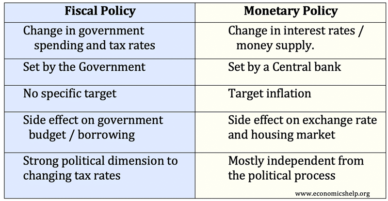

## Table of Contents

## What is fiscal policy?

Fiscal policy is the way a government manages its spending and taxes to influence the economy. It's like a tool that governments use to try to make the economy grow, keep prices stable, and help people. When the government spends more money or cuts taxes, it can help boost the economy by giving people and businesses more money to spend. On the other hand, if the government raises taxes or spends less, it can slow down the economy to keep inflation in check.

There are two main types of fiscal policy: expansionary and contractionary. Expansionary fiscal policy is used when the economy is not doing well, like during a recession. The government might spend more on things like building roads or giving money to people who are out of work. This can help get the economy moving again. Contractionary fiscal policy is used when the economy is growing too fast and prices are going up too much. The government might raise taxes or cut back on spending to cool things down and keep prices stable.

In summary, fiscal policy is a powerful tool that governments use to manage the economy. By adjusting spending and taxes, they can either stimulate growth or slow it down, depending on what the economy needs at the time. It's all about finding the right balance to keep the economy healthy and stable.

## What is monetary policy?

Monetary policy is what central banks do to control the amount of money in the economy and how much it costs to borrow money. The main goal is to keep prices stable and help the economy grow smoothly. Central banks, like the Federal Reserve in the U.S., do this by changing interest rates, which is the price people pay to borrow money. When they lower interest rates, borrowing becomes cheaper, and people and businesses might spend more, helping the economy grow. When they raise interest rates, borrowing becomes more expensive, which can slow down spending and help control inflation.

There are two main types of monetary policy: expansionary and contractionary. Expansionary monetary policy is used when the economy needs a boost, like during a recession. The central bank might lower interest rates or buy government bonds to put more money into the economy. This can encourage spending and investment. On the other hand, contractionary monetary policy is used when the economy is growing too fast and prices are rising too much. The central bank might raise interest rates or sell government bonds to take money out of the economy. This can help cool things down and keep inflation in check.

In simple terms, monetary policy is a tool that central banks use to manage the economy. By adjusting interest rates and the money supply, they can either speed up or slow down economic activity to keep things balanced and stable.

## How do fiscal and monetary policies affect the economy?

Fiscal and monetary policies are like the steering wheel and brakes of the economy. They help control how fast or slow the economy grows. Fiscal policy is when the government changes how much it spends or how much it taxes people. If the government spends more or taxes less, it puts more money into people's pockets, which can help the economy grow. This is called expansionary fiscal policy. But if the government spends less or taxes more, it takes money out of the economy, which can slow things down. This is called contractionary fiscal policy. Governments use these tools to try to keep the economy healthy and stable.

Monetary policy is what central banks do to control the amount of money in the economy and the cost of borrowing. When the central bank lowers interest rates, borrowing money becomes cheaper, and people and businesses might spend more. This can help the economy grow and is called expansionary monetary policy. But if the central bank raises interest rates, borrowing becomes more expensive, and people might spend less. This can slow down the economy and help control inflation, and it's called contractionary monetary policy. By adjusting interest rates and the money supply, central banks try to keep prices stable and the economy running smoothly.

Both fiscal and monetary policies work together to manage the economy. When they are used well, they can help keep the economy growing at a steady pace, with low unemployment and stable prices. But if they are not used carefully, they can cause problems like too much inflation or a slowdown in economic growth. So, it's important for governments and central banks to work together and use these tools wisely to keep the economy on track.

## What are the main tools of fiscal policy?

The main tools of fiscal policy are government spending and taxes. When the government wants to help the economy grow, it can spend more money on things like building roads, schools, or giving money to people who need help. This is called expansionary fiscal policy. By spending more, the government puts more money into the economy, which can help businesses and people have more money to spend and invest. On the other hand, if the government wants to slow down the economy to keep prices from going up too fast, it can spend less money. This is called contractionary fiscal policy. By spending less, the government takes money out of the economy, which can help cool things down.

The other big tool of fiscal policy is taxes. If the government wants to help the economy grow, it can lower taxes. When taxes are lower, people and businesses have more money to spend and invest, which can help the economy. This is also part of expansionary fiscal policy. But if the government wants to slow down the economy, it can raise taxes. When taxes go up, people and businesses have less money to spend, which can help keep prices stable. This is part of contractionary fiscal policy. By adjusting how much it spends and how much it taxes, the government can try to keep the economy healthy and balanced.

## What are the main tools of monetary policy?

The main tools of monetary policy are interest rates and the money supply. When a central bank wants to help the economy grow, it can lower interest rates. Lower interest rates make it cheaper for people and businesses to borrow money. This can encourage them to spend more on things like houses, cars, or new business projects. When people spend more, it can help the economy grow. This is called expansionary monetary policy. But if the economy is growing too fast and prices are going up too much, the central bank can raise interest rates. Higher interest rates make borrowing more expensive, so people might spend less. This can help slow down the economy and keep prices stable. This is called contractionary monetary policy.

The other big tool of monetary policy is controlling the money supply. The central bank can do this by buying or selling government bonds. When it buys bonds, it puts more money into the economy, which can help it grow. This is another way to do expansionary monetary policy. But when the central bank sells bonds, it takes money out of the economy. This can help slow things down and control inflation, which is part of contractionary monetary policy. By adjusting interest rates and the money supply, the central bank can try to keep the economy healthy and balanced.

## How do governments implement fiscal policy?

Governments implement fiscal policy by changing how much they spend and how much they tax. When the economy needs a boost, the government might spend more money on things like building roads, schools, or helping people who are out of work. This puts more money into the economy, which can help businesses and people have more money to spend and invest. It's like giving the economy a little push to help it grow. The government can also lower taxes to leave more money in people's pockets. When people have more money, they might spend more, which can also help the economy grow.

On the other hand, if the economy is growing too fast and prices are going up too much, the government might spend less money. By cutting back on spending, the government takes money out of the economy, which can help slow things down and keep prices stable. The government can also raise taxes to take more money out of the economy. When taxes go up, people have less money to spend, which can help cool down the economy. By using these tools, the government tries to keep the economy healthy and balanced, making sure it grows at the right pace without causing too much inflation.

## How do central banks implement monetary policy?

Central banks implement monetary policy by changing interest rates and controlling the amount of money in the economy. When the economy needs help to grow, the central bank can lower interest rates. This makes borrowing cheaper, so people and businesses might take out loans to buy things like houses or start new projects. When people spend more, it can help the economy grow. The central bank can also buy government bonds, which puts more money into the economy and encourages spending. This is called expansionary monetary policy.

If the economy is growing too fast and prices are going up too much, the central bank might raise interest rates. Higher interest rates make borrowing more expensive, so people might spend less. This can help slow down the economy and keep prices from rising too fast. The central bank can also sell government bonds, which takes money out of the economy. This is called contractionary monetary policy. By using these tools, the central bank tries to keep the economy balanced and stable, making sure it grows at the right pace without causing too much inflation.

## What is the difference between expansionary and contractionary fiscal policy?

Expansionary fiscal policy is when the government wants to help the economy grow. They do this by spending more money on things like building roads, schools, or helping people who are out of work. This puts more money into the economy, which can help businesses and people have more money to spend and invest. The government can also lower taxes, which leaves more money in people's pockets. When people have more money, they might spend more, which can also help the economy grow. This kind of policy is used when the economy is not doing well, like during a recession, to give it a boost.

Contractionary fiscal policy is the opposite. It's used when the economy is growing too fast and prices are going up too much. The government might spend less money to take some money out of the economy. By cutting back on spending, they can help slow things down and keep prices stable. The government can also raise taxes, which takes more money out of people's pockets. When taxes go up, people have less money to spend, which can help cool down the economy. This kind of policy is used to control inflation and keep the economy from overheating.

## What is the difference between expansionary and contractionary monetary policy?

Expansionary monetary policy is when the central bank wants to help the economy grow. They do this by lowering interest rates, which makes borrowing money cheaper. When it's cheaper to borrow, people and businesses might take out loans to buy things like houses or start new projects. This can help the economy grow because people are spending more. The central bank can also buy government bonds, which puts more money into the economy and encourages spending. This kind of policy is used when the economy is not doing well, like during a recession, to give it a boost.

Contractionary monetary policy is the opposite. It's used when the economy is growing too fast and prices are going up too much. The central bank might raise interest rates, which makes borrowing money more expensive. When it's more expensive to borrow, people might spend less. This can help slow down the economy and keep prices from rising too fast. The central bank can also sell government bonds, which takes money out of the economy. This kind of policy is used to control inflation and keep the economy from overheating.

## How do fiscal and monetary policies interact with each other?

Fiscal and monetary policies work together to manage the economy. The government uses fiscal policy by changing how much it spends and how much it taxes. When the government spends more or taxes less, it puts more money into the economy, which can help it grow. This is called expansionary fiscal policy. If the government spends less or taxes more, it takes money out of the economy, which can slow things down. This is called contractionary fiscal policy. The central bank uses monetary policy by changing interest rates and controlling the money supply. When the central bank lowers interest rates or buys bonds, it makes borrowing cheaper and puts more money into the economy, helping it grow. This is called expansionary monetary policy. If the central bank raises interest rates or sells bonds, it makes borrowing more expensive and takes money out of the economy, slowing it down. This is called contractionary monetary policy.

When both fiscal and monetary policies work together, they can be more effective in managing the economy. For example, if the economy is in a recession, the government might use expansionary fiscal policy by spending more or cutting taxes, while the central bank might use expansionary monetary policy by lowering interest rates. Together, these actions can give the economy a bigger boost. On the other hand, if the economy is growing too fast and prices are rising too much, the government might use contractionary fiscal policy by spending less or raising taxes, while the central bank might use contractionary monetary policy by raising interest rates. Together, these actions can help cool down the economy and control inflation. By working together, fiscal and monetary policies can help keep the economy balanced and stable.

## What are the limitations and challenges of fiscal policy?

One of the big challenges with fiscal policy is that it can take a long time to put into action. When the government decides to spend more money or change taxes, it takes time to plan and carry out these changes. This can be a problem if the economy needs help right away. Also, if the government spends too much, it can lead to a big debt. This means the government owes a lot of money and might have to pay more in interest, which can be hard to manage. Plus, deciding how to spend the money or change taxes can be tricky because different people and groups might want different things.

Another limitation is that fiscal policy can sometimes have unintended effects. For example, if the government cuts taxes to help the economy grow, it might also lead to more spending and higher prices, which is called inflation. Or, if the government spends a lot of money on certain projects, it might not help everyone equally. Some people might benefit more than others, which can cause problems. Also, it can be hard to know exactly how much to spend or how much to change taxes because the economy is always changing. So, even when the government tries to help, it might not always get it right.

## What are the limitations and challenges of monetary policy?

One challenge with monetary policy is that it can take time to work. When the central bank changes interest rates, it might take months or even years for the economy to feel the effects. This can be a problem if the economy needs help right away. Also, the central bank can only control interest rates so much. If people and businesses are not borrowing or spending, even low interest rates might not help the economy grow. And if inflation is too high, raising interest rates might not be enough to stop prices from going up.

Another limitation is that monetary policy can have unintended effects. For example, if the central bank lowers interest rates to help the economy grow, it might also lead to more borrowing and higher prices, which is called inflation. Or, if the central bank raises interest rates to control inflation, it might slow down the economy too much and cause people to lose their jobs. It can be hard for the central bank to find the right balance because the economy is always changing. So, even when the central bank tries to help, it might not always get it right.

## References & Further Reading

[1]: ["Fiscal Policy: Theory and Practice"](https://www.coursesidekick.com/economics/4283248) by Alan J. Auerbach 

[2]: Mishkin, F.S. (2004). ["The Economics of Money, Banking, and Financial Markets"](https://www.pearsonhighered.com/assets/preface/0/1/3/4/0134855388.pdf). Pearson.

[3]: Carlin, B.P. & Louis, T.A. (2009). ["Bayesian Methods for Data Analysis"](https://www.taylorfrancis.com/books/mono/10.1201/b14884/bayesian-methods-data-analysis-bradley-carlin-thomas-louis). CRC Press.

[4]: Hull, J. (2017). ["Options, Futures, and Other Derivatives"](https://elibrary.pearson.de/book/99.150005/9781292212920). Pearson.

[5]: ["High-Frequency Trading: A Practical Guide to Algorithmic Strategies and Trading Systems"](https://www.ahmetbeyefendi.com/wp-content/uploads/2020/07/High-Frequency-Trading-Irene-Aldridge.pdf) by Irene Aldridge

[6]: Wooldridge, J. M. (2015). ["Introductory Econometrics: A Modern Approach"](https://books.google.com/books/about/Introductory_Econometrics_A_Modern_Appro.html?id=wUF4BwAAQBAJ). Cengage Learning.