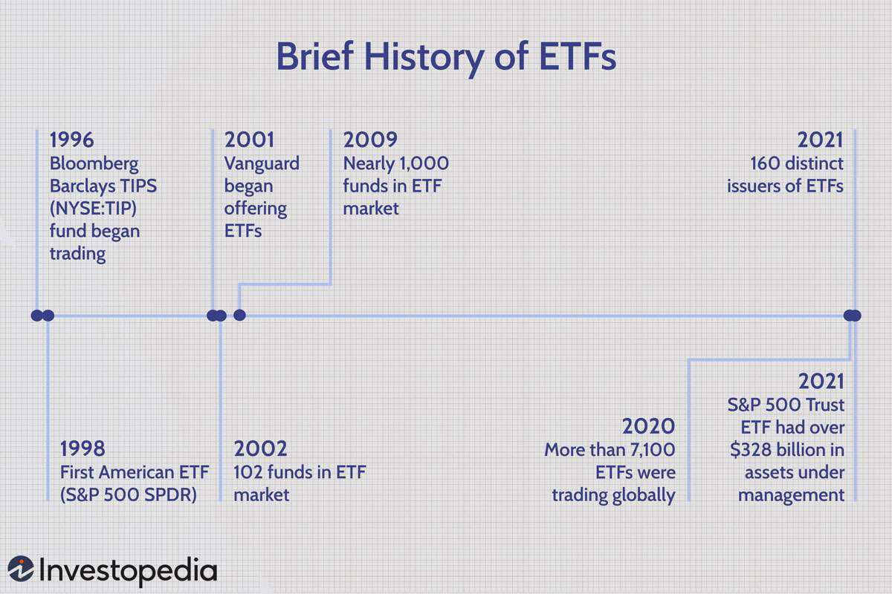

Exchange-traded funds (ETFs) have fundamentally transformed the investment landscape by providing investors with an efficient means to achieve diversified exposure across various market segments. With their inherent ability to track indices and offer liquidity similar to stocks, ETFs have become a mainstay for both individual and institutional investors seeking to construct well-rounded portfolios. Among the diverse array of ETFs available, mid-cap ETFs hold a unique position. They specifically cater to investors aiming to capitalize on the potential of mid-sized companies, typically characterized by market capitalizations ranging from $2 billion to $10 billion. These companies often represent a sweet spot in the investment universe, offering the stability of established businesses, while still retaining the capacity for significant growth, akin to smaller firms poised on the threshold of expansion.

Mid-cap ETFs, therefore, present a compelling opportunity to tap into these dynamic growth trajectories. They attract those who are keen on enhancing their portfolios with assets that not only bolster diversification but also provide a balanced risk-return profile. In conjunction with traditional investment strategies, mid-cap ETFs can serve as strategic additions, mitigating potential market volatilities and aligning with long-term financial objectives.



This article will guide you through the intricacies of mid-cap ETFs, elucidating the advantages they offer and examining the transformative role of algorithmic trading in refining investment outcomes. Algorithmic trading, involving the use of sophisticated computer algorithms to execute trades based on pre-set parameters, has become increasingly prevalent in the efficient management of mid-cap ETFs. By automating critical trading decisions, algo trading enhances precision, reduces transaction costs, and facilitates agile market responses, which can be pivotal in optimizing portfolio returns.

Understanding the nuances of mid-cap ETFs, along with the application of algorithmic trading, enables investors to craft strategies that are not only forward-looking but also resilient to the ebbs and flows of market dynamics. By weaving these elements into a cohesive investment approach, one can unlock the potential of mid-cap stocks while maintaining a thoughtful balance within a diversified portfolio.

## Table of Contents

## Understanding Mid-Cap ETFs

Mid-cap ETFs primarily focus on investing in mid-cap stocks, which are typically defined as companies with market capitalizations ranging from $2 billion to $10 billion. These funds are strategically positioned to offer investors a balance of stability and growth. They combine the solid foundation often associated with large-cap stocks with the high growth potential characteristic of small-cap stocks. This unique positioning allows mid-cap ETFs to attract investors seeking a diverse portfolio with the potential for substantial returns.

One of the key attractions of mid-cap ETFs is their historical performance. Historically, mid-cap stocks have demonstrated the ability to perform positively over the long term, navigating both bullish and bearish market conditions with relative resilience. This performance is rooted in the nature of mid-sized companies, which often have matured past the volatility of early-stage development but still possess significant room for expansion and market penetration.

Popular mid-cap ETFs include the iShares Russell Mid-Cap [ETF](/wiki/etf-trading-strategies) (IWR) and the Vanguard Mid-Cap ETF (VO). These funds track indices that represent the mid-cap segment of the market and have been noted for their competitive expense ratios and [liquidity](/wiki/liquidity-risk-premium). Metrics commonly used to evaluate these funds include their average annual return, standard deviation (a measure of [volatility](/wiki/volatility-trading-strategies)), and the price-to-earnings (P/E) ratio of their underlying stocks.

Mid-cap ETFs typically cover a broad array of sectors, providing investors with diversified exposure. Common sectors represented in mid-cap ETFs include consumer discretionary, industrials, information technology, and healthcare. These sectors often consist of companies with innovative and growth-oriented business models that are poised to capitalize on emerging market trends and technologies. Such diversification helps in mitigating sector-specific risks and can contribute to the overall stability of an investment portfolio.

In sum, mid-cap ETFs serve as an effective investment tool by harnessing the growth potential of mid-cap stocks while managing risk. Their proven track record, across various economic conditions, coupled with strategic diversification across sectors, makes them an appealing choice for investors aiming for balanced, long-term growth.

## Benefits of Mid-Cap Investments

Mid-cap stocks present a compelling investment alternative due to their unique growth potential and risk characteristics. Companies classified as mid-cap generally possess market capitalizations between $2 billion and $10 billion. This tier often includes firms that have outgrown the small-cap phase but have not yet reached the scale of large-cap entities.

One significant advantage of mid-cap investments is their strong growth potential. Mid-cap companies are often in the expansion phase of their business lifecycle, allowing them to tap into new markets and innovate with agility. This positioning often results in substantial returns, as these companies can grow their earnings at a faster rate than their larger counterparts. For instance, during the economic recoveries observed in past decades, mid-cap stocks have frequently delivered robust performance.

Mid-cap stocks tend to offer a balanced risk-reward profile, characterized by less volatility compared to small-cap stocks. While smaller companies can experience significant fluctuations in their earnings and, consequently, stock prices, mid-cap firms tend to exhibit more stability. This stability is partly because mid-caps often possess established business models and reliable revenue streams. Therefore, investors looking for growth without the extreme volatility associated with small-cap stocks may find mid-cap stocks appealing.

Diversification is another key benefit of including mid-cap stocks in an investment portfolio. Mid-cap stocks often cover a broad range of sectors, from technology and healthcare to industrials and consumer goods. This sectoral diversity provides investors with exposure to different areas of economic growth, reducing portfolio risk associated with sector-specific downturns. The presence of mid-cap stocks can contribute to a more rounded and resilient portfolio strategy.

A significant long-term advantage of investing in mid-cap stocks is their potential migration into large-cap status. Companies that successfully navigate the mid-cap phase and achieve substantial growth can transition into large-cap stocks, often leading to increased visibility and liquidity. This migration can result in further price appreciation as larger institutional investors, which typically focus on large-caps, begin to take interest in such stocks.

Historically, mid-cap stocks have demonstrated periods of outperformance, especially in certain market cycles. For example, during the economic expansions following recessions, mid-cap stocks have often outperformed both small-cap and large-cap counterparts. This behavior can be attributed to their size, which allows them to implement growth strategies quickly, respond effectively to market demands, and capitalize on economic upswings.

In summary, mid-cap investments offer a blend of growth potential, moderate volatility, and diversification benefits, making them an attractive option for investors aiming to enhance their portfolio returns. Their historical performance and potential for leadership in emerging market trends emphasize their strategic value in an investment portfolio.

## The Role of Algorithmic Trading in Mid-Cap ETFs

Algorithmic trading, commonly known as algo trading, employs computer algorithms to execute trades based on predefined criteria such as timing, price, and [volume](/wiki/volume-trading-strategy). In relation to mid-cap ETFs, these algorithms can significantly enhance trading efficiency, reduce transaction costs, and systematically manage risks.

In the case of mid-cap ETFs, which track the performance of mid-sized companies, [algorithmic trading](/wiki/algorithmic-trading) can be advantageous due to the unique characteristics of these market segments. Mid-cap companies often exhibit higher volatility and less liquidity than large-cap stocks. Hence, algorithms are particularly useful for navigating these markets effectively. They optimize entry and [exit](/wiki/exit-strategy) points, ensuring that trades are executed with precision and at the most favorable prices. 

Furthermore, algorithmic trading systems are capable of analyzing vast amounts of historical data and current market sentiment to refine strategies. This capability allows for the identification of patterns and trends that may not be immediately evident through traditional analysis. For example, an algorithm can preprocess historical price data, identify anomalies or opportunities, and execute trades contingent upon these insights. Here is a simple Python representation using libraries like `pandas` and `numpy` to explore data:

```python
import pandas as pd
import numpy as np

# Load historical data for a mid-cap ETF
data = pd.read_csv("mid_cap_etf_data.csv")

# Analyzing historical price movements
data['Returns'] = np.log(data['Close'] / data['Close'].shift(1))
moving_average = data['Close'].rolling(window=20).mean()

# Simple decision rule based on moving average
signal = (data['Close'] > moving_average).astype(int)

# Trading decisions
data['Signal'] = signal
data = data.dropna()

# Visualising the strategy
data[['Close', 'Signal']].plot(subplots=True, figsize=(10, 6))
```

This algorithm might generate buy or sell signals based on whether the ETF's price crosses the moving average, suggesting potential market movements.

The automation of the trading process through algorithms facilitates real-time portfolio adjustments, crucial for capitalizing on market opportunities as they arise and managing risks associated with mid-cap investments. By automating buys and sells, algo trading minimizes human error and emotional factors, standardizing the execution process which enhances the strategy's consistency.

In addition to precision and efficiency at an individual trade level, algorithmic systems can be designed to adjust entire portfolios based on shifts in market dynamics. For instance, adaptive algorithms might evaluate portfolio performance against certain benchmarks and reallocate assets to maintain an optimal risk-return balance. 

Ultimately, the integration of algorithmic trading in mid-cap ETFs empowers traders and investors to exploit market inefficiencies with heightened accuracy and reduced transaction costs, potentially leading to superior investment performance over time.

## Implementing Mid-Cap ETFs in Your Investment Strategy

Investors looking to integrate mid-cap ETFs into their portfolios should initially evaluate their personal risk tolerance and specific investment goals. The inherent characteristics of mid-cap stocks, which blend the stability of large-cap entities and the growth potential of small-cap firms, make mid-cap ETFs a potent addition to an investment strategy aimed at diversification.

A diversified portfolio will typically include a variety of asset classes, such as stocks, bonds, and possibly real estate, often alongside mid-cap ETFs. This breadth of asset classes helps to mitigate volatility and reduce risk. For instance, a portfolio could be structured to allocate a certain percentage to mid-cap ETFs—based on an investor’s risk appetite—while the remaining allocation is split among other asset classes. Balancing mid-cap ETFs with large-cap and small-cap ETFs could optimize the growth potential and provide stability, as large-cap stocks tend to be less volatile, and small-cap stocks offer potential for high returns albeit with higher risk.

Investors are encouraged to regularly review their portfolios to ensure alignment with their financial objectives and adapt to prevailing market conditions. Portfolio rebalancing is an essential practice whereby investors adjust the weightings of different assets to maintain the desired risk level and investment goals. This process typically involves selling certain positions and buying others and is advised to be done at predetermined intervals or when significant shifts in the market occur. Tools such as Python’s `pandas` library can facilitate calculations and simulations to determine the most effective asset allocation. Below is a simple example of a rebalance calculation using Python:

```python
import pandas as pd

# Define current portfolio allocation and target allocation
current_allocation = pd.Series({'LargeCap': 0.3, 'MidCap': 0.4, 'SmallCap': 0.2, 'Bonds': 0.1})
target_allocation = pd.Series({'LargeCap': 0.25, 'MidCap': 0.35, 'SmallCap': 0.25, 'Bonds': 0.15})

# Calculate rebalancing
rebalance = target_allocation - current_allocation
print("Rebalance by asset class:", rebalance)
```

Staying informed on economic trends is crucial for investors in mid-cap ETFs, as macroeconomic factors like interest rates, inflation, and GDP growth can significantly impact market performance. Being aware of such trends allows investors to anticipate how mid-cap stocks might perform and to strategize accordingly.

Algorithmic trading can substantially aid investors by promoting consistency and discipline. By employing algorithms that execute trades based on predefined parameters, investors can systematically manage their portfolios with reduced emotional influence. These algorithms utilize vast datasets and advanced analytics to identify trading opportunities, optimize trade execution, and ensure efficient realignment in response to shifting market conditions. The precision and speed of algorithmic trading provide a strategic advantage, particularly in volatile markets.

In conclusion, effectively implementing mid-cap ETFs within an investment strategy requires a disciplined approach characterized by careful risk assessment, strategic asset allocation, regular portfolio reviews and rebalancing, and staying abreast of economic indicators. Leveraging algorithmic trading can further enhance strategy management, yielding a robust, diversified investment portfolio aligned with long-term financial objectives.

## Conclusion

Mid-cap ETFs present an attractive investment option for those aiming to tap into growth prospects beyond what traditional large-cap stocks offer. By coupling these funds with algorithmic trading techniques, investors can significantly enhance their decision-making process. Algorithmic trading allows for systematic analysis and execution, providing a more disciplined approach to investing by reducing human error and maximizing precision. This integration becomes especially beneficial considering the inherently dynamic nature of mid-cap stocks, which often require timely responses to market movements.

For investors, both seasoned and novice, developing a deep understanding of mid-cap investments is imperative. Mid-cap stocks often strike a balance between stability and growth—offering less volatility compared to small-caps, while still providing substantial growth potential. Consequently, mid-cap ETFs can serve as a robust component of a balanced investment strategy, complementing other asset classes to achieve optimal diversification.

Effective risk management and strategic planning are crucial for harnessing the full potential of mid-cap ETFs. This involves regular portfolio reviews and adjustments in response to market shifts, ensuring that the investment strategy remains aligned with the investor's goals and risk tolerance. Algorithmic tools can be instrumental in maintaining this discipline, automating processes that would otherwise rely solely on human oversight.

To achieve long-term success, staying informed about market trends is vital. Economic developments, technological advancements, and shifts in consumer behavior can all impact mid-cap stocks, necessitating ongoing refinement of investment strategies. By maintaining an active engagement with these trends, investors can continue to refine their strategies, ensuring that their portfolios are well-positioned to capitalize on future opportunities. Hence, mid-cap ETFs, supported by strategic algorithmic trading, are a compelling choice for diversifying portfolios and pursuing growth beyond the traditional bounds of large-cap investments.

## References & Further Reading

[1]: Bergstra, J., Bardenet, R., Bengio, Y., & Kégl, B. (2011). ["Algorithms for Hyper-Parameter Optimization."](https://papers.nips.cc/paper/4443-algorithms-for-hyper-parameter-optimization) Advances in Neural Information Processing Systems 24.

[2]: ["Advances in Financial Machine Learning"](https://www.amazon.com/Advances-Financial-Machine-Learning-Marcos/dp/1119482089) by Marcos Lopez de Prado

[3]: ["Evidence-Based Technical Analysis: Applying the Scientific Method and Statistical Inference to Trading Signals"](https://books.google.com/books/about/Evidence_Based_Technical_Analysis.html?id=MeoJAQAAMAAJ) by David Aronson

[4]: ["Machine Learning for Algorithmic Trading"](https://github.com/stefan-jansen/machine-learning-for-trading) by Stefan Jansen

[5]: ["Quantitative Trading: How to Build Your Own Algorithmic Trading Business"](https://www.amazon.com/Quantitative-Trading-Build-Algorithmic-Business/dp/1119800064) by Ernest P. Chan