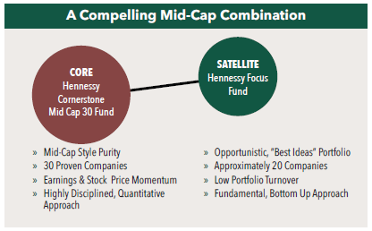

## Table of Contents

## What are mid-cap exchange-traded funds (ETFs)?

Mid-cap exchange-traded funds (ETFs) are investment funds that focus on companies with medium-sized market values. These companies are usually ranked between the largest and smallest companies in the stock market. Mid-cap ETFs give investors a way to own a piece of many mid-sized companies at once, instead of buying each stock separately. This can be easier and less risky than picking individual stocks.

These ETFs are popular because they offer a good balance between growth and stability. Mid-sized companies often have more room to grow than big companies, but they are usually more stable than small companies. By investing in a mid-cap ETF, you spread your money across many companies, which can help reduce the risk if one company does poorly. This makes mid-cap ETFs a good choice for people looking to grow their money over time without taking on too much risk.

## How do mid-cap ETFs differ from small-cap and large-cap ETFs?

Mid-cap ETFs focus on companies that are in the middle range of market size, not too big and not too small. They invest in companies that are growing but are already established, which means they might grow faster than large companies but are more stable than small ones. This makes mid-cap ETFs a good choice for people who want to balance growth and risk. They usually include companies with market values between $2 billion and $10 billion.

Small-cap ETFs, on the other hand, invest in smaller companies, often those with market values less than $2 billion. These companies can grow a lot, but they can also be riskier because they are less established and might not have a proven track record. Small-cap ETFs might be good for people who are willing to take more risk for the chance of higher returns. Large-cap ETFs focus on the biggest companies, those with market values over $10 billion. These companies are usually very stable and well-known, but they might not grow as fast as smaller companies. Large-cap ETFs are often chosen by investors who want to keep their money safe and are looking for steady, if slower, growth.

## What are the benefits of investing in mid-cap ETFs?

Investing in mid-cap ETFs can be a smart choice for many reasons. One big benefit is that they offer a good mix of growth and stability. Mid-sized companies often have more room to grow than big companies, so you might see your money grow faster. But they are also more established than small companies, which means they are usually less risky. This balance makes mid-cap ETFs a good fit for people who want to grow their money but don't want to take big risks.

Another advantage is that mid-cap ETFs let you spread your money across many companies at once. Instead of [picking](/wiki/asset-class-picking) individual stocks, which can be risky if one company does badly, you get a little piece of many companies. This diversification can help protect your money because if one company in the [ETF](/wiki/etf-trading-strategies) does poorly, the others might do well and balance it out. This makes mid-cap ETFs a safer way to invest in the stock market, especially for people who don't want to spend a lot of time researching individual stocks.

## What are the risks associated with mid-cap ETFs?

Investing in mid-cap ETFs does come with some risks. One risk is that mid-sized companies can be more affected by economic changes than big companies. If the economy takes a downturn, mid-cap companies might not have as much money saved up to weather the storm. This means their stock prices could drop more than those of large companies, which might impact the value of your ETF.

Another risk is that mid-cap ETFs might not be as liquid as large-cap ETFs. This means it can be harder to buy or sell shares quickly if you need to. If a lot of people want to sell their shares at the same time, it could be harder to find buyers, which might mean you have to sell at a lower price than you hoped. This is something to think about if you might need to get your money out quickly.

## Can you list some of the major mid-cap ETFs available in the market?

Some of the major mid-cap ETFs you can find in the market include the Vanguard Mid-Cap ETF (VO), the iShares Core S&P Mid-Cap ETF (IJH), and the SPDR S&P MidCap 400 ETF Trust (MDY). These ETFs are popular because they track well-known indexes and have low costs, which means you keep more of your money. The Vanguard Mid-Cap ETF, for example, follows the CRSP US Mid Cap Index and has a very low expense ratio, making it a good choice for people who want to keep their costs down.

Another important mid-cap ETF is the Schwab U.S. Mid-Cap ETF (SCHM), which tracks the Dow Jones U.S. Mid-Cap Total Stock Market Index. It's also known for its low costs and is a good option if you're looking for a broad exposure to mid-sized companies. The Invesco S&P MidCap Quality ETF (XMHQ) is different because it focuses on mid-cap companies that are considered high quality, based on things like their profits and how much debt they have. This can be a good choice if you want to invest in mid-cap companies but also want to focus on those that are financially strong.

## How do the performance metrics of different mid-cap ETFs compare?

The performance of different mid-cap ETFs can vary based on what they invest in and how much they charge. For example, the Vanguard Mid-Cap ETF (VO) and the iShares Core S&P Mid-Cap ETF (IJH) both follow broad mid-cap indexes, but they have slightly different expenses. VO has a lower expense ratio, which means it costs less to own, and this can make a big difference in your returns over time. IJH, on the other hand, might have a slightly higher expense ratio but tracks a different index, which could lead to different performance depending on which mid-cap companies do well.

Another example is the SPDR S&P MidCap 400 ETF Trust (MDY) and the Schwab U.S. Mid-Cap ETF (SCHM). MDY tracks the S&P MidCap 400 Index and has a higher expense ratio than SCHM, which follows the Dow Jones U.S. Mid-Cap Total Stock Market Index. SCHM's lower costs can help boost your returns, but the performance can also depend on how the companies in each index do. The Invesco S&P MidCap Quality ETF (XMHQ) focuses on high-quality mid-cap companies, which might lead to different performance compared to ETFs that include a wider range of mid-cap companies. Over time, the choice between these ETFs can affect your investment growth, so it's important to look at both their costs and the companies they invest in.

## What are the expense ratios of the top mid-cap ETFs, and how do they impact returns?

The expense ratio is how much it costs to own an ETF each year, shown as a percentage of your investment. For mid-cap ETFs, the Vanguard Mid-Cap ETF (VO) has a very low expense ratio of about 0.04%. The iShares Core S&P Mid-Cap ETF (IJH) has a slightly higher expense ratio at around 0.05%. The SPDR S&P MidCap 400 ETF Trust (MDY) charges about 0.23%, and the Schwab U.S. Mid-Cap ETF (SCHM) is even lower at around 0.04%. The Invesco S&P MidCap Quality ETF (XMHQ) has an expense ratio of about 0.25%. These costs can add up over time, so choosing an ETF with a lower expense ratio can help you keep more of your money.

Expense ratios impact your returns because they are taken out of your investment each year. If you invest $10,000 in an ETF with a 0.04% expense ratio, you'll pay $4 a year. But if the expense ratio is 0.25%, you'll pay $25 a year. Over many years, these small differences can make a big impact. For example, if both ETFs grow at the same rate, the one with the lower expense ratio will give you more money in the end because you're not losing as much to fees. So, when picking a mid-cap ETF, it's smart to look at the expense ratio and think about how it will affect your long-term returns.

## How does the sector allocation within mid-cap ETFs influence their performance?

The way mid-cap ETFs split their money between different sectors can really affect how they do over time. Sectors are like groups of companies that do similar things, like technology or healthcare. If an ETF puts a lot of its money into a sector that's doing really well, the ETF might do better too. But if it's heavy in a sector that's not doing so great, it might not do as well. For example, if a mid-cap ETF has a lot of its money in tech companies and tech is booming, the ETF could see big gains. But if it's got a lot in energy and energy prices are falling, it might not do so well.

This is why looking at the sector breakdown of a mid-cap ETF can help you guess how it might do in the future. Different sectors do better or worse at different times, and this can shake up the performance of an ETF. If you think a certain sector will do well, you might want to pick an ETF that has more of its money in that area. But remember, it's not just about picking the right sector. It's also about spreading your money across different sectors to lower your risk. That way, if one sector does badly, the others might help balance it out.

## What are the key factors to consider when selecting a mid-cap ETF for investment?

When picking a mid-cap ETF to invest in, one of the first things to look at is the expense ratio. This is how much it costs to own the ETF each year, and lower costs can help you keep more of your money over time. Another important thing is the index that the ETF follows. Different ETFs track different indexes, which means they might invest in different mid-sized companies. So, it's good to know what the ETF is investing in and how those companies are doing.

You should also think about the sector breakdown of the ETF. Some ETFs might have more money in certain areas, like technology or healthcare, and this can affect how the ETF does. If you think a certain sector will do well, you might want to pick an ETF that focuses on that area. But remember, it's also smart to spread your money across different sectors to lower your risk. Lastly, consider how easy it is to buy and sell the ETF, which is called [liquidity](/wiki/liquidity-risk-premium). If you might need to get your money out quickly, you'll want an ETF that's easy to trade.

## How do mid-cap ETFs fit into a diversified investment portfolio?

Mid-cap ETFs can be a great part of a diversified investment portfolio because they help spread your money across many different companies. When you invest in a mid-cap ETF, you're not putting all your money into just one or two companies. Instead, you're getting a little piece of many mid-sized companies. This can help lower your risk because if one company doesn't do well, the others might balance it out. Plus, mid-cap companies often have more room to grow than big companies but are more stable than small ones, so they can offer a good mix of growth and safety.

Adding mid-cap ETFs to your portfolio can also help you reach different parts of the market. While large-cap ETFs focus on big companies and small-cap ETFs focus on smaller ones, mid-cap ETFs give you a way to invest in the middle ground. This means you can have a bit of everything - big, medium, and small companies - which can make your investments more balanced. By including mid-cap ETFs, you're not just betting on one type of company; you're spreading your bets across different sizes and sectors, which can help your money grow more steadily over time.

## What are the tax implications of investing in mid-cap ETFs?

Investing in mid-cap ETFs can have some tax effects that you should know about. When you own an ETF, you might have to pay taxes on any money you make from it. This can happen in two main ways: capital gains and dividends. Capital gains are the profits you make when you sell your ETF shares for more than you paid for them. If you hold the ETF for more than a year, you'll pay a lower tax rate on these gains. But if you sell within a year, you'll pay a higher rate. Dividends are payments that the ETF might give you from the profits of the companies it owns. You'll have to pay taxes on these dividends too, but the rate can be lower if they are qualified dividends.

Another thing to think about is how ETFs handle their taxes. ETFs are usually pretty good at keeping taxes low because of how they work. They can use something called "in-kind" transactions to swap securities without selling them, which can help avoid triggering capital gains taxes. But sometimes, if the ETF has to sell some of its holdings, it might pass on capital gains to you. This is called a capital gains distribution, and you'll have to pay taxes on it, even if you didn't sell any of your ETF shares. So, it's a good idea to look at the tax efficiency of the mid-cap ETFs you're thinking about to help keep your tax bill down.

## How have mid-cap ETFs historically performed during different economic cycles?

Mid-cap ETFs have shown different performance patterns during different economic cycles. In good times, when the economy is growing, mid-cap ETFs often do well. This is because mid-sized companies can grow faster than big companies. They are not as big and slow as large companies, so they can take advantage of new opportunities quickly. During these times, mid-cap ETFs might even beat the performance of large-cap ETFs because they can grow more.

But when the economy is not doing well, mid-cap ETFs can be riskier. In a downturn, mid-sized companies might not have as much money saved up as big companies, so they can be hit harder. Their stock prices might drop more, which can pull down the value of mid-cap ETFs. During these tough times, large-cap ETFs might be safer because big companies are usually more stable. So, mid-cap ETFs can be a good choice for growth in good times, but you need to be ready for more ups and downs during bad times.

## References & Further Reading

[1]: Bergstra, J., Bardenet, R., Bengio, Y., & Kégl, B. (2011). ["Algorithms for Hyper-Parameter Optimization."](https://papers.nips.cc/paper/4443-algorithms-for-hyper-parameter-optimization) Advances in Neural Information Processing Systems 24.

[2]: ["Advances in Financial Machine Learning"](https://www.amazon.com/Advances-Financial-Machine-Learning-Marcos/dp/1119482089) by Marcos Lopez de Prado

[3]: ["Evidence-Based Technical Analysis: Applying the Scientific Method and Statistical Inference to Trading Signals"](https://books.google.com/books/about/Evidence_Based_Technical_Analysis.html?id=MeoJAQAAMAAJ) by David Aronson

[4]: ["Machine Learning for Algorithmic Trading"](https://github.com/stefan-jansen/machine-learning-for-trading) by Stefan Jansen

[5]: ["Quantitative Trading: How to Build Your Own Algorithmic Trading Business"](https://www.amazon.com/Quantitative-Trading-Build-Algorithmic-Business/dp/1119800064) by Ernest P. Chan