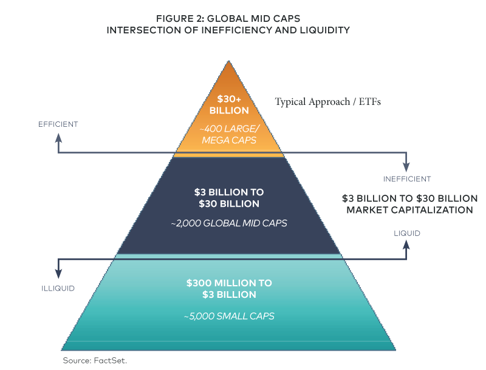

The financial sector is a vital component of the economy, offering a plethora of investment opportunities that cater to a wide range of investor preferences and risk tolerances. Among these opportunities are mid-cap financial stocks, which represent corporations with a market capitalization typically ranging from $1.6 billion to $12.5 billion. These stocks are considered a crucial segment of the equity market, providing a unique advantage by balancing growth potential and stability.

Investors often view mid-cap stocks as an attractive proposition because they can offer substantial growth prospects without the inherent volatility of smaller-cap stocks. Mid-cap companies are typically more mature than their small-cap counterparts, often possessing a more established market presence and financial health. This maturity can translate into more predictable and stable earnings compared to smaller, emerging firms.



In the dynamic landscape of financial markets, understanding the intricacies of mid-cap financial companies is essential. This understanding encompasses recognizing the advantages and potential risks associated with investing in these stocks. Additionally, algorithmic trading plays a significant role in enhancing trading efficiency within this niche. By leveraging sophisticated trading algorithms, investors can navigate the often complex and volatile mid-cap landscape with greater accuracy and reduced transaction costs.

Throughout the exploration of this topic, we also highlight some of the top mid-cap financial stocks currently recognized in the market. These stocks exemplify robust performance and are often considered valuable additions to a diversified investment portfolio.

## Table of Contents

## Understanding Mid-Cap Financial Companies

Mid-cap financial companies represent a fascinating intersection within the financial sector, positioned between the dynamic growth potential of smaller, emerging companies and the relative stability of large, established institutions. These mid-cap firms typically have a market capitalization ranging between $1.6 billion and $12.5 billion, setting them apart as businesses with the capacity for both expansion and resilience.

Primarily, mid-cap financial companies encompass regional banks, diversified banking institutions, and insurance firms. Regional banks cater to the financial needs of local communities, benefiting from intimate knowledge of their markets and clientele. This localized approach often provides a competitive advantage over larger, more generalized banks. Diversified banking institutions offer a broad range of services, including commercial and retail banking, investment services, and financial planning, providing multiple revenue streams and reducing reliance on any single market segment. Insurance firms in this category typically focus on specific geographies or types of insurance, allowing them to capitalize on niche markets.

Investors are drawn to mid-cap stocks largely because of their growth potential. Historically, mid-cap stocks have demonstrated the ability to outperform large-cap stocks during certain market scenarios. This performance can be attributed to their size, which allows for more agility in adapting to market changes and seizing new opportunities. Additionally, mid-cap companies are often at a stage where they are expanding their market share and can potentially grow their earnings at a faster rate than their larger counterparts.

However, it is important to recognize that mid-cap stocks can also exhibit more [volatility](/wiki/volatility-trading-strategies) than large-cap stocks. This volatility arises from several factors. For instance, mid-cap companies might have less access to capital markets compared to their larger peers, which can affect their [liquidity](/wiki/liquidity-risk-premium) and financial flexibility. Moreover, these companies might still be in the process of establishing their market presence, which can lead to significant fluctuations in their stock performance based on market perception and external economic conditions.

In conclusion, while mid-cap financial companies present intriguing investment opportunities due to their growth potential and ability to outperform under certain conditions, they also [carry](/wiki/carry-trading) inherent risks associated with their volatility and market positioning. Investors considering mid-cap stocks must weigh these factors carefully in their decision-making process, balancing the potential rewards against the associated risks.

## Top Mid-Cap Financial Stocks

Arthur J. Gallagher & Co. (AJG) and Webster Financial Corporation (WBS) stand out as leading stocks within the mid-cap financial sector due to their consistent performance and strategic market positioning. Arthur J. Gallagher & Co., a global insurance brokerage and risk management services firm, has demonstrated significant growth by expanding its operations through acquisitions and strategic partnerships. This strategy has enabled AJG to enhance its service offerings and penetrate new markets, contributing to its robust financial performance.

Webster Financial Corporation (WBS), a prominent name in regional banking, has capitalized on its strong customer relationships and community presence. By focusing on personalized banking services and adopting innovative technologies, Webster Financial has maintained a competitive edge in a crowded market. The corporation's emphasis on digital transformation has also played a crucial role in its recent growth, appealing to a tech-savvy customer base.

East West Bancorp, Inc. (EWBC) and American Financial Group, Inc. (AFG) also merit attention within the mid-cap financial sector. East West Bancorp, recognized for its focus on the Chinese-American community, benefits from its unique positioning in the niche market of cross-border banking and commercial lending. By leveraging its network and expertise, EWBC has shown strong financial results, outperforming many peers.

American Financial Group, Inc. (AFG), primarily active in the insurance sector, has experienced growth through its diversified insurance products and commitment to customer service. AFG has effectively managed its underwriting processes and investment strategies, thereby ensuring consistent profitability and shareholder returns. This strategic focus has helped the company navigate market fluctuations and maintain a stable performance trajectory.

These companies exemplify the potential of mid-cap financial stocks to achieve significant growth. Their strategic initiatives, market adaptability, and financial acumen have often led to superior price appreciation compared to larger, more established peers. Investing in these mid-cap financial stocks may offer an attractive opportunity for those seeking to benefit from industry growth trends and innovative business models.

## The Role of Algorithmic Trading in Mid-Cap Stocks

Algorithmic trading has become increasingly prominent in financial markets, significantly impacting the trading of mid-cap stocks. This trading method employs complex algorithms to execute orders based on pre-defined criteria such as timing, price, and [volume](/wiki/volume-trading-strategy). By relying on computer systems, [algorithmic trading](/wiki/algorithmic-trading) enhances efficiency and precision in executing trades, leading to a reduction in both transaction costs and human error.

Investors focusing on mid-cap stocks particularly benefit from algorithmic trading due to the unique characteristics of this segment. Mid-cap stocks, while offering higher growth potential than large-cap stocks, typically exhibit lower liquidity and wider bid-ask spreads. These attributes can pose challenges for investors in terms of executing trades efficiently and at favorable prices.

Algorithmic trading addresses the liquidity issue by allowing for rapid execution of large orders without a significant impact on stock prices. This is achieved through techniques such as "order slicing," where a large order is divided into smaller chunks and executed over time to avoid market disruption. Additionally, algorithms can be designed to exploit specific market conditions, thus taking advantage of price inefficiencies and the volatility often observed in mid-cap stocks.

For example, a Python implementation of a basic algorithmic trading strategy might look like this:

```python
import yfinance as yf  # For more datasets, visit: https://paperswithbacktest.com/datasets

# Define the stock and time period
ticker = 'EWBC'  # Example mid-cap stock: East West Bancorp, Inc.
data = yf.download(ticker, start="2022-01-01", end="2023-01-01", interval='1d')

# Simple moving average strategy
data['SMA_50'] = data['Close'].rolling(window=50).mean()
data['SMA_200'] = data['Close'].rolling(window=200).mean()

# Generate buy/sell signals
data['Signal'] = 0
data['Signal'][50:] = np.where(data['SMA_50'][50:] > data['SMA_200'][50:], 1, -1)

trade_signals = data[(data['Signal'] == 1) | (data['Signal'] == -1)]
print(trade_signals[['Close', 'SMA_50', 'SMA_200', 'Signal']])
```

This script fetches historical data for a mid-cap stock and calculates two simple moving averages (SMA) as part of a strategy to generate buy and sell signals. Such automated strategies can help investors manage trades effectively, succeeding where manual efforts might falter due to human limitations.

Moreover, by minimizing manual intervention, algorithmic trading reduces the risk of emotional decision-making, which is particularly beneficial in a segment prone to price swings.

In conclusion, algorithmic trading not only provides traders with an advanced toolset for managing mid-cap stocks but also enhances their ability to navigate the complexities inherent in this segment with greater efficiency and success.

## Benefits and Risks of Investing in Mid-Cap Financials

Investing in mid-cap financial stocks presents distinct advantages and challenges, primarily driven by their growth potential and market behavior. Mid-cap financials, which include entities like regional banks and insurance firms, offer investors a promising opportunity for capital appreciation. Their unique position allows them to balance growth and stability effectively. Historically, mid-cap stocks have demonstrated a higher propensity for growth compared to their large-cap counterparts, partly because they often have more room to expand and capture market share.

One of the significant benefits of investing in mid-cap financials is their potential to outperform during bull markets. In such periods, these stocks can capitalize on economic expansions, increasing their profitability through enhanced service offerings and customer base expansion. For instance, regional banks may benefit from increased lending and financial product penetration in local markets.

However, the volatile nature of mid-cap stocks relative to large-cap stocks is a notable risk. During bear markets, these stocks are more susceptible to price fluctuations and may experience steeper declines due to their less diversified business models and lower market capitalizations. This heightened volatility warrants careful consideration and risk management strategies.

A strategic approach to investing in mid-cap financials is crucial to mitigating associated risks. Algorithmic trading is a valuable tool in this regard, providing investors the ability to execute trades swiftly and with precision. By utilizing algorithms that analyze vast datasets in real-time, investors can make informed decisions that minimize human error. Additionally, algorithmic strategies can adapt to market conditions, allowing for automatic execution of trades that optimize profit margins and reduce losses.

Risk management techniques, such as diversification and hedging, are essential for investors in mid-cap stocks. Diversification can spread risk across different sectors and geographic locations, while hedging can protect against adverse price movements. Implementing a comprehensive risk management strategy can balance the growth potential of mid-cap financials with their inherent risk, enabling investors to capitalize on market opportunities with confidence.

## FAQs

What defines a mid-cap financial stock?

Mid-cap financial stocks are defined by their market capitalization, which typically ranges from $1.6 billion to $12.5 billion. These companies are usually beyond the startup phase and have established operations but still possess significant growth potential. Often, they include regional banks, diversified banking institutions, and insurance firms, situated between the smaller, emerging businesses and the larger, more stable entities in the financial sector. This unique positioning allows them to balance growth prospects with relative stability.

Which are some of the key mid-cap financial companies to watch?

Some notable mid-cap financial companies recognized for their robust market performance include Arthur J. Gallagher & Co. (AJG) and Webster Financial Corporation (WBS). Additionally, East West Bancorp, Inc. (EWBC) and American Financial Group, Inc. (AFG) have demonstrated impressive growth, often outperforming larger peers in terms of price appreciation. Investors should keep an eye on these companies due to their strong market presence and consistent performance.

How does algorithmic trading benefit mid-cap stock investors?

Algorithmic trading offers several advantages for investors in mid-cap stocks. It enables the automation of trade execution, ensuring high efficiency and precision, and helps reduce transaction costs by minimizing human error. This is particularly beneficial in mid-cap stocks, which tend to have less liquidity and wider bid-ask spreads compared to large-cap stocks. Algorithmic trading can help navigate these challenges, optimizing trade outcomes by swiftly responding to market changes and executing trades at the best possible prices.

What are the risks associated with investing in mid-cap financial stocks?

Investing in mid-cap financial stocks involves certain risks, chiefly due to their volatility. While they offer substantial growth potential and can outpace large-cap stocks during bull markets, they may also experience sharper declines during bear markets. The relative instability and limited liquidity of mid-cap stocks can further contribute to this volatility. Therefore, it is crucial for investors to employ strategic planning, potentially leveraging algorithmic trading and risk management techniques, to mitigate these risks and enhance their investment returns.

## The Bottom Line

Mid-cap financial stocks present a unique investment opportunity by balancing growth potential and inherent risks, making them attractive to a wide array of investors. These stocks, characterized by corporations with market capitalizations typically between $1.6 billion and $12.5 billion, stand out for their ability to outperform larger counterparts under favorable economic conditions. However, their intrinsic volatility can introduce significant risks, especially during market downturns.

Algorithmic trading can greatly benefit investors in the mid-cap segment by promoting efficient trade execution and improving potential returns. This technological approach allows market participants to execute trades with precision, benefitting from reduced transaction costs and minimized human error. Crucially, it addresses the liquidity challenges often associated with mid-cap stocks, which tend to have wider bid-ask spreads relative to large-cap stocks.

Investors must approach mid-cap financial stock investments with a comprehensive strategy focused on due diligence and rigorous planning. Careful analysis and understanding of market dynamics can reveal opportunities within this segment. Strategic planning, possibly enhanced by algorithmic trading, helps manage the risks involved and position investors to capitalize on potential growth. Ultimately, prudent investment strategies—such as diversified portfolios and active risk management techniques—are essential for maximizing gains while mitigating risks associated with mid-cap financial stocks.

## References & Further Reading

[1]: ["The Use of Algorithmic Trading in Financial Markets"](https://www.investopedia.com/articles/active-trading/101014/basics-algorithmic-trading-concepts-and-examples.asp) - Investopedia

[2]: ["Mid-Cap Stocks: Understanding the Opportunities and Risks"](https://www.investopedia.com/mid-cap-companies-advantages-and-disadvantages-5224695) - The Balance

[3]: ["Machine Learning for Asset Managers"](https://www.cambridge.org/core/elements/machine-learning-for-asset-managers/6D9211305EA2E425D33A9F38D0AE3545) by Marcos Lopez de Prado

[4]: ["Algorithmic Trading and DMA: An introduction to direct access trading strategies"](https://archive.org/details/algorithmictradi0000john) by Barry Johnson

[5]: "Algorithmic and High-Frequency Trading" by Álvaro Cartea, Sebastian Jaimungal, and José Penalva - Cambridge University Press

[6]: ["Understanding Algorithmic Trading and Its Benefits"](https://www.investopedia.com/articles/active-trading/101014/basics-algorithmic-trading-concepts-and-examples.asp) - Nasdaq

[7]: "Investment Valuation: Tools and Techniques for Determining the Value of Any Asset" by Aswath Damodaran - Wiley