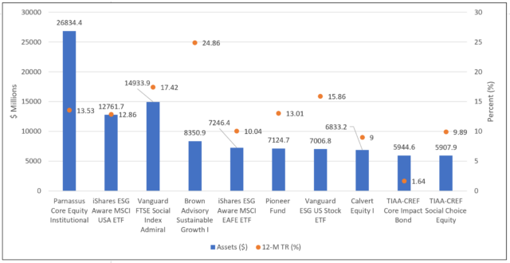

Sustainable investing, often referred to as socially responsible investing (SRI), is an investment strategy that seeks to generate both financial return and social/environmental impact. This approach has gained momentum as investors increasingly recognize the importance of integrating ethical considerations into financial decision-making. Sustainable investing is primarily guided by Environmental, Social, and Governance (ESG) criteria, which evaluate companies based on their commitments to sustainability and ethical impacts, alongside traditional financial metrics.

Investment funds, exchange-traded funds (ETFs), and algorithmic trading represent key financial instruments and strategies that intersect with sustainable investing. Investment funds pool capital from numerous investors to purchase securities, whereas ETFs are marketable securities that track an index, commodity, bonds, or a basket of assets. ETFs are known for their trading flexibility and typically lower costs compared to mutual funds. Algorithmic trading, on the other hand, involves the use of complex algorithms to execute trades based on pre-set criteria. This technology-driven approach can harness real-time data and analytics to make informed investment decisions swiftly.

Each of these components interacts with sustainable investing, providing mechanisms for implementing ESG strategies effectively. Sustainable investment funds deliberately invest in companies that demonstrate robust ESG practices, while ESG-focused ETFs allow individual investors exposure to sustainable enterprises with the ease of trading. Algorithmic trading can further refine sustainable investing by swiftly processing vast amounts of ESG data and executing trades that align with sustainable goals.

The purpose of this article is to explore how these financial instruments and strategies contribute to sustainable investment practices. The article will first examine the principles and emerging trends in sustainable investing, followed by a discussion of investment funds tailored towards sustainability. Subsequently, it will delve into the role of ETFs in enhancing sustainable investment opportunities. The article will also explore how algorithmic trading can be leveraged for sustainable finance. Finally, it will address the challenges and opportunities within sustainable investing, concluding with a call to action for embracing sustainable practices in the financial landscape.

## Table of Contents

## Understanding Sustainable Investing

Sustainable investing is an approach that considers not only financial returns but also environmental, social, and governance (ESG) factors. It aims to generate long-term positive impact on society and the environment while maintaining or increasing financial gains. This practice has gained significant traction over recent years due to increased awareness of global challenges such as climate change, social inequality, and corporate governance issues.

Key to the rise of sustainable investing is the integration of ESG criteria, which provide a framework for assessing a company's operations and their impact on the environment, their social relationships, and governance structures. Environmental criteria consider how a company performs as a steward of nature. Social criteria examine how it manages relationships with employees, suppliers, customers, and the communities where it operates. Governance involves the company’s leadership, executive pay, audits, internal controls, and shareholder rights. The incorporation of ESG criteria in investment strategies not only aids in identifying risks but also in pinpointing opportunities to generate better long-term returns.

The demand for sustainable investments is particularly pronounced among millennials and institutional investors. Millennials, who are increasingly [earning](/wiki/earning-announcement) more purchasing power, tend to prefer companies and products that align with their values, especially concerning social justice and environmental sustainability. Institutional investors, such as pension funds and insurance companies, are also prioritizing sustainable investments, recognizing that climate change and other [ESG](/wiki/esg-investing) factors can pose material risks to their portfolios. For example, a 2020 report by Morgan Stanley found that 85% of individual investors are interested in sustainable investing, and 95% of millennials expressed the same interest.

Investors have several approaches to implementing sustainable investing strategies. Among them are negative screening, positive screening, and impact investing. Negative screening involves excluding companies or industries that do not meet certain ESG criteria, such as tobacco, firearms, or fossil fuels. Positive screening, on the other hand, involves actively choosing companies that score well on ESG metrics. Impact investing goes a step further by investing in projects or companies specifically aimed at generating measurable social or environmental benefits alongside financial returns.

Success stories in sustainable investing are increasingly common. For instance, the Danish renewable energy company Ørsted, which shifted from fossil fuels to become a leading renewable energy provider, has seen significant growth in its stock value and been recognized for its sustainability efforts. Another example is Beyond Meat, whose plant-based products align with increased consumer demand for sustainable food options and have attracted substantial investment.

In sum, sustainable investing has become a vital part of modern finance, blending ethical considerations with financial gain. As more investors prioritize sustainability, the financial world is likely to see further integration of ESG criteria into investment strategies, positioning them to address some of today's most pressing global challenges.

## Investment Funds and Sustainability

Investment funds are collective investment schemes that pool capital from multiple investors to purchase a diversified portfolio of securities, such as stocks, bonds, or other assets. This approach allows individual investors to gain access to a broad range of asset classes and investment opportunities that they might not easily access on their own. Investment funds can take various forms, including mutual funds, index funds, and exchange-traded funds (ETFs), with professional money managers responsible for buying and selling assets in line with the fund's objectives.

Sustainable investment funds are similar in structure to traditional investment funds but differ in their focus. While traditional investment funds primarily seek to maximize financial returns, sustainable investment funds integrate Environmental, Social, and Governance (ESG) criteria into their investment decisions. This integration aims to achieve not only financial performance but also positive environmental and social impact. Sustainable investment funds evaluate companies based on factors such as their carbon footprint, ethical labor practices, and board diversity, in addition to traditional financial metrics.

The benefits of sustainable investment funds include the potential for enhanced long-term returns due to better risk management and alignment with evolving consumer and regulatory expectations. Companies that prioritize ESG criteria often demonstrate improved operational efficiencies and innovation, leading to long-term profitability. Moreover, sustainable investment funds can attract capital from socially conscious investors, fostering a virtuous cycle of responsible business practices and investment returns. However, challenges persist, such as the varying definitions and measurements of ESG criteria, which can lead to inconsistencies in fund labeling and assessment. Additionally, there is an ongoing debate about the potential trade-off between sustainability and financial returns, although recent studies suggest that this conflict may be overstated.

Several leading sustainable investment funds have gained recognition for their performance and commitment to ESG principles. Examples include the Parnassus Core Equity Fund, which focuses on investing in large-cap companies with sustainable practices, and the Calvert Emerging Markets Equity Fund, which targets emerging market companies demonstrating robust ESG standards. Another notable example is the Vanguard FTSE Social Index Fund, which provides exposure to large and mid-cap US stocks that meet specific ESG criteria while avoiding sectors such as tobacco and weapons.

In conclusion, sustainable investment funds offer a compelling alternative to traditional investment vehicles by combining financial ambitions with a commitment to environmental and social progress. Yet, despite their promise, investors must remain vigilant about the challenges that arise in assessing ESG metrics and ensuring alignment with personal and societal values.

## The Role of ETFs in Sustainable Investing

Exchange-Traded Funds (ETFs) are investment funds that are traded on stock exchanges, much like individual stocks. Typically, ETFs are composed of a collection of assets such as stocks, bonds, commodities, or a mix of asset classes designed to track the performance of a specific index. They offer investors a cost-effective way to diversify their portfolios without the higher fees often associated with mutual funds.

One of the key advantages of ETFs over mutual funds is their [liquidity](/wiki/liquidity-risk-premium). Since ETFs can be bought and sold throughout the trading day at market prices, they provide investors with the flexibility to react quickly to market changes. This is in contrast to mutual funds, whose shares can only be bought and sold at the end of the trading day at the net asset value (NAV). Moreover, ETFs typically have lower expense ratios due to their passive management style, which minimizes both operational costs and management fees.

In recent years, a significant development in the world of ETFs is the rise of ESG-focused ETFs. Environmental, Social, and Governance (ESG) criteria have become increasingly important to investors seeking to align their investments with their values. ESG-focused ETFs are designed to include companies that score well on sustainability metrics while avoiding those that don't. These funds aim to provide both financial returns and social impact, attracting a demographic more conscious about where and how they invest their money.

Investing in sustainable ETFs offers several benefits. Firstly, they present lower costs relative to actively managed funds by utilizing a passive management approach. This cost-efficiency allows investors to retain more of their earnings over time. Additionally, sustainable ETFs offer significant diversification potential; as they comprise a basket of stocks or bonds across various sectors, they can spread risk more effectively than individual securities. This diversification can mitigate the impact of poor performance by any single asset or sector.

There are several popular sustainable ETFs in the market. For instance, the iShares ESG MSCI USA [ETF](/wiki/etf-trading-strategies) (ESGU) tracks the performance of U.S. companies with high ESG performance relative to their sector peers. Similarly, the SPDR S&P 500 ESG ETF (EFIV) is designed to reflect the performance of the S&P 500 companies that meet specific sustainability criteria. Another example is the Vanguard ESG U.S. Stock ETF (ESGV), which provides broad exposure to U.S. companies screened for certain ESG criteria.

The growing interest in sustainable investing has propelled the creation and adoption of ESG-focused ETFs, catering to the needs of investors who desire both portfolio growth and positive environmental and social impacts. These tools allow investors to make conscientious investment decisions without sacrificing the benefits afforded by diversification and cost-efficiency inherent in traditional ETFs.

## Algorithmic Trading and Sustainable Investing

Algorithmic trading, a method of executing orders using automated and pre-programmed trading instructions, has significantly transformed the landscape of finance. These algorithms, which are based on variables such as time, price, and [volume](/wiki/volume-trading-strategy), enable the efficient processing of high-frequency trades with minimal human intervention. This technique is prevalent in stock exchanges where speed and precision are paramount. It provides traders with the ability to capitalize on market trends and fluctuations faster than would be possible manually.

In the context of sustainable investing, algorithms can be designed to prioritize investments that align with environmental, social, and governance (ESG) criteria. By utilizing sophisticated data analytics, these algorithms can assess vast datasets to identify sustainable investment opportunities. For example, an algorithm might analyze a company's carbon footprint, social responsibility initiatives, and corporate governance practices to determine its suitability for inclusion in a sustainable portfolio. The integration of ESG data into algorithmic models is crucial, as it provides a structured way to evaluate and compare potential investments based on sustainability metrics.

Data analytics plays an essential role in enhancing sustainable investing strategies. By leveraging [machine learning](/wiki/machine-learning) and [artificial intelligence](/wiki/ai-artificial-intelligence), investors can analyze historical and real-time data to make informed decisions that align with their sustainability goals. These technologies enable the detection of patterns and trends that may not be apparent through traditional analysis. For instance, predictive analytics can forecast the sustainability performance of companies based on past behavior and external factors, allowing investors to anticipate potential opportunities or risks.

However, there are challenges and ethical considerations involved in employing [algorithmic trading](/wiki/algorithmic-trading) for sustainable investments. One significant challenge is the quality and availability of ESG data. Inconsistent reporting standards and lack of transparency can lead to inaccurate assessments by algorithms. Additionally, there's the ethical concern of data bias. If the data inputs are biased, the algorithms' outputs will also reflect those biases, potentially leading to misguided investments.

Moreover, as algorithmic trading operates at high speeds and volumes, there is the potential for market instability if not properly monitored. Automated systems, while efficient, can sometimes act unexpectedly due to programming errors or unforeseen market scenarios. As such, regulatory frameworks and continuous oversight are necessary to ensure that algorithmic trading supports market stability while promoting sustainable investment practices.

In conclusion, while algorithmic trading offers significant potential for advancing sustainable investing through rapid and data-driven decision-making, it is essential to address the challenges and ethical considerations to harness its full potential in a socially responsible manner.

## Challenges and Opportunities

Sustainable investing, while gaining traction due to its focus on environmental, social, and governance (ESG) criteria, faces several challenges. One significant challenge is market [volatility](/wiki/volatility-trading-strategies), which affects all investments but can be especially pronounced in sustainable sectors that may be more susceptible to regulatory changes or shifts in consumer sentiment. For instance, sudden changes in government policy regarding renewable energy subsidies can impact stock prices of companies within green sectors, consequently affecting ETFs and algorithmic strategies heavily reliant on these sectors.

Data quality presents another challenge. Investors require accurate, timely, and comprehensive ESG data to evaluate companies effectively. However, inconsistencies in ESG reporting standards and the lack of a unified reporting framework can lead to varying datasets, complicating decision-making for both investment funds and algorithmic trading models. The discrepancies may arise from different interpretations of ESG criteria or incomplete disclosures by companies, resulting in algorithms making less informed investment decisions.

Regulatory challenges also play a major role. As sustainable investing continues to evolve, so do the regulatory frameworks governing it. Differing regulations across regions can complicate the investment landscape for global investors interested in sustainable ETFs or utilizing algorithmic trading strategies. For instance, the European Union's Sustainable Finance Disclosure Regulation (SFDR) mandates specific disclosures, whereas other regions may not have similar requirements, leading to a patchwork of regulatory practices.

Despite these challenges, there are noteworthy opportunities. Technology and innovative strategies have the potential to revolutionize sustainable investing. Advanced data analytics and machine learning can provide deeper insights into ESG criteria, enhance the accuracy of sustainability assessments, and improve the performance of algorithmic trading models by processing large volumes of data more efficiently. This capacity can help identify new sustainable investment opportunities and predict trends with greater precision.

Moreover, the growing development of sustainable ETFs offers investors lower-cost options with inherent diversification benefits compared to traditional mutual funds. These ETFs have the advantage of tracking strong ESG-indexed performance, providing a more straightforward pathway for investors to engage with sustainable products.

Looking to the future, several trends and predictions are evident. As data quality improves and regulatory standards become more unified, the effectiveness of algorithmic trading in sustainable investing is likely to increase. Additionally, the integration of artificial intelligence and machine learning in trading strategies is expected to become more sophisticated, allowing for better analysis and execution of sustainability-focused investment strategies.

The expanding availability of ESG data from non-traditional sources, such as satellite imagery and IoT devices, could further enhance data-driven decision-making. As sustainability becomes an integral part of financial systems, it is likely that sustainable investing will not only increase in volume but also in complexity, offering new layers of opportunity for innovative strategies in ETFs and algo-trading.

## Conclusion

In conclusion, sustainable investing represents a crucial evolution within the financial landscape, emphasizing the integration of ethical, environmental, and social considerations into investment decisions. This approach aligns with the growing demand from a diverse range of investors, including millennials and institutional players, for strategies that not only yield financial returns but also contribute positively to the world. The introduction and adoption of investment funds, Exchange-Traded Funds (ETFs), and algorithmic trading within sustainable investing frameworks have significantly bolstered these efforts, providing effective avenues for enhancing portfolio performance while adhering to sustainability principles.

Investment funds and ETFs offer accessible and diversified vehicles for sustainable investments, with ESG criteria shaping their composition and strategic direction. These financial instruments have proven successful in offering cost-effective and impactful means to participate in sustainable growth, supporting the shifting priorities of modern investors. Furthermore, algorithmic trading presents an innovative enhancement to sustainable investing, enabling the dynamic and data-driven identification of investment opportunities that align with ESG criteria. Despite the associated challenges—such as market volatility, data quality concerns, and regulatory complexities—technology continues to drive the evolution of sustainable investment strategies, unlocking potential for increased adoption and effectiveness.

The integration of sustainability with cutting-edge investment techniques is not merely a trend but a necessity as we confront global challenges ranging from climate change to social inequity. Investors and industry professionals are encouraged to prioritize sustainability in their strategic approaches, recognizing the symbiotic relationship between financial success and positive societal impact. This commitment requires continuous research, the refinement of analytics methodologies, and the development of innovative financial products to adapt to an ever-evolving market landscape. 

Ultimately, sustainable investing is more than a niche sector—it is a pivotal component of future-proofing the global economic system. Embracing such practices promises substantial benefits, not just in terms of financial returns, but also in fostering a resilient and equitable future. As such, a concerted effort towards further research and the practical application of sustainable investing principles is crucial for capturing the opportunities presented by this burgeoning facet of finance.

## References

1. Friede, G., Busch, T., & Bassen, A. (2015). "ESG and Financial Performance: Aggregated Evidence from More than 2000 Empirical Studies." Journal of Sustainable Finance & Investment. [Link](https://www.tandfonline.com/doi/full/10.1080/20430795.2015.1118917)

2. Morgan Stanley Institute for Sustainable Investing. (2019). "Sustainable Reality: Analyzing Risk and Returns of Sustainable Funds." [Link](https://www.morganstanley.com/pub/content/dam/msdotcom/ideas/sustainable-investing-offers-financial-performance-lowered-risk/Sustainable_Reality_An_Investigation_into_Performance.pdf)

3. Monitor Institute by Deloitte. (2018). "Allocating for Impact: Subject Paper of Impact Investing." [Link](https://www2.deloitte.com/content/dam/Deloitte/global/Documents/About-Deloitte/gx-mo-about-deloitte-impact-investing.pdf)

4. Morningstar. (2020). "Global Sustainable Fund Flows: Q2 2020 in Review." [Link](https://www.morningstar.com/research/downloads/1006699/sustainable-fund-flows.html)

5. Henisz, W., Koller, T., & Nuttall, R. (2019). "Five ways that ESG creates value." McKinsey Quarterly. [Link](https://www.mckinsey.com/business-functions/strategy-and-corporate-finance/our-insights/five-ways-that-esg-creates-value)

6. CFA Institute. (2020). "ESG Integration in the Americas: Markets, Practices, and Data." [Link](https://www.cfainstitute.org/research/survey-reports/esg-integration-americas)

7. BlackRock. (2021). "Sustainability: The Future of Investing." [Link](https://www.blackrock.com/us/individual/insights/blackrock-investment-institute/sustainability-the-future-of-investing)

8. Statman, M. (2000). "Socially Responsible Mutual Funds." Financial Analysts Journal. Vol. 56, No. 3. [Accessible via JSTOR]

9. Drempetic, S., Klein, C., & Zwergel, B. (2019). "The Influence of Firm Size on the ESG Score: Corporate Sustainability Ratings under Review." Journal of Business Ethics. [Link](https://link.springer.com/article/10.1007/s10551-019-04164-1)

10. European Investment Bank. (2020). "The EIB Group Sustainability Report 2019." [Link](https://www.eib.org/en/publications/the-eib-group-sustainability-report-2019) 

This list encompasses a range of academic studies, industry reports, and white papers that provide in-depth analyses and findings on sustainable investing, ESG criteria, and the integration of these concepts in various investment tools and practices, such as mutual funds, ETFs, and algorithmic trading.

## References & Further Reading

[1]: Friede, G., Busch, T., & Bassen, A. (2015). ["ESG and Financial Performance: Aggregated Evidence from More than 2000 Empirical Studies."](https://www.tandfonline.com/doi/full/10.1080/20430795.2015.1118917) Journal of Sustainable Finance & Investment.

[2]: Morgan Stanley Institute for Sustainable Investing. (2019). ["Sustainable Reality: Analyzing Risk and Returns of Sustainable Funds."](https://www.morganstanley.com/content/dam/msdotcom/ideas/sustainable-investing-offers-financial-performance-lowered-risk/Sustainable_Reality_Analyzing_Risk_and_Returns_of_Sustainable_Funds.pdf)

[3]: Monitor Institute by Deloitte. (2018). ["Allocating for Impact: Subject Paper of Impact Investing."](https://www2.deloitte.com/us/en/pages/monitor-institute/solutions/monitor-institute-services.html)

[4]: Morningstar. (2020). ["Global Sustainable Fund Flows: Q2 2020 in Review."](https://www.morningstar.com/sustainable-investing/sustainable-funds-continue-rake-assets-during-second-quarter)

[5]: Henisz, W., Koller, T., & Nuttall, R. (2019). ["Five ways that ESG creates value."](https://www.mckinsey.com/capabilities/strategy-and-corporate-finance/our-insights/five-ways-that-esg-creates-value) McKinsey Quarterly.

[6]: CFA Institute. (2020). ["ESG Integration in the Americas: Markets, Practices, and Data."](https://rpc.cfainstitute.org/-/media/documents/survey/esg-integration-in-the-americas.pdf)

[7]: BlackRock. (2021). ["Sustainability: The Future of Investing."](https://www.blackrock.com/corporate/sustainability/low-carbon-transition) 

[8]: Statman, M. (2000). ["Socially Responsible Mutual Funds."](https://www.researchgate.net/publication/240311517_Socially_Responsible_Mutual_Funds) Financial Analysts Journal, Vol. 56, No. 3. 

[9]: Drempetic, S., Klein, C., & Zwergel, B. (2019). ["The Influence of Firm Size on the ESG Score: Corporate Sustainability Ratings under Review."](https://www.jstor.org/stable/45386660) Journal of Business Ethics.

[10]: European Investment Bank. (2020). ["The EIB Group Sustainability Report 2019."](https://www.eib.org/en/publications/sustainability-report-2020) 