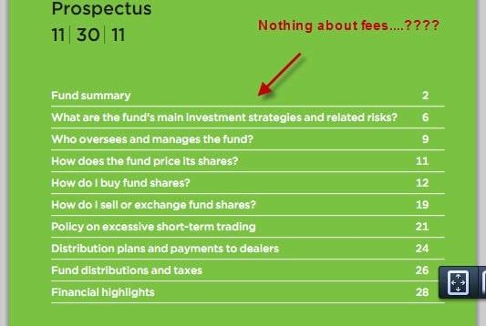

Mutual funds remain integral to the financial ecosystem, providing individual and institutional investors with a means to diversify portfolios and mitigate risk. As pooled investment vehicles, mutual funds offer an array of options based on investment objectives, such as capital appreciation, income generation, and market exposure. For investors, understanding the intricacies of how mutual funds operate, particularly through the analysis of a mutual fund prospectus, is a critical step in making informed decisions. This document serves as a comprehensive guide, detailing vital components such as the fund's investment objectives, strategies employed, historical performance, and fee structures. It operates as a legally binding agreement between the fund managers and investors, ensuring transparency and alignment of interests.

The landscape of mutual fund management has evolved with technological advancements, particularly with the advent of algorithmic trading. This rise in computational finance has introduced novel complexities and opportunities that have reshaped fund management practices. Algorithmic trading leverages sophisticated computer algorithms to execute trades with precision and speed unattainable by human traders. This integration allows fund managers to analyze vast datasets in real-time, optimize trade executions, and potentially improve fund performance by adopting data-driven decision-making processes. 



In the following sections, we will explore these pivotal elements—the essential aspects of mutual fund prospectuses and the role of algorithmic trading in modern fund management—and how they can be harnessed to enhance investment strategies. The synergy of detailed financial documentation and advanced technological tools equips investors to navigate the increasingly intricate investing landscape and optimize portfolios for long-term growth.

## Table of Contents

## What Is a Mutual Fund Prospectus?

A mutual fund prospectus is a critical legal document issued by a mutual fund, designed to provide investors with comprehensive information about the fund. This document acts as both an informative resource and a legally binding agreement between the mutual fund manager and investors. It serves to ensure transparency and facilitate informed investment decisions by outlining several key aspects of the mutual fund.

Primarily, the prospectus details the fund's investment objectives. These objectives guide the fund's overall strategy and inform potential investors about the financial goals the fund aims to achieve. For instance, a fund may target capital growth, stable income, or a balance of both. Understanding these objectives is essential for investors to align the fund's goals with their own financial aspirations.

The prospectus also elaborates on the investment strategies employed by the fund. It describes the methodologies and techniques used to accomplish the stated objectives, such as asset allocation plans, specific securities or sectors the fund may focus on, or any investment restrictions that the fund adheres to. This section helps investors gauge whether the fund's approach aligns with their risk tolerance and investment philosophy.

In addition to objectives and strategies, the prospectus includes a comprehensive disclosure of historical performance. While past performance does not guarantee future results, it offers context and aids investors in evaluating the fund's track record over various market conditions. Accompanying performance data, the prospectus provides a detailed breakdown of the fund's fee structure. This includes management fees, administrative costs, and any other expenses that impact the net returns investors receive. Understanding these fees is crucial, as they can significantly affect overall investment returns over time.

Furthermore, the prospectus highlights the specific risks associated with the fund. This section discusses factors that might affect the fund's performance, such as market [volatility](/wiki/volatility-trading-strategies), [interest rate](/wiki/interest-rate-trading-strategies) changes, or currency fluctuations. By clearly outlining these risks, the prospectus enables investors to assess whether they are comfortable with the potential uncertainties involved.

Overall, the mutual fund prospectus plays a vital role in evaluating fund viability. By furnishing detailed information about objectives, strategies, performance, fees, and risks, the prospectus equips investors with the necessary tools to make informed decisions, ensuring that their investments align with their personal financial goals and risk appetite.

## Key Components of a Prospectus

A mutual fund prospectus serves as a vital document that offers an in-depth view of the fund’s operations and investment strategies. Understanding the key components of a prospectus equips investors with the necessary information to evaluate a fund's compatibility with their financial goals. 

**Investment Objectives:**  
The investment objectives section provides clarity on the fund's primary financial goals, which may include capital growth, stable income, or high returns. It outlines the anticipated outcome that the fund aims to deliver to its investors. For instance, a fund focused on capital growth might invest heavily in equities, targeting stocks with robust growth potential. Conversely, a fund aiming for stable income might focus on fixed-income securities, such as bonds, to provide consistent revenue streams.

**Investment Strategies:**   
Investment strategies delineate the methodologies employed to meet the fund's objectives. This includes details on asset allocation, which refers to the distribution of investments across various asset classes, such as stocks, bonds, and cash equivalents. The strategy section may also highlight any restrictions or limitations the fund management adheres to, such as geographic constraints or industry-specific investments. For example, a fund might limit its investments to companies within a specific sector, leveraging specialized knowledge to capitalize on emerging market trends.

**Risks:**  
The prospectus outlines the risks associated with investing in the fund, enabling potential investors to evaluate their risk tolerance. This section typically covers both market risk, which involves fluctuations in market prices and interest rates, and specific risk, which pertains to factors unique to the individual assets within the fund. Other risks might include credit risk, [liquidity](/wiki/liquidity-risk-premium) risk, and inflation risk. By providing a comprehensive understanding of these risks, the prospectus helps investors assess whether the potential rewards align with their risk profile.

A detailed examination of these components helps investors make informed decisions by aligning their personal financial objectives with the fund's operational blueprint.

## The Role of Algorithmic Trading in Mutual Funds

Algorithmic trading, commonly known as algo-trading, employs sophisticated mathematical models and software systems to make high-speed trading decisions in financial markets. Within mutual funds, this technology plays a vital role in executing trades with optimal precision and efficiency, essential for maximizing returns and managing risks.

Algorithms process vast amounts of data much quicker than human traders can. This rapid analysis allows mutual funds to react to market conditions that are constantly in flux. For instance, algorithms can evaluate trends across different asset classes and detect [arbitrage](/wiki/arbitrage) opportunities by analyzing price differences in a matter of milliseconds. The ability to adjust positions based on live data allows mutual funds to maintain competitive performance effectively.

Moreover, [algorithmic trading](/wiki/algorithmic-trading) empowers mutual funds to implement complex investment strategies that consider a myriad of variables simultaneously. For example, [machine learning](/wiki/machine-learning) algorithms can be harnessed to predict market movements by recognizing patterns within historical data. They can continually learn and adapt, thereby refining strategies to improve decision-making. Here's a basic illustration of how an algorithm might be implemented using Python:

```python
import numpy as np
import pandas as pd

# Example function to simulate a basic algo-trading strategy
def simple_moving_average_strategy(prices, short_window=40, long_window=100):
    # Create short and long moving averages
    signals = pd.DataFrame(index=prices.index)
    signals['price'] = prices['close']
    signals['short_mavg'] = prices['close'].rolling(window=short_window, min_periods=1).mean()
    signals['long_mavg'] = prices['close'].rolling(window=long_window, min_periods=1).mean()

    # Generate signals
    signals['signal'] = 0.0
    signals['signal'][short_window:] = np.where(
        signals['short_mavg'][short_window:] > signals['long_mavg'][short_window:], 1.0, 0.0
    )
    return signals

# Sample usage with a hypothetical DataFrame 'df'
# The DataFrame 'df' would contain datetime index and 'close' price column
# signals = simple_moving_average_strategy(df)
```

This code example demonstrates a simple moving average strategy, where 'signals' are created based on short and long-term moving averages of asset prices. If the short-term average exceeds the long-term average, a buy signal is generated. While rudimentary, this technique underpins more intricate systems utilized in mutual funds.

Finally, algorithmic trading promotes cost efficiency for mutual funds. By minimizing human intervention, transaction costs are reduced, and trades are executed at precise entry and [exit](/wiki/exit-strategy) points, which can mitigate slippage—a common issue where the actual transaction price differs from the intended price.

Through these technological advancements, mutual funds are better positioned to navigate the intricacies of contemporary financial markets. Algorithmic trading not only aids in optimizing trading strategies but also supports the broader goal of achieving sustainable portfolio growth for investors.

## Importance of Understanding Management and Fees

Understanding the management and fee structure of a mutual fund is of paramount importance for investors seeking to optimize their investment returns. Evaluating the fund manager is crucial as their experience, decision-making ability, and tenure can significantly affect the fund's performance. A seasoned manager with a proven track record is more likely to execute the fund's strategies effectively, thereby aligning with the investors' financial objectives. The manager's previous success in navigating various market conditions can serve as an indicator of their capability to handle market volatility and capitalize on growth opportunities. 

In addition to assessing management, a comprehensive understanding of the fees associated with a mutual fund is critical, as these expenses can substantially erode potential returns. Mutual fund fees generally include management fees, which compensate the fund manager and their team, and other operating expenses such as administrative costs, custodial fees, and marketing expenses. These fees are usually expressed as a percentage of the fund's assets under management, known as the expense ratio. For example, if a fund has an expense ratio of 1.5%, an investor would incur annual fees amounting to 1.5% of their total investment in the fund.

Calculating the impact of these fees over time underscores their significance. Consider an initial investment of $10,000 in a mutual fund with an average annual return of 6% before fees and an expense ratio of 1.5%. Using the formula for compound interest:

$$
A = P \left(1 + \frac{r}{n}\right)^{nt}
$$

where $A$ is the amount of money accumulated after n years, including interest; $P$ is the principal amount ($10,000); $r$ is the annual interest rate (0.06); and $n$ is the number of times that interest is compounded per year (assumed to be 1 for simplicity), the effect of fees can be illustrated.

First, calculate the final amount without fees:

$$
A_\text{without fees} = 10000 \times (1 + 0.06)^{10} = \$17,908.48
$$

Then, adjust for the expense ratio:

$$
\text{Net Rate} = 0.06 - 0.015 = 0.045
$$

$$
A_\text{with fees} = 10000 \times (1 + 0.045)^{10} = \$15,857.34
$$

The difference of $2,051.14 over a decade emphasizes the impact of fees on investment growth. Thus, investors should scrutinize the fee structures of different funds, comparing them with their performance history and management quality to ensure they are making cost-effective investment choices. Careful evaluation of these aspects will aid investors in maximizing returns and achieving their investment goals.

## Challenges in Interpreting Past Performance

Historical performance data is a critical component in the evaluation of mutual fund investments. It provides a snapshot of how a fund has performed relative to benchmarks and peers over various periods. However, relying solely on past performance as a predictive tool for future results can be misleading, primarily due to the dynamic nature of financial markets.

One of the fundamental axioms in finance is that "past performance is not indicative of future results." This principle underscores the inherent unpredictability of markets. External factors such as economic changes, new regulations, technological advances, and geopolitical events can significantly affect market conditions, rendering past success an unreliable forecast of future returns. As markets evolve, so do the factors influencing investment outcomes.

Furthermore, historical performance may be distorted by the unique circumstances of certain periods. For example, a fund that demonstrated exceptional returns during a bull market may not perform similarly in a bear market or during periods of volatility. To critically interpret past performance, investors should analyze both long-term and short-term data, recognizing that each time frame can tell a different story about the fund's resilience and adaptability under various conditions.

An effective analysis includes understanding measures such as the Sharpe ratio, which accounts for risk-adjusted returns, and distinguishing between alpha and beta. Alpha measures the fund's excess return relative to a benchmark, while beta assesses the fund's sensitivity to market movements. This distinction helps investors gauge whether impressive historical returns were due to skillful management or simply high exposure to market risk.

Python can be a valuable tool in evaluating historical performance data. For instance, using libraries like `pandas` and `numpy`, investors can calculate moving averages and other statistical measures to assess trends and volatility. Here's a simple example:

```python
import pandas as pd
import numpy as np

# Sample data for fund performance
dates = pd.date_range('2020-01-01', periods=100)
data = np.random.randn(100) * 0.01 + 0.01 # Simulated returns

# Construct a DataFrame
df = pd.DataFrame(data, index=dates, columns=['Returns'])

# Calculate rolling volatility (standard deviation of returns)
df['Volatility'] = df['Returns'].rolling(window=20).std()

# Calculate cumulative returns
df['Cumulative Returns'] = (1 + df['Returns']).cumprod()

print(df.tail())
```

This code calculates rolling volatility and cumulative returns over a set period, allowing investors to visualize how returns have moved historically and their volatility. An understanding of these statistical analyses supports investors in making better-informed decisions by considering the variability in potential outcomes.

Ultimately, while historical performance can guide investment decisions, it should be integrated with an understanding of current and anticipated market dynamics. Investors must remain vigilant and consider various factors and metrics to form a holistic view of a fund's potential performance. In doing so, they are more likely to construct portfolios that align with their risk tolerance and financial goals despite the inherent uncertainties.

## The Future of Investing: Combining Prospectuses and Algorithms

The evolving landscape of investment management demands novel approaches, where the integration of traditional financial documentation, such as mutual fund prospectuses, with advanced technological solutions like algorithmic trading, can redefine investment strategies. This synthesis offers investors the opportunity to harness the depth of thorough financial analysis with the rapid decision-making capabilities provided by modern technology.

A mutual fund prospectus delivers a comprehensive overview of a mutual fund's objectives, strategies, and risks. This document functions as a cornerstone for informed decision-making by providing critical insights into investment goals, the methods employed to achieve these goals, and potential risk exposures. Therefore, a nuanced understanding of a prospectus is essential; it allows investors to align investment selections with personal financial targets and risk tolerance levels.

Simultaneously, algorithmic trading optimizes the implementation of these investment strategies by programmatically executing trades. Algorithms manage complex data analysis and respond to market dynamics with speed and precision beyond human capabilities. For instance, an algorithm can identify arbitrage opportunities by analyzing market price discrepancies rapidly enough to capitalize on them profitably.

The integration of algorithmic trading with thorough prospectus analysis offers several advantages. By employing algorithms, investors can continuously monitor adherence to the fund’s investment strategy stipulated in the prospectus, ensuring that real-time trading decisions remain aligned with long-term objectives. Moreover, algorithms facilitate the management of risk factors outlined in the prospectus by enabling quick adjustments in portfolios to address unforeseen market volatilities.

In crafting a strategy that amalgamates a detailed understanding of mutual fund prospectuses with algorithmically driven trading, investors are equipped to tailor their portfolios more precisely to their financial goals. The ability to swiftly parse through voluminous data, adjust to market shifts, and adhere to specified investment strategies enhances the potential for optimized returns while adhering to individual risk parameters.

To exemplify, consider a Python-based algorithm designed to optimize a portfolio based on criteria extracted from a prospectus:

```python
import numpy as np
import pandas as pd

# Sample data: Expected returns and covariance from a mutual fund prospectus
expected_returns = np.array([0.05, 0.07, 0.06])
risk_covariance = np.array([[0.005, -0.010, 0.004],
                            [-0.010, 0.040, -0.002],
                            [0.004, -0.002, 0.023]])

# Define the portfolio optimization function
def optimize_portfolio(returns, covariance, risk_tol):
    num_assets = len(returns)
    weights = np.random.random(num_assets)
    weights /= np.sum(weights)

    # Portfolio expected return and risk
    port_return = np.sum(returns * weights)
    port_risk = np.sqrt(np.dot(weights.T, np.dot(covariance, weights)))

    # Portfolio risk-adjusted return
    sharpe_ratio = (port_return - risk_tol) / port_risk

    return weights, port_return, port_risk, sharpe_ratio

risk_tolerance = 0.01
opt_weights, opt_return, opt_risk, opt_sharpe = optimize_portfolio(expected_returns, risk_covariance, risk_tolerance)
print(f"Optimized Weights: {opt_weights}\nExpected Return: {opt_return}\nRisk: {opt_risk}\nSharpe Ratio: {opt_sharpe}")
```

This code snippet illustrates how an investor could employ algorithms to align portfolio compositions with desired outcome expectations. It underscores the potential of whether these novel tools and methodologies can achieve congruence between detailed prospectus insights and the agility of algorithmic trading.

The future of investing is defined by an increased capability to marry the analytical strengths of comprehensive prospectus understanding with the efficiencies driven by algorithmic solutions. This intersection not only streamlines investment practices but also empowers investors to make decisions that are more precise and responsive to evolving market conditions.

## Conclusion

As investment options diversify and become more complex, the imperative to comprehend essential documents like the mutual fund prospectus, alongside modern tools such as algorithmic trading, becomes increasingly critical. A mutual fund prospectus serves as a key resource, outlining vital information about investment objectives, strategies, risks, and fee structures. This transparency allows investors to make informed judgments regarding the suitability of a fund to meet their financial goals.

Algorithmic trading complements this by providing a sophisticated means to manage investments, leveraging data analysis and rapid market responsiveness to optimize trade executions. The combination of algorithmic efficiency and the foundational knowledge contained within a prospectus empowers investors to navigate the financial landscape with enhanced precision.

Understanding these elements equips investors with the skills needed to assess investment opportunities critically. By integrating data-driven strategies and thorough analysis of fundamental financial documents, investors can refine their approaches, aligning them with specific goals and market conditions. This alignment facilitates more effective portfolio management and positions investors for potential growth in an ever-evolving financial market.

## References & Further Reading

[1]: Bodie, Z., Kane, A., & Marcus, A. J. (2014). ["Investments."](https://www.mheducation.com/highered/product/Investments-Bodie.html) McGraw-Hill Education.

[2]: Hasbrouck, J. (2007). ["Empirical Market Microstructure: The Institutions, Economics, and Econometrics of Securities Trading."](https://archive.org/details/empiricalmarketm0000hasb) Oxford University Press.

[3]: Lo, A. W., & MacKinlay, A. C. (1999). ["A Non-Random Walk Down Wall Street."](https://www.jstor.org/stable/j.ctt7tccx) Princeton University Press.

[4]: Politis, D. N., & Romano, J. P. (1994). ["The Stationary Bootstrap."](https://www.jstor.org/stable/2290993) Journal of the American Statistical Association, 89(428), 1303-1313.

[5]: Treynor, J. L., & Mazuy, K. (1966). ["Can Mutual Funds Outguess the Market?"](https://www.semanticscholar.org/paper/Can-mutual-funds-outguess-the-market-Harvard-Review-Treynor-Mazuy/46f77dbcc3c07c1475640aa0a4ef4a957c026d99) Harvard University Press.

[6]: Lopez de Prado, M. (2018). ["Advances in Financial Machine Learning."](https://www.amazon.com/Advances-Financial-Machine-Learning-Marcos/dp/1119482089) Wiley.

[7]: Aldridge, I. (2013). ["High-Frequency Trading: A Practical Guide to Algorithmic Strategies and Trading Systems."](https://www.ahmetbeyefendi.com/wp-content/uploads/2020/07/High-Frequency-Trading-Irene-Aldridge.pdf) Wiley.