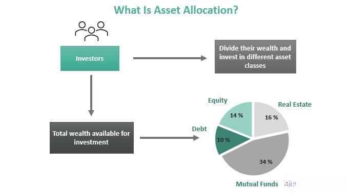

In today's complex financial world, asset allocation, financial planning, and algorithmic trading are recognized as essential components in constructing a robust investment strategy. These elements, when understood and applied effectively, can substantially enhance an investor's capability to manage their wealth and navigate the volatile financial markets. This article aims to explore the fundamentals of asset allocation, its significance within financial planning, and the evolving role of algorithmic trading in shaping modern investment strategies.

Asset allocation involves distributing investments among various asset classes, such as stocks, bonds, and cash, to balance risk and reward according to individual financial goals, risk tolerance, and time horizon. Financial planning, on the other hand, provides a structured approach to achieving these goals through disciplined saving and investing. Integrating these principles allows investors to construct portfolios that are resilient and capable of generating sustainable returns over time.



Algorithmic trading represents a technological leap in investing, utilizing computer algorithms to automate trading decisions at speeds and precision beyond human capability. This innovation enhances the efficiency of executing trades and minimizes human error, thereby improving trading outcomes.

Balancing risk and return, deploying financial tools effectively, and staying updated with algorithmic trading innovations are crucial for remaining competitive. These strategies, when combined, can significantly optimize financial outcomes and provide a comprehensive framework for strategic wealth management. By understanding the interaction between these components, investors can leverage the synergy of these investment strategies, creating resilient portfolios capable of withstanding market fluctuations.

Join us as we explore these pivotal elements of investment strategy, highlighting how they contribute to informed decision-making and optimal financial outcomes.

## Table of Contents

## What is Asset Allocation?

Asset allocation is a foundational principle in investment management, entailing the strategic allocation of an investment portfolio across various asset classes. Common asset classes include stocks, bonds, and cash. The primary objective of asset allocation is to achieve a balance between risk and reward, tailoring the investment strategy to an individual's financial goals, risk tolerance, and time horizon.

Asset allocation operates on a fundamental premise: different asset classes exhibit unique characteristics and respond differently to market changes. For example, stocks are typically associated with higher [volatility](/wiki/volatility-trading-strategies) and potential for high returns, making them suitable for investors with a long time horizon and high-risk tolerance. Conversely, bonds usually offer more stable returns and are considered less risky, often appealing to those with a shorter investment horizon or a conservative risk profile. Cash and cash equivalents provide [liquidity](/wiki/liquidity-risk-premium) and safety, serving as a buffer in volatile markets but generally offering lower returns.

Diversification is a key concept underpinning asset allocation. By spreading investments across multiple asset classes, investors can reduce exposure to the risk associated with any single asset class. This is because different assets do not always move in the same direction or magnitude in response to market events. A diversified portfolio is less likely to suffer severe losses when one asset class underperforms since gains in other assets can offset these losses.

The process of determining the appropriate asset allocation involves evaluating the investor’s specific financial goals, which might include retirement planning, funding education, or purchasing a home. These goals, combined with an assessment of risk tolerance—how much risk an investor is willing and able to take—and the investment time horizon—how long the investor plans to hold the investment—shape the composition of the portfolio.

In practice, asset allocation is dynamic. It requires periodic rebalancing to maintain the desired asset mix, especially as market conditions change or as the investor's goals and circumstances evolve. By systematically adjusting the portfolio's composition, investors can manage risk more effectively and align their strategy with their evolving financial landscape.

In conclusion, a well-constructed asset allocation strategy is crucial for achieving a balance between risk and reward, and diversification lies at its core. By understanding the distinct characteristics of various asset classes and their responses to market movements, investors can craft a portfolio that aligns with their specific financial goals and risk appetite.

## Importance of Asset Allocation in Financial Planning

Asset allocation plays a pivotal role in financial planning as it fundamentally shapes the risk and return profile of an investment portfolio. By strategically spreading investments across various asset classes such as stocks, bonds, and cash, investors can mitigate the adverse effects of poor-performing assets while potentially reaping the benefits from assets that are performing well. This diversification is a key principle in managing investment risk, helping to smooth returns over time and reducing the likelihood of significant financial losses.

A well-structured asset allocation strategy is essential for long-term wealth building and retirement planning. It enables investors to align their portfolios with their financial goals, risk tolerance, and investment time horizons. For instance, younger investors with a longer time horizon might opt for a higher allocation in equities to capitalize on growth potential, while those approaching retirement may shift towards bonds and other fixed-income securities to prioritize capital preservation.

To illustrate the impact of asset allocation, consider an investor with a balanced portfolio comprised of 60% stocks and 40% bonds. In a turbulent market scenario where stocks drop by 10%, the bond holdings might provide stability by maintaining value or even appreciating, thereby cushioning the portfolio against total value loss. This interplay between different asset classes exemplifies the risk-mitigating benefits of asset allocation.

Incorporating asset allocation strategies into financial planning ensures optimized financial outcomes. By setting a target mix of asset classes and periodically rebalancing to maintain this allocation, investors can adapt their portfolios in response to changes in market conditions or personal financial objectives. For example, an investor might automate the rebalancing process to occur semi-annually or when an asset class deviates by more than 5% from its target allocation.

The integration of asset allocation into financial planning is not static but requires continuous assessment and adjustments. Given the dynamic nature of financial markets, remaining vigilant about market trends and economic indicators is crucial. This strategy aligns resources efficiently to pursue potential investment opportunities while safeguarding the portfolio against unforeseen risks.

In conclusion, asset allocation is indispensable to effective financial planning, providing the necessary framework for optimizing risk-adjusted returns. By employing well-thought-out allocation strategies, investors can enhance their ability to achieve long-term financial goals and secure a comfortable retirement.

## Types of Asset Allocation Strategies

Asset allocation strategies are fundamental to developing a tailored investment approach that aligns with individual financial goals and risk tolerance. The principal asset allocation strategies are strategic, tactical, and dynamic. Each provides a unique pathway to managing an investment portfolio.

**Strategic Asset Allocation:** This strategy involves setting a base policy mix based on long-term investment objectives. Strategic asset allocation maintains a fixed asset class distribution, typically defined by percentages, which remains constant over time. For example, an investor may allocate 60% to equities, 30% to bonds, and 10% to cash. The primary benefit of strategic asset allocation is its focus on long-term consistency and range-bound risk management. This strategy suits investors with a clear understanding of their financial goals and a stable risk tolerance. However, the fixed nature of allocations means that it does not adjust quickly to short-term market fluctuations, potentially limiting returns during volatile periods.

**Tactical Asset Allocation:** Unlike strategic asset allocation, tactical asset allocation allows for short-term flexibility to capitalize on market conditions. This approach involves temporarily deviating from the base asset mix to exploit perceived profitable opportunities. By making adjustments based on market forecasts, investors can potentially enhance returns. However, tactical asset allocation requires precise market knowledge and timing, which can pose a significant challenge. It introduces higher risk due to the constant need for market monitoring and the possibility of incorrect forecasts. This strategy may appeal to those with a higher risk appetite and the resources to actively manage and analyze market trends.

**Dynamic Asset Allocation:** Dynamic asset allocation represents a flexible strategy that routinely adjusts the asset mix in response to market changes. It involves continuous monitoring and altering investments based on predefined criteria or market performance, addressing the limitations of both strategic and tactical approaches. Dynamic asset allocation offers greater adaptability and can enhance returns by responding efficiently to market shifts. Nonetheless, this strategy demands sophisticated analytical tools and constant management to be effectively implemented, making it less suitable for passive investors.

In conclusion, choosing the right asset allocation strategy depends heavily on an investor’s financial objectives, risk tolerance, and resource availability for portfolio management. Balancing these strategies can optimize portfolio performance by combining stability, flexibility, and adaptability in line with market dynamics.

## Integrating Algorithmic Trading

Algorithmic trading employs sophisticated computer algorithms to automate trading decisions, providing a level of precision and speed that surpasses human capabilities. At its core, [algorithmic trading](/wiki/algorithmic-trading) is about using predefined criteria to execute trades, thereby enhancing efficiency and minimizing human errors that can arise from emotional biases or sluggish decision processes. 

The primary advantage of algorithmic trading lies in its ability to seize market opportunities as soon as they arise. Algorithms are designed to analyze vast amounts of market data in real-time and make instantaneous trading decisions based on criteria such as price, timing, and [volume](/wiki/volume-trading-strategy). This real-time data processing enables traders to capitalize on market inefficiencies that are often fleeting. For instance, algorithms can exploit [arbitrage](/wiki/arbitrage) opportunities or execute strategies that require rapid trade execution, thus improving trading outcomes.

Algorithmic trading strategies can vary significantly, ranging from simple rule-based systems to complex models incorporating multiple factors. A fundamental example is the moving average crossover strategy, which involves two moving averages: a short-term moving average and a long-term moving average. The basic principle is straightforward: when the short-term moving average crosses above the long-term moving average, a buy signal is generated, indicating an upward trend, whereas a sell signal is triggered when the short-term moving average crosses below the long-term moving average, suggesting a downward trend. This approach allows traders to identify trends and adjust their positions accordingly.

In Python, a simple moving average crossover strategy can be implemented as follows:

```python
import pandas as pd

# Sample data containing historical prices
data = pd.read_csv('historical_prices.csv')

# Calculate moving averages
short_window = 20
long_window = 50

data['Short_MA'] = data['Close'].rolling(window=short_window, min_periods=1).mean()
data['Long_MA'] = data['Close'].rolling(window=long_window, min_periods=1).mean()

# Generate buy and sell signals
data['Signal'] = 0
data['Signal'][short_window:] = np.where(data['Short_MA'][short_window:] > data['Long_MA'][short_window:], 1, 0)
data['Position'] = data['Signal'].diff()

# Visualize the signals
import matplotlib.pyplot as plt

plt.figure(figsize=(14,7))
plt.plot(data['Close'], label='Close Price')
plt.plot(data['Short_MA'], label=f'Short {short_window}-Day MA', alpha=0.7)
plt.plot(data['Long_MA'], label=f'Long {long_window}-Day MA', alpha=0.7)
plt.plot(data[data['Position'] == 1].index, data['Short_MA'][data['Position'] == 1], '^', markersize=10, color='g', lw=0, label='Buy Signal')
plt.plot(data[data['Position'] == -1].index, data['Short_MA'][data['Position'] == -1], 'v', markersize=10, color='r', lw=0, label='Sell Signal')
plt.title('Moving Average Crossover Strategy')
plt.legend()
plt.show()
```

This simple strategy highlights the basic structure of an algorithmic trading system, which can be expanded to include more sophisticated elements like risk management protocols, parameter optimization, and [machine learning](/wiki/machine-learning) for predictive analytics. As algorithmic trading continues to evolve, it promises to play a critical role in modern investment strategies by providing enhanced decision-making capabilities and improved trading performance.

## Synergy Between Asset Allocation and Algorithmic Trading

The integration of asset allocation techniques and algorithmic trading produces a comprehensive investment strategy that significantly enhances decision-making, boosts efficiency, and elevates portfolio performance. Asset allocation, which involves diversifying an investment portfolio across various asset classes, benefits from the precision and speed that algorithmic trading offers. This integration allows for dynamic adjustments to portfolios that better align with market trends and investor goals.

**Enhanced Decision-Making and Efficiency**

Combining asset allocation with algorithmic trading improves decision-making by utilizing data-driven insights for both long-term strategic planning and short-term tactical adjustments. Algorithmic trading algorithms can process vast amounts of data and make trades based on predefined criteria without the limitations of human bias or fatigue. This capability increases the efficiency of executing trade strategies that maintain the desired balance between asset classes.

For example, an algorithm could be programmed to regularly rebalance a portfolio based on market conditions and pre-set asset class thresholds. With the ability to continuously monitor and analyze market data, the algorithm can adapt a portfolio to maintain a desired risk-return profile. Python libraries such as `pandas` and `NumPy` can be used to handle data manipulation, while `scikit-learn` can assist in predictive modeling to enhance the robustness of trading algorithms.

**Real-World Examples**

In practice, the synergy between asset allocation and algorithmic trading can lead to superior investment performance. For instance, consider a fund that uses strategic asset allocation as its foundation but incorporates algorithmic trading for tactical adjustments. When market volatility is detected, the algorithm can swiftly move to buy undervalued stocks or sell overvalued ones, optimizing the overall performance without departing from the strategic asset allocation plan. This dual approach ensures that the portfolio not only adheres to the investor’s long-term financial objectives but is also responsive to short-term market movements.

**Technological Advancements and Resilience**

Technological advancements are at the forefront of enhancing the synergy between these techniques. Machine learning and [artificial intelligence](/wiki/ai-artificial-intelligence) are increasingly being used to refine trading algorithms, enabling them to learn from market data patterns and past trading outcomes. This continuous learning process makes investment strategies more adaptive and resilient to market shocks.

Algorithmic trading systems can be further optimized using the powerful computational capabilities of modern technology. High-frequency trading platforms leverage such technologies to execute trades in fractions of a second, providing opportunities to capitalize on minute price discrepancies.

In summary, integrating asset allocation with algorithmic trading makes investment strategies more robust, efficient, and sophisticated. As technology continues to evolve, the potential for these synergistic strategies to deliver optimal financial outcomes only grows, offering a promising future for portfolio management.

## Future Trends and Innovations

The asset management industry is experiencing a transformative era marked by the rapid integration of artificial intelligence (AI) and machine learning (ML). These technologies are playing a crucial role in modernizing algorithmic trading and portfolio management, offering novel approaches to prediction, decision-making, and strategy optimization.

AI and ML handle vast datasets by identifying patterns that facilitate predictive modeling, ultimately enhancing trading strategies. For instance, machine learning algorithms can be trained to forecast stock price movements by analyzing historical data, leading to more informed trading decisions. Additionally, natural language processing (NLP) within AI analyzes market sentiments by processing financial news and social media feeds, offering insights that were previously challenging to quantify.

In algorithmic trading, these advancements improve trade execution, risk management, and strategy development. Algorithms powered by AI can adapt to new data in real-time, adopting strategies that were refined using [backtesting](/wiki/backtesting) on historical datasets. For instance, a [reinforcement learning](/wiki/reinforcement-learning) algorithm may optimize trading decisions by continually learning from outcomes and adjusting strategies to maximize returns.

Predictive analytics, powered by AI and ML, offers a significant competitive edge in financial markets. With these technologies, investors can develop models that anticipate market fluctuations, leading to more effective asset allocation and risk management strategies. The tools may incorporate Monte Carlo simulations to evaluate potential outcomes under various market conditions, making portfolios more resilient and adaptable.

However, the integration of AI and ML into finance is not without challenges. Data privacy concerns and the regulatory landscape pose significant hurdles, as increasingly sophisticated algorithms require scrutiny to prevent biased or unethical decision-making. Moreover, the continuous evolution of technology necessitates constant adaptation and investment in infrastructure and skills development to harness the full potential of AI-driven tools.

The potential opportunities offered by these technological innovations are vast. AI and ML have the capacity to redefine portfolio management by facilitating personalized investment strategies tailored to individual risk profiles and financial goals. As these technologies evolve, they promise to deliver unprecedented levels of precision, efficiency, and adaptability in asset management.

The financial markets are poised for significant evolution, driven by these emerging technologies. Those who embrace these innovations stand to gain a critical strategic advantage, optimizing financial strategies and outcomes in an increasingly complex and competitive environment.

## Conclusion

Asset allocation, financial planning, and algorithmic trading collectively form a robust investment strategy that empowers investors to navigate the complexities of financial markets effectively. The integration of these components is crucial for making informed decisions that optimize financial outcomes. Through asset allocation, investors distribute their resources across diverse asset classes, such as stocks, bonds, and cash, balancing risk and potential returns. Financial planning further supports this by aligning investments with personal financial goals and risk tolerance.

Algorithmic trading complements these elements by harnessing technology to execute trades with precision and speed. Algorithms can quickly process vast amounts of data, reducing human error and exploiting market opportunities that might otherwise go unnoticed. This technological integration enhances decision-making processes and portfolio performance, making investment strategies more adaptive and efficient.

Encouraging a holistic approach to investment that encompasses asset allocation, financial planning, and algorithmic trading can lead to sustained financial success. Investors who remain informed and adaptable can fully leverage the potential of these synergistic strategies. By staying abreast of advancements in technology and market trends, investors can ensure their strategies remain competitive and effective in achieving their financial objectives.

## References & Further Reading

[1]: Bergstra, J., Bardenet, R., Bengio, Y., & Kégl, B. (2011). ["Algorithms for Hyper-Parameter Optimization."](https://dl.acm.org/doi/10.5555/2986459.2986743) Advances in Neural Information Processing Systems 24.

[2]: ["Advances in Financial Machine Learning"](https://www.amazon.com/Advances-Financial-Machine-Learning-Marcos/dp/1119482089) by Marcos Lopez de Prado

[3]: ["Evidence-Based Technical Analysis: Applying the Scientific Method and Statistical Inference to Trading Signals"](https://www.amazon.com/Evidence-Based-Technical-Analysis-Scientific-Statistical/dp/0470008741) by David Aronson

[4]: ["Machine Learning for Algorithmic Trading"](https://github.com/stefan-jansen/machine-learning-for-trading) by Stefan Jansen

[5]: ["Quantitative Trading: How to Build Your Own Algorithmic Trading Business"](https://www.amazon.com/Quantitative-Trading-Build-Algorithmic-Business/dp/1119800064) by Ernest P. Chan