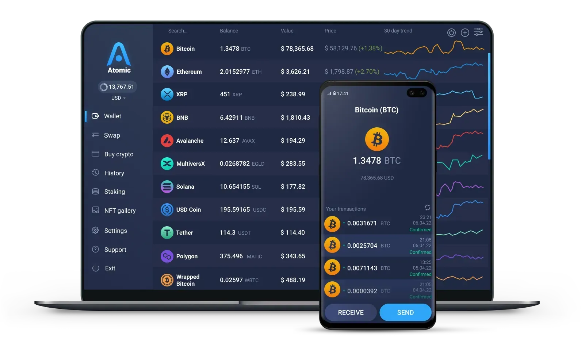

## Table of Contents

## What is Atomic Wallet?

Atomic Wallet is a type of digital wallet that lets you store, manage, and trade different cryptocurrencies. It's like a safe place on your computer or phone where you can keep your digital money. You can use it to send and receive cryptocurrencies, and it supports over 500 different types of digital currencies, including popular ones like Bitcoin, Ethereum, and Litecoin.

The wallet is designed to be easy to use, even if you're new to cryptocurrencies. It has a simple interface that makes it easy to see your balances and make transactions. One of the best things about Atomic Wallet is that it's decentralized, which means you have full control over your money and don't need to rely on a third party to manage it. This makes it more secure and private.

## How do you set up an Atomic Wallet?

To set up an Atomic Wallet, first go to their website and download the app for your computer or phone. It works on Windows, Mac, Linux, Android, and iOS. Once you have the app, open it and click on "Create a New Wallet." You'll need to pick a strong password that you'll remember but others can't guess easily. This password is important because it helps keep your wallet safe.

After you set your password, the app will show you a list of words called a "mnemonic seed." This is like a special code that you can use to get your wallet back if you lose it or if something happens to your device. Write these words down on paper and keep them in a safe place. Don't share them with anyone! Once you've saved your seed, click "Continue" and your wallet is ready to use. You can now add cryptocurrencies to your wallet and start using it.

## What cryptocurrencies does Atomic Wallet support?

Atomic Wallet supports over 500 different cryptocurrencies. Some of the most popular ones you can use with it are Bitcoin, Ethereum, Litecoin, and Ripple. It also works with many other well-known coins like Bitcoin Cash, Cardano, and Stellar. If you're into newer or less common cryptocurrencies, Atomic Wallet has you covered too, with support for tokens like Aave, Uniswap, and Chainlink.

The wallet is designed to be easy to use, so you can quickly add and manage all these different types of digital money. Whether you're interested in big names like Bitcoin and Ethereum or smaller, newer projects, Atomic Wallet makes it simple to keep everything in one place. This wide range of supported cryptocurrencies means you can explore and invest in the crypto world without needing multiple wallets.

## How can you secure your Atomic Wallet?

To keep your Atomic Wallet safe, start by picking a strong password. Make sure it's something you can remember but that others can't guess easily. Use a mix of letters, numbers, and symbols to make it hard for anyone to break into your wallet. Also, be careful not to share your password with anyone. If someone else knows it, they could get into your wallet and take your money.

Another important way to secure your wallet is by keeping your mnemonic seed safe. This is a list of words that you get when you first set up your wallet. Write these words down on paper and store them in a safe place, like a locked drawer or a safe. Don't keep them on your computer or phone where someone could find them. If you lose your wallet or your device, you can use these words to get your money back. But if someone else finds them, they could steal your money, so keep them secret and safe.

Lastly, always be careful when using your wallet. Don't click on suspicious links or download files from unknown sources, as they could contain viruses or malware that could steal your information. Keep your wallet's software up to date, as updates often include important security fixes. By following these simple steps, you can help keep your Atomic Wallet and your cryptocurrencies safe.

## What are the fees associated with using Atomic Wallet?

Using Atomic Wallet comes with some fees that you should know about. When you want to send cryptocurrencies to someone else, you'll need to pay a network fee. This fee goes to the people who run the cryptocurrency's network and help process your transaction. The amount of the fee can change depending on which cryptocurrency you're using and how busy the network is. For example, sending Bitcoin might cost more than sending Litecoin.

Atomic Wallet itself doesn't charge you to use their app, but they do make money in other ways. They have something called Atomic Swaps, which let you trade cryptocurrencies directly with other users. When you use this feature, Atomic Wallet takes a small fee for making the trade happen. Also, if you use their built-in exchange service to buy or sell cryptocurrencies, there might be fees for those transactions too. It's good to check the fees before you make a trade or exchange so you know what to expect.

## How does Atomic Wallet facilitate cryptocurrency exchanges?

Atomic Wallet makes it easy to trade cryptocurrencies with other people through something called Atomic Swaps. This means you can swap one type of cryptocurrency for another without needing a middleman like a big exchange. You just need to find someone who wants to trade with you, and Atomic Wallet helps make the trade happen safely. When you do an Atomic Swap, the wallet takes a small fee for helping with the trade, but it's usually less than what you'd pay on a big exchange.

Besides Atomic Swaps, Atomic Wallet also has a built-in exchange service. This lets you buy or sell cryptocurrencies right from your wallet. You can trade your digital money for other types of cryptocurrencies or even for regular money like dollars or euros. When you use this service, there might be fees for the trades, but it's handy because you don't have to leave the wallet to make your exchanges. This makes it simple and quick to manage your cryptocurrencies all in one place.

## What are the advantages of using Atomic Wallet over other wallets?

Atomic Wallet has some great advantages that make it stand out from other wallets. One big plus is that it supports over 500 different cryptocurrencies. This means you can keep all your digital money in one place, whether it's popular coins like Bitcoin and Ethereum or smaller, newer ones. Another advantage is that Atomic Wallet is decentralized. This means you have full control over your money and don't need to rely on a third party to manage it. This makes it more secure and private because you don't have to trust someone else with your funds.

Another great thing about Atomic Wallet is how easy it is to use. The app has a simple interface that makes it easy to see your balances and make transactions, even if you're new to cryptocurrencies. Plus, Atomic Wallet lets you trade cryptocurrencies directly with other users through Atomic Swaps, and it has a built-in exchange service for buying and selling digital money. This makes it convenient to manage and trade your cryptocurrencies without needing to use multiple apps or services.

## Can you use Atomic Wallet on multiple devices?

Yes, you can use Atomic Wallet on multiple devices. It works on computers with Windows, Mac, and Linux, and on phones with Android and iOS. This means you can have your wallet on your laptop, your phone, and even your tablet if you want. To use it on different devices, you just need to download the app on each one and then use your mnemonic seed to get your wallet back. This way, you can check your cryptocurrencies and make transactions from any of your devices.

It's important to keep your mnemonic seed safe when using Atomic Wallet on multiple devices. This is the list of words you get when you first set up your wallet, and it's what you use to recover your wallet if you lose it. Make sure to write these words down on paper and keep them in a safe place, like a locked drawer. Don't store them on your devices where someone else could find them. By keeping your seed secure, you can safely use Atomic Wallet on as many devices as you need.

## How does Atomic Wallet handle private keys?

Atomic Wallet keeps your private keys safe on your own device. When you set up your wallet, it makes a special code called a private key for each cryptocurrency you add. This key is like a secret password that lets you use your money. Atomic Wallet doesn't share these keys with anyone else, so you're the only one who can access your cryptocurrencies. This makes it more secure because you don't have to trust someone else to keep your money safe.

If you lose your device or want to use your wallet on another device, you can use your mnemonic seed to get your private keys back. The mnemonic seed is a list of words that you write down when you first set up your wallet. It's very important to keep these words safe and not share them with anyone. If someone else gets your seed, they could use it to steal your money. By keeping your seed secret and secure, you can make sure your private keys and your cryptocurrencies stay safe.

## What are the limitations of Atomic Wallet?

Atomic Wallet has some limitations you should know about. One big one is that it doesn't work with every single cryptocurrency out there. Even though it supports over 500, there are still some smaller or newer ones that you can't use with it. Also, if you want to use Atomic Swaps to trade with other people, you need to find someone who wants to trade the same cryptocurrencies you do. This can be tricky and might take some time.

Another thing to think about is that Atomic Wallet is a software wallet, which means it's not as secure as a hardware wallet. If someone gets into your computer or phone, they could steal your money. It's important to keep your device safe and use strong passwords. Plus, the fees for sending cryptocurrencies can change a lot depending on how busy the network is. This means you might have to pay more to send your money sometimes, which can be frustrating.

## How does Atomic Wallet comply with regulatory requirements?

Atomic Wallet works hard to follow the rules set by different countries and groups. They make sure their wallet follows laws about money and privacy. This means they check who can use their wallet and how it can be used. They also work with other companies and groups to make sure they're doing everything right. This helps keep their users safe and makes sure they're not breaking any laws.

Even though Atomic Wallet is decentralized, which means users control their own money, the company still has to follow some rules. They do this by making sure their app is safe and secure, and by helping users understand how to use it the right way. They also keep an eye on changes in laws and update their wallet to stay in line with new rules. This way, they can keep offering their services without any problems.

## What are the future development plans for Atomic Wallet?

Atomic Wallet is always working on new things to make their app even better. They want to add more cryptocurrencies so users can keep even more types of digital money in one place. They're also looking at ways to make trading easier and faster, like improving their Atomic Swaps and exchange services. They want to make sure their wallet works well on all kinds of devices, so they're always updating it to work smoothly on computers, phones, and tablets.

Another big plan for Atomic Wallet is to make their app even safer. They're working on new ways to protect users' money and private keys, like adding more security features and making sure their software is always up to date. They also want to make the wallet easier to use, so even people who are new to cryptocurrencies can use it without any trouble. By keeping their app simple, safe, and full of features, Atomic Wallet hopes to stay a top choice for people who want to manage their digital money.

## References & Further Reading

[1]: Bergstra, J., Bardenet, R., Bengio, Y., & Kégl, B. (2011). ["Algorithms for Hyper-Parameter Optimization."](https://papers.nips.cc/paper/4443-algorithms-for-hyper-parameter-optimization) Advances in Neural Information Processing Systems 24.

[2]: ["Advances in Financial Machine Learning"](https://www.amazon.com/Advances-Financial-Machine-Learning-Marcos/dp/1119482089) by Marcos Lopez de Prado

[3]: ["Evidence-Based Technical Analysis: Applying the Scientific Method and Statistical Inference to Trading Signals"](https://www.amazon.com/Evidence-Based-Technical-Analysis-Scientific-Statistical/dp/0470008741) by David Aronson

[4]: ["Machine Learning for Algorithmic Trading"](https://github.com/stefan-jansen/machine-learning-for-trading) by Stefan Jansen

[5]: ["Quantitative Trading: How to Build Your Own Algorithmic Trading Business"](https://www.amazon.com/Quantitative-Trading-Build-Algorithmic-Business/dp/1119800064) by Ernest P. Chan