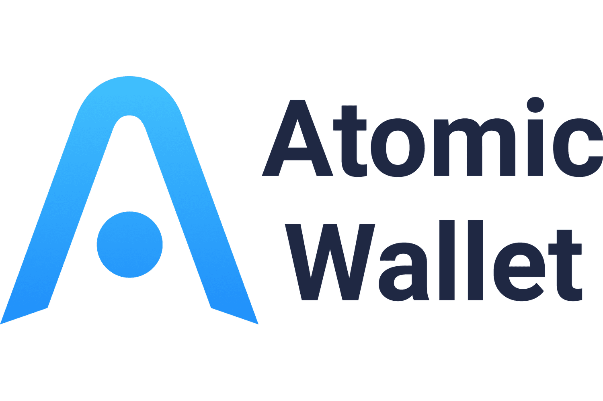

Digital asset management has become an essential component in the rapidly evolving cryptocurrency landscape. As digital currencies continue their rise in popularity, the need for secure and efficient tools to manage these assets has become more apparent. Atomic Wallet is one such solution, offering a comprehensive platform for managing digital assets. This multi-currency digital wallet enables users to store, exchange, and manage a wide variety of cryptocurrencies securely, thus serving a critical role in the digital asset management ecosystem.

The cryptocurrency market is witnessing a growing interest in algorithmic trading (algo trading), a technique that leverages computer algorithms to trade assets automatically and efficiently. The advantages of algo trading, such as enhanced speed, elimination of human error, and the ability to analyze vast amounts of data, have made it an attractive strategy for traders in the crypto market. Efficient digital asset management tools like Atomic Wallet can significantly enhance algo trading strategies by providing functionalities such as decentralized storage, atomic swaps, and staking capabilities, which contribute to streamlined trading operations.

Atomic Wallet's ability to facilitate direct trading through atomic swaps reduces the reliance on intermediaries, thereby making trading processes more efficient. This function, coupled with the wallet's robust security measures and user-friendly interface, makes it an ideal tool for both novice and experienced traders. As we embark on a comprehensive exploration of these interconnected topics, we will examine how digital asset management, represented by solutions like Atomic Wallet, aligns with and enhances the strategies employed in algo trading. This alignment not only optimizes trading efficiency but also empowers traders to maintain a competitive edge in the dynamic cryptocurrency market.

## Table of Contents

## Understanding Digital Asset Management

Digital asset management (DAM) refers to the systematic organization, storage, and retrieval of digital assets, which in cryptocurrencies, primarily includes various types of cryptocurrencies and tokens. Its importance in the cryptocurrency ecosystem stems from the need to efficiently manage these assets in volatile and rapidly changing markets. 

Cryptocurrencies, such as Bitcoin and Ethereum, are digital currencies that leverage blockchain technology to facilitate secure transactions. Tokens, on the other hand, can represent assets or utilities on a blockchain and extend beyond simple value transfer to include voting rights, access to services, and more. Together, these digital assets form the foundational elements of engagement in the cryptocurrency space and must be managed effectively to optimize returns and mitigate risks.

One of the primary challenges of digital asset management is security. The decentralized nature of cryptocurrencies necessitates robust security measures to protect against hacks, fraud, and unauthorized access. Additionally, accessibility is critical; users must be able to retrieve and utilize their assets efficiently, which can be hampered by technological barriers or user interface shortcomings. Volatility of digital assets presents yet another obstacle, as the value of cryptocurrencies can fluctuate dramatically, affecting both short-term trading strategies and long-term investment plans.

Effective digital asset management optimizes trading and investment strategies by ensuring that assets are secure, accessible, and positioned for agile response to market changes. Employing a robust DAM system allows for efficient asset allocation, timely rebalancing of portfolios, and the execution of complex trading strategies, such as [arbitrage](/wiki/arbitrage) or hedging.

Several key tools and technologies facilitate digital asset management. Blockchain technology itself serves as the backbone for secure transactions and transparent asset tracking. Wallet solutions, both hardware and software-based, provide users with means to store and manage their digital currencies safely. Platforms like Atomic Wallet, which integrate advanced features such as atomic swaps and decentralized storage, offer comprehensive solutions for managing digital assets without reliance on financial intermediaries. Furthermore, portfolio management applications and analytic tools enable investors to track performance and analyze market trends, which are crucial for informed decision-making.

## An Overview of Atomic Wallet

Atomic Wallet is a prominent multi-currency digital wallet solution designed to streamline the management of diverse digital assets. It facilitates users in storing, exchanging, and managing a variety of cryptocurrencies and tokens efficiently.

### Key Features

#### Decentralized Storage
One of the standout features of Atomic Wallet is its decentralized storage system. This means that private keys are stored directly on the user's device rather than on centralized servers. This approach enhances the security and privacy of user data, as there is no single point of failure that can be targeted by hackers.

#### Atomic Swaps
Atomic Wallet incorporates atomic swap technology, which allows users to exchange cryptocurrencies directly from wallet to wallet without the need for intermediaries. Atomic swaps are facilitated through smart contracts, ensuring that the exchange process is both trustless and secure. By employing hashed time-lock contracts (HTLC), Atomic Wallet ensures that each party receives the agreed-upon currency or the transaction is canceled, preventing any loss of funds.

#### Staking Capabilities
In addition to storage and exchanges, Atomic Wallet offers staking functionalities. Users can earn passive income by participating in the staking process of certain cryptocurrencies. This feature supports a variety of coins, allowing users to increase their holdings by simply holding and locking their coins in the wallet. Staking rewards are often proportional to the amount of digital currency staked and the duration of staking.

### Security Measures
Atomic Wallet implements robust security protocols to protect users' digital assets. As mentioned, private keys are stored on the user's device, keeping them out of reach from potential server-side breaches. Furthermore, the wallet supports a mnemonic seed phrase for backup and recovery, allowing users to restore access to their wallets in case of device loss or failure.

### User-Friendliness and Accessibility
Atomic Wallet is designed with both beginners and experienced investors in mind. Its intuitive interface allows users to navigate seamlessly through the various functions offered by the wallet. The setup process is straightforward, and the wallet provides comprehensive guides and support, making it accessible to users with varying levels of expertise in [cryptocurrency](/wiki/cryptocurrency) management.

### Recent Developments
Atomic Wallet continues to evolve with the dynamic cryptocurrency market. Recent updates have focused on expanding the list of supported cryptocurrencies and enhancing user experience through improved interface design and faster transaction processing. Security updates are regularly implemented to counter emerging threats, ensuring user assets remain protected.

In conclusion, Atomic Wallet stands out not only for its comprehensive range of features like atomic swaps and staking but also for its commitment to security and user-friendliness. This makes it a valuable tool for anyone looking to effectively manage and grow their digital assets.

## Exploring Algorithmic Trading in Cryptocurrency

Algorithmic trading, often abbreviated as algo trading, refers to the use of computer algorithms to automate trading decisions and transactions. In the cryptocurrency markets, this approach leverages historical data and predefined criteria to execute trades at optimal times, thus enhancing profitability and reducing the risks associated with human error and emotional trading. The inherent [volatility](/wiki/volatility-trading-strategies) and 24/7 trading environment of cryptocurrencies make them particularly well-suited for such automated strategies. 

**Advantages of Algorithmic Trading**

One of the primary benefits of algo trading is its speed. Algorithms can process vast amounts of data much faster than a human can, allowing for quicker decision-making and execution. This speed is crucial in volatile markets where prices can change significantly in a matter of seconds. Moreover, [algorithmic trading](/wiki/algorithmic-trading) improves efficiency by executing orders at the best possible prices, reducing transaction costs, and increasing [liquidity](/wiki/liquidity-risk-premium). Automation eliminates the emotional component of trading, minimizing errors and lending a more systematic approach.

**Common Algorithmic Trading Strategies**

Several strategies are frequently employed in the cryptocurrency market:

1. **Arbitrage**: This involves exploiting price differences for the same asset across different exchanges. An algorithm can instantaneously buy a cryptocurrency at a lower price on one exchange and sell it at a higher price on another, locking in a risk-free profit.

2. **Trend Following**: Algorithms identify and capitalize on market trends without predicting the future. They use statistical methods to determine trends and execute trades based on past performance indicators, such as moving averages or breakouts.

3. **Market Making**: This strategy provides liquidity to a market by simultaneously placing buy and sell orders. Market makers benefit from the bid-ask spread.

**Technological Requirements and Challenges**

Implementing algorithmic trading in cryptocurrency markets requires significant technological infrastructure. High-performance computing and data processing capabilities are essential for executing trades swiftly. A stable and fast internet connection is crucial to maintain downtime at a minimum. Additionally, accessing high-quality real-time and historical market data is obligatory for developing effective algorithms.

Despite these technological advancements, challenges persist. Cryptocurrency markets can be highly unpredictable, and algorithmic strategies need to adapt quickly to changing conditions. Furthermore, the risk of algorithmic glitches and security breaches requires continuous monitoring and robust security measures.

**Competitive Edge in Volatile Markets**

Algorithmic trading provides a distinct advantage in volatile markets. By executing orders at unprecedented speeds and without human intervention, traders can capitalize on short-lived trading opportunities that might be missed otherwise. Furthermore, algo trading can effectively manage large volumes of trades, making it possible for investors to scale their operations efficiently.

In conclusion, algorithmic trading in cryptocurrency markets offers a powerful tool for maximizing profitability and efficiency. As technology continues to evolve, traders increasingly rely on sophisticated algorithms to maintain a competitive advantage in the dynamically shifting cryptocurrency landscape.

## The Symbiotic Relationship: Atomic Wallet and Algo Trading

Atomic Wallet plays a pivotal role in aiding traders to execute algorithmic strategies efficiently within the cryptocurrency sphere. As a multi-currency digital wallet solution, its architecture supports the execution of algo trading through several key integration and operational features.

Atomic Wallet provides seamless integration capabilities with various trading platforms and automated trading systems, commonly referred to as algorithmic trading bots. This connectivity allows users to synchronize their digital assets between Atomic Wallet and external platforms, reducing the friction associated with executing trades across multiple channels. Through its API, traders can automate the execution of trading strategies, which can be tailored to exploit market trends, arbitrage opportunities, or any predefined strategy without manual intervention.

A standout feature of Atomic Wallet is its support for direct trading swaps. Atomic swaps enable users to exchange cryptocurrencies directly without requiring intermediaries, significantly enhancing trading efficiency. By eliminating third-party involvement, trading speed is increased, transaction costs are reduced, and security is bolstered, as there is no need to deposit funds on external exchanges. This is particularly advantageous for algorithmic traders who rely on speed and efficiency to capitalize on fleeting opportunities in the crypto markets.

Real-world examples highlight Atomic Wallet’s effectiveness in supporting successful algorithmic trading. Traders leveraging the wallet's inherent features have reported enhanced transaction speed and reduced costs, directly benefiting their algo trading strategies across volatile market conditions. These user experiences underscore the practical advantages of using Atomic Wallet in tandem with automated trading systems.

Looking towards potential future enhancements, Atomic Wallet could further support algo trading by expanding its API capabilities to support more sophisticated trading functionalities. This includes the integration of advanced [machine learning](/wiki/machine-learning) models for predictive analytics and trading signal generation, which would empower traders to develop more robust and adaptive strategies. Moreover, implementing real-time market data feeds and advanced charting tools within the wallet could provide traders with more comprehensive analytical capabilities directly accessible from their wallet interface.

In summary, Atomic Wallet’s integration capacities, combined with features like atomic swaps, provide a robust framework for supporting algorithmic trading strategies. Future enhancements could unlock even greater potential, offering traders improved tools for navigating and succeeding in the dynamic cryptocurrency market.

## Challenges and Best Practices

Cryptocurrency traders often encounter several challenges when using digital wallets for algorithmic trading. Security concerns, technical complications, and the dynamic nature of the market are primary obstacles that must be addressed to facilitate successful trading experiences.

**Common Challenges**

1. **Security Threats**: Digital wallets are prone to hacking and phishing attacks, making the security of digital assets a paramount concern. Reliance on internet connectivity further exposes traders to cybersecurity risks.

2. **Technical Difficulties**: Integrating algorithmic trading strategies with digital wallets requires technical proficiency. Challenges include setting up APIs, managing latency, and ensuring compatibility between trading bots and wallets.

3. **Market Volatility**: The cryptocurrency market is highly volatile, posing a significant risk to assets managed via algorithmic trading. Unforeseen market swings can result in substantial gains or losses, necessitating robust risk management strategies.

4. **Regulation and Compliance**: The evolving regulatory landscape can pose challenges for algorithmic trading, as different jurisdictions may have varying compliance requirements affecting trading operations.

**Best Practices for Secure Management of Digital Assets**

1. **Multi-layered Security**: Utilize wallets that offer multi-signature transactions and two-factor authentication (2FA) to bolster security. Regularly update passwords and enable encryption for sensitive data.

2. **Regular Software Updates**: Keeping wallet software and trading algorithms updated is crucial to protect against potential vulnerabilities and glitches that could be exploited by malicious actors. Automated updates can be implemented for convenience.

3. **Risk Management Techniques**: Implement stop-loss orders and diversify trading strategies to mitigate the impact of sudden market movements. Regularly backtesting trading algorithms using historical data can optimize performance and minimize risks.

**Selecting the Right Platforms and Tools**

1. **Platform Stability and Reputation**: Choose digital wallets and trading platforms with a proven track record of stability and reliability. Research user reviews and industry ratings to assess the reputation of potential service providers.

2. **Integration Capabilities**: Opt for platforms that offer seamless integration with popular trading bots and APIs, maximizing automation and efficiency. Compatibility ensures smoother execution of trading algorithms without significant technical interruptions.

3. **User Support and Resources**: Comprehensive documentation, tutorials, and customer support can greatly assist in the effective implementation of trading strategies. Platforms that offer extensive user resources can help overcome technical hurdles.

**Continuous Learning and Adaptation**

The cryptocurrency landscape is characterized by rapid evolution. Traders should commit to continuous learning to stay abreast of market trends, technological advancements, and regulatory changes. Engaging with online courses, webinars, and forums can provide valuable insights and enhance algorithmic trading strategies.

Encouraging an adaptive approach ensures that traders are well-prepared to adjust their strategies to the changing dynamics of the cryptocurrency market, ultimately fostering more resilient and successful trading practices.

## Conclusion

The discussion surrounding digital asset management has highlighted its vital role in the cryptocurrency ecosystem, especially as this market continues to evolve. Atomic Wallet emerges as a valuable tool in this context, offering a secure, user-friendly platform for managing a diverse portfolio of digital assets. Its features such as decentralized storage and seamless atomic swaps notably enhance trading efficiency, providing users with significant advantages in implementing algorithmic trading strategies.

Algorithmic trading in cryptocurrency markets, characterized by its speed and precision, enables traders to capitalize on market opportunities while minimizing human error. Incorporating tools like Atomic Wallet into trading strategies can facilitate direct trading swaps, reducing reliance on intermediaries and optimizing the trading process.

For investors and traders, embracing digital asset management and algorithmic trading can unlock new opportunities and competitive advantages. Engaging with these technologies is essential for staying adept within the rapidly shifting cryptocurrency landscape. Emerging traders or existing investors should consider incorporating Atomic Wallet and algorithmic strategies into their toolset for effective digital asset management and trading.

To continue enhancing their understanding and skills, readers are encouraged to explore further resources such as cryptocurrency trading forums, financial technology webinars, and academic journals focusing on blockchain technology and digital finance. This ongoing learning is crucial for adapting to technological advancements and safeguarding their investments against evolving security threats.

In conclusion, the future of cryptocurrency trading and digital asset management appears promising, with innovative solutions like Atomic Wallet poised to support traders in navigating this dynamic environment. By staying informed and strategically integrating the right tools, investors can position themselves for success in the coming years.

## References & Further Reading

[1]: Bergstra, J., Bardenet, R., Bengio, Y., & Kégl, B. (2011). ["Algorithms for Hyper-Parameter Optimization."](https://papers.nips.cc/paper/4443-algorithms-for-hyper-parameter-optimization) Advances in Neural Information Processing Systems 24.

[2]: ["Advances in Financial Machine Learning"](https://www.amazon.com/Advances-Financial-Machine-Learning-Marcos/dp/1119482089) by Marcos Lopez de Prado

[3]: ["Evidence-Based Technical Analysis: Applying the Scientific Method and Statistical Inference to Trading Signals"](https://www.amazon.com/Evidence-Based-Technical-Analysis-Scientific-Statistical/dp/0470008741) by David Aronson

[4]: ["Machine Learning for Algorithmic Trading"](https://github.com/stefan-jansen/machine-learning-for-trading) by Stefan Jansen

[5]: ["Quantitative Trading: How to Build Your Own Algorithmic Trading Business"](https://www.amazon.com/Quantitative-Trading-Build-Algorithmic-Business/dp/1119800064) by Ernest P. Chan