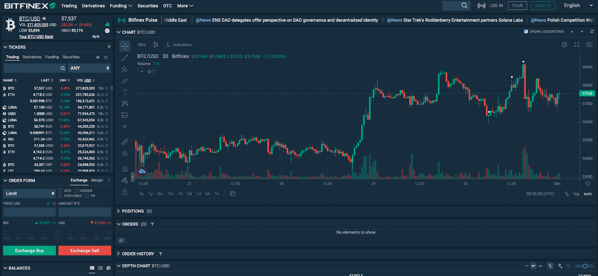

Cryptocurrency trading has experienced a phenomenal rise over the past decade, evolving from a niche market into a global financial powerhouse. The demand for digital trading platforms is driven by the ever-growing interest in cryptocurrencies, which offer alternative investment opportunities and innovative financial solutions. Among these platforms, Bitfinex has established itself as a prominent cryptocurrency exchange, providing traders with a diverse range of services and tools to navigate the digital asset market effectively.

Bitfinex, launched in 2012, is renowned for its comprehensive suite of trading products and services catering to both novice and seasoned traders. It stands out not only for its extensive range of supported cryptocurrencies but also for its advanced trading functionalities and sophisticated infrastructure. This positions Bitfinex as a leading choice for individuals and institutions looking to engage in cryptocurrency trading.

A key feature of modern cryptocurrency trading is algorithmic trading, which involves the use of automated, pre-programmed trading instructions to execute trades at speeds and frequencies that would be impossible for a human trader. Algorithmic trading in the cryptocurrency market is significant for its ability to enhance trading efficiency, reduce transaction costs, and eliminate emotional decision-making. Algorithms can execute complex trading strategies based on market data, statistical models, and mathematical formulas, making them highly effective in capturing market opportunities.

The primary purpose of this article is to explore Bitfinex's algorithmic trading features, highlighting how they can be leveraged by traders to optimize their trading strategies. As technology continues to advance, it reshapes traditional trading methods, offering innovative solutions that improve market participation and accessibility. By examining these features, traders can better understand how to adapt and thrive in the fast-paced world of cryptocurrency trading.

Overall, the exploration of Bitfinex's algo trading capabilities demonstrates the transformative power of technology in the world of finance, encouraging traders to adopt and experiment with these sophisticated tools to achieve their trading objectives. As the digital finance landscape continues to evolve, the role of algorithmic trading in shaping trading strategies and outcomes becomes increasingly prominent, driving the need for platforms like Bitfinex that support and facilitate these advancements.

## Table of Contents

## Understanding Bitfinex: A Leading Digital Trading Platform

Bitfinex is a prominent digital trading platform that has established a strong foothold in the cryptocurrency market through its comprehensive offerings and robust security measures. Founded in 2012, Bitfinex has evolved to become one of the world's largest and most advanced cryptocurrency exchanges. It was initially conceived as a peer-to-peer Bitcoin exchange and has since expanded its services to include a wide range of cryptocurrencies and trading options. Bitfinex's history is marked by both innovation and recovery, notably managing to rebound and fortify its security infrastructure after facing significant challenges, such as the 2016 hack where approximately 120,000 BTC were stolen.

One of the unique features of Bitfinex is its advanced trading platform, which caters to both retail and institutional investors. It offers margin trading, providing traders with the opportunity to leverage their positions up to 10 times. The platform also supports a variety of order types, including limit, market, stop, trailing stop, fill or kill, and iceberg orders, allowing traders to execute complex trading strategies. Bitfinex also offers a lending market where users can earn interest by providing funding to traders who wish to trade with leverage.

Bitfinex's role in the [cryptocurrency](/wiki/cryptocurrency) market is significant due to its trading [volume](/wiki/volume-trading-strategy) and [liquidity](/wiki/liquidity-risk-premium), contributing to price discovery across the cryptocurrency spectrum. By offering a high degree of liquidity, Bitfinex ensures that trades can be executed swiftly and efficiently, minimizing slippage. This liquidity also attracts a large number of traders, including institutions, to the platform, further solidifying its influence in the market.

Security is a critical consideration for Bitfinex, and the platform has implemented comprehensive measures to safeguard user assets. Bitfinex secures 99.5% of user funds in cold storage and employs cutting-edge security features such as advanced verification tools, two-[factor](/wiki/factor-investing) authentication (2FA), and withdrawal protection. Additionally, Bitfinex conducts regular security audits and encourages users to activate enhanced account security options to further protect their accounts.

The user base of Bitfinex is diverse, comprising traders from around the globe who engage in trading numerous cryptocurrencies. Bitfinex supports a wide array of digital assets, including Bitcoin (BTC), Ethereum (ETH), Ripple (XRP), Litecoin (LTC), and many others, providing traders with ample options for diversification and investment opportunities.

In summary, Bitfinex stands out as a leading digital trading platform due to its robust technological infrastructure, extensive range of trading features, substantial liquidity, and a strong emphasis on security. Its comprehensive service offerings and significant role in the global cryptocurrency market make it a preferred choice for many traders seeking to engage in cryptocurrency trading effectively and securely.

## The Role of Algorithmic Trading in Cryptocurrency

Algorithmic trading refers to the use of computer programs and systems to execute trades automatically based on pre-defined criteria. This technology employs complex algorithms to analyze market patterns, execute trade strategies, and manage buy/sell orders at high speeds and volumes, surpassing human capabilities. It signifies a paradigm shift in the financial markets, including the burgeoning cryptocurrency arena.

### Advantages of Using Algorithms in Trading Cryptocurrencies

The primary benefit of [algorithmic trading](/wiki/algorithmic-trading) is efficiency. Algorithms can process vast amounts of data and execute trades faster than any human, capitalizing on brief market opportunities. This speed is crucial in the fast-paced, volatile cryptocurrency markets. Additionally, algorithmic trading eliminates human emotions from trading decisions, reducing the likelihood of panic selling or irrational buying.

Algorithmic trading also supports diversification by enabling traders to manage multiple strategies and trading pairs simultaneously. This capability helps in spreading risk across different cryptocurrencies and market strategies.

### Manual Trading vs. Algorithmic Trading

Manual trading entails a human trader executing orders through their judgment, typically involving significant time and effort in market analysis and decision-making. In contrast, algorithmic trading automates these processes, allowing traders to set parameters and let the algorithm execute trades. While manual trading allows for nuanced decision-making, it is less efficient and slower. Algorithmic trading's efficiency brings higher trading frequency and can potentially lead to increased profitability due to its ability to exploit multiple opportunities simultaneously.

### Impact on Market Dynamics

Algorithmic trading has a profound impact on market dynamics, significantly altering liquidity and [volatility](/wiki/volatility-trading-strategies). By providing consistent and large volumes of buy and sell orders, algorithms increase market liquidity, often resulting in tighter spreads and reduced transaction costs. However, the rapid execution speed can also exacerbate market volatility, as algorithms can trigger simultaneous sell-offs or buy-ins based on similar market indicators.

Moreover, algorithmic trading influences price discovery and can lead to increased market efficiency, as the algorithms react faster to news and market data than human traders. They contribute to more accurate pricing by quickly integrating available information into trade decisions.

### Common Algorithms in Cryptocurrency Trading

Several algorithms are commonly used in cryptocurrency trading:

1. **Market-Making Algorithms**: These algorithms provide liquidity by placing both buy and sell orders. They profit from the spread between these orders.

2. **Arbitrage Algorithms**: Exploiting price differences for the same asset across different platforms or regions, these algorithms seek to buy low and sell high in quick succession.

3. **Trend-Following Algorithms**: These systems analyze trends and execute trades based on market momentum, buying assets likely to rise and selling those expected to fall.

4. **Mean Reversion Algorithms**: Operating on the premise that prices will revert to their mean, these algorithms buy assets when prices are low and sell when prices are high.

5. **Scalping Algorithms**: Designed for high-frequency trading, these algorithms make numerous trades for small profits each, capitalizing on small price gaps.

In conclusion, algorithmic trading is revolutionizing cryptocurrency markets by offering efficiency, speed, and the ability to manage complex strategies seamlessly. It plays a pivotal role in shaping today’s trading environment, offering traders a technological edge to navigate the volatile landscape of cryptocurrencies.

## Exploring Bitfinex's Algo Trading Features

Bitfinex has integrated advanced algorithmic trading functionalities that cater to both novice and experienced traders, offering an efficient and customizable platform for managing digital assets. Algorithmic trading on Bitfinex allows users to automate trading processes, optimize strategies through computational algorithms, and minimize human intervention to take advantage of market opportunities.

### Step-by-step Guide on Setting Up Algo Trading on Bitfinex

To set up algorithmic trading on Bitfinex, users must first create an account on the platform and enable two-factor authentication for security purposes. Following this, the user can proceed with the following steps:

1. **API Key Creation**: Access the 'API' section in the user account settings. Create a new API key with permissions suitable for trading activities, such as 'read', 'write', and 'withdraw'.

2. **Connect to Third-party Platforms**: Bitfinex facilitates easy integration with third-party algorithmic trading platforms. Users can link their API key to these platforms for enhanced functionality.

3. **Select a Trading Algorithm**: Users can either choose pre-existing trading algorithms or develop custom scripts using coding languages like Python. Bitfinex supports integration with several algorithmic trading tools and libraries.

4. **Configure Algorithm Parameters**: Set specific parameters for your chosen algorithm, such as trading pairs, entry/exit conditions, and risk management rules.

5. **Run and Monitor Algorithms**: Deploy the algorithm in a simulated environment initially for testing, and upon satisfactory performance, execute it on a live market with real funds.

### Types of Trading Algorithms Supported by Bitfinex

Bitfinex supports a wide range of trading algorithms, allowing users to implement diverse strategies:

- **Market Making**: Involves placing both buy and sell orders to earn profits from the spread between the bid and ask price.
- **Arbitrage**: Exploits price discrepancies of the same asset across different markets or exchanges.
- **Momentum Trading**: Capitalizes on market trends by purchasing assets that are performing well and selling them as they lose momentum.
- **Mean Reversion**: Assumes that the price will revert to its average and involves trading based on deviations from this mean.

### Customization Features for Traders

Bitfinex provides extensive customization options, enabling users to tailor their trading strategies flexibly:

- **Custom Scripts**: Advanced users can write their custom trading scripts using Bitfinex's API and numerous coding libraries, such as CCXT for multi-exchange trading.
- **Parameter Adjustments**: Traders have the ability to modify algorithm settings to adapt to changing market conditions efficiently.
- **Backtesting Tools**: To refine trading strategies, users can access backtesting tools to simulate algorithms over past market data.

### Case Studies and Real-world Examples

Several real-world examples demonstrate the efficacy of algorithmic trading on Bitfinex. One such success story involves a trader employing a [momentum](/wiki/momentum)-based strategy that capitalized on Bitcoin’s price trends during a period of high volatility, resulting in significant returns. Another example is a market maker who utilized an algorithm to provide liquidity across multiple trading pairs, consistently profiting from the spread while minimizing market risk.

These examples illustrate the potential for algorithmic trading on platforms like Bitfinex to optimize Tn vestment strategies and enhance profitability in the dynamic cryptocurrency market.

## Advantages of Using Bitfinex for Algo Trading

Bitfinex stands out as a prominent platform for algorithmic trading in the cryptocurrency market due to several compelling advantages. One of the key benefits is its user-friendly interface. Designed with both novice and experienced traders in mind, Bitfinex's platform provides an intuitive navigation system, simplifying the process of setting up and managing algorithmic trading strategies. This accessibility is critical for traders who may be new to algorithmic concepts, ensuring they can take full advantage of automated trading without a steep learning curve.

In addition to its ease of use, Bitfinex offers competitive fees and transparent trading conditions. The platform’s fee structure is designed to accommodate various trading volumes, providing percentage fee reductions as a trader’s monthly volume increases. This tiered fee system makes it financially appealing for high-frequency algorithmic traders who benefit from reduced costs that can significantly impact their overall profitability.

The liquidity available on Bitfinex is another substantial advantage. High liquidity ensures that trades can be executed quickly and at desired prices, an essential factor for algorithmic trading strategies that rely on fast execution to capitalize on fleeting market opportunities. Bitfinex consistently ranks among the top exchanges for liquidity, offering substantial order [books](/wiki/algo-trading-books) for a wide array of cryptocurrencies.

Bitfinex’s robust integration with third-party trading bots and API connectivity further enhances its suitability for algo trading. Through its well-documented API, traders can connect custom algorithms or existing trading bots to execute trades automatically, collect data, and monitor market conditions in real-time. This seamless integration aligns with the needs of sophisticated traders seeking to implement complex strategies that require high-speed execution and data analysis.

Lastly, Bitfinex provides a supportive community and an array of resources tailored for new algo traders. The platform regularly updates its educational content, offering guides, webinars, and a dedicated support team to aid traders in overcoming challenges associated with algorithmic trading. By fostering an environment of continuous learning and support, Bitfinex empowers traders to refine their strategies and improve their trading skills over time.

In conclusion, Bitfinex's user-centric design, competitive fee structure, high liquidity, advanced integration capabilities, and strong community support collectively make it an ideal platform for algorithmic trading in the cryptocurrency sector.

## Potential Challenges and Considerations

Algorithmic trading in cryptocurrency markets presents unique challenges and considerations, particularly due to the inherent volatility of these digital assets. Traders and developers need to be acutely aware of the impacts this volatility can have on trading algorithms. Price swings can result in significant financial losses if algorithms are not designed to manage such risks. High volatility can lead to sudden and extreme price changes, which may cause algorithms to execute trades that are not in the trader's best interest.

To effectively engage in algorithmic trading, users must possess a certain level of technical knowledge. This includes understanding programming languages (such as Python) to develop and customize trading algorithms, as well as knowledge of market dynamics and asset behaviors. A solid foundation in quantitative analysis and data interpretation is essential for developing robust algorithms capable of adapting to changing market conditions.

Monitoring and adjusting algorithmic strategies is crucial for maintaining their effectiveness. Algorithms require continuous supervision to ensure they are executing trades as intended. Real-time monitoring allows traders to make necessary adjustments in response to market shifts, which may involve tweaking parameters or using different algorithms based on current data. Failure to adapt can result in missed opportunities or detrimental losses.

Security is another critical concern for algorithmic traders. The automated nature of these systems exposes them to various risks, including potential software bugs, hacking attempts, and algorithmic errors that could lead to unauthorized trades. Implementing strong security measures, such as regular software updates, robust encryption protocols, and secure API connections, is vital to safeguarding trading operations.

Legal and regulatory considerations play a significant role in algorithmic trading. Different jurisdictions have varying laws and regulations that govern the trading of cryptocurrencies and the use of automated systems. Traders must ensure compliance with applicable legal requirements to avoid potential fines or sanctions. This includes understanding regulations concerning data privacy, anti-money laundering (AML) policies, and financial reporting obligations.

In summary, while algorithmic trading offers numerous advantages, it also comes with a range of challenges that traders must navigate. These include managing the risks associated with market volatility, ensuring technical and strategic proficiency, maintaining rigorous security measures, and adhering to legal and regulatory standards. Addressing these challenges is essential for success in algorithmic trading within the dynamic landscape of cryptocurrencies.

## Conclusion

Bitfinex has established itself as a formidable player in the cryptocurrency trading landscape, offering a comprehensive suite of features that cater to both novice and experienced traders. Its impact is underscored by its commitment to security, user trust, and high liquidity, which are critical elements for successful trading in the volatile cryptocurrency market. The platform's support for algorithmic trading highlights its innovative approach, providing traders with advanced tools to optimize their strategies and capitalize on market opportunities.

Algorithmic trading holds significant potential for traders at all levels. For beginners, it offers a structured approach to trading, reducing emotional biases and enhancing decision-making. Experienced traders can leverage algorithms to execute complex strategies with precision and speed, maximizing efficiency and potential returns. As technology continues to advance, the importance of understanding and utilizing algorithmic trading cannot be overstated. Bitfinex's platform, with its customization capabilities and robust API connectivity, invites users to explore these possibilities.

Looking ahead, digital trading platforms and cryptocurrency exchanges are poised to evolve significantly. Trends such as increased adoption of [artificial intelligence](/wiki/ai-artificial-intelligence), [machine learning](/wiki/machine-learning), and blockchain technology will likely shape the future of trading. These technologies promise to enhance market efficiency, improve security, and offer new trading opportunities. Consequently, embracing these innovations is imperative for staying competitive in this dynamic market.

Readers are encouraged to actively engage with algorithmic trading by taking advantage of Bitfinex's tools and resources. Whether you're a novice trader looking to understand the basics or an experienced trader aiming to refine your strategies, exploring the platform's offerings can provide valuable insights and potentially enhance your trading performance. As the cryptocurrency market continues to grow and evolve, staying informed and adaptable will be key to succeeding in this burgeoning field.

## References & Further Reading

[1]: Bergstra, J., Bardenet, R., Bengio, Y., & Kégl, B. (2011). ["Algorithms for Hyper-Parameter Optimization."](https://dl.acm.org/doi/10.5555/2986459.2986743) Advances in Neural Information Processing Systems 24.

[2]: ["Advances in Financial Machine Learning"](https://www.amazon.com/Advances-Financial-Machine-Learning-Marcos/dp/1119482089) by Marcos Lopez de Prado

[3]: ["Evidence-Based Technical Analysis: Applying the Scientific Method and Statistical Inference to Trading Signals"](https://www.amazon.com/Evidence-Based-Technical-Analysis-Scientific-Statistical/dp/0470008741) by David Aronson

[4]: ["Machine Learning for Algorithmic Trading"](https://github.com/stefan-jansen/machine-learning-for-trading) by Stefan Jansen

[5]: ["Quantitative Trading: How to Build Your Own Algorithmic Trading Business"](https://books.google.com/books/about/Quantitative_Trading.html?id=j70yEAAAQBAJ) by Ernest P. Chan