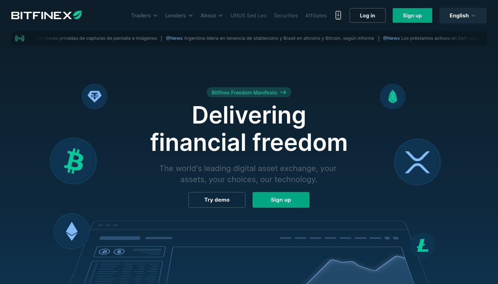

## Table of Contents

## What is Bitfinex?

Bitfinex is a cryptocurrency exchange where people can buy, sell, and trade different digital currencies like Bitcoin and Ethereum. It started in 2012 and has become one of the biggest exchanges in the world. People use Bitfinex because it offers a lot of different cryptocurrencies and has tools that help traders make smart decisions.

The platform is known for its advanced trading features, which can be a bit complicated for beginners but are very useful for experienced traders. Bitfinex also lets users borrow money to trade, which can increase their profits but also comes with more risk. It's important for users to understand these risks before they start trading on Bitfinex.

## When was Bitfinex founded and by whom?

Bitfinex was founded in 2012. The people who started it were Raphael Nicolle and Giancarlo Devasini. They wanted to create a place where people could easily trade cryptocurrencies like Bitcoin.

At first, Bitfinex was just a way for people to trade Bitcoin. But soon, they added more cryptocurrencies and tools to help traders. This made Bitfinex grow bigger and become one of the most popular exchanges in the world.

## What types of cryptocurrencies can be traded on Bitfinex?

Bitfinex lets you trade many different kinds of cryptocurrencies. Some of the most popular ones you can find there are Bitcoin, Ethereum, and Litecoin. These are the big names that a lot of people know and use.

But Bitfinex doesn't stop there. They also have other cryptocurrencies like Tether, EOS, and Ripple. This means if you're interested in trading different types of digital money, Bitfinex has a lot to offer. They keep adding new cryptocurrencies too, so you can always find something new to trade.

## How does Bitfinex ensure the security of user funds?

Bitfinex takes the security of user funds very seriously. They use something called cold storage to keep most of the cryptocurrencies safe. Cold storage means the digital money is kept offline, so it's harder for hackers to steal it. Bitfinex also uses strong encryption to protect the information that moves around on their website. This makes it tough for anyone to break in and take your money.

They also have something called two-[factor](/wiki/factor-investing) authentication, or 2FA. This means you need two ways to prove it's really you before you can log in or move your money. It's like having a key and a secret code. Plus, Bitfinex keeps an eye on everything that happens on their platform. If they see anything strange, they can stop it before it becomes a big problem. This way, they try to make sure your funds stay safe.

## What are the fees associated with trading on Bitfinex?

When you trade on Bitfinex, you need to know about the fees. There are two main types of fees: maker fees and taker fees. Maker fees are what you pay when you add a new order to the exchange that doesn't get filled right away. These are usually lower than taker fees, which you pay when you take an order that's already on the exchange. For most trades, maker fees are 0.1% and taker fees are 0.2%. But if you trade a lot, you can get discounts on these fees.

Besides trading fees, there are also fees for moving your money in and out of Bitfinex. If you want to put money into Bitfinex or take it out, you'll have to pay a fee. These fees can change depending on what kind of money you're using, like Bitcoin or Ethereum. It's a good idea to check the fees before you move your money because they can be different for each type of [cryptocurrency](/wiki/cryptocurrency).

## How can someone start trading on Bitfinex?

To start trading on Bitfinex, first you need to sign up for an account on their website. Go to the Bitfinex homepage and click on the "Register" button. You'll need to fill in some information like your email address and choose a strong password. After you sign up, you'll need to verify your identity. This means you'll have to send Bitfinex some documents like a photo of your ID and maybe a utility bill to prove where you live. Once they check everything and approve your account, you can move on to the next step.

After your account is all set up, you can start trading. First, you'll need to add some money to your account. This is called depositing. You can deposit money using cryptocurrencies like Bitcoin or Ethereum, or sometimes even regular money. Once your money is in your account, you can go to the trading section of the website. There, you can choose which cryptocurrencies you want to trade and decide if you want to buy or sell. Bitfinex has a lot of tools to help you make these decisions, so take some time to look around and learn how to use them.

## What are the advanced trading features offered by Bitfinex?

Bitfinex has a lot of advanced tools that can help you trade better. One of these tools is called margin trading. This means you can borrow money from Bitfinex to trade with more than what you have. It can make your profits bigger, but it also means you could lose more money if things don't go well. Another tool is called stop orders. These let you set a price where you want to buy or sell a cryptocurrency automatically. This can help you make sure you don't miss a good chance to trade or lose too much money if the price goes down a lot.

There are also tools like trailing stops and take-profit orders. A trailing stop follows the price of a cryptocurrency and will sell it if the price starts to drop a lot. This can help you make sure you don't lose too much money. A take-profit order is the opposite; it will sell your cryptocurrency when it reaches a price you think is good enough. Bitfinex also has something called an API, which lets you connect other programs to the exchange. This can help you trade faster and more easily if you know how to use it.

These tools can be a bit hard to understand at first, but they can really help you if you learn how to use them. Bitfinex has a lot of information on their website to help you learn about these tools. If you're new to trading, it might be a good idea to start with simpler trades and then try out these advanced features once you feel more comfortable.

## How does Bitfinex comply with regulatory requirements?

Bitfinex works hard to follow the rules set by different countries. They know it's important to keep their users safe and make sure everything they do is legal. To do this, they check who their users are by asking for things like ID photos and proof of where they live. This is called Know Your Customer (KYC) and it helps stop bad people from using the exchange. Bitfinex also keeps an eye on where money comes from and goes to, which is called Anti-Money Laundering (AML). This makes sure no one is using Bitfinex to do anything illegal with money.

They also work with different groups and follow the rules in the places where they do business. For example, they might need to report certain things to the government or follow special rules about how they handle money. Bitfinex keeps up with these rules and changes how they do things if the laws change. This way, they can keep offering their services while making sure they're doing everything the right way.

## What is the liquidity like on Bitfinex compared to other exchanges?

Bitfinex has pretty good [liquidity](/wiki/liquidity-risk-premium), which means it's easy to buy and sell cryptocurrencies there without the price changing a lot. When you want to trade, you need other people who want to trade the opposite way. Bitfinex has a lot of users, so there are usually enough people to trade with. This makes it easier for you to get the price you want when you buy or sell. Compared to some other exchanges, Bitfinex's liquidity is often better, especially for big trades.

However, liquidity can change depending on which cryptocurrency you're trading. For popular ones like Bitcoin and Ethereum, Bitfinex usually has high liquidity. But for less common cryptocurrencies, it might not be as good as on some other exchanges. So, if you're trading something that's not as popular, you might want to check other exchanges too. Overall, Bitfinex is known for its strong liquidity, but it's always a good idea to look at different exchanges to see which one works best for what you want to trade.

## Can you explain the Bitfinex mobile app and its features?

The Bitfinex mobile app is a handy way to trade cryptocurrencies on your phone. You can download it on your iOS or Android device. The app lets you do everything you can do on the Bitfinex website, like buying and selling different types of cryptocurrencies. It's easy to use, even if you're new to trading. You can check your account balance, see how your trades are doing, and even set up new trades right from your phone.

One cool thing about the Bitfinex mobile app is that it has real-time price updates. This means you can see the latest prices for cryptocurrencies at any time. The app also has charts and tools that help you make smart trading decisions. For example, you can use the app to set up stop orders, which automatically buy or sell at a certain price. This can be really helpful if you're busy and can't watch the market all the time. Overall, the Bitfinex mobile app makes trading easy and convenient, no matter where you are.

## What are some of the controversies or challenges Bitfinex has faced?

Bitfinex has faced some big problems over the years. One of the biggest was in 2016 when hackers stole about 120,000 bitcoins from the exchange. This was a lot of money, and it made a lot of people worried about the safety of their money on Bitfinex. The company had to work hard to make things right and improve their security. They also had to deal with a lot of questions and criticism from people who use the exchange and from the media.

Another challenge came in 2019 when New York's Attorney General accused Bitfinex of hiding the loss of $850 million. They said Bitfinex used money from another company, Tether, to cover up the loss. This led to a lot of legal trouble and made people question if Bitfinex was being honest. Bitfinex said they did nothing wrong and fought back against the accusations. These controversies have made some people think twice about using Bitfinex, even though the company keeps trying to show they are safe and trustworthy.

## How does Bitfinex's token, LEO, work and what is its purpose?

LEO is a special token that Bitfinex created. It's called LEO because it stands for "Let's Exchange Offers." The main reason Bitfinex made LEO was to help pay for the money they lost in the big hack back in 2016. They sold LEO tokens to people who wanted to help them out, and the money from those sales was used to cover the losses. LEO also lets users pay lower fees on Bitfinex if they use the token to pay for trading.

LEO tokens are also used to make Bitfinex a better place to trade. People who own LEO can vote on new ideas and changes to the exchange. This gives them a say in how Bitfinex works. Plus, Bitfinex sometimes buys back LEO tokens and takes them out of circulation, which can make the remaining tokens more valuable. So, LEO is not just about helping Bitfinex recover from the hack, but also about making the exchange better for everyone who uses it.

## References & Further Reading

[1]: Bergstra, J., Bardenet, R., Bengio, Y., & Kégl, B. (2011). ["Algorithms for Hyper-Parameter Optimization."](https://dl.acm.org/doi/10.5555/2986459.2986743) Advances in Neural Information Processing Systems 24.

[2]: ["Advances in Financial Machine Learning"](https://www.amazon.com/Advances-Financial-Machine-Learning-Marcos/dp/1119482089) by Marcos Lopez de Prado

[3]: ["Evidence-Based Technical Analysis: Applying the Scientific Method and Statistical Inference to Trading Signals"](https://www.amazon.com/Evidence-Based-Technical-Analysis-Scientific-Statistical/dp/0470008741) by David Aronson

[4]: ["Machine Learning for Algorithmic Trading"](https://github.com/stefan-jansen/machine-learning-for-trading) by Stefan Jansen

[5]: ["Quantitative Trading: How to Build Your Own Algorithmic Trading Business"](https://books.google.com/books/about/Quantitative_Trading.html?id=j70yEAAAQBAJ) by Ernest P. Chan