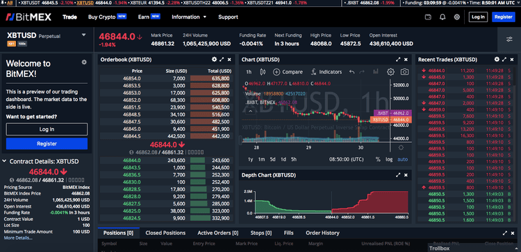

## Table of Contents

## What is BitMEX and what is its primary function?

BitMEX is a trading platform where people can buy and sell cryptocurrencies like Bitcoin. It stands for Bitcoin Mercantile Exchange. The main thing BitMEX is known for is letting people trade with borrowed money, which is called trading on margin. This can make profits bigger, but it can also make losses bigger, so it's risky.

The primary function of BitMEX is to offer a place for people to trade cryptocurrency futures contracts. Futures contracts are agreements to buy or sell something at a future date for a price agreed on today. On BitMEX, people can trade these contracts to guess where the price of Bitcoin or other cryptocurrencies will go in the future. This can be a way to make money if they guess right, but it's important to understand the risks involved.

## How does BitMEX differ from traditional cryptocurrency exchanges?

BitMEX is different from traditional cryptocurrency exchanges because it focuses on trading futures contracts instead of just buying and selling cryptocurrencies directly. Traditional exchanges like Coinbase or Binance let you exchange one cryptocurrency for another or for regular money. But BitMEX is all about futures, which means you're betting on what the price of a cryptocurrency will be in the future. This makes BitMEX more like a betting platform than a simple exchange.

Another big difference is that BitMEX lets you trade with borrowed money, which is called margin trading. This means you can make bigger trades than you could with just your own money, but it's also riskier because you could lose more money if the price goes the wrong way. Traditional exchanges usually don't let you trade with as much borrowed money, so the risk is lower. Because of this, BitMEX attracts traders who are looking for bigger potential rewards and are okay with taking on more risk.

## What types of trading products does BitMEX offer?

BitMEX offers different types of trading products, mainly focused on futures contracts. Futures contracts are agreements to buy or sell something at a future date for a price agreed on today. On BitMEX, you can trade futures for cryptocurrencies like Bitcoin, Ethereum, and others. This means you can bet on whether the price of these cryptocurrencies will go up or down in the future. It's a way to try to make money if you guess right about where the price is going.

Besides futures, BitMEX also offers something called perpetual contracts. Perpetual contracts are similar to futures but they don't have an expiration date, so you can keep them open as long as you want. This makes them a bit more flexible than regular futures. BitMEX also has options for trading with borrowed money, which is called margin trading. This can make your potential profits bigger, but it also makes the risk bigger because you could lose more money if the price goes against you.

## How does the leverage system work on BitMEX?

The leverage system on BitMEX lets you trade with more money than you actually have. It's like borrowing money from BitMEX to make bigger trades. If you think the price of Bitcoin will go up, you can use leverage to buy more Bitcoin than you could with just your own money. This can make your profits bigger if you're right, but it also means you could lose more money if the price goes down. BitMEX lets you use up to 100 times the amount of money you have, which is called 100x leverage. That means if you have $100, you can trade as if you have $10,000.

When you use leverage, you have to be careful because if the price moves against you, you might get a "margin call." This happens when the money you've put in isn't enough to cover your losses. If you get a margin call, BitMEX might close your trade to stop you from losing even more money. It's important to understand how leverage works and to be ready for the risks. Using leverage can be a good way to make more money, but it can also lead to big losses if you're not careful.

## What are the fees associated with trading on BitMEX?

When you trade on BitMEX, you have to pay fees. There are two main types of fees: the taker fee and the maker fee. The taker fee is what you pay when you take away someone else's order from the market. The maker fee is what you pay when you add your own order to the market. The taker fee is usually higher than the maker fee because taking an order can make the market less stable. The taker fee is 0.075% of the trade amount, and the maker fee is -0.01%, which means you actually get a small discount for being a maker.

Besides these trading fees, there's also a fee for funding. This is for people who trade perpetual contracts. If you're betting that the price will go up, you have to pay a funding fee to people who are betting that the price will go down. If you're betting that the price will go down, you get paid the funding fee. The funding fee changes based on how much people are betting on the price going up or down. It's important to know about these fees because they can affect how much money you make or lose when you trade on BitMEX.

## How does BitMEX ensure the security of user funds and data?

BitMEX takes several steps to keep user funds and data safe. They use something called multi-signature wallets, which means that to move money out, more than one person has to agree. This makes it harder for hackers to steal money. They also keep most of the money in cold storage, which means it's not connected to the internet, making it much safer from online attacks. BitMEX also uses strong encryption to protect the information you send to them, so it's hard for anyone to see or steal your data.

Besides these technical measures, BitMEX has strict rules about who can see your data and how it's used. They have a team that watches for anything strange happening on the platform, and they work with security experts to find and fix any weak spots. All these things together help make sure that your money and information are kept safe when you use BitMEX.

## What is the process for depositing and withdrawing funds on BitMEX?

To deposit funds on BitMEX, you first need to log into your account. Once you're in, go to the "Account" section and click on "Deposit." You'll see a Bitcoin address that BitMEX gives you. You can copy this address and send Bitcoin to it from your own wallet or another exchange. It's important to double-check the address to make sure you're sending your Bitcoin to the right place. Once the Bitcoin network confirms your deposit, the funds will show up in your BitMEX account, usually within an hour.

To withdraw funds from BitMEX, go to the "Account" section again and click on "Withdraw." You'll need to enter the Bitcoin address where you want to send your money, and you can also set a withdrawal amount. BitMEX might ask you to confirm your identity before they let you withdraw, to make sure it's really you. Once you've entered all the details and confirmed everything, BitMEX will process your withdrawal. It can take a bit of time for the Bitcoin network to confirm the transaction, but once it's done, your money will be in the wallet you chose.

## How does BitMEX's trading engine and order book function?

BitMEX's trading engine is like the brain of the platform. It's what makes sure that trades happen quickly and fairly. When you want to buy or sell something on BitMEX, your order goes into the trading engine. The engine looks at all the orders from everyone and matches them up. If you want to buy Bitcoin at a certain price and someone else wants to sell it at that price, the engine will make the trade happen. It does this very fast, so you don't have to wait long for your trades to go through.

The [order book](/wiki/order-book-trading-strategies) on BitMEX is like a list that shows all the buy and sell orders that people have put in. On one side, you see all the orders from people who want to buy, and on the other side, you see all the orders from people who want to sell. The order book helps you see what prices people are willing to trade at. If you want to buy Bitcoin, you can look at the order book to see the lowest price someone is willing to sell at. If you want to sell, you can see the highest price someone is willing to buy at. This helps you decide what price to put in your own order.

## What are the key features of BitMEX's user interface and trading tools?

BitMEX's user interface is designed to be easy to use, even if you're new to trading. When you log in, you'll see a main screen that shows the current prices of different cryptocurrencies and the charts that track their prices over time. There's a big button to quickly buy or sell, and you can switch between different trading products like Bitcoin or Ethereum futures. The interface also has a section where you can see your account balance and any open trades you have. Everything is laid out in a way that makes it simple to find what you need and make trades without getting confused.

BitMEX also has a lot of trading tools to help you make better decisions. You can use different types of charts, like candlestick charts, to see how prices have changed over time. There are also tools to draw lines and shapes on the charts, which can help you spot patterns and predict where prices might go next. BitMEX lets you set up alerts, so you get a notification if the price hits a certain level. You can also use something called stop-loss and take-profit orders, which automatically close your trade if the price goes too low or too high. All these tools together make it easier for you to trade smartly and manage your risks.

## How does BitMEX handle regulatory compliance and what jurisdictions does it operate in?

BitMEX takes steps to follow the rules set by different countries. They have a team that makes sure the platform follows these rules. BitMEX used to have some trouble with regulations, but they've made changes to fix that. They now have a license to operate in certain places, which means they can legally offer their services there. They also make sure to check who their users are, a process called KYC (Know Your Customer), to stop people from using the platform for bad things like money laundering.

BitMEX mainly operates in places where they have the right licenses. They are allowed to offer their services in countries like the United States, but only to certain types of customers. They also work in other countries around the world, but the rules can be different in each place. BitMEX always tries to follow the local laws wherever they offer their services. This helps them stay out of trouble and keep their users safe.

## What advanced trading strategies can be implemented on BitMEX?

On BitMEX, traders can use advanced strategies like [scalping](/wiki/gamma-scalping), where they make lots of small trades to take advantage of tiny price changes. This works well because BitMEX has low fees and fast trading. Another strategy is [arbitrage](/wiki/arbitrage), where traders buy Bitcoin on one platform and sell it on BitMEX at a higher price to make a profit from the difference. BitMEX's futures contracts make this possible because you can bet on future prices.

Another advanced strategy is hedging, where traders use futures contracts to protect themselves from big price swings. If you own Bitcoin and are worried about the price going down, you can sell a futures contract on BitMEX to balance out any losses. This way, if the price drops, you lose on your Bitcoin but make money on the futures contract. BitMEX also lets you use stop-loss and take-profit orders, which automatically close your trades at certain prices. This helps you manage risk and can be part of more complex trading strategies.

## How does BitMEX's API support algorithmic trading and what are its limitations?

BitMEX's API, or Application Programming Interface, is a tool that lets you connect to the platform and trade automatically using computer programs. This is called [algorithmic trading](/wiki/algorithmic-trading). With the API, you can send orders, check prices, and manage your account without having to click buttons on the website. It's like having a robot do your trading for you, which can be faster and more accurate than doing it by hand. Many traders use the API to run complex strategies that would be hard to do manually, like trading based on lots of data or reacting to the market very quickly.

The API has some limitations though. For example, it can only handle a certain number of requests at a time, so if you're trying to make too many trades very quickly, you might run into problems. Also, the API has rules about how often you can use it, to stop people from overloading the system. Another thing to watch out for is that if there's a problem with your internet connection or the API itself, your trading program might stop working, which could lead to losses. So while the API is a powerful tool, you need to be careful and understand its limits to use it safely.

## References & Further Reading

[1]: Bergstra, J., Bardenet, R., Bengio, Y., & Kégl, B. (2011). ["Algorithms for Hyper-Parameter Optimization."](https://papers.nips.cc/paper/4443-algorithms-for-hyper-parameter-optimization) Advances in Neural Information Processing Systems 24.

[2]: ["Advances in Financial Machine Learning"](https://www.amazon.com/Advances-Financial-Machine-Learning-Marcos/dp/1119482089) by Marcos Lopez de Prado

[3]: ["Evidence-Based Technical Analysis: Applying the Scientific Method and Statistical Inference to Trading Signals"](https://www.amazon.com/Evidence-Based-Technical-Analysis-Scientific-Statistical/dp/0470008741) by David Aronson

[4]: ["Machine Learning for Algorithmic Trading"](https://github.com/stefan-jansen/machine-learning-for-trading) by Stefan Jansen

[5]: ["Quantitative Trading: How to Build Your Own Algorithmic Trading Business"](https://www.amazon.com/Quantitative-Trading-Build-Algorithmic-Business/dp/1119800064) by Ernest P. Chan