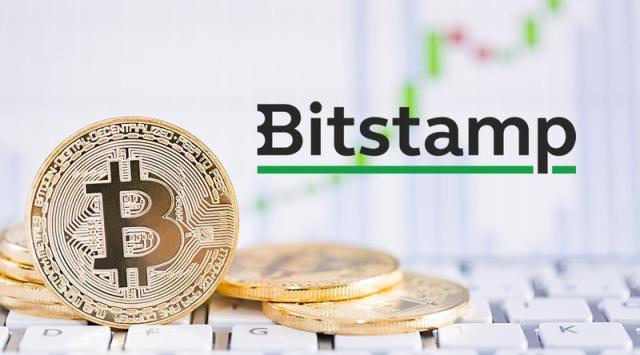

## Table of Contents

## What is Bitstamp?

Bitstamp is a company that helps people buy and sell cryptocurrencies like Bitcoin and Ethereum. It started in 2011 and is one of the oldest places to trade these digital currencies. People from all over the world use Bitstamp because it is safe and easy to use. They can trade different cryptocurrencies and even change them into regular money like dollars or euros.

Bitstamp works like a big online market where people can trade their cryptocurrencies. It uses special technology to make sure all trades are safe and fair. The company also follows rules from different countries to make sure everything is legal. This helps people trust Bitstamp and feel comfortable using it to trade their digital money.

## When was Bitstamp founded?

Bitstamp was founded in 2011. It is one of the oldest companies that help people buy and sell cryptocurrencies like Bitcoin and Ethereum.

People from all over the world use Bitstamp because it is safe and easy to use. They can trade different cryptocurrencies and even change them into regular money like dollars or euros.

## Who founded Bitstamp?

Bitstamp was founded by Nejc Kodrič and Damijan Merlak. They started the company in 2011 in Slovenia. Nejc and Damijan wanted to create a safe and easy way for people to buy and sell cryptocurrencies like Bitcoin.

Bitstamp grew quickly and became one of the oldest and most trusted places for trading digital currencies. People from all over the world use Bitstamp because it is reliable and follows the rules in different countries. This helps everyone feel safe when they trade their cryptocurrencies on the platform.

## What cryptocurrencies can be traded on Bitstamp?

Bitstamp lets people trade many different cryptocurrencies. Some of the main ones you can trade on Bitstamp are Bitcoin, Ethereum, Litecoin, Bitcoin Cash, Ripple, and Stellar. These are popular digital currencies that many people use and trust.

Besides these, Bitstamp also has other cryptocurrencies like EOS, Chainlink, and Aave. This gives people a lot of choices when they want to trade their digital money. Bitstamp makes it easy for people to buy, sell, and trade these cryptocurrencies all in one place.

## How does Bitstamp ensure the security of user funds?

Bitstamp takes many steps to keep user funds safe. They use strong encryption to protect information and keep it private. They also have special systems that watch for anything strange or unusual, which helps stop people from trying to steal money or do anything bad. Bitstamp keeps most of the money in special secure places called cold storage, which are not connected to the internet, so it's very hard for hackers to get to them.

Another way Bitstamp keeps funds safe is by following strict rules and getting checked by outside groups. They have to follow laws in different countries to make sure everything they do is legal and safe. Bitstamp also gets regular checks from security experts to make sure their systems are strong and up to date. This helps everyone feel more confident that their money is safe when they use Bitstamp.

## What are the fees associated with trading on Bitstamp?

Bitstamp has different fees depending on what you are doing on their platform. If you want to buy or sell cryptocurrencies, the fees can be between 0.0% and 0.5% of the amount you are trading. The exact fee depends on how much you trade in a month. If you trade more, you might pay less. For example, if you trade less than $1,000 in a month, you might pay 0.5%, but if you trade more than $20 million, you might pay 0.0%.

There are also fees for moving money in and out of Bitstamp. If you want to put money into Bitstamp using a bank transfer, it might cost you between 0.05% and 0.1%, depending on where you are. Taking money out can cost more, like 0.1% for a bank transfer or $10 for a wire transfer. If you use a credit or debit card to put money in, the fee can be around 5%. These fees help Bitstamp keep their platform running smoothly and safely.

## How can someone start trading on Bitstamp?

To start trading on Bitstamp, first you need to sign up for an account on their website. You'll need to give some personal information like your name, email, and a strong password. After signing up, you'll need to verify your identity. This means sending Bitstamp some documents like a photo ID and proof of where you live. This step is important to keep the platform safe and follow the rules.

Once your account is verified, you can add money to your Bitstamp account. You can do this by using a bank transfer, credit card, or other ways Bitstamp allows. After you have money in your account, you can start trading. Just choose the [cryptocurrency](/wiki/cryptocurrency) you want to buy or sell, like Bitcoin or Ethereum, and follow the steps on the website. Bitstamp makes it easy to trade, and you can start with just a few clicks.

## What are the deposit and withdrawal options available on Bitstamp?

To add money to your Bitstamp account, you can use different ways. One common way is a bank transfer, which lets you move money from your bank to Bitstamp. You can also use a credit or debit card to add money quickly, but this might cost more. Bitstamp also lets you use other payment services like Skrill or Neteller. The fees for adding money depend on the method you choose and where you live, but they can be between 0.05% and 5%.

When you want to take money out of Bitstamp, you have a few choices too. You can use a bank transfer to move your money back to your bank account. This might cost you around 0.1% or a flat fee like $10 for a wire transfer. If you want to take out cryptocurrencies instead, you can send them to your own wallet or another exchange. The fees for taking out money can change, so it's good to check them on the Bitstamp website before you do it.

## How does Bitstamp comply with regulatory requirements?

Bitstamp follows the rules set by different countries to make sure it is doing everything legally. They have to get special licenses and follow laws about money and trading. This means they have to check who their users are and make sure no one is using the platform for bad things like money laundering. Bitstamp works with government groups and follows their rules to keep everything safe and legal.

To make sure they are following all the rules, Bitstamp gets checked regularly by outside experts. These checks help make sure Bitstamp is doing everything right and keeping up with new laws. This helps everyone feel more confident that Bitstamp is a safe and trustworthy place to trade cryptocurrencies.

## What are the advanced trading features offered by Bitstamp?

Bitstamp has some special tools for people who want to trade a lot or in different ways. One of these tools is called the Bitstamp API. This lets people connect their own computer programs to Bitstamp, so they can trade automatically without having to click buttons all the time. Another tool is called margin trading. This means you can borrow money from Bitstamp to trade more than you have, but it can be risky because you might lose more money if things don't go well.

There are also other tools like stop orders and limit orders. A stop order helps you set a price where you want to sell or buy, so if the price reaches that point, the trade happens automatically. A limit order lets you set a price you want to trade at, and it will only happen if the price gets to that level. These tools help people trade in a smarter way and can make it easier to make money if they know how to use them right.

## How does Bitstamp's liquidity compare to other exchanges?

Bitstamp is known for having good [liquidity](/wiki/liquidity-risk-premium), which means it's easy to buy and sell cryptocurrencies on their platform. Liquidity is important because it helps make sure you can trade quickly without big changes in price. Bitstamp is one of the older and more trusted exchanges, so a lot of people use it. This helps keep the liquidity high because there are always people trading on Bitstamp.

Compared to other exchanges, Bitstamp's liquidity is usually very good, but it can change depending on which cryptocurrency you are looking at. For big cryptocurrencies like Bitcoin and Ethereum, Bitstamp often has high liquidity, similar to other big exchanges like Coinbase or Binance. But for smaller or less popular cryptocurrencies, Bitstamp might not have as much liquidity as some other exchanges. So, if you are trading the most popular cryptocurrencies, Bitstamp is a good choice for liquidity.

## What are the future plans or developments for Bitstamp?

Bitstamp is always working on new things to make their platform better. They want to add more cryptocurrencies for people to trade. This way, people can have more choices and find new digital money to buy and sell. Bitstamp also wants to make their website and app easier to use. They are thinking about new tools that can help people trade better and faster.

Another big plan for Bitstamp is to grow in more countries. They want to make sure people all over the world can use their platform easily. This means following more rules in different places and making their service available in more languages. By doing this, Bitstamp hopes to become even more popular and trusted around the world.

## References & Further Reading

[1]: Lavi, R., & Villadsen, B. (2019). ["Cryptocurrency Trading & Investing: Evaluating Security and Risks"](https://pmc.ncbi.nlm.nih.gov/articles/PMC8670570/). Security Magazine.

[2]: Nakamoto, S. (2008). ["Bitcoin: A Peer-to-Peer Electronic Cash System"](https://nakamotoinstitute.org/library/bitcoin/).

[3]: Golumbia, D. (2016). ["The Politics of Bitcoin: Software as Right-Wing Extremism"](https://archive.org/details/politicsofbitcoi0000golu). University of Minnesota Press.

[4]: Shreve, S. E. (2004). ["Stochastic Calculus for Finance I & II"](https://link.springer.com/book/9780387401010). Springer Finance Textbooks.

[5]: Burniske, C., & Tatar, J. (2017). ["Cryptoassets: The Innovative Investor's Guide to Bitcoin and Beyond"](https://www.amazon.com/Cryptoassets-Innovative-Investors-Bitcoin-Beyond/dp/1260026671). McGraw-Hill Education.